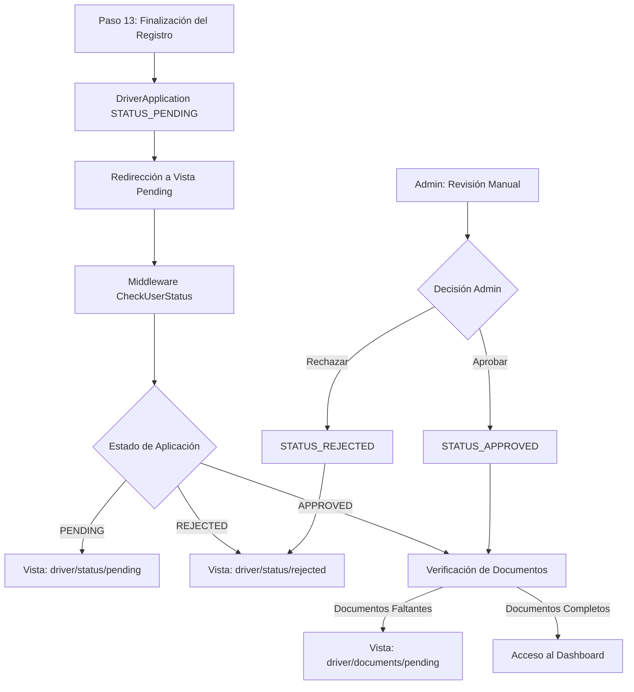

# Informe de Análisis: Flujo Post-Registro de Conductores - EF Services

## 1. Resumen Ejecutivo

Este informe presenta un análisis detallado del flujo completo después del registro de conductores en el sistema EF Services, desde la finalización del paso 13 del registro hasta el acceso al dashboard. Se identifican los puntos críticos del proceso, las vulnerabilidades existentes y se proponen mejoras para optimizar la experiencia del usuario y la seguridad del sistema.

## 2. Mapeo del Flujo Post-Registro

### 2.1 Flujo Principal



### 2.2 Estados de DriverApplication

El modelo `DriverApplication` maneja los siguientes estados:

| Estado | Constante | Descripción |
|--------|-----------|-------------|
| Draft | `STATUS_DRAFT` | Aplicación en borrador |
| Pending | `STATUS_PENDING` | Pendiente de revisión administrativa |
| Approved | `STATUS_APPROVED` | Aprobada por administrador |
| Rejected | `STATUS_REJECTED` | Rechazada por administrador |

### 2.3 Puntos de Control de Acceso

#### Middleware CheckUserStatus
Ubicación: `app/Http/Middleware/CheckUserStatus.php`

**Funciones principales:**
- Verificación de autenticación del usuario
- Control de estado de aplicación de conductor
- Redirección automática según estado
- Manejo de rutas exentas

**Lógica de redirección:**
```php
switch ($application->status) {
    case DriverApplication::STATUS_PENDING:
        // Redirige a driver/pending
    case DriverApplication::STATUS_REJECTED:
        // Redirige a driver/rejected
    case DriverApplication::STATUS_APPROVED:
        // Verifica documentos requeridos
}
```

## 3. Análisis de Vistas de Estado

### 3.1 Vista Pending (resources/views/driver/status/pending.blade.php)

**Características:**
- **Diseño:** Interfaz limpia con indicador visual de estado pendiente
- **Información:** Tiempo estimado de revisión (1-3 días hábiles)
- **Funcionalidades:**
  - Notificación por email cuando se apruebe
  - Contacto con soporte si necesita información adicional
  - Información sobre FMCSA Clearinghouse (modal educativo)
  - Enlace directo al sitio web de Clearinghouse

**Elementos de UX:**
- Indicador animado de estado pendiente
- Lista de expectativas claras para el usuario
- Información de contacto de soporte
- Modal informativo sobre requisitos regulatorios

### 3.2 Vista Rejected (resources/views/driver/status/rejected.blade.php)

**Características:**
- **Diseño:** Interfaz clara con indicadores visuales de rechazo
- **Información:** Mensaje de rechazo con pasos a seguir
- **Funcionalidades:**
  - Contacto directo con soporte
  - Orientación sobre posible reaprobación
  - Botón de acción para contactar soporte

**Elementos de UX:**
- Mensaje empático pero claro sobre el rechazo
- Pasos constructivos para el usuario
- Múltiples canales de contacto con soporte

## 4. Área Administrativa

### 4.1 Controladores Identificados

#### DriversController (Admin)
Ubicación: `app/Http/Controllers/Admin/DriversController.php`
- **Función:** Gestión básica de conductores activos
- **Limitación:** No maneja aprobación de aplicaciones

#### DriverRecruitmentController
Ubicación: `app/Http/Controllers/Admin/Driver/DriverRecruitmentController.php`
- **Función:** Vista de solicitudes de conductores
- **Limitación:** Solo visualización, sin lógica de aprobación

### 4.2 Rutas Administrativas

```php
// Rutas identificadas en routes/admin.php
Route::prefix('driver-recruitment')->name('driver-recruitment.')->group(function () {
    Route::get('/', [DriverRecruitmentController::class, 'index'])->name('index');
    Route::get('/{driverId}', [DriverRecruitmentController::class, 'show'])->name('show');
});
```

## 5. Puntos Críticos Identificados

### 5.1 Críticos - Alta Prioridad

1. **Falta de Controlador de Aprobación**
   - **Problema:** No existe un controlador específico para aprobar/rechazar aplicaciones
   - **Impacto:** Los administradores no pueden cambiar el estado de las aplicaciones
   - **Ubicación:** Falta implementar en área administrativa

2. **Ausencia de Sistema de Notificaciones**
   - **Problema:** No hay notificaciones automáticas por email al cambiar estado
   - **Impacto:** Los usuarios no son informados de cambios en su aplicación
   - **Ubicación:** Falta en lógica de aprobación/rechazo

3. **Falta de Logging de Decisiones Administrativas**
   - **Problema:** No se registran las decisiones de aprobación/rechazo
   - **Impacto:** Falta de trazabilidad y auditoría
   - **Ubicación:** Middleware y controladores administrativos

### 5.2 Importantes - Media Prioridad

4. **Gestión de Razones de Rechazo**
   - **Problema:** No hay campo para especificar razón de rechazo
   - **Impacto:** Los usuarios no saben por qué fueron rechazados
   - **Ubicación:** Modelo DriverApplication y vistas

5. **Dashboard Básico**
   - **Problema:** El dashboard de conductores es muy básico
   - **Impacto:** Experiencia de usuario limitada
   - **Ubicación:** `DashboardController` y vista correspondiente

6. **Falta de Métricas Administrativas**
   - **Problema:** No hay estadísticas de aplicaciones pendientes/aprobadas/rechazadas
   - **Impacto:** Falta de visibilidad para administradores
   - **Ubicación:** Dashboard administrativo

### 5.3 Menores - Baja Prioridad

7. **Rutas Exentas Hardcodeadas**
   - **Problema:** Las rutas exentas están hardcodeadas en el middleware
   - **Impacto:** Dificulta mantenimiento y escalabilidad
   - **Ubicación:** `CheckUserStatus` middleware

8. **Falta de Validación de Transiciones de Estado**
   - **Problema:** No hay validación de transiciones válidas entre estados
   - **Impacto:** Posibles estados inconsistentes
   - **Ubicación:** Modelo DriverApplication

## 6. Vulnerabilidades de Seguridad

### 6.1 Acceso No Autorizado
- **Riesgo:** Usuarios podrían intentar acceder directamente al dashboard
- **Mitigación Actual:** Middleware CheckUserStatus previene esto
- **Recomendación:** Mantener y fortalecer validaciones

### 6.2 Manipulación de Estado
- **Riesgo:** Sin controlador de aprobación, no hay validación de permisos
- **Mitigación Actual:** Ninguna implementada
- **Recomendación:** Implementar validación de roles y permisos

### 6.3 Logging Insuficiente
- **Riesgo:** Falta de trazabilidad en cambios de estado
- **Mitigación Actual:** Logging básico en middleware
- **Recomendación:** Implementar logging completo de auditoría

## 7. Propuestas de Mejora

### 7.1 Mejoras Inmediatas (1-2 semanas)

#### A. Implementar Controlador de Aprobación
```php
// Nuevo: DriverApplicationController
class DriverApplicationController extends Controller
{
    public function approve(DriverApplication $application, Request $request)
    {
        $application->update([
            'status' => DriverApplication::STATUS_APPROVED,
            'approved_by' => auth()->id(),
            'approved_at' => now()
        ]);
        
        // Enviar notificación por email
        // Registrar en logs de auditoría
        
        return back()->with('success', 'Application approved successfully');
    }
    
    public function reject(DriverApplication $application, Request $request)
    {
        $request->validate(['rejection_reason' => 'required|string|max:500']);
        
        $application->update([
            'status' => DriverApplication::STATUS_REJECTED,
            'rejection_reason' => $request->rejection_reason,
            'rejected_by' => auth()->id(),
            'rejected_at' => now()
        ]);
        
        // Enviar notificación por email
        // Registrar en logs de auditoría
        
        return back()->with('success', 'Application rejected');
    }
}
```

#### B. Agregar Campos al Modelo DriverApplication
```php
// Migración para agregar campos de auditoría
Schema::table('driver_applications', function (Blueprint $table) {
    $table->text('rejection_reason')->nullable();
    $table->unsignedBigInteger('approved_by')->nullable();
    $table->unsignedBigInteger('rejected_by')->nullable();
    $table->timestamp('approved_at')->nullable();
    $table->timestamp('rejected_at')->nullable();
});
```

#### C. Sistema de Notificaciones por Email
```php
// Nuevos Mailables
class ApplicationApprovedMail extends Mailable
class ApplicationRejectedMail extends Mailable
```

### 7.2 Mejoras a Mediano Plazo (3-4 semanas)

#### A. Dashboard Mejorado para Conductores
- Estadísticas personales
- Estado de documentos
- Próximos vencimientos
- Historial de actividades

#### B. Panel Administrativo Completo
- Lista filtrable de aplicaciones
- Estadísticas y métricas
- Búsqueda avanzada
- Exportación de reportes

#### C. Sistema de Auditoría
- Logging completo de todas las acciones
- Historial de cambios de estado
- Reportes de auditoría

### 7.3 Mejoras a Largo Plazo (1-2 meses)

#### A. Workflow Automatizado
- Reglas automáticas de aprobación
- Integración con sistemas externos
- Validaciones automáticas de documentos

#### B. Sistema de Comunicación Integrado
- Chat interno entre admin y conductor
- Notificaciones push
- Centro de mensajes

#### C. Analytics y Reportes
- Dashboard de métricas en tiempo real
- Reportes de rendimiento del proceso
- Análisis de tiempos de aprobación

## 8. Plan de Implementación Recomendado

### Fase 1: Funcionalidad Crítica (Semana 1-2)
1. Crear `DriverApplicationController` con métodos approve/reject
2. Agregar campos de auditoría al modelo
3. Implementar sistema básico de notificaciones por email
4. Crear rutas administrativas para aprobación
5. Actualizar vistas administrativas

### Fase 2: Mejoras de UX (Semana 3-4)
1. Mejorar dashboard de conductores
2. Implementar panel administrativo completo
3. Agregar sistema de logging de auditoría
4. Crear reportes básicos

### Fase 3: Optimización (Semana 5-8)
1. Implementar workflow automatizado
2. Agregar sistema de comunicación
3. Crear analytics avanzados
4. Optimizar rendimiento

## 9. Consideraciones Técnicas

### 9.1 Compatibilidad
- Mantener compatibilidad con middleware existente
- Preservar rutas actuales para evitar errores 404
- Migrar gradualmente funcionalidades

### 9.2 Rendimiento
- Implementar caché para consultas frecuentes
- Optimizar consultas de base de datos
- Usar paginación en listados largos

### 9.3 Seguridad
- Validar permisos en todos los endpoints
- Implementar rate limiting
- Sanitizar inputs de usuario

## 10. Conclusiones

El sistema actual de EF Services tiene una base sólida para el manejo del flujo post-registro de conductores, con un middleware robusto y vistas bien diseñadas. Sin embargo, carece de la funcionalidad administrativa crítica para completar el ciclo de aprobación.

Las mejoras propuestas se enfocan en:
1. **Completar la funcionalidad faltante** (aprobación/rechazo)
2. **Mejorar la experiencia del usuario** (notificaciones, dashboard)
3. **Fortalecer la seguridad y auditoría** (logging, permisos)
4. **Optimizar el proceso** (automatización, métricas)

La implementación por fases permite entregar valor de manera incremental mientras se mantiene la estabilidad del sistema existente.

---

**Documento generado el:** $(date)
**Versión:** 1.0
**Autor:** SOLO Document - Análisis de Sistema EF Services