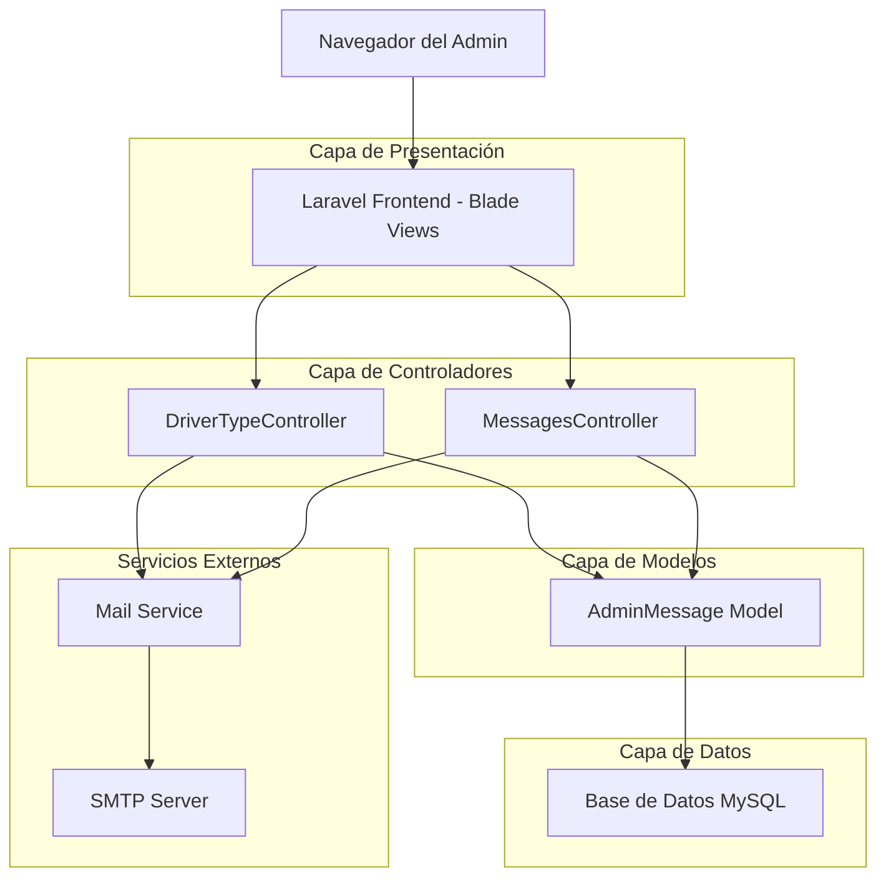
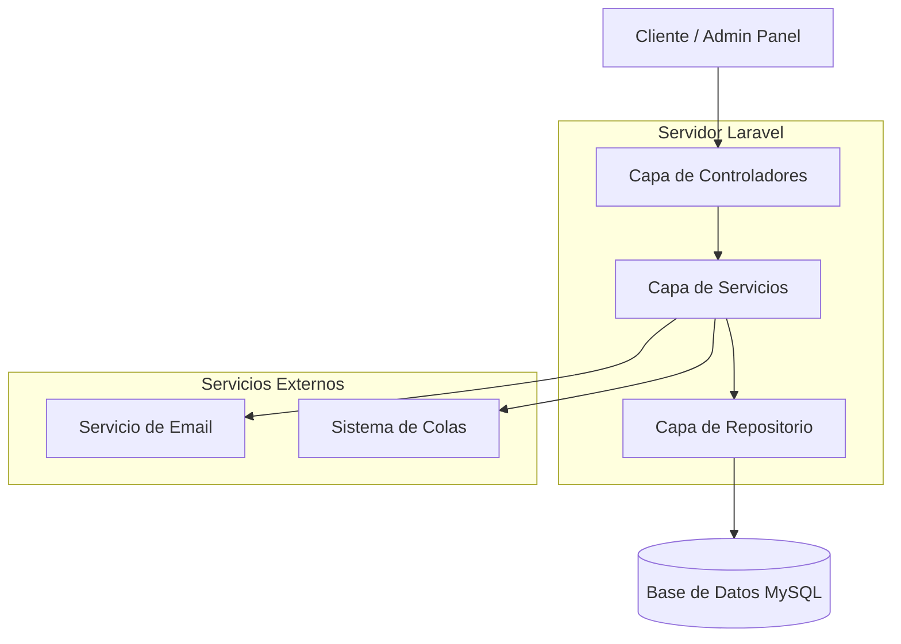
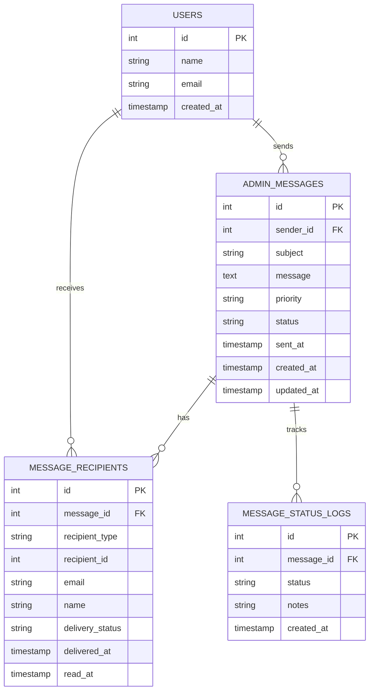

# Sistema de Gestión de Mensajes del Admin - Documento de Arquitectura Técnica

## 1. Diseño de Arquitectura



## 2. Descripción de Tecnologías

* Frontend: Laravel Blade Templates + TailwindCSS + Alpine.js

* Backend: Laravel 10 + PHP 8.1

* Base de Datos: MySQL (existente)

* Email: Laravel Mail + SMTP

## 3. Definiciones de Rutas

| Ruta                      | Propósito                                            |
| ------------------------- | ---------------------------------------------------- |
| /admin/messages           | Página principal de mensajes, muestra lista paginada |
| /admin/messages/create    | Formulario para crear nuevo mensaje                  |
| /admin/messages/{id}      | Vista de detalles de mensaje específico              |
| /admin/messages/{id}/edit | Editar mensaje (solo si no ha sido enviado)          |
| /admin/messages/dashboard | Dashboard con estadísticas de mensajes               |
| /admin/messages/search    | Búsqueda y filtrado de mensajes                      |

## 4. Definiciones de API

### 4.1 API Principal

**Listar mensajes**

```
GET /admin/messages
```

Parámetros de consulta:

| Nombre del Parámetro | Tipo del Parámetro | Es Requerido | Descripción                                    |
| -------------------- | ------------------ | ------------ | ---------------------------------------------- |
| page                 | integer            | false        | Número de página para paginación               |
| per\_page            | integer            | false        | Cantidad de elementos por página (default: 15) |
| search               | string             | false        | Búsqueda de texto en asunto o contenido        |
| status               | string             | false        | Filtrar por estado: sent, delivered, failed    |
| priority             | string             | false        | Filtrar por prioridad: low, normal, high       |
| date\_from           | date               | false        | Fecha de inicio para filtro de rango           |
| date\_to             | date               | false        | Fecha de fin para filtro de rango              |

Respuesta:

| Nombre del Parámetro | Tipo del Parámetro | Descripción          |
| -------------------- | ------------------ | -------------------- |
| data                 | array              | Lista de mensajes    |
| current\_page        | integer            | Página actual        |
| total                | integer            | Total de mensajes    |
| per\_page            | integer            | Elementos por página |

**Crear mensaje**

```
POST /admin/messages
```

Parámetros de solicitud:

| Nombre del Parámetro | Tipo del Parámetro | Es Requerido | Descripción                                    |
| -------------------- | ------------------ | ------------ | ---------------------------------------------- |
| recipient\_type      | string             | true         | Tipo de destinatario: driver, carrier, user    |
| recipient\_id        | integer            | true         | ID del destinatario                            |
| subject              | string             | true         | Asunto del mensaje (máx. 255 caracteres)       |
| message              | text               | true         | Contenido del mensaje (máx. 2000 caracteres)   |
| priority             | string             | true         | Prioridad: low, normal, high                   |
| send\_email          | boolean            | false        | Si enviar email inmediatamente (default: true) |

Ejemplo de solicitud:

```json
{
  "recipient_type": "driver",
  "recipient_id": 123,
  "subject": "Actualización de asignación de vehículo",
  "message": "Su asignación de vehículo ha sido actualizada...",
  "priority": "normal",
  "send_email": true
}
```

**Obtener detalles de mensaje**

```
GET /admin/messages/{id}
```

Respuesta:

| Nombre del Parámetro | Tipo del Parámetro | Descripción                  |
| -------------------- | ------------------ | ---------------------------- |
| id                   | integer            | ID del mensaje               |
| subject              | string             | Asunto del mensaje           |
| message              | text               | Contenido completo           |
| status               | string             | Estado actual del mensaje    |
| sent\_at             | datetime           | Fecha y hora de envío        |
| recipient            | object             | Información del destinatario |

## 5. Diagrama de Arquitectura del Servidor



## 6. Modelo de Datos

### 6.1 Definición del Modelo de Datos



### 6.2 Lenguaje de Definición de Datos

**Tabla de Mensajes Administrativos (admin\_messages)**

```sql
-- Crear tabla
CREATE TABLE admin_messages (
    id BIGINT UNSIGNED PRIMARY KEY AUTO_INCREMENT,
    sender_id BIGINT UNSIGNED NOT NULL,
    subject VARCHAR(255) NOT NULL,
    message TEXT NOT NULL,
    priority ENUM('low', 'normal', 'high') DEFAULT 'normal',
    status ENUM('draft', 'sent', 'delivered', 'failed') DEFAULT 'draft',
    sent_at TIMESTAMP NULL,
    created_at TIMESTAMP DEFAULT CURRENT_TIMESTAMP,
    updated_at TIMESTAMP DEFAULT CURRENT_TIMESTAMP ON UPDATE CURRENT_TIMESTAMP,
    
    FOREIGN KEY (sender_id) REFERENCES users(id) ON DELETE CASCADE
);

-- Crear índices
CREATE INDEX idx_admin_messages_sender_id ON admin_messages(sender_id);
CREATE INDEX idx_admin_messages_status ON admin_messages(status);
CREATE INDEX idx_admin_messages_priority ON admin_messages(priority);
CREATE INDEX idx_admin_messages_sent_at ON admin_messages(sent_at DESC);
CREATE INDEX idx_admin_messages_created_at ON admin_messages(created_at DESC);

-- Tabla de Destinatarios de Mensajes (message_recipients)
CREATE TABLE message_recipients (
    id BIGINT UNSIGNED PRIMARY KEY AUTO_INCREMENT,
    message_id BIGINT UNSIGNED NOT NULL,
    recipient_type ENUM('driver', 'carrier', 'user') NOT NULL,
    recipient_id BIGINT UNSIGNED NOT NULL,
    email VARCHAR(255) NOT NULL,
    name VARCHAR(255) NOT NULL,
    delivery_status ENUM('pending', 'sent', 'delivered', 'failed', 'bounced') DEFAULT 'pending',
    delivered_at TIMESTAMP NULL,
    read_at TIMESTAMP NULL,
    created_at TIMESTAMP DEFAULT CURRENT_TIMESTAMP,
    
    FOREIGN KEY (message_id) REFERENCES admin_messages(id) ON DELETE CASCADE
);

-- Crear índices para recipients
CREATE INDEX idx_message_recipients_message_id ON message_recipients(message_id);
CREATE INDEX idx_message_recipients_type_id ON message_recipients(recipient_type, recipient_id);
CREATE INDEX idx_message_recipients_email ON message_recipients(email);
CREATE INDEX idx_message_recipients_delivery_status ON message_recipients(delivery_status);

-- Tabla de Logs de Estado (message_status_logs)
CREATE TABLE message_status_logs (
    id BIGINT UNSIGNED PRIMARY KEY AUTO_INCREMENT,
    message_id BIGINT UNSIGNED NOT NULL,
    status VARCHAR(50) NOT NULL,
    notes TEXT NULL,
    created_at TIMESTAMP DEFAULT CURRENT_TIMESTAMP,
    
    FOREIGN KEY (message_id) REFERENCES admin_messages(id) ON DELETE CASCADE
);

-- Crear índices para logs
CREATE INDEX idx_message_status_logs_message_id ON message_status_logs(message_id);
CREATE INDEX idx_message_status_logs_created_at ON message_status_logs(created_at DESC);

-- Datos iniciales (opcional)
INSERT INTO admin_messages (sender_id, subject, message, priority, status, sent_at) VALUES
(1, 'Mensaje de prueba', 'Este es un mensaje de prueba del sistema', 'normal', 'sent', NOW());
```

