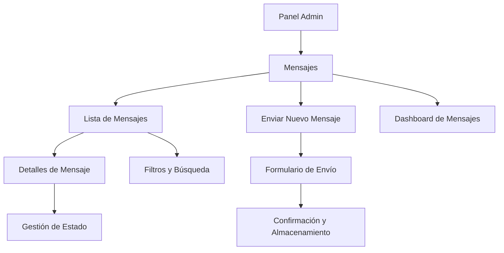

# Sistema de Gestión de Mensajes del Admin - Documento de Requerimientos del Producto

## 1. Resumen del Producto

Sistema integral de gestión de mensajes para administradores que permite almacenar, visualizar y gestionar todos los mensajes de contacto enviados desde el panel de administración hacia conductores y otros usuarios del sistema. El sistema proporciona un historial completo de comunicaciones con capacidades de búsqueda, filtrado y seguimiento de estado.

- **Propósito Principal**: Centralizar y gestionar todas las comunicaciones salientes del admin para mejorar el seguimiento y control de las interacciones con conductores.
- **Usuarios Objetivo**: Administradores del sistema EF Services que necesitan enviar y hacer seguimiento de mensajes a conductores.
- **Valor del Mercado**: Mejora la eficiencia operativa y proporciona trazabilidad completa de las comunicaciones administrativas.

## 2. Características Principales

### 2.1 Roles de Usuario

| Rol | Método de Registro | Permisos Principales |
|-----|-------------------|---------------------|
| Administrador | Acceso existente al sistema admin | Puede enviar mensajes, ver historial completo, gestionar estados |
| Super Admin | Acceso existente al sistema admin | Todos los permisos de admin + configuración del sistema |

### 2.2 Módulos de Funcionalidad

Nuestros requerimientos del sistema de mensajes consisten en las siguientes páginas principales:

1. **Página de Mensajes**: listado principal, filtros de búsqueda, paginación, acciones masivas.
2. **Página de Detalles de Mensaje**: vista completa del mensaje, información del destinatario, estado de entrega.
3. **Página de Envío de Mensaje**: formulario mejorado integrado con el sistema existente.
4. **Dashboard de Mensajes**: estadísticas y métricas de comunicaciones.

### 2.3 Detalles de Páginas

| Nombre de Página | Nombre del Módulo | Descripción de Funcionalidad |
|------------------|-------------------|------------------------------|
| Página de Mensajes | Lista de Mensajes | Mostrar todos los mensajes enviados con filtros por fecha, destinatario, estado, prioridad. Incluir búsqueda por asunto o contenido. Paginación y ordenamiento. |
| Página de Mensajes | Filtros y Búsqueda | Filtrar por rango de fechas, tipo de destinatario, estado (enviado, leído, fallido), prioridad (baja, normal, alta). Búsqueda de texto completo. |
| Página de Mensajes | Acciones Masivas | Marcar múltiples mensajes como leídos, eliminar mensajes seleccionados, exportar a CSV. |
| Página de Detalles | Vista de Mensaje | Mostrar contenido completo del mensaje, información del destinatario, fecha/hora de envío, estado de entrega, respuestas si las hay. |
| Página de Detalles | Gestión de Estado | Marcar como leído/no leído, agregar notas internas, reenviar mensaje. |
| Página de Envío | Formulario Integrado | Mejorar formulario existente para guardar en base de datos, selección de plantillas, vista previa. |
| Dashboard | Estadísticas | Métricas de mensajes enviados por período, tasas de respuesta, mensajes por tipo de destinatario. |
| Dashboard | Gráficos | Visualización de tendencias de comunicación, distribución por prioridad, estado de mensajes. |

## 3. Proceso Principal

### Flujo de Administrador

El administrador accede al sistema de mensajes desde el panel principal, puede ver el historial completo de mensajes enviados, filtrar y buscar comunicaciones específicas, y enviar nuevos mensajes que se almacenan automáticamente en el sistema.

**Flujo de Navegación:**

## 4. Diseño de Interfaz de Usuario

### 4.1 Estilo de Diseño

- **Colores Primarios**: Azul (#3B82F6) para acciones principales, Verde (#10B981) para estados exitosos
- **Colores Secundarios**: Gris (#6B7280) para texto secundario, Rojo (#EF4444) para alertas
- **Estilo de Botones**: Redondeados con sombras sutiles, consistente con el tema existente
- **Fuentes**: Sistema de fuentes existente del admin, tamaños 14px para texto normal, 16px para títulos
- **Layout**: Diseño de tarjetas para lista de mensajes, navegación superior integrada
- **Iconos**: Lucide icons para consistencia con el sistema existente

### 4.2 Resumen de Diseño de Páginas

| Nombre de Página | Nombre del Módulo | Elementos de UI |
|------------------|-------------------|-----------------|
| Lista de Mensajes | Encabezado | Título de página, botón "Nuevo Mensaje", filtros rápidos, barra de búsqueda |
| Lista de Mensajes | Tabla de Mensajes | Columnas: Destinatario, Asunto, Fecha, Estado, Prioridad, Acciones. Paginación inferior |
| Lista de Mensajes | Filtros Laterales | Panel colapsible con filtros por fecha, estado, tipo, prioridad |
| Detalles de Mensaje | Información Principal | Tarjeta con datos del mensaje, estado de entrega, botones de acción |
| Detalles de Mensaje | Contenido | Área de texto formateada, adjuntos si los hay, historial de estados |
| Dashboard | Métricas | Tarjetas con estadísticas clave, gráficos de tendencias |
| Formulario de Envío | Campos | Selector de destinatario, asunto, mensaje, prioridad, plantillas |

### 4.3 Responsividad

El sistema será responsive-first con adaptación completa para dispositivos móviles y tablets. En móviles, la tabla se convertirá en tarjetas apiladas y los filtros se mostrarán en un modal deslizable.
