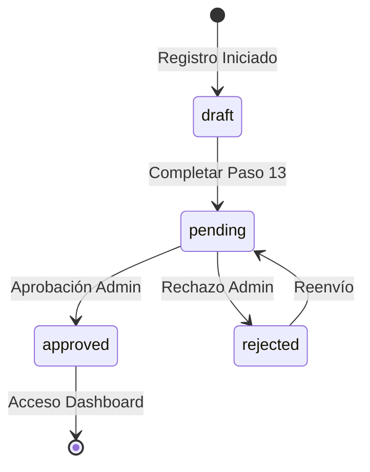

# Análisis Actualizado: Flujo Post-Registro de Conductores - EF Services

## 1. Resumen Ejecutivo

Este documento presenta un análisis completo y actualizado del flujo post-registro de conductores en EF Services, sincronizado con la infraestructura administrativa existente. El análisis incorpora las URLs administrativas actuales, los componentes Livewire implementados y propone mejoras que complementen el sistema sin duplicar funcionalidad.

## 2. Sistema Administrativo Actual

### 2.1 URLs y Rutas Existentes

**Rutas Administrativas Principales:**
- **Lista de Reclutamiento**: `http://efservices.la/admin/driver-recruitment`
  - Controlador: `DriverRecruitmentController@index`
  - Ruta: `admin.driver-recruitment.index`
  - Componente: `DriverRecruitmentList`

- **Vista Individual**: `http://efservices.la/admin/driver-recruitment/{id}`
  - Controlador: `DriverRecruitmentController@show`
  - Ruta: `admin.driver-recruitment.show`
  - Componente: `DriverRecruitmentReview`

### 2.2 Arquitectura de Controladores

```php
// DriverRecruitmentController.php
class DriverRecruitmentController extends Controller
{
    public function index()
    {
        return view('admin.drivers.recruitment.index');
    }

    public function show($driverId)
    {
        $driver = UserDriverDetail::findOrFail($driverId);
        return view('admin.drivers.recruitment.show', [
            'driverId' => $driverId,
            'driver' => $driver
        ]);
    }
}
```

## 3. Componentes Livewire Existentes

### 3.1 DriverRecruitmentList

**Funcionalidades Implementadas:**
- Listado paginado de conductores
- Filtros por búsqueda, estado y carrier
- Cálculo de porcentaje de verificación
- Actualización en tiempo real

**Características Técnicas:**
```php
class DriverRecruitmentList extends Component
{
    use WithPagination;
    
    public $search = '';
    public $statusFilter = '';
    public $carrierFilter = '';
    
    public function getChecklistPercentage($driver)
    {
        // Lógica de cálculo de porcentaje basada en DriverRecruitmentVerification
        if ($driver->application && $driver->application->status === 'approved') {
            return ['percentage' => 100, 'checked' => 1, 'total' => 1];
        }
        // ... lógica de verificación detallada
    }
}
```

### 3.2 DriverRecruitmentReview

**Funcionalidades Implementadas:**
- Sistema de checklist con 18+ elementos de verificación
- Aprobación y rechazo de aplicaciones
- Gestión de documentos y archivos
- Notas de verificación
- Descarga masiva de documentos

**Checklist de Verificación:**
```php
public function initializeChecklist()
{
    $this->checklistItems = [
        'general_info' => ['checked' => false, 'label' => 'Complete and valid general information'],
        'contact_info' => ['checked' => false, 'label' => 'Verified contact information'],
        'address_info' => ['checked' => false, 'label' => 'Validated current address and history'],
        'license_info' => ['checked' => false, 'label' => 'Valid and current drivers license'],
        'license_image' => ['checked' => false, 'label' => 'Attached, legible license images'],
        'medical_info' => ['checked' => false, 'label' => 'Complete medical information'],
        'medical_image' => ['checked' => false, 'label' => 'Medical card attached and current'],
        'experience_info' => ['checked' => false, 'label' => 'Verified driving experience'],
        'training_verified' => ['checked' => false, 'label' => 'Training information verified (or N/A)'],
        'traffic_verified' => ['checked' => false, 'label' => 'Traffic violations verified (or N/A)'],
        'accident_verified' => ['checked' => false, 'label' => 'Accident record verified (or N/A)'],
        'driving_record' => ['checked' => false, 'label' => 'Driving record uploaded and verified'],
        'criminal_record' => ['checked' => false, 'label' => 'Criminal record uploaded and verified'],
        'clearing_house' => ['checked' => false, 'label' => 'Clearing House uploaded and verified'],
        'history_info' => ['checked' => false, 'label' => 'Complete work history (10 years)'],
        'criminal_check' => ['checked' => false, 'label' => 'Criminal background check'],
        'drug_test' => ['checked' => false, 'label' => 'Drug test verification'],
        'mvr_check' => ['checked' => false, 'label' => 'MVR check completed'],
        'policy_agreed' => ['checked' => false, 'label' => 'Company policies agreed'],
        'application_certification' => ['checked' => false, 'label' => 'Application Certification'],
        'documents_checked' => ['checked' => false, 'label' => 'All documents verified']
    ];
}
```

## 4. Estados de DriverApplication

### 4.1 Constantes de Estado

```php
// DriverApplication.php
class DriverApplication extends Model
{
    public const STATUS_DRAFT = 'draft';
    public const STATUS_PENDING = 'pending';
    public const STATUS_APPROVED = 'approved';
    public const STATUS_REJECTED = 'rejected';
}
```

### 4.2 Flujo de Estados



## 5. Funcionalidad de Aprobación/Rechazo Implementada

### 5.1 Método de Aprobación

```php
public function approveApplication()
{
    if (!$this->isChecklistComplete()) {
        $this->addError('checklist', 'You must complete the entire checklist prior to approval.');
        return;
    }

    // Guardar la verificación final
    $this->saveVerification();

    // Actualizar estado de la aplicación a aprobado
    $this->application->update([
        'status' => DriverApplication::STATUS_APPROVED,
        'completed_at' => now()
    ]);

    // Actualizar estado del driver
    $this->driver->update([
        'status' => UserDriverDetail::STATUS_ACTIVE,
        'completion_percentage' => 100
    ]);

    // Notificaciones y actualizaciones
    $this->loadDriverData();
    $this->dispatch('applicationStatusUpdated');
    session()->flash('message', 'La solicitud ha sido aprobada correctamente.');
}
```

### 5.2 Método de Rechazo

```php
public function rejectApplication()
{
    return $this->processRejection();
}

public function processRejection()
{
    $this->validate([
        'rejectionReason' => 'required|min:10'
    ], [
        'rejectionReason.required' => 'You must provide a reason for rejection.',
        'rejectionReason.min' => 'The reason must have at least 10 characters.'
    ]);

    $this->application->update([
        'status' => DriverApplication::STATUS_REJECTED,
        'rejection_reason' => $this->rejectionReason,
        'completed_at' => now()
    ]);

    $this->loadDriverData();
    $this->dispatch('applicationStatusUpdated');
    session()->flash('message', 'La solicitud ha sido rechazada correctamente.');
}
```

## 6. Flujo Post-Registro Completo

### 6.1 Diagrama de Flujo Principal

```mermaid
flowchart TD
    A[Paso 13: Certificación] --> B{Aplicación Completa?}
    B -->|Sí| C[Estado: PENDING]
    B -->|No| D[Estado: DRAFT]
    
    C --> E[CheckUserStatus Middleware]
    E --> F[Redirección a /driver/pending]
    F --> G[Vista: pending.blade.php]
    
    D --> H[Continuar Registro]
    H --> A
    
    I[Admin: Lista Reclutamiento] --> J[DriverRecruitmentList]
    J --> K[Filtros y Búsqueda]
    K --> L[Seleccionar Conductor]
    L --> M[Vista Individual]
    M --> N[DriverRecruitmentReview]
    
    N --> O{Checklist Completo?}
    O -->|No| P[Completar Verificación]
    P --> O
    O -->|Sí| Q{Decisión Admin}
    
    Q -->|Aprobar| R[approveApplication()]
    Q -->|Rechazar| S[rejectApplication()]
    
    R --> T[Estado: APPROVED]
    S --> U[Estado: REJECTED]
    
    T --> V[UserDriverDetail: ACTIVE]
    V --> W[Acceso Dashboard]
    
    U --> X[Vista: rejected.blade.php]
    X --> Y[Contactar Soporte]
```

### 6.2 Middleware CheckUserStatus

```php
class CheckUserStatus
{
    public function handle($request, Closure $next)
    {
        $user = Auth::user();
        
        if ($user->hasRole('driver')) {
            $driverDetail = $user->driverDetail;
            $application = $driverDetail->application;
            
            switch ($application->status) {
                case DriverApplication::STATUS_PENDING:
                    if (!$request->is('driver/pending')) {
                        return redirect()->route('driver.pending');
                    }
                    break;
                    
                case DriverApplication::STATUS_REJECTED:
                    if (!$request->is('driver/rejected')) {
                        return redirect()->route('driver.rejected');
                    }
                    break;
                    
                case DriverApplication::STATUS_APPROVED:
                    if ($request->is('driver/pending', 'driver/rejected')) {
                        return redirect()->route('driver.dashboard');
                    }
                    break;
            }
        }
        
        return $next($request);
    }
}
```

## 7. Vistas de Estado del Conductor

### 7.1 Vista Pending (pending.blade.php)

**Elementos Principales:**
- Mensaje de "Application Under Review"
- Estado "Pending Approval"
- Información sobre notificaciones por email
- Sección FMCSA Clearinghouse
- Modal informativo

### 7.2 Vista Rejected (rejected.blade.php)

**Elementos Principales:**
- Mensaje de "Application Rejected"
- Información sobre próximos pasos
- Botón "Contact Support"
- Orientación para reapplicación

## 8. Propuestas de Mejora Sincronizadas

### 8.1 Mejoras al Sistema de Notificaciones

**Problema Identificado:** No existe un sistema automatizado de notificaciones.

**Solución Propuesta:**
```php
// Nuevo: DriverApplicationNotificationService
class DriverApplicationNotificationService
{
    public function sendStatusUpdateNotification($application, $oldStatus, $newStatus)
    {
        $driver = $application->userDriverDetail;
        
        switch ($newStatus) {
            case DriverApplication::STATUS_APPROVED:
                Mail::to($driver->user->email)
                    ->send(new DriverApplicationApprovedMail($driver));
                break;
                
            case DriverApplication::STATUS_REJECTED:
                Mail::to($driver->user->email)
                    ->send(new DriverApplicationRejectedMail($driver, $application->rejection_reason));
                break;
        }
    }
}
```

### 8.2 Dashboard Administrativo Mejorado

**Mejora:** Agregar métricas y estadísticas al componente DriverRecruitmentList.

```php
// Agregar al DriverRecruitmentList
public function getRecruitmentStats()
{
    return [
        'total_applications' => DriverApplication::count(),
        'pending_applications' => DriverApplication::where('status', 'pending')->count(),
        'approved_today' => DriverApplication::where('status', 'approved')
            ->whereDate('completed_at', today())->count(),
        'rejected_today' => DriverApplication::where('status', 'rejected')
            ->whereDate('completed_at', today())->count(),
        'average_processing_time' => $this->calculateAverageProcessingTime()
    ];
}
```

### 8.3 Sistema de Auditoría

**Mejora:** Implementar logging detallado de acciones administrativas.

```php
// Nuevo: DriverApplicationAuditLog
class DriverApplicationAuditLog extends Model
{
    protected $fillable = [
        'driver_application_id',
        'admin_user_id',
        'action',
        'old_status',
        'new_status',
        'notes',
        'ip_address',
        'user_agent'
    ];
}

// Integrar en DriverRecruitmentReview
public function approveApplication()
{
    // ... código existente ...
    
    // Agregar log de auditoría
    DriverApplicationAuditLog::create([
        'driver_application_id' => $this->application->id,
        'admin_user_id' => Auth::id(),
        'action' => 'approve',
        'old_status' => $this->application->status,
        'new_status' => DriverApplication::STATUS_APPROVED,
        'notes' => 'Application approved after checklist completion',
        'ip_address' => request()->ip(),
        'user_agent' => request()->userAgent()
    ]);
}
```

### 8.4 Mejoras a las Vistas de Estado

**Mejora:** Agregar información más detallada y acciones adicionales.

```php
// Mejorar pending.blade.php
<div class="status-timeline">
    <div class="timeline-item completed">
        <span class="timeline-icon">✓</span>
        <span class="timeline-text">Application Submitted</span>
        <span class="timeline-date">{{ $application->created_at->format('M d, Y') }}</span>
    </div>
    <div class="timeline-item active">
        <span class="timeline-icon">⏳</span>
        <span class="timeline-text">Under Review</span>
        <span class="timeline-date">Current</span>
    </div>
    <div class="timeline-item pending">
        <span class="timeline-icon">📋</span>
        <span class="timeline-text">Decision</span>
        <span class="timeline-date">Pending</span>
    </div>
</div>
```

## 9. Plan de Implementación Sincronizado

### 9.1 Fase 1: Mejoras Inmediatas (1-2 semanas)

**Objetivos:**
- Implementar sistema de notificaciones
- Agregar logging de auditoría
- Mejorar vistas de estado

**Tareas:**
1. Crear `DriverApplicationNotificationService`
2. Implementar `DriverApplicationAuditLog`
3. Actualizar métodos de aprobación/rechazo
4. Mejorar `pending.blade.php` y `rejected.blade.php`

### 9.2 Fase 2: Dashboard y Métricas (2-3 semanas)

**Objetivos:**
- Agregar métricas al dashboard administrativo
- Implementar reportes de reclutamiento
- Optimizar rendimiento de consultas

**Tareas:**
1. Agregar métricas a `DriverRecruitmentList`
2. Crear componente de estadísticas
3. Implementar caché para consultas pesadas
4. Agregar filtros avanzados

### 9.3 Fase 3: Automatización y Optimización (3-4 semanas)

**Objetivos:**
- Automatizar procesos de verificación
- Implementar recordatorios automáticos
- Optimizar flujo de trabajo

**Tareas:**
1. Crear jobs para verificaciones automáticas
2. Implementar sistema de recordatorios
3. Optimizar middleware `CheckUserStatus`
4. Agregar tests automatizados

## 10. Consideraciones Técnicas

### 10.1 Rendimiento

- **Consultas Optimizadas:** Usar eager loading para relaciones
- **Caché:** Implementar caché para métricas y estadísticas
- **Paginación:** Mantener paginación eficiente en listados

### 10.2 Seguridad

- **Autorización:** Verificar permisos administrativos
- **Validación:** Validar todas las entradas de usuario
- **Auditoría:** Registrar todas las acciones críticas

### 10.3 Escalabilidad

- **Jobs en Cola:** Procesar notificaciones en background
- **Eventos:** Usar eventos para desacoplar funcionalidades
- **Microservicios:** Considerar separación de servicios de notificación

## 11. Conclusiones

El sistema actual de EF Services cuenta con una base sólida para el manejo del flujo post-registro de conductores. Los componentes Livewire `DriverRecruitmentList` y `DriverRecruitmentReview` proporcionan funcionalidad completa de gestión administrativa, mientras que el middleware `CheckUserStatus` maneja correctamente las redirecciones basadas en estado.

Las mejoras propuestas se enfocan en:
1. **Complementar** la funcionalidad existente sin duplicar código
2. **Automatizar** procesos manuales
3. **Mejorar** la experiencia del usuario y administrador
4. **Fortalecer** la seguridad y auditoría

La implementación por fases permite una integración gradual que minimiza riesgos y maximiza el valor agregado al sistema existente.

---

**Documento generado:** {{ date('Y-m-d H:i:s') }}
**Versión:** 2.0 - Sincronizado con sistema existente
**Estado:** Listo para implementación