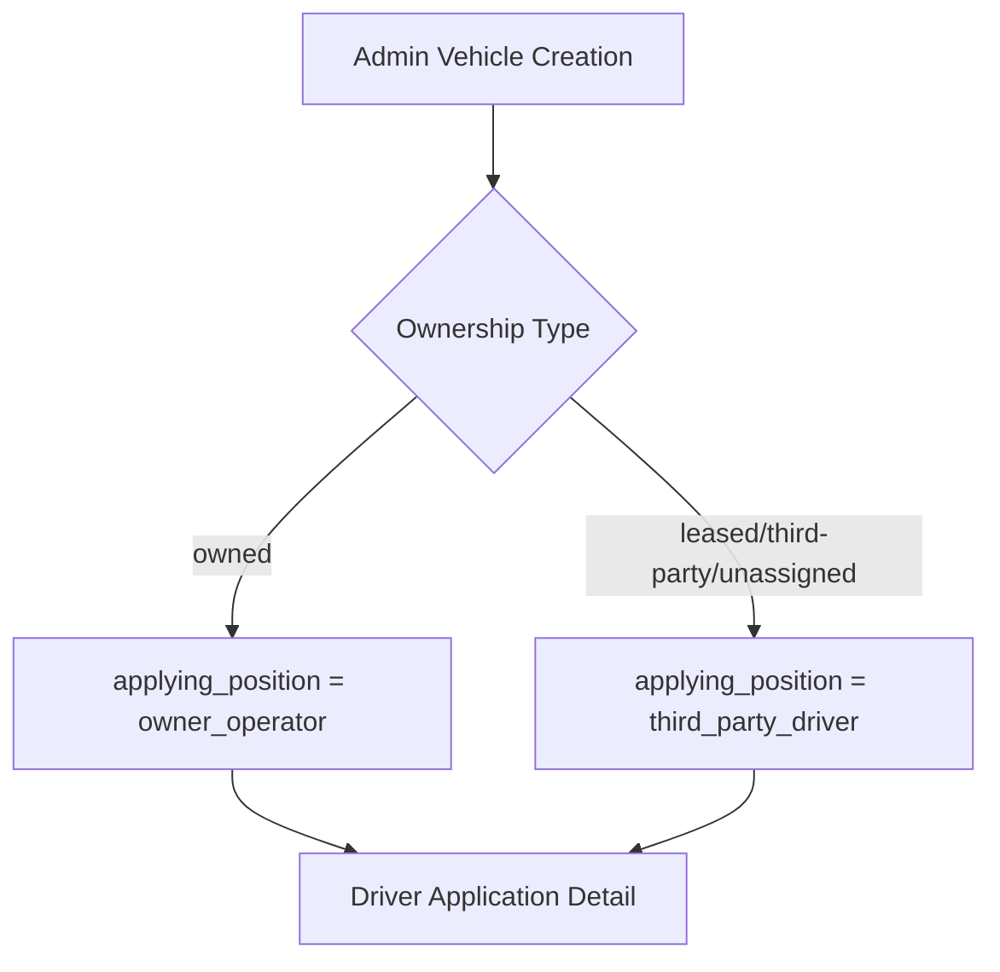
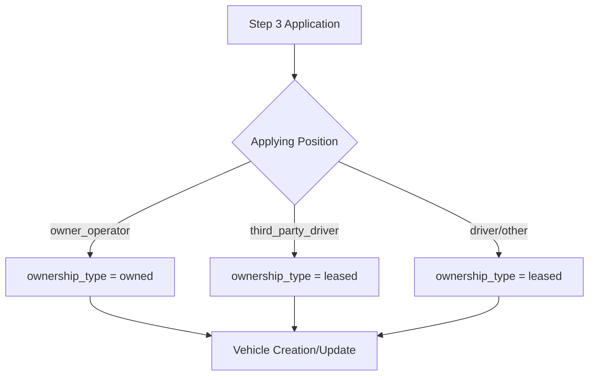

# Análisis de Gestión de Vehículos: Admin vs Step 3

## 1. Resumen Ejecutivo

Este documento analiza la gestión del campo "Ownership Type" en el panel de administración de vehículos y su sincronización con el campo "applying_position" del Step 3 del proceso de aplicación de conductores. Se identifican las diferencias, inconsistencias y se proponen recomendaciones para mejorar la coherencia entre ambos sistemas.

## 2. Análisis del Sistema Actual

### 2.1 Panel de Administración de Vehículos

**Rutas analizadas:**
- `http://efservices.la/admin/vehicles/` (Lista de vehículos)
- `http://efservices.la/admin/vehicles/create` (Crear vehículo)
- `http://efservices.la/admin/vehicles/{id}/edit` (Editar vehículo)

**Campo Ownership Type en Admin:**
```php
// Opciones disponibles en admin/vehicles/create.blade.php y edit.blade.php
<select name="ownership_type" x-model="ownership_type" @change="handleOwnershipChange">
    <option value="unassigned">Unassigned</option>
    <option value="owned">Owned</option>
    <option value="leased">Leased</option>
    <option value="third-party">Third Party</option>
</select>
```

**Lógica de mapeo en VehicleController.php:**
```php
// Línea 196-206: Mapeo de ownership_type a applying_position
'applying_position' => $request->ownership_type === 'owned' ? 'owner_operator' : 'third_party_driver',
```

### 2.2 Step 3 - Proceso de Aplicación del Conductor

**Campo applying_position en ApplicationStep:**
```php
// Opciones disponibles desde Constants::driverPositions()
'driver' => 'Company Driver',
'owner_operator' => 'Owner Operator', 
'third_party_driver' => 'Third Party Company Driver',
'other' => 'Other'
```

**Lógica de mapeo en ApplicationStep.php:**
```php
// Líneas 600-615: Mapeo de applying_position a ownership_type
'ownership_type' => $this->applying_position === 'owner_operator' ? 'owned' : 'leased',
```

## 3. Comparación y Análisis de Inconsistencias

### 3.1 Mapeo de Valores

| Admin Ownership Type | Step 3 Applying Position | Mapeo Actual | Problema Identificado |
|---------------------|-------------------------|--------------|----------------------|
| `unassigned` | N/A | No mapeado | ❌ Valor no considerado en Step 3 |
| `owned` | `owner_operator` | ✅ Correcto | ✅ Mapeo coherente |
| `leased` | `third_party_driver` | ⚠️ Parcial | ⚠️ Solo mapea desde Step 3 a Admin |
| `third-party` | `third_party_driver` | ❌ Inconsistente | ❌ VehicleController mapea a `third_party_driver` |
| N/A | `driver` (Company Driver) | No mapeado | ❌ Valor no considerado en Admin |
| N/A | `other` | No mapeado | ❌ Valor no considerado en Admin |

### 3.2 Problemas Identificados

#### 3.2.1 Mapeo Bidireccional Incompleto
- **Admin → Step 3:** Solo mapea `owned` y otros valores por defecto a `third_party_driver`
- **Step 3 → Admin:** Solo mapea `owner_operator` a `owned`, todo lo demás a `leased`

#### 3.2.2 Valores No Sincronizados
- `unassigned` en Admin no tiene equivalente en Step 3
- `driver` (Company Driver) en Step 3 no tiene equivalente en Admin
- `other` en Step 3 no tiene equivalente en Admin

#### 3.2.3 Lógica de Determinación de Tipo de Vehículo
```php
// ApplicationStep.php líneas 275-299
$driverType = $this->applying_position === 'owner_operator' ? 'owner_operator' : 
              ($this->applying_position === 'third_party_driver' ? 'third_party' : 'company');
```

Esta lógica es más completa que el mapeo de `ownership_type`.

## 4. Flujo de Datos Actual

### 4.1 Desde Admin hacia Step 3


### 4.2 Desde Step 3 hacia Admin


## 5. Recomendaciones de Mejora

### 5.1 Estandarización de Valores

**Propuesta de mapeo mejorado:**

| Step 3 Applying Position | Admin Ownership Type | Driver Type | Descripción |
|-------------------------|---------------------|-------------|-------------|
| `owner_operator` | `owned` | `owner_operator` | Vehículo propio del conductor |
| `third_party_driver` | `third-party` | `third_party` | Vehículo de terceros |
| `driver` | `company` | `company` | Vehículo de la empresa |
| `other` | `unassigned` | `unassigned` | Casos especiales |

### 5.2 Modificaciones Técnicas Requeridas

#### 5.2.1 Actualizar Constants.php
```php
public static function driverPositions()
{
    return [
        'company_driver' => 'Company Driver',
        'owner_operator' => 'Owner Operator',
        'third_party_driver' => 'Third Party Company Driver',
        'other' => 'Other'
    ];
}

public static function ownershipTypes()
{
    return [
        'company' => 'Company Vehicle',
        'owned' => 'Owner Operator Vehicle',
        'third-party' => 'Third Party Vehicle',
        'unassigned' => 'Unassigned'
    ];
}
```

#### 5.2.2 Mejorar VehicleController.php
```php
// Mapeo bidireccional mejorado
private function mapApplyingPositionToOwnership($applyingPosition)
{
    return match($applyingPosition) {
        'owner_operator' => 'owned',
        'third_party_driver' => 'third-party',
        'driver' => 'company',
        default => 'unassigned'
    };
}

private function mapOwnershipToApplyingPosition($ownershipType)
{
    return match($ownershipType) {
        'owned' => 'owner_operator',
        'third-party' => 'third_party_driver',
        'company' => 'driver',
        default => 'other'
    };
}
```

#### 5.2.3 Actualizar ApplicationStep.php
```php
// Mejorar la lógica de mapeo en saveApplicationDetails()
'ownership_type' => $this->mapApplyingPositionToOwnership($this->applying_position),

// Mejorar loadExistingData() para mapeo inverso
$this->applying_position = $this->mapOwnershipToApplyingPosition($vehicle->ownership_type);
```

### 5.3 Validaciones y Consistencia

#### 5.3.1 Agregar Validación Cruzada
```php
// En ApplicationStep.php
public function validateVehicleConsistency()
{
    if ($this->vehicle_id) {
        $vehicle = Vehicle::find($this->vehicle_id);
        $expectedOwnership = $this->mapApplyingPositionToOwnership($this->applying_position);
        
        if ($vehicle->ownership_type !== $expectedOwnership) {
            $this->addError('applying_position', 'Vehicle ownership type does not match selected position.');
        }
    }
}
```

#### 5.3.2 Sincronización Automática
```php
// En updatedApplyingPosition()
public function updatedApplyingPosition($value)
{
    // Lógica existente...
    
    // Sincronizar vehículo existente si está seleccionado
    if ($this->vehicle_id) {
        $vehicle = Vehicle::find($this->vehicle_id);
        if ($vehicle) {
            $vehicle->update([
                'ownership_type' => $this->mapApplyingPositionToOwnership($value),
                'driver_type' => $this->mapApplyingPositionToDriverType($value)
            ]);
        }
    }
}
```

## 6. Plan de Implementación

### 6.1 Fase 1: Estandarización (Semana 1)
1. Actualizar Constants.php con mapeos estandarizados
2. Crear métodos de mapeo bidireccional
3. Actualizar vistas de admin para usar nuevos valores

### 6.2 Fase 2: Lógica de Negocio (Semana 2)
1. Implementar mapeo mejorado en VehicleController
2. Actualizar ApplicationStep con nueva lógica
3. Agregar validaciones cruzadas

### 6.3 Fase 3: Migración de Datos (Semana 3)
1. Crear migración para actualizar datos existentes
2. Script de sincronización de vehículos existentes
3. Validación de integridad de datos

### 6.4 Fase 4: Testing y Validación (Semana 4)
1. Pruebas unitarias para mapeos
2. Pruebas de integración Admin ↔ Step 3
3. Validación con datos reales

## 7. Consideraciones Técnicas

### 7.1 Impacto en Base de Datos
- Actualización de registros existentes en tabla `vehicles`
- Posible necesidad de migración de datos históricos
- Validación de integridad referencial

### 7.2 Compatibilidad hacia Atrás
- Mantener soporte temporal para valores antiguos
- Implementar mapeo de compatibilidad durante transición
- Logs detallados para monitorear cambios

### 7.3 Impacto en Generación de PDFs
- Verificar que CertificationStep.php use el `applying_position` correcto
- Validar que los PDFs se generen según el tipo correcto
- Probar ambos flujos: `owner_operator` y `third_party_driver`

## 8. Conclusiones

La gestión actual del "Ownership Type" presenta inconsistencias significativas entre el panel de administración y el Step 3 del proceso de aplicación. Las principales áreas de mejora incluyen:

1. **Estandarización de valores** entre ambos sistemas
2. **Mapeo bidireccional completo** y consistente
3. **Validaciones cruzadas** para mantener integridad
4. **Sincronización automática** entre sistemas

La implementación de estas mejoras garantizará una experiencia más coherente y reducirá errores en la gestión de vehículos y generación de documentos.

---

**Documento generado:** `analisis_gestion_vehiculos_admin_vs_step3.md`  
**Fecha:** $(