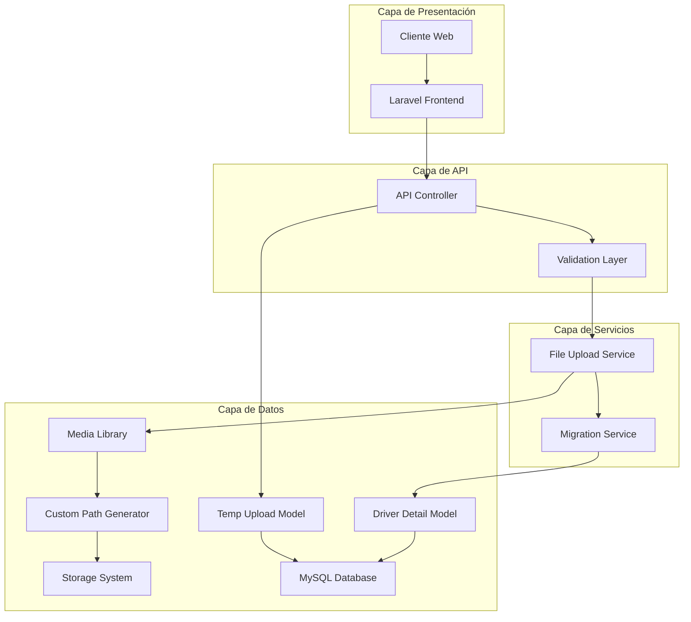
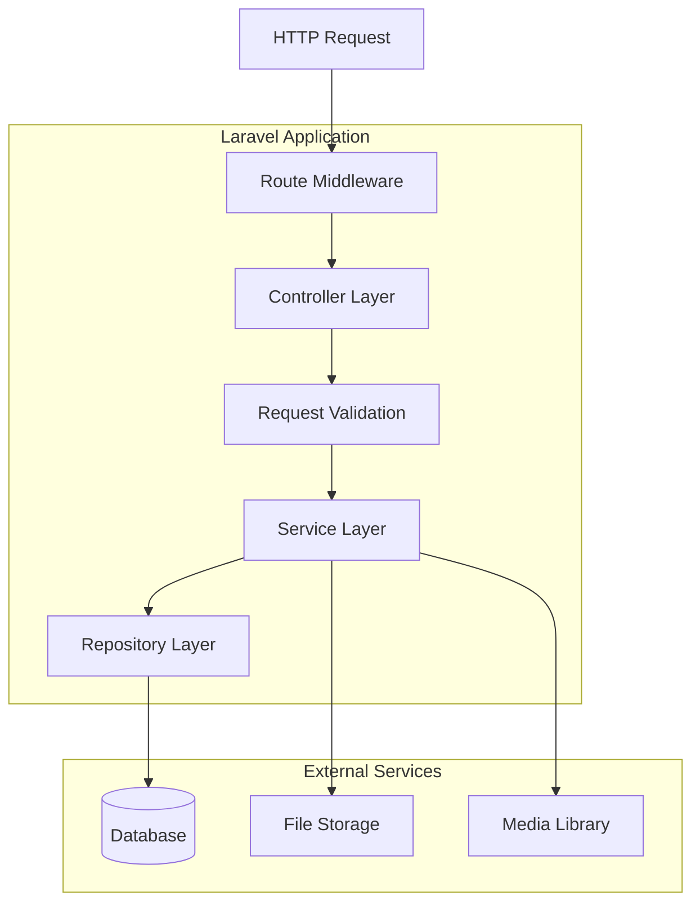
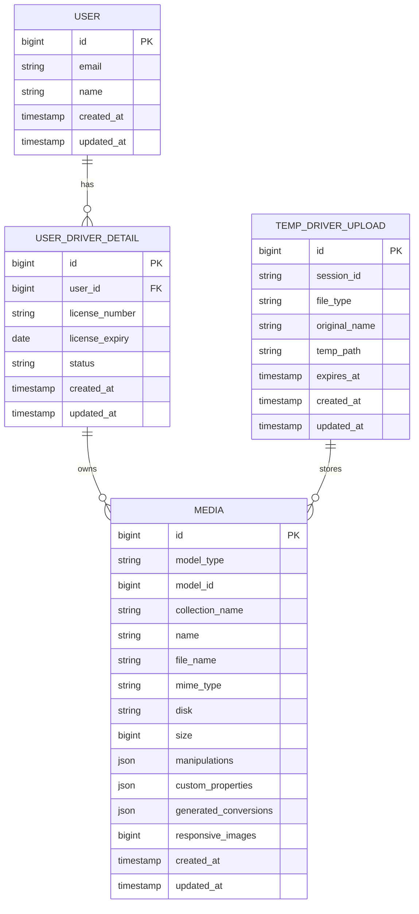

# Arquitectura Técnica - Sistema de Carga de Licencias

## 1. Diseño de Arquitectura



## 2. Descripción de Tecnologías

* **Frontend**: Laravel Blade + Livewire + JavaScript

* **Backend**: Laravel 10+ + Spatie Media Library

* **Base de Datos**: MySQL 8.0+

* **Almacenamiento**: Local Storage / S3 Compatible

* **Validación**: Laravel Validation + Custom Rules

## 3. Definición de Rutas

| Ruta                                   | Propósito                                   |
| -------------------------------------- | ------------------------------------------- |
| `/driver/registration/continue/4`      | Página del Step 4 - Carga de licencias      |
| `/api/driver/upload-license-temp`      | API para carga temporal de licencias        |
| `/api/driver/validate-license`         | API para validación de archivos de licencia |
| `/api/driver/preview-license/{id}`     | API para preview de licencias temporales    |
| `/api/driver/delete-temp-license/{id}` | API para eliminar licencias temporales      |

## 4. Definiciones de API

### 4.1 API Principal

**Carga temporal de licencias**

```
POST /api/driver/upload-license-temp
```

Request:

| Parámetro   | Tipo   | Requerido | Descripción                              |
| ----------- | ------ | --------- | ---------------------------------------- |
| file        | File   | true      | Archivo de imagen de la licencia         |
| type        | string | true      | Tipo: 'license\_front' o 'license\_back' |
| session\_id | string | true      | ID único de sesión del usuario           |

Response:

| Parámetro    | Tipo    | Descripción                                  |
| ------------ | ------- | -------------------------------------------- |
| success      | boolean | Estado de la operación                       |
| temp\_id     | integer | ID del registro temporal                     |
| media\_id    | integer | ID del archivo en media library              |
| preview\_url | string  | URL para preview del archivo                 |
| file\_info   | object  | Información del archivo (tamaño, tipo, etc.) |

Ejemplo de Request:

```json
{
  "file": "<binary_data>",
  "type": "license_front",
  "session_id": "sess_abc123def456"
}
```

Ejemplo de Response:

```json
{
  "success": true,
  "temp_id": 123,
  "media_id": 456,
  "preview_url": "https://example.com/temp/preview/456",
  "file_info": {
    "size": 2048576,
    "mime_type": "image/jpeg",
    "dimensions": "1920x1080"
  }
}
```

**Validación de licencia**

```
POST /api/driver/validate-license
```

Request:

| Parámetro | Tipo    | Requerido | Descripción             |
| --------- | ------- | --------- | ----------------------- |
| temp\_id  | integer | true      | ID del archivo temporal |

Response:

| Parámetro   | Tipo    | Descripción                  |
| ----------- | ------- | ---------------------------- |
| valid       | boolean | Si el archivo es válido      |
| errors      | array   | Lista de errores encontrados |
| suggestions | array   | Sugerencias de mejora        |

**Preview de licencia temporal**

```
GET /api/driver/preview-license/{id}
```

Response:

| Parámetro      | Tipo   | Descripción           |
| -------------- | ------ | --------------------- |
| url            | string | URL del archivo       |
| thumbnail\_url | string | URL de la miniatura   |
| metadata       | object | Metadatos del archivo |

## 5. Arquitectura del Servidor



## 6. Modelo de Datos

### 6.1 Diagrama de Entidades



### 6.2 Definición de Lenguaje de Datos (DDL)

**Tabla de cargas temporales**

```sql
-- Crear tabla temp_driver_uploads
CREATE TABLE temp_driver_uploads (
    id BIGINT UNSIGNED AUTO_INCREMENT PRIMARY KEY,
    session_id VARCHAR(255) NOT NULL,
    file_type ENUM('license_front', 'license_back') NOT NULL,
    original_name VARCHAR(255) NOT NULL,
    temp_path VARCHAR(500),
    expires_at TIMESTAMP NOT NULL,
    created_at TIMESTAMP DEFAULT CURRENT_TIMESTAMP,
    updated_at TIMESTAMP DEFAULT CURRENT_TIMESTAMP ON UPDATE CURRENT_TIMESTAMP,
    
    INDEX idx_session_id (session_id),
    INDEX idx_expires_at (expires_at),
    INDEX idx_file_type (file_type)
);

-- Crear tabla para tracking de migraciones
CREATE TABLE license_migrations (
    id BIGINT UNSIGNED AUTO_INCREMENT PRIMARY KEY,
    session_id VARCHAR(255) NOT NULL,
    driver_id BIGINT UNSIGNED,
    status ENUM('pending', 'completed', 'failed') DEFAULT 'pending',
    temp_files_count INT DEFAULT 0,
    migrated_files_count INT DEFAULT 0,
    error_message TEXT,
    started_at TIMESTAMP,
    completed_at TIMESTAMP,
    created_at TIMESTAMP DEFAULT CURRENT_TIMESTAMP,
    updated_at TIMESTAMP DEFAULT CURRENT_TIMESTAMP ON UPDATE CURRENT_TIMESTAMP,
    
    INDEX idx_session_id (session_id),
    INDEX idx_driver_id (driver_id),
    INDEX idx_status (status),
    
    FOREIGN KEY (driver_id) REFERENCES user_driver_details(id) ON DELETE SET NULL
);

-- Agregar columnas a user_driver_details si no existen
ALTER TABLE user_driver_details 
ADD COLUMN license_front_uploaded BOOLEAN DEFAULT FALSE,
ADD COLUMN license_back_uploaded BOOLEAN DEFAULT FALSE,
ADD COLUMN license_upload_session VARCHAR(255),
ADD INDEX idx_license_upload_session (license_upload_session);

-- Datos iniciales para configuración
INSERT INTO settings (key, value, description) VALUES 
('temp_upload_expiry_hours', '24', 'Horas antes de que expiren las cargas temporales'),
('max_license_file_size', '5120', 'Tamaño máximo de archivo de licencia en KB'),
('allowed_license_formats', 'jpg,jpeg,png,pdf', 'Formatos permitidos para licencias'),
('license_image_quality', '85', 'Calidad de compresión para imágenes de licencia');
```

**Índices adicionales para optimización**

```sql
-- Índices para media table (si no existen)
CREATE INDEX idx_media_model_type_id ON media(model_type, model_id);
CREATE INDEX idx_media_collection_name ON media(collection_name);
CREATE INDEX idx_media_created_at ON media(created_at DESC);

-- Índices para temp_driver_uploads
CREATE INDEX idx_temp_uploads_session_type ON temp_driver_uploads(session_id, file_type);
CREATE INDEX idx_temp_uploads_expires_status ON temp_driver_uploads(expires_at, created_at);
```

**Procedimiento almacenado para limpieza automática**

```sql
DELIMITER //
CREATE PROCEDURE CleanExpiredTempUploads()
BEGIN
    DECLARE done INT DEFAULT FALSE;
    DECLARE temp_id BIGINT;
    DECLARE cur CURSOR FOR 
        SELECT id FROM temp_driver_uploads 
        WHERE expires_at < NOW();
    DECLARE CONTINUE HANDLER FOR NOT FOUND SET done = TRUE;
    
    OPEN cur;
    
    read_loop: LOOP
        FETCH cur INTO temp_id;
        IF done THEN
            LEAVE read_loop;
        END IF;
        
        -- Eliminar archivos de media asociados
        DELETE FROM media 
        WHERE model_type = 'App\\Models\\TempDriverUpload' 
        AND model_id = temp_id;
        
        -- Eliminar registro temporal
        DELETE FROM temp_driver_uploads WHERE id = temp_id;
        
    END LOOP;
    
    CLOSE cur;
END//
DELIMITER ;

-- Crear evento para ejecutar limpieza automática cada hora
CREATE EVENT IF NOT EXISTS cleanup_temp_uploads
ON SCHEDULE EVERY 1 HOUR
DO
  CALL CleanExpiredTempUploads();
```

## 7. Configuración de Seguridad

### 7.1 Validaciones de Archivo

```php
// config/filesystems.php - Configuración adicional
'temp_uploads' => [
    'driver' => 'local',
    'root' => storage_path('app/temp-uploads'),
    'url' => env('APP_URL').'/storage/temp-uploads',
    'visibility' => 'private',
],

// Reglas de validación personalizadas
'license_file' => [
    'required',
    'file',
    'mimes:jpeg,jpg,png,pdf',
    'max:5120', // 5MB
    'dimensions:min_width=800,min_height=600',
    new ValidLicenseFormat()
]
```

### 7.2 Middleware de Seguridad

```php
// app/Http/Middleware/ValidateUploadSession.php
class ValidateUploadSession
{
    public function handle($request, Closure $next)
    {
        $sessionId = $request->input('session_id');
        
        if (!$sessionId || !$this->isValidSession($sessionId)) {
            return response()->json(['error' => 'Invalid session'], 401);
        }
        
        return $next($request);
    }
}
```

## 8. Monitoreo y Logging

### 8.1 Métricas Clave

* Tiempo promedio de carga de archivos

* Tasa de éxito/fallo en cargas

* Número de archivos temporales activos

* Espacio de almacenamiento utilizado

* Tiempo de migración de archivos temporales

### 8.2 Logs Estructurados

```php
// Ejemplo de logging estructurado
Log::info('License upload started', [
    'session_id' => $sessionId,
    'file_type' => $fileType,
    'file_size' => $fileSize,
    'user_agent' => $request->userAgent(),
    'ip_address' => $request->ip()
]);
```

## 9. Plan de Despliegue

### 9.1 Requisitos de Infraestructura

* PHP 8.1+

* MySQL 8.0+

* Redis (para cache y sesiones)

* Almacenamiento con al menos 10GB libres

* Memoria RAM: mínimo 2GB recomendado

### 9.2 Pasos de Despliegue

1. Ejecutar migraciones de base de datos
2. Configurar directorios de almacenamiento
3. Actualizar configuración de media library
4. Desplegar código de aplicación
5. Configurar tareas programadas (cron)
6. Verificar funcionamiento con archivos de prueba

### 9.3 Rollback Plan

* Mantener backup de base de datos antes del despliegue

* Versionar archivos de configuración

* Procedimiento de rollback documentado

* Monitoreo post-despliegue durante 24 horas

