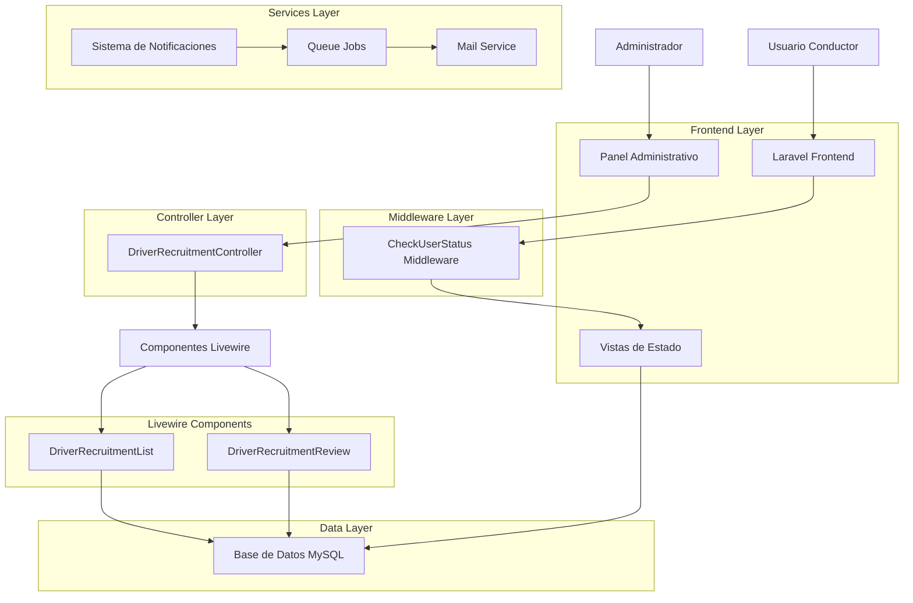
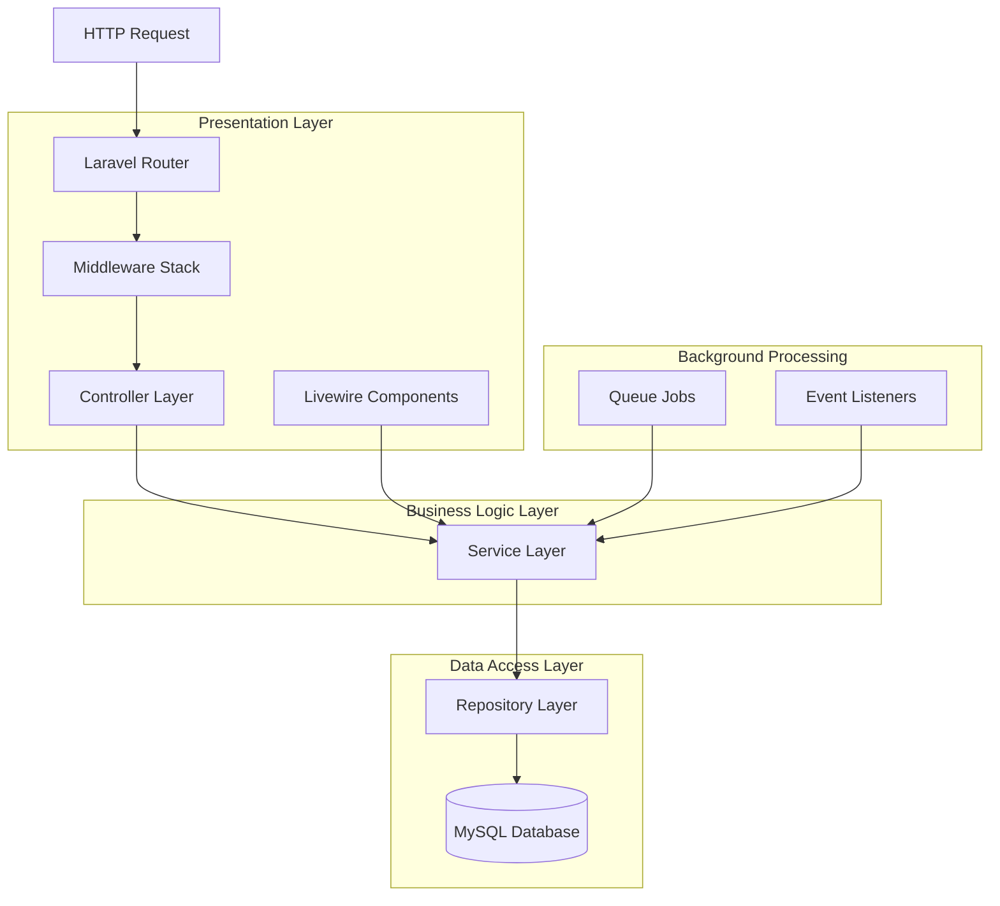
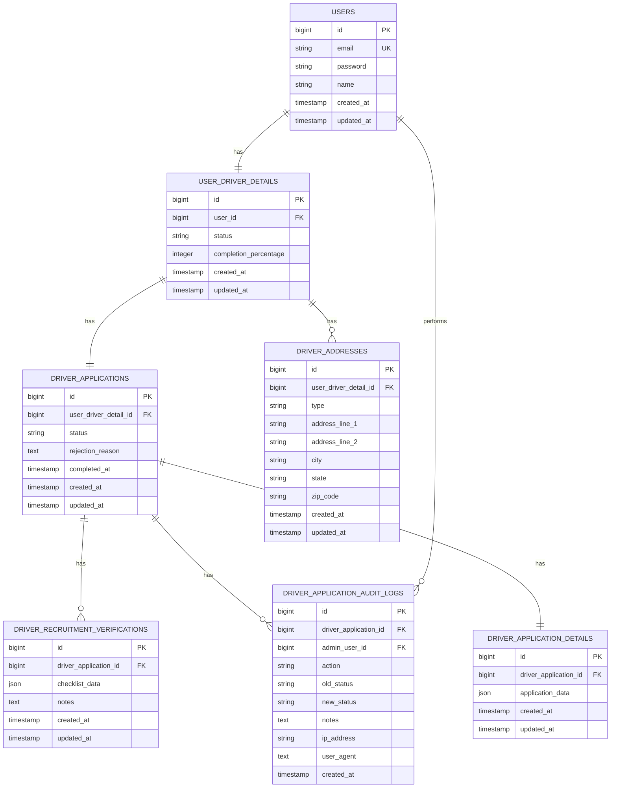

# Arquitectura Técnica: Sistema de Flujo Post-Registro de Conductores - EF Services

## 1. Arquitectura General del Sistema



## 2. Descripción de Tecnologías

- **Frontend**: Laravel Blade Templates + Livewire 3.x + Alpine.js
- **Backend**: Laravel 10.x + PHP 8.1+
- **Base de Datos**: MySQL 8.0+
- **Cache**: Redis (para sesiones y cache)
- **Queue**: Redis/Database (para jobs de notificación)
- **Mail**: Laravel Mail + SMTP
- **Autenticación**: Laravel Sanctum/Session

## 3. Definiciones de Rutas

### 3.1 Rutas del Conductor

| Ruta | Propósito | Middleware |
|------|-----------|------------|
| `/driver/pending` | Vista de aplicación pendiente | `auth`, `CheckUserStatus` |
| `/driver/rejected` | Vista de aplicación rechazada | `auth`, `CheckUserStatus` |
| `/driver/dashboard` | Dashboard principal del conductor | `auth`, `CheckUserStatus` |
| `/driver/registration/step/{step}` | Pasos de registro | `auth` |

### 3.2 Rutas Administrativas

| Ruta | Propósito | Middleware |
|------|-----------|------------|
| `/admin/driver-recruitment` | Lista de reclutamiento | `auth`, `role:admin` |
| `/admin/driver-recruitment/{id}` | Vista individual de conductor | `auth`, `role:admin` |
| `/admin/dashboard` | Dashboard administrativo | `auth`, `role:admin` |

## 4. Definiciones de API

### 4.1 APIs Livewire (Internas)

**DriverRecruitmentList Component**
```php
// Métodos públicos disponibles
POST /livewire/message/{component}
```

Request para filtrado:
```json
{
  "fingerprint": {
    "id": "component-id",
    "name": "admin.driver.recruitment.driver-recruitment-list"
  },
  "serverMemo": {
    "data": {
      "search": "john",
      "statusFilter": "pending",
      "carrierFilter": "carrier-123"
    }
  },
  "updates": [
    {
      "type": "callMethod",
      "payload": {
        "method": "updatedSearch",
        "params": []
      }
    }
  ]
}
```

**DriverRecruitmentReview Component**
```php
// Método de aprobación
POST /livewire/message/{component}
```

Request para aprobación:
```json
{
  "fingerprint": {
    "id": "component-id",
    "name": "admin.driver.recruitment.driver-recruitment-review"
  },
  "updates": [
    {
      "type": "callMethod",
      "payload": {
        "method": "approveApplication",
        "params": []
      }
    }
  ]
}
```

Request para rechazo:
```json
{
  "fingerprint": {
    "id": "component-id",
    "name": "admin.driver.recruitment.driver-recruitment-review"
  },
  "serverMemo": {
    "data": {
      "rejectionReason": "Documentos incompletos o inválidos"
    }
  },
  "updates": [
    {
      "type": "callMethod",
      "payload": {
        "method": "rejectApplication",
        "params": []
      }
    }
  ]
}
```

### 4.2 APIs de Notificación (Propuestas)

**Envío de notificación de estado**
```
POST /api/driver/notifications/status-update
```

Request:
| Param Name | Param Type | isRequired | Description |
|------------|------------|------------|-------------|
| driver_id | integer | true | ID del conductor |
| old_status | string | true | Estado anterior |
| new_status | string | true | Nuevo estado |
| reason | string | false | Razón del cambio (para rechazos) |

Response:
| Param Name | Param Type | Description |
|------------|------------|-------------|
| success | boolean | Estado de la operación |
| message | string | Mensaje de respuesta |
| notification_id | integer | ID de la notificación enviada |

Ejemplo:
```json
{
  "driver_id": 123,
  "old_status": "pending",
  "new_status": "approved"
}
```

## 5. Arquitectura del Servidor



### 5.1 Capas de la Arquitectura

**Capa de Presentación:**
- Controllers (DriverRecruitmentController)
- Middleware (CheckUserStatus)
- Livewire Components (DriverRecruitmentList, DriverRecruitmentReview)
- Blade Views (pending.blade.php, rejected.blade.php)

**Capa de Lógica de Negocio:**
- Services (DriverApplicationNotificationService)
- Event Listeners
- Validation Rules

**Capa de Acceso a Datos:**
- Eloquent Models (DriverApplication, UserDriverDetail)
- Database Migrations
- Seeders

## 6. Modelo de Datos

### 6.1 Diagrama de Entidad-Relación



### 6.2 Definiciones DDL

**Tabla de Aplicaciones de Conductores**
```sql
-- Tabla existente (ya implementada)
CREATE TABLE driver_applications (
    id BIGINT UNSIGNED AUTO_INCREMENT PRIMARY KEY,
    user_driver_detail_id BIGINT UNSIGNED NOT NULL,
    status ENUM('draft', 'pending', 'approved', 'rejected') DEFAULT 'draft',
    rejection_reason TEXT NULL,
    completed_at TIMESTAMP NULL,
    created_at TIMESTAMP DEFAULT CURRENT_TIMESTAMP,
    updated_at TIMESTAMP DEFAULT CURRENT_TIMESTAMP ON UPDATE CURRENT_TIMESTAMP,
    
    FOREIGN KEY (user_driver_detail_id) REFERENCES user_driver_details(id) ON DELETE CASCADE
);

-- Índices
CREATE INDEX idx_driver_applications_status ON driver_applications(status);
CREATE INDEX idx_driver_applications_completed_at ON driver_applications(completed_at DESC);
```

**Tabla de Auditoría (Nueva - Propuesta)**
```sql
-- Nueva tabla para auditoría
CREATE TABLE driver_application_audit_logs (
    id BIGINT UNSIGNED AUTO_INCREMENT PRIMARY KEY,
    driver_application_id BIGINT UNSIGNED NOT NULL,
    admin_user_id BIGINT UNSIGNED NOT NULL,
    action VARCHAR(50) NOT NULL,
    old_status VARCHAR(20) NULL,
    new_status VARCHAR(20) NULL,
    notes TEXT NULL,
    ip_address VARCHAR(45) NULL,
    user_agent TEXT NULL,
    created_at TIMESTAMP DEFAULT CURRENT_TIMESTAMP,
    
    FOREIGN KEY (driver_application_id) REFERENCES driver_applications(id) ON DELETE CASCADE,
    FOREIGN KEY (admin_user_id) REFERENCES users(id) ON DELETE CASCADE
);

-- Índices
CREATE INDEX idx_audit_logs_application_id ON driver_application_audit_logs(driver_application_id);
CREATE INDEX idx_audit_logs_admin_user_id ON driver_application_audit_logs(admin_user_id);
CREATE INDEX idx_audit_logs_created_at ON driver_application_audit_logs(created_at DESC);
CREATE INDEX idx_audit_logs_action ON driver_application_audit_logs(action);
```

**Tabla de Notificaciones (Nueva - Propuesta)**
```sql
-- Nueva tabla para notificaciones
CREATE TABLE driver_application_notifications (
    id BIGINT UNSIGNED AUTO_INCREMENT PRIMARY KEY,
    driver_application_id BIGINT UNSIGNED NOT NULL,
    type VARCHAR(50) NOT NULL,
    status ENUM('pending', 'sent', 'failed') DEFAULT 'pending',
    email_address VARCHAR(255) NOT NULL,
    subject VARCHAR(255) NOT NULL,
    content TEXT NOT NULL,
    sent_at TIMESTAMP NULL,
    failed_reason TEXT NULL,
    attempts INTEGER DEFAULT 0,
    created_at TIMESTAMP DEFAULT CURRENT_TIMESTAMP,
    updated_at TIMESTAMP DEFAULT CURRENT_TIMESTAMP ON UPDATE CURRENT_TIMESTAMP,
    
    FOREIGN KEY (driver_application_id) REFERENCES driver_applications(id) ON DELETE CASCADE
);

-- Índices
CREATE INDEX idx_notifications_status ON driver_application_notifications(status);
CREATE INDEX idx_notifications_type ON driver_application_notifications(type);
CREATE INDEX idx_notifications_sent_at ON driver_application_notifications(sent_at DESC);
```

**Datos Iniciales**
```sql
-- Insertar roles si no existen
INSERT IGNORE INTO roles (name, guard_name, created_at, updated_at) VALUES 
('admin', 'web', NOW(), NOW()),
('driver', 'web', NOW(), NOW());

-- Insertar permisos para gestión de conductores
INSERT IGNORE INTO permissions (name, guard_name, created_at, updated_at) VALUES 
('view_driver_applications', 'web', NOW(), NOW()),
('approve_driver_applications', 'web', NOW(), NOW()),
('reject_driver_applications', 'web', NOW(), NOW()),
('audit_driver_applications', 'web', NOW(), NOW());

-- Asignar permisos al rol admin
INSERT IGNORE INTO role_has_permissions (permission_id, role_id)
SELECT p.id, r.id 
FROM permissions p, roles r 
WHERE p.name IN ('view_driver_applications', 'approve_driver_applications', 'reject_driver_applications', 'audit_driver_applications')
AND r.name = 'admin';
```

## 7. Servicios y Componentes

### 7.1 Servicios Principales

**DriverApplicationNotificationService**
```php
class DriverApplicationNotificationService
{
    public function sendStatusUpdateNotification(
        DriverApplication $application, 
        string $oldStatus, 
        string $newStatus
    ): void {
        // Lógica de envío de notificaciones
    }
    
    public function sendReminderNotification(
        DriverApplication $application
    ): void {
        // Lógica de recordatorios
    }
}
```

**DriverApplicationAuditService**
```php
class DriverApplicationAuditService
{
    public function logAction(
        DriverApplication $application,
        string $action,
        ?string $oldStatus = null,
        ?string $newStatus = null,
        ?string $notes = null
    ): DriverApplicationAuditLog {
        // Lógica de auditoría
    }
}
```

### 7.2 Jobs de Cola

**SendDriverNotificationJob**
```php
class SendDriverNotificationJob implements ShouldQueue
{
    use Dispatchable, InteractsWithQueue, Queueable, SerializesModels;
    
    public function __construct(
        private DriverApplication $application,
        private string $notificationType,
        private array $data = []
    ) {}
    
    public function handle(): void
    {
        // Lógica de envío de notificación
    }
}
```

### 7.3 Event Listeners

**DriverApplicationStatusUpdated**
```php
class DriverApplicationStatusUpdated
{
    public function __construct(
        public DriverApplication $application,
        public string $oldStatus,
        public string $newStatus
    ) {}
}

class HandleDriverApplicationStatusUpdate
{
    public function handle(DriverApplicationStatusUpdated $event): void
    {
        // Enviar notificación
        SendDriverNotificationJob::dispatch(
            $event->application,
            'status_update',
            ['old_status' => $event->oldStatus, 'new_status' => $event->newStatus]
        );
        
        // Registrar en auditoría
        app(DriverApplicationAuditService::class)->logAction(
            $event->application,
            'status_change',
            $event->oldStatus,
            $event->newStatus
        );
    }
}
```

## 8. Consideraciones de Seguridad

### 8.1 Autenticación y Autorización

- **Middleware de Autenticación**: Verificar usuario autenticado
- **Middleware de Roles**: Verificar permisos administrativos
- **CSRF Protection**: Protección contra ataques CSRF
- **Rate Limiting**: Limitar intentos de acceso

### 8.2 Validación de Datos

```php
// Validación en DriverRecruitmentReview
protected function rules(): array
{
    return [
        'rejectionReason' => 'required_if:action,reject|min:10|max:1000',
        'checklistItems.*' => 'boolean',
        'verificationNotes' => 'nullable|string|max:2000'
    ];
}
```

### 8.3 Auditoría y Logging

- **Registro de Acciones**: Todas las acciones administrativas
- **IP Tracking**: Registro de direcciones IP
- **User Agent**: Registro de navegadores/dispositivos
- **Timestamps**: Registro preciso de fechas y horas

## 9. Optimización y Rendimiento

### 9.1 Consultas de Base de Datos

```php
// Optimización en DriverRecruitmentList
public function getDriversProperty()
{
    return UserDriverDetail::with([
        'user:id,name,email',
        'application:id,user_driver_detail_id,status,created_at,completed_at',
        'application.verification:id,driver_application_id,checklist_data'
    ])
    ->when($this->search, function ($query) {
        $query->whereHas('user', function ($q) {
            $q->where('name', 'like', '%' . $this->search . '%')
              ->orWhere('email', 'like', '%' . $this->search . '%');
        });
    })
    ->when($this->statusFilter, function ($query) {
        $query->whereHas('application', function ($q) {
            $q->where('status', $this->statusFilter);
        });
    })
    ->paginate(15);
}
```

### 9.2 Caché

```php
// Caché para estadísticas
public function getRecruitmentStats()
{
    return Cache::remember('recruitment_stats', 300, function () {
        return [
            'total_applications' => DriverApplication::count(),
            'pending_applications' => DriverApplication::where('status', 'pending')->count(),
            // ... más estadísticas
        ];
    });
}
```

### 9.3 Jobs en Cola

```php
// Configuración de colas en config/queue.php
'connections' => [
    'redis' => [
        'driver' => 'redis',
        'connection' => 'default',
        'queue' => env('REDIS_QUEUE', 'default'),
        'retry_after' => 90,
        'block_for' => null,
    ],
],
```

## 10. Monitoreo y Métricas

### 10.1 Métricas Clave

- **Tiempo de Procesamiento**: Tiempo promedio de aprobación/rechazo
- **Tasa de Aprobación**: Porcentaje de aplicaciones aprobadas
- **Volumen de Aplicaciones**: Número de aplicaciones por período
- **Errores de Sistema**: Fallos en notificaciones o procesos

### 10.2 Logging

```php
// Logging personalizado
Log::channel('driver_applications')->info('Application approved', [
    'driver_id' => $driver->id,
    'application_id' => $application->id,
    'admin_id' => Auth::id(),
    'processing_time' => $processingTime
]);
```

---

**Documento generado:** {{ date('Y-m-d H:i:s') }}
**Versión:** 1.0
**Estado:** Listo para implementación