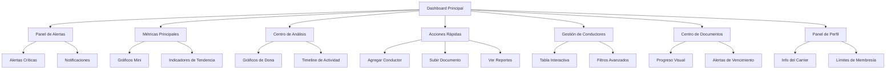

# Dashboard del Carrier - Modernización y Mejoras

## 1. Product Overview

Modernización integral del dashboard del carrier para proporcionar una experiencia de usuario más rica, interactiva y funcional. El objetivo es transformar el dashboard actual en una herramienta de gestión avanzada que permita a los carriers monitorear, analizar y gestionar eficientemente sus operaciones, conductores, vehículos y documentos.

El dashboard mejorado proporcionará métricas avanzadas, visualizaciones interactivas, alertas inteligentes y acciones rápidas para optimizar la productividad y toma de decisiones del carrier.

## 2. Core Features

### 2.1 User Roles

| Role | Registration Method | Core Permissions |
|------|---------------------|------------------|
| Carrier | Registro existente con validación de documentos | Acceso completo al dashboard, gestión de conductores, vehículos y documentos |

### 2.2 Feature Module

Nuestro dashboard modernizado del carrier consiste en las siguientes secciones principales:

1. **Panel de Alertas y Notificaciones**: sistema de alertas inteligentes, notificaciones en tiempo real, indicadores de estado crítico.
2. **Métricas Principales Mejoradas**: cards de estadísticas con gráficos integrados, indicadores de tendencia, comparativas temporales.
3. **Centro de Análisis Visual**: gráficos de dona interactivos, timeline de actividad, métricas de rendimiento.
4. **Panel de Acciones Rápidas**: botones de acceso directo, funciones frecuentes, atajos de navegación.
5. **Dashboard de Conductores Avanzado**: tabla interactiva con filtros, estados visuales, métricas de rendimiento.
6. **Centro de Documentos Inteligente**: progreso visual, alertas de vencimiento, estado de aprobación.
7. **Panel de Configuración y Perfil**: información del carrier, límites de membresía, configuraciones rápidas.

### 2.3 Page Details

| Page Name | Module Name | Feature description |
|-----------|-------------|---------------------|
| Dashboard Principal | Panel de Alertas | Mostrar alertas críticas, notificaciones pendientes, indicadores de estado con colores dinámicos y iconos descriptivos |
| Dashboard Principal | Métricas Principales | Visualizar estadísticas clave con gráficos mini integrados, indicadores de tendencia (flechas up/down), comparativas mes anterior |
| Dashboard Principal | Centro de Análisis | Renderizar gráficos de dona para estados de documentos, timeline de actividad reciente, métricas de crecimiento |
| Dashboard Principal | Acciones Rápidas | Proporcionar botones de acceso directo a funciones principales, crear shortcuts para tareas frecuentes |
| Dashboard Principal | Gestión de Conductores | Mostrar tabla interactiva con filtros por estado, búsqueda en tiempo real, indicadores visuales de rendimiento |
| Dashboard Principal | Centro de Documentos | Visualizar progreso de documentos con barras de progreso, alertas de vencimiento, estados con colores dinámicos |
| Dashboard Principal | Panel de Perfil | Mostrar información del carrier, límites de membresía con visualización gráfica, acceso rápido a configuraciones |
| Dashboard Principal | Sistema de Refresh | Implementar actualización automática de datos, botón de refresh manual, indicadores de última actualización |

## 3. Core Process

**Flujo Principal del Carrier:**

1. **Acceso al Dashboard**: El carrier accede al dashboard y ve inmediatamente las alertas más críticas
2. **Revisión de Métricas**: Analiza las métricas principales con indicadores de tendencia y comparativas
3. **Análisis Visual**: Interactúa con gráficos de dona y timeline para obtener insights detallados
4. **Acciones Rápidas**: Utiliza los botones de acceso directo para realizar tareas frecuentes
5. **Gestión de Conductores**: Revisa el estado de conductores con filtros y búsqueda avanzada
6. **Monitoreo de Documentos**: Verifica el progreso de documentos y atiende alertas de vencimiento
7. **Configuración**: Accede rápidamente a configuraciones de perfil y límites de membresía

## 4. User Interface Design

### 4.1 Design Style

- **Colores Primarios**: 
  - Primary: #3B82F6 (Blue-500)
  - Success: #10B981 (Emerald-500)
  - Warning: #F59E0B (Amber-500)
  - Danger: #EF4444 (Red-500)
  - Info: #06B6D4 (Cyan-500)

- **Estilo de Botones**: Redondeados con hover effects, sombras suaves, transiciones de 200ms
- **Tipografía**: Inter font, tamaños de 12px a 24px, pesos de 400 a 700
- **Layout**: Grid de 12 columnas, cards con bordes redondeados, espaciado consistente
- **Iconos**: Lucide icons con tamaños de 16px a 24px, colores temáticos
- **Animaciones**: Transiciones suaves, hover effects, loading states

### 4.2 Page Design Overview

| Page Name | Module Name | UI Elements |
|-----------|-------------|-------------|
| Dashboard Principal | Panel de Alertas | Cards con bordes coloreados según tipo de alerta, iconos Lucide, botones de acción con hover effects |
| Dashboard Principal | Métricas Principales | Cards con gradientes, gráficos mini integrados, indicadores de tendencia con flechas animadas |
| Dashboard Principal | Centro de Análisis | Gráficos de dona con Chart.js, colores dinámicos, tooltips interactivos, timeline con iconos |
| Dashboard Principal | Acciones Rápidas | Botones con iconos grandes, colores temáticos, hover effects con elevación |
| Dashboard Principal | Gestión de Conductores | Tabla con hover effects, badges de estado coloreados, avatares circulares, filtros dropdown |
| Dashboard Principal | Centro de Documentos | Barras de progreso animadas, badges de estado, iconos de tipo de documento |
| Dashboard Principal | Panel de Perfil | Avatar circular grande, información en cards, botones de acción primarios |

### 4.3 Responsiveness

El dashboard está diseñado con un enfoque mobile-first y es completamente responsive:
- **Desktop**: Layout de 12 columnas con sidebar
- **Tablet**: Layout adaptativo con colapso de sidebar
- **Mobile**: Layout de una columna con navegación optimizada para touch
- **Interacciones Touch**: Botones con tamaño mínimo de 44px, gestos de swipe para