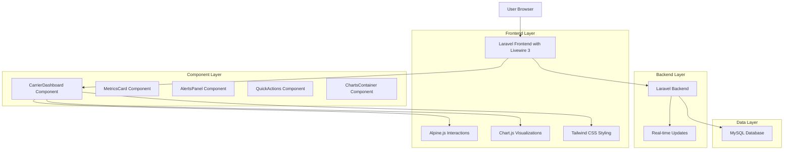
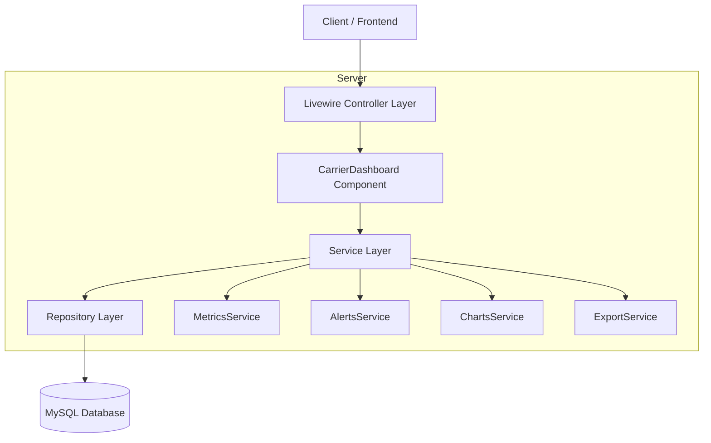
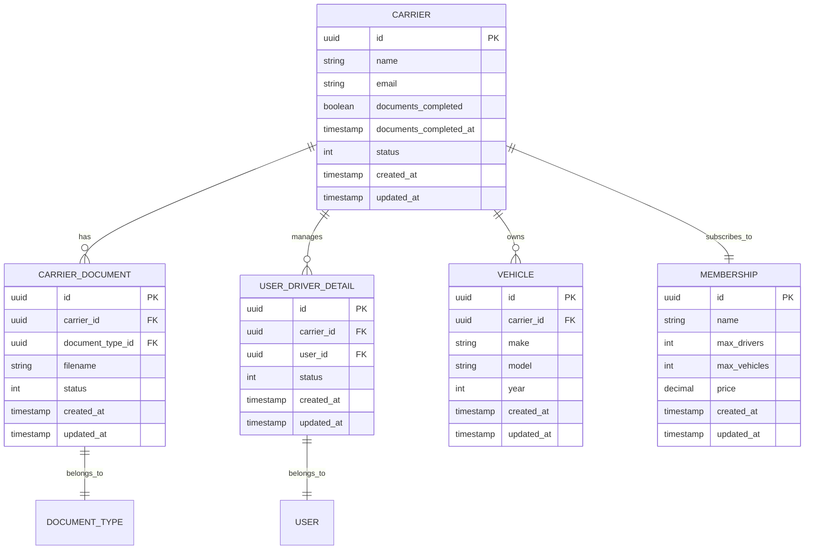

# Dashboard del Carrier - Arquitectura Técnica Modernizada

## 1. Architecture design



## 2. Technology Description

* Frontend: Laravel Blade + Livewire 3 + Alpine.js + Tailwind CSS 3 + Chart.js 4

* Backend: Laravel 10+ con Livewire Components

* Database: MySQL (existente)

* Real-time: Livewire polling y eventos

* Icons: Lucide Icons

* Animations: Tailwind CSS transitions + Alpine.js

## 3. Route definitions

| Route                      | Purpose                                                      |
| -------------------------- | ------------------------------------------------------------ |
| /carrier/dashboard         | Dashboard principal del carrier con componentes modernizados |
| /carrier/dashboard/refresh | Endpoint para actualización manual de datos                  |
| /carrier/dashboard/export  | Exportación de reportes del dashboard                        |
| /carrier/dashboard/metrics | API para métricas en tiempo real                             |

## 4. API definitions

### 4.1 Core API

Actualización de métricas en tiempo real

```
POST /carrier/dashboard/refresh
```

Request:

| Param Name | Param Type | isRequired | Description                        |
| ---------- | ---------- | ---------- | ---------------------------------- |
| component  | string     | false      | Componente específico a actualizar |
| timeframe  | string     | false      | Marco temporal para métricas       |

Response:

| Param Name | Param Type | Description                   |
| ---------- | ---------- | ----------------------------- |
| status     | boolean    | Estado de la actualización    |
| data       | object     | Datos actualizados            |
| timestamp  | string     | Timestamp de la actualización |

Exportación de reportes

```
GET /carrier/dashboard/export
```

Request:

| Param Name | Param Type | isRequired | Description                             |
| ---------- | ---------- | ---------- | --------------------------------------- |
| format     | string     | true       | Formato de exportación (pdf, excel)     |
| period     | string     | true       | Período de datos (week, month, quarter) |

Response:

| Param Name  | Param Type | Description                    |
| ----------- | ---------- | ------------------------------ |
| file\_url   | string     | URL del archivo generado       |
| expires\_at | string     | Fecha de expiración del enlace |

## 5. Server architecture diagram



## 6. Data model

### 6.1 Data model definition



### 6.2 Data Definition Language

Tablas existentes - No se requieren cambios adicionales en la estructura de base de datos.

El sistema utilizará las tablas existentes:

* `carriers` (con campo `documents_completed` ya agregado)

* `carrier_documents`

* `user_driver_details`

* `vehicles`

* `memberships`

* `document_types`

## 7. Component Architecture

### 7.1 Livewire Components Structure

```
app/Livewire/Carrier/
├── CarrierDashboard.php (Componente principal)
├── Components/
│   ├── MetricsCard.php
│   ├── AlertsPanel.php
│   ├── QuickActions.php
│   ├── ChartsContainer.php
│   ├── DriversTable.php
│   ├── DocumentsProgress.php
│   └── ProfileSidebar.php
```

### 7.2 Frontend Components Structure

```
resources/views/livewire/carrier/
├── carrier-dashboard.blade.php (Vista principal)
├── components/
│   ├── metrics-card.blade.php
│   ├── alerts-panel.blade.php
│   ├── quick-actions.blade.php
│   ├── charts-container.blade.php
│   ├── drivers-table.blade.php
│   ├── documents-progress.blade.php
│   └── profile-sidebar.blade.php
```

### 7.3 JavaScript Integration

```javascript
// resources/js/dashboard.js
import Alpine from 'alpinejs'
import Chart from 'chart.js/auto'

// Configuración de gráficos
window.initCharts = function(data) {
    // Gráfico de dona para estados de documentos
    const ctx = document.getElementById('documentsChart').getContext('2d');
    new Chart(ctx, {
        type: 'doughnut',
        data: data.documentStatus,
        options: {
            responsive: true,
            plugins: {
                legend: {
                    position: 'bottom'
                }
            }
        }
    });
}

// Componente Alpine.js para refresh automático
Alpine.data('dashboardRefresh', () => ({
    lastUpdate: new Date(),
    autoRefresh: true,
    refreshInterval: 30000, // 30 segundos
    
    init() {
        if (this.autoRefresh) {
            setInterval(() => {
                this.$wire.refreshData();
                this.lastUpdate = new Date();
            }, this.refreshInterval);
        }
    },
    
    manualRefresh() {
        this.$wire.refreshData();
        this.lastUpdate = new Date();
    }
}));
```

### 7.4 CSS Customizations

```css
/* resources/css/dashboard.css */
.metric-card {
    @apply relative overflow-hidden rounded-lg border bg-white p-6 shadow-sm transition-all duration-200 hover:shadow-md;
}

.metric-card-gradient {
    @apply bg-gradient-to-br from-blue-500 to-blue-600 text-white;
}

.chart-container {
    @apply relative h-64 w-full;
}

.alert-card {
    @apply rounded-lg border-l-4 bg-white p-4 shadow-sm;
}

.alert-warning {
    @apply border-l-amber-500 bg-amber-50;
}

.alert-danger {
    @apply border-l-red-500 bg-red-50;
}

.alert-info {
    @apply border-l-blue-500 bg-blue-50;
}

.quick-action-btn {
    @apply flex flex-col items-center justify-center rounded-lg border bg-white p-4 shadow-sm transition-all duration-200 hover:shadow-md hover:-translate-y-1;
}

.progress-bar-animated {
    @apply transition-all duration-500 ease-out;
}
```

## 8. Performance Optimizations

### 8.1 Caching Strategy

* Cache de métricas con TTL de 5 minutos

* Cache de datos de gráficos con TTL de 15 minutos

* Lazy loading de componentes no críticos

### 8.2 Database Optimizations

* Índices optimizados para consultas de dashboard

* Consultas agregadas para métricas

* Paginación en tablas de datos

### 8.3 Frontend Optimizations

* Lazy loading de Chart.js

* Debounce en filtros de búsqueda

* Virtual scrolling para tablas grandes

* Optimización de re-renders de Livewire

