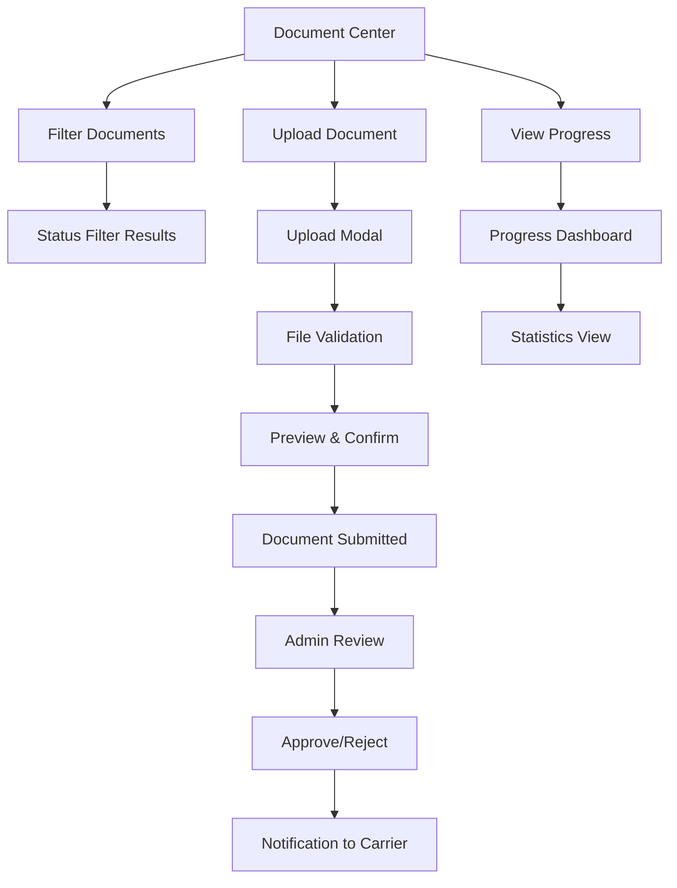

# Carrier Document Management System - Product Requirements Document

## 1. Product Overview

Sistema integral de gestión de documentos para carriers que permite la carga, validación, seguimiento y administración de documentos requeridos para el registro y operación de transportistas. El sistema facilita el proceso de onboarding y cumplimiento regulatorio mediante una interfaz intuitiva y flujos automatizados.

El producto resuelve el problema de gestión manual de documentos, reduce tiempos de procesamiento y mejora la experiencia del usuario carrier, mientras proporciona herramientas de administración eficientes para el equipo interno.

## 2. Core Features

### 2.1 User Roles

| Role | Registration Method | Core Permissions |
|------|---------------------|------------------|
| Carrier User | Email registration + carrier association | Can upload, view, and manage own carrier documents |
| Super Admin | System invitation | Full access to all carriers and documents, approval workflows |
| Carrier Admin | Carrier owner designation | Manage documents for specific carrier organization |

### 2.2 Feature Module

Nuestro sistema de gestión de documentos consta de las siguientes páginas principales:

1. **Document Center**: dashboard principal, filtros de estado, estadísticas de progreso, lista de documentos requeridos.
2. **Document Upload**: zona de carga drag & drop, validación de archivos, preview de documentos.
3. **Document Review**: vista de documentos individuales, herramientas de aprobación/rechazo, comentarios.
4. **Progress Dashboard**: métricas de completitud, reportes de estado, alertas de vencimiento.

### 2.3 Page Details

| Page Name | Module Name | Feature description |
|-----------|-------------|---------------------|
| Document Center | Document Grid | Display all required documents with status indicators, filtering by status (uploaded, pending, missing, default-available), search functionality |
| Document Center | Progress Overview | Show completion percentage, document statistics, status breakdown with visual indicators |
| Document Center | Filter Sidebar | Filter documents by status, requirement type (mandatory/optional), document category |
| Document Upload | Upload Modal | Drag & drop file upload, file validation (PDF, JPG, PNG), progress indicators, error handling |
| Document Upload | File Preview | Display uploaded document preview, metadata information, replace/delete options |
| Document Review | Document Viewer | View document details, download functionality, status history, admin comments |
| Document Review | Approval Workflow | Approve/reject documents, add review comments, status change notifications |
| Progress Dashboard | Statistics Panel | Overall completion metrics, document status distribution, compliance tracking |
| Progress Dashboard | Alerts System | Notification for missing documents, expiration warnings, status updates |

## 3. Core Process

### Carrier User Flow
1. Usuario accede al Document Center desde el dashboard principal
2. Ve el estado actual de todos los documentos requeridos con indicadores visuales
3. Filtra documentos por estado (faltantes, pendientes, aprobados, etc.)
4. Selecciona un documento faltante y abre el modal de carga
5. Arrastra y suelta el archivo o selecciona desde el explorador
6. El sistema valida el archivo y muestra preview
7. Confirma la carga y recibe notificación de éxito
8. El documento pasa a estado "pendiente de revisión"
9. Recibe notificaciones sobre cambios de estado

### Admin Flow
1. Admin accede a la vista de revisión de documentos
2. Ve lista de documentos pendientes de aprobación
3. Selecciona documento para revisar en detalle
4. Examina el documento y metadatos
5. Aprueba o rechaza con comentarios
6. El sistema notifica al carrier sobre la decisión
7. Actualiza estadísticas y métricas del sistema

## 4. User Interface Design

### 4.1 Design Style

- **Primary Colors**: #1B1C6E (navy blue), #3b82f6 (blue)
- **Secondary Colors**: #22c55e (success green), #f59e0b (warning amber), #ef4444 (danger red)
- **Button Style**: Rounded corners (0.375rem), subtle shadows, hover transitions
- **Font**: System font stack, sizes from 0.75rem to 1.5rem
- **Layout Style**: Card-based design, grid layout, sticky sidebar navigation
- **Icons**: Lucide icons with 1.3 stroke width, consistent sizing (16px/20px/24px)

### 4.2 Page Design Overview

| Page Name | Module Name | UI Elements |
|-----------|-------------|-------------|
| Document Center | Main Layout | 12-column grid, sticky sidebar (3 cols), main content (9 cols), responsive breakpoints |
| Document Center | Filter Sidebar | Vertical navigation, active state highlighting, badge counters, icon + text labels |
| Document Center | Document Cards | Gradient backgrounds by status, hover animations, status badges, action buttons |
| Upload Modal | Modal Dialog | x-base.dialog component, centered layout, drag & drop zone with dashed borders |
| Upload Modal | File Preview | Thumbnail display, metadata table, progress indicators, validation messages |
| Progress Dashboard | Statistics Cards | Metric cards with icons, percentage displays, color-coded status indicators |

### 4.3 Responsiveness

El producto es desktop-first con adaptación móvil completa. En dispositivos móviles, la sidebar se convierte en un menú colapsible, las cards se apilan verticalmente, y los modales ocupan el ancho completo de la pantalla. Se optimiza para interacción táctil con botones de tamaño adecuado y gestos de arrastrar y soltar.