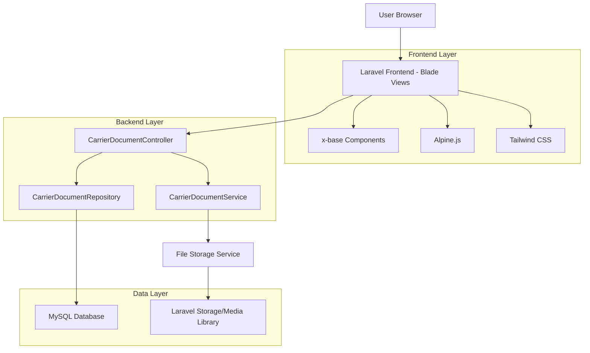
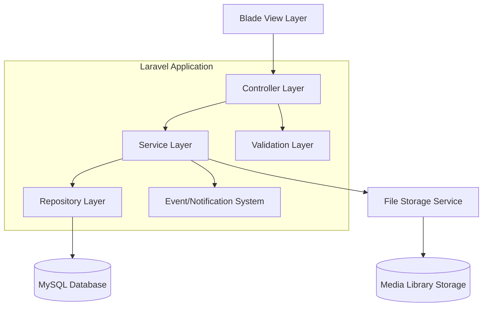
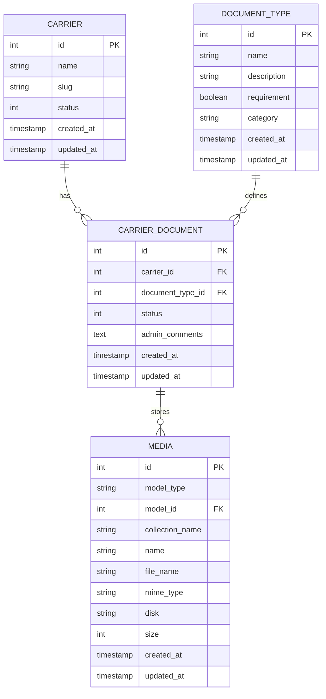

# Carrier Document Management System - Technical Architecture Document

## 1. Architecture Design



## 2. Technology Description

- Frontend: Laravel Blade + Alpine.js + Tailwind CSS + x-base component library
- Backend: Laravel 10 + CarrierDocumentService + Repository Pattern
- Database: MySQL (existing Laravel structure)
- File Storage: Laravel Media Library + Local/S3 Storage
- Components: x-base UI component library (dialog, button, lucide icons)

## 3. Route Definitions

| Route | Purpose |
|-------|---------|
| /carrier/{carrier}/documents | Document center main page, displays all documents with filtering |
| /carrier/{carrier}/documents/upload | Handle document upload via AJAX |
| /carrier/{carrier}/documents/progress | Get document progress statistics via API |
| /carrier/{carrier}/documents/delete | Delete document via AJAX |
| /carrier/{carrier}/documents/toggle-default | Accept default document via AJAX |

## 4. API Definitions

### 4.1 Core API

Document upload endpoint
```
POST /carrier/{carrierSlug}/documents/upload
```

Request:
| Param Name | Param Type | isRequired | Description |
|------------|------------|------------|-------------|
| document_type_id | integer | true | ID of the document type being uploaded |
| file | file | true | Document file (PDF, JPG, PNG, max 10MB) |

Response:
| Param Name | Param Type | Description |
|------------|------------|-------------|
| success | boolean | Upload operation status |
| message | string | Success/error message |
| document | object | Document data with media URLs |

Example Response:
```json
{
  "success": true,
  "message": "Document uploaded successfully.",
  "document": {
    "id": 123,
    "status": "pending",
    "file_url": "/storage/documents/carrier_123/document.pdf",
    "uploaded_at": "2024-01-15T10:30:00Z"
  }
}
```

Document progress endpoint
```
GET /carrier/{carrierSlug}/documents/progress
```

Response:
| Param Name | Param Type | Description |
|------------|------------|-------------|
| success | boolean | Request status |
| progress | object | Progress statistics and percentages |

Example Response:
```json
{
  "success": true,
  "progress": {
    "total_documents": 12,
    "uploaded_documents": 8,
    "pending_documents": 2,
    "missing_documents": 2,
    "completion_percentage": 67,
    "status_breakdown": {
      "uploaded": 8,
      "pending": 2,
      "missing": 2,
      "default_available": 3
    }
  }
}
```

Toggle default document endpoint
```
POST /carrier/{carrierSlug}/documents/toggle-default/{documentType}
```

Response:
| Param Name | Param Type | Description |
|------------|------------|-------------|
| success | boolean | Operation status |
| message | string | Result message |
| document | object | Updated document data |

## 5. Server Architecture Diagram



## 6. Data Model

### 6.1 Data Model Definition



### 6.2 Data Definition Language

Document Types Table (document_types)
```sql
-- Create table
CREATE TABLE document_types (
    id BIGINT UNSIGNED AUTO_INCREMENT PRIMARY KEY,
    name VARCHAR(255) NOT NULL,
    description TEXT,
    requirement BOOLEAN DEFAULT FALSE,
    category VARCHAR(100),
    created_at TIMESTAMP NULL DEFAULT NULL,
    updated_at TIMESTAMP NULL DEFAULT NULL
);

-- Create indexes
CREATE INDEX idx_document_types_requirement ON document_types(requirement);
CREATE INDEX idx_document_types_category ON document_types(category);

-- Initial data
INSERT INTO document_types (name, description, requirement, category) VALUES
('Commercial Driver License', 'Valid CDL for commercial vehicle operation', TRUE, 'driver'),
('DOT Medical Certificate', 'Current DOT medical examination certificate', TRUE, 'medical'),
('Insurance Certificate', 'Proof of commercial vehicle insurance', TRUE, 'insurance'),
('Vehicle Registration', 'Current vehicle registration documents', TRUE, 'vehicle'),
('Operating Authority', 'FMCSA operating authority documentation', TRUE, 'authority');
```

Carrier Documents Table (carrier_documents)
```sql
-- Create table
CREATE TABLE carrier_documents (
    id BIGINT UNSIGNED AUTO_INCREMENT PRIMARY KEY,
    carrier_id BIGINT UNSIGNED NOT NULL,
    document_type_id BIGINT UNSIGNED NOT NULL,
    status TINYINT DEFAULT 0 COMMENT '0=pending, 1=approved, 2=rejected, 3=in_process',
    admin_comments TEXT,
    created_at TIMESTAMP NULL DEFAULT NULL,
    updated_at TIMESTAMP NULL DEFAULT NULL,
    FOREIGN KEY (carrier_id) REFERENCES carriers(id) ON DELETE CASCADE,
    FOREIGN KEY (document_type_id) REFERENCES document_types(id) ON DELETE CASCADE
);

-- Create indexes
CREATE INDEX idx_carrier_documents_carrier_id ON carrier_documents(carrier_id);
CREATE INDEX idx_carrier_documents_document_type_id ON carrier_documents(document_type_id);
CREATE INDEX idx_carrier_documents_status ON carrier_documents(status);
CREATE UNIQUE INDEX idx_carrier_documents_unique ON carrier_documents(carrier_id, document_type_id);
```

Media Library Integration
```sql
-- Media table is handled by Laravel Media Library package
-- Collections used:
-- - 'carrier_documents': Uploaded carrier documents
-- - 'default_documents': System default documents for document types

-- Permissions for Supabase (if used)
GRANT SELECT ON document_types TO anon;
GRANT SELECT ON carrier_documents TO anon;
GRANT ALL PRIVILEGES ON document_types TO authenticated;
GRANT ALL PRIVILEGES ON carrier_documents TO authenticated;
GRANT ALL PRIVILEGES ON media TO authenticated;
```