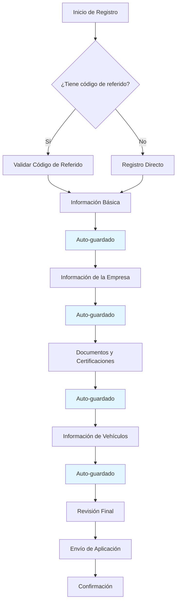
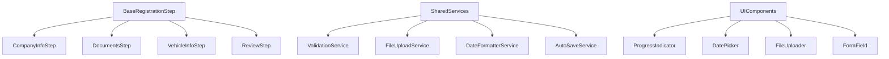

# Plan de Mejora del Proceso de Registro para Carriers

## 1. Resumen Ejecutivo

Este documento presenta un plan integral para mejorar el proceso de registro de carriers, unificando los flujos existentes y aplicando las mejores prácticas identificadas en el análisis del sistema de registro de drivers. Las mejoras se enfocan en optimización del flujo, calidad del código, experiencia de usuario y continuidad del proceso.

## 2. Análisis del Estado Actual

### 2.1 Problemas Identificados
- **Duplicación de flujos**: Existen dos procesos separados (registro directo vs referido)
- **Falta de persistencia**: No se guarda el progreso automáticamente
- **Inconsistencias de formato**: Diferentes formatos de fecha en distintos componentes
- **Código duplicado**: Lógica repetida entre componentes
- **UX fragmentada**: Experiencia inconsistente entre pasos

### 2.2 Oportunidades de Mejora
- Unificación de procesos de registro
- Implementación de auto-guardado
- Estandarización de formatos y validaciones
- Componentización reutilizable
- Mejora de la experiencia móvil

## 3. Optimización del Flujo

### 3.1 Proceso Unificado de Registro



### 3.2 Sistema de Auto-guardado

**Especificaciones técnicas:**
- Guardado automático cada 30 segundos
- Guardado al cambiar de campo (debounced 2 segundos)
- Guardado al navegar entre pasos
- Indicador visual de estado de guardado

**Implementación:**
```php
// Servicio de Auto-guardado
class RegistrationAutoSaveService
{
    public function autoSave($carrierId, $step, $data)
    {
        RegistrationProgress::updateOrCreate(
            ['carrier_id' => $carrierId, 'step' => $step],
            ['data' => json_encode($data), 'updated_at' => now()]
        );
    }
    
    public function getLastCompletedStep($carrierId)
    {
        return RegistrationProgress::where('carrier_id', $carrierId)
            ->orderBy('step')
            ->pluck('step')
            ->last();
    }
}
```

### 3.3 Reanudación del Proceso

**Funcionalidades:**
- Detección automática del último paso completado
- Restauración de datos guardados
- Indicador visual de progreso
- Opción de reiniciar desde cualquier paso anterior

## 4. Mejoras de Código

### 4.1 Arquitectura de Componentes Reutilizables



### 4.2 Componente Base Reutilizable

```php
// BaseRegistrationStep.php
abstract class BaseRegistrationStep extends Component
{
    public $carrierId;
    public $stepData = [];
    public $errors = [];
    public $isLoading = false;
    
    protected $autoSaveService;
    protected $validationService;
    
    public function mount($carrierId = null)
    {
        $this->carrierId = $carrierId;
        $this->autoSaveService = app(RegistrationAutoSaveService::class);
        $this->validationService = app(ValidationService::class);
        $this->loadExistingData();
    }
    
    abstract protected function getStepName(): string;
    abstract protected function getValidationRules(): array;
    abstract protected function saveStepData(): void;
    
    public function updated($propertyName)
    {
        $this->validateOnly($propertyName);
        $this->autoSave();
    }
    
    protected function autoSave()
    {
        $this->autoSaveService->autoSave(
            $this->carrierId,
            $this->getStepName(),
            $this->stepData
        );
    }
}
```

### 4.3 Servicios Centralizados

**ValidationService:**
```php
class ValidationService
{
    public function validateStep($step, $data)
    {
        $rules = $this->getStepRules($step);
        return Validator::make($data, $rules);
    }
    
    private function getStepRules($step)
    {
        return match($step) {
            'company_info' => [
                'company_name' => 'required|string|max:255',
                'tax_id' => 'required|string|unique:carriers,tax_id',
                'phone' => 'required|string|regex:/^\+?[1-9]\d{1,14}$/'
            ],
            'documents' => [
                'insurance_certificate' => 'required|file|mimes:pdf,jpg,png|max:5120',
                'operating_authority' => 'required|file|mimes:pdf,jpg,png|max:5120'
            ],
            // ... más reglas
        };
    }
}
```

**DateFormatterService:**
```php
class DateFormatterService
{
    const DISPLAY_FORMAT = 'm/d/Y';
    const DATABASE_FORMAT = 'Y-m-d';
    
    public function formatForDisplay($date)
    {
        if (!$date) return null;
        return Carbon::parse($date)->format(self::DISPLAY_FORMAT);
    }
    
    public function formatForDatabase($date)
    {
        if (!$date) return null;
        return Carbon::createFromFormat(self::DISPLAY_FORMAT, $date)
            ->format(self::DATABASE_FORMAT);
    }
}
```

## 5. Mejoras de UI/UX

### 5.1 Diseño Responsivo Mejorado

**Breakpoints:**
- Mobile: 320px - 768px
- Tablet: 768px - 1024px
- Desktop: 1024px+

**Grid System:**
```css
.registration-container {
    display: grid;
    grid-template-columns: 1fr;
    gap: 1.5rem;
    max-width: 1200px;
    margin: 0 auto;
    padding: 1rem;
}

@media (min-width: 768px) {
    .registration-container {
        grid-template-columns: 300px 1fr;
        gap: 2rem;
    }
}

@media (min-width: 1024px) {
    .registration-container {
        padding: 2rem;
    }
}
```

### 5.2 Indicador de Progreso Visual

```html
<!-- Componente ProgressIndicator -->
<div class="progress-indicator">
    <div class="progress-bar">
        <div class="progress-fill" style="width: {{ $progressPercentage }}%"></div>
    </div>
    <div class="steps-list">
        @foreach($steps as $index => $step)
            <div class="step {{ $step['status'] }}">
                <div class="step-number">{{ $index + 1 }}</div>
                <div class="step-label">{{ $step['label'] }}</div>
            </div>
        @endforeach
    </div>
</div>
```

### 5.3 Componente DatePicker Unificado

```html
<!-- date-picker-unified.blade.php -->
<div class="date-picker-container">
    <label for="{{ $name }}" class="form-label">{{ $label }}</label>
    <input 
        type="date" 
        id="{{ $name }}"
        name="{{ $name }}"
        wire:model="{{ $model }}"
        class="form-input"
        placeholder="MM/DD/YYYY"
        {{ $required ? 'required' : '' }}
    >
    @error($name)
        <span class="error-message">{{ $message }}</span>
    @enderror
</div>
```

### 5.4 Sistema de Compresión de Imágenes

```php
class ImageCompressionService
{
    public function compressImage($file, $maxWidth = 1920, $quality = 85)
    {
        $image = Image::make($file);
        
        // Redimensionar si es necesario
        if ($image->width() > $maxWidth) {
            $image->resize($maxWidth, null, function ($constraint) {
                $constraint->aspectRatio();
                $constraint->upsize();
            });
        }
        
        // Comprimir
        $image->encode('jpg', $quality);
        
        return $image;
    }
    
    public function getOptimalSize($fileSize)
    {
        if ($fileSize > 5 * 1024 * 1024) { // > 5MB
            return ['width' => 1920, 'quality' => 70];
        } elseif ($fileSize > 2 * 1024 * 1024) { // > 2MB
            return ['width' => 1920, 'quality' => 80];
        }
        return ['width' => 1920, 'quality' => 85];
    }
}
```

### 5.5 Mensajes de Error Descriptivos

```php
class ErrorMessageService
{
    public function getCustomMessages()
    {
        return [
            'company_name.required' => 'El nombre de la empresa es obligatorio.',
            'tax_id.unique' => 'Este número de identificación fiscal ya está registrado en nuestro sistema.',
            'insurance_certificate.required' => 'Debe subir el certificado de seguro de su empresa.',
            'insurance_certificate.mimes' => 'El certificado de seguro debe ser un archivo PDF, JPG o PNG.',
            'insurance_certificate.max' => 'El archivo del certificado no puede exceder 5MB.',
            'phone.regex' => 'Por favor ingrese un número de teléfono válido (ej: +1-555-123-4567).'
        ];
    }
}
```

## 6. Continuidad del Proceso

### 6.1 Sistema de Sesión Persistente

```php
// Modelo RegistrationSession
class RegistrationSession extends Model
{
    protected $fillable = [
        'carrier_id',
        'current_step',
        'completed_steps',
        'session_data',
        'last_activity',
        'expires_at'
    ];
    
    protected $casts = [
        'completed_steps' => 'array',
        'session_data' => 'array',
        'last_activity' => 'datetime',
        'expires_at' => 'datetime'
    ];
}
```

### 6.2 Sistema de Recordatorios

```php
class RegistrationReminderService
{
    public function scheduleReminders($carrierId)
    {
        // Recordatorio después de 24 horas
        RegistrationReminderJob::dispatch($carrierId)
            ->delay(now()->addHours(24));
            
        // Recordatorio después de 3 días
        RegistrationReminderJob::dispatch($carrierId)
            ->delay(now()->addDays(3));
            
        // Recordatorio final después de 7 días
        FinalRegistrationReminderJob::dispatch($carrierId)
            ->delay(now()->addDays(7));
    }
}
```

### 6.3 Dashboard de Reanudación

```html
<!-- registration-resume.blade.php -->
<div class="resume-dashboard">
    <div class="progress-summary">
        <h2>Continúa tu registro</h2>
        <p>Has completado {{ $completedSteps }} de {{ $totalSteps }} pasos</p>
        
        <div class="progress-visual">
            @foreach($steps as $step)
                <div class="step-item {{ $step['status'] }}">
                    <div class="step-icon">
                        @if($step['status'] === 'completed')
                            ✓
                        @elseif($step['status'] === 'current')
                            {{ $step['number'] }}
                        @else
                            {{ $step['number'] }}
                        @endif
                    </div>
                    <div class="step-info">
                        <h4>{{ $step['title'] }}</h4>
                        <p>{{ $step['description'] }}</p>
                    </div>
                </div>
            @endforeach
        </div>
        
        <div class="action-buttons">
            <button wire:click="continueRegistration" class="btn-primary">
                Continuar desde paso {{ $nextStep }}
            </button>
            <button wire:click="startOver" class="btn-secondary">
                Empezar de nuevo
            </button>
        </div>
    </div>
</div>
```

## 7. Especificaciones Técnicas

### 7.1 Estructura de Base de Datos

```sql
-- Tabla para progreso de registro
CREATE TABLE registration_progress (
    id BIGINT UNSIGNED AUTO_INCREMENT PRIMARY KEY,
    carrier_id BIGINT UNSIGNED NOT NULL,
    step VARCHAR(50) NOT NULL,
    data JSON,
    is_completed BOOLEAN DEFAULT FALSE,
    created_at TIMESTAMP DEFAULT CURRENT_TIMESTAMP,
    updated_at TIMESTAMP DEFAULT CURRENT_TIMESTAMP ON UPDATE CURRENT_TIMESTAMP,
    INDEX idx_carrier_step (carrier_id, step)
);

-- Tabla para sesiones de registro
CREATE TABLE registration_sessions (
    id BIGINT UNSIGNED AUTO_INCREMENT PRIMARY KEY,
    carrier_id BIGINT UNSIGNED NOT NULL,
    current_step VARCHAR(50),
    completed_steps JSON,
    session_data JSON,
    last_activity TIMESTAMP,
    expires_at TIMESTAMP,
    created_at TIMESTAMP DEFAULT CURRENT_TIMESTAMP,
    updated_at TIMESTAMP DEFAULT CURRENT_TIMESTAMP ON UPDATE CURRENT_TIMESTAMP,
    INDEX idx_carrier_id (carrier_id),
    INDEX idx_expires_at (expires_at)
);

-- Tabla para recordatorios
CREATE TABLE registration_reminders (
    id BIGINT UNSIGNED AUTO_INCREMENT PRIMARY KEY,
    carrier_id BIGINT UNSIGNED NOT NULL,
    reminder_type ENUM('24_hours', '3_days', '7_days') NOT NULL,
    sent_at TIMESTAMP NULL,
    created_at TIMESTAMP DEFAULT CURRENT_TIMESTAMP,
    INDEX idx_carrier_type (carrier_id, reminder_type)
);
```

### 7.2 API Endpoints

```php
// routes/api.php
Route::prefix('registration')->group(function () {
    Route::post('/auto-save', [RegistrationController::class, 'autoSave']);
    Route::get('/progress/{carrierId}', [RegistrationController::class, 'getProgress']);
    Route::post('/validate-step', [RegistrationController::class, 'validateStep']);
    Route::post('/upload-document', [RegistrationController::class, 'uploadDocument']);
    Route::delete('/session/{carrierId}', [RegistrationController::class, 'clearSession']);
});
```

### 7.3 Configuración de Livewire

```php
// config/livewire.php
return [
    'temporary_file_upload' => [
        'disk' => 'local',
        'rules' => ['file', 'max:5120'], // 5MB max
        'directory' => 'livewire-tmp',
        'middleware' => 'throttle:60,1',
        'preview_mimes' => ['png', 'gif', 'bmp', 'svg', 'wav', 'mp4', 'mov', 'avi', 'wmv', 'mp3', 'm4a', 'jpg', 'jpeg', 'mpga', 'webp', 'wma'],
        'max_upload_time' => 5,
    ],
    'auto_save' => [
        'enabled' => true,
        'interval' => 30, // segundos
        'debounce' => 2, // segundos
    ]
];
```

## 8. Guía de Estilos

### 8.1 Sistema de Colores

```css
:root {
    /* Colores primarios */
    --primary-blue: #2563eb;
    --primary-blue-light: #3b82f6;
    --primary-blue-dark: #1d4ed8;
    
    /* Colores de estado */
    --success-green: #10b981;
    --warning-yellow: #f59e0b;
    --error-red: #ef4444;
    --info-blue: #06b6d4;
    
    /* Colores neutros */
    --gray-50: #f9fafb;
    --gray-100: #f3f4f6;
    --gray-200: #e5e7eb;
    --gray-300: #d1d5db;
    --gray-400: #9ca3af;
    --gray-500: #6b7280;
    --gray-600: #4b5563;
    --gray-700: #374151;
    --gray-800: #1f2937;
    --gray-900: #111827;
}
```

### 8.2 Tipografía

```css
/* Fuentes */
.font-heading {
    font-family: 'Inter', -apple-system, BlinkMacSystemFont, sans-serif;
    font-weight: 600;
}

.font-body {
    font-family: 'Inter', -apple-system, BlinkMacSystemFont, sans-serif;
    font-weight: 400;
}

/* Tamaños */
.text-xs { font-size: 0.75rem; line-height: 1rem; }
.text-sm { font-size: 0.875rem; line-height: 1.25rem; }
.text-base { font-size: 1rem; line-height: 1.5rem; }
.text-lg { font-size: 1.125rem; line-height: 1.75rem; }
.text-xl { font-size: 1.25rem; line-height: 1.75rem; }
.text-2xl { font-size: 1.5rem; line-height: 2rem; }
.text-3xl { font-size: 1.875rem; line-height: 2.25rem; }
```

### 8.3 Componentes de Formulario

```css
.form-input {
    @apply w-full px-3 py-2 border border-gray-300 rounded-md shadow-sm;
    @apply focus:outline-none focus:ring-2 focus:ring-primary-blue focus:border-transparent;
    @apply disabled:bg-gray-50 disabled:text-gray-500;
}

.form-label {
    @apply block text-sm font-medium text-gray-700 mb-1;
}

.form-error {
    @apply text-sm text-error-red mt-1;
}

.form-help {
    @apply text-sm text-gray-500 mt-1;
}
```

### 8.4 Botones

```css
.btn-base {
    @apply inline-flex items-center justify-center px-4 py-2 border border-transparent;
    @apply text-sm font-medium rounded-md focus:outline-none focus:ring-2 focus:ring-offset-2;
    @apply disabled:opacity-50 disabled:cursor-not-allowed;
    transition: all 0.2s ease-in-out;
}

.btn-primary {
    @apply btn-base bg-primary-blue text-white hover:bg-primary-blue-dark;
    @apply focus:ring-primary-blue;
}

.btn-secondary {
    @apply btn-base bg-white text-gray-700 border-gray-300 hover:bg-gray-50;
    @apply focus:ring-primary-blue;
}

.btn-success {
    @apply btn-base bg-success-green text-white hover:bg-green-600;
    @apply focus:ring-success-green;
}
```

## 9. Plan de Migración

### 9.1 Fases de Implementación

**Fase 1: Preparación (Semana 1-2)**
- Crear nuevas tablas de base de datos
- Implementar servicios base (AutoSave, Validation, DateFormatter)
- Crear componentes reutilizables básicos

**Fase 2: Backend (Semana 3-4)**
- Implementar BaseRegistrationStep
- Migrar lógica de validación a servicios centralizados
- Implementar sistema de auto-guardado
- Crear APIs para progreso y sesiones

**Fase 3: Frontend (Semana 5-6)**
- Implementar nuevos componentes UI
- Actualizar vistas con diseño responsivo
- Integrar sistema de progreso visual
- Implementar compresión de imágenes

**Fase 4: Integración (Semana 7)**
- Unificar flujos de registro
- Implementar dashboard de reanudación
- Configurar sistema de recordatorios
- Pruebas de integración

**Fase 5: Despliegue (Semana 8)**
- Migración gradual de usuarios existentes
- Monitoreo y ajustes
- Documentación final

### 9.2 Estrategia de Migración Sin Interrupciones

**Enfoque de Feature Flags:**
```php
// config/features.php
return [
    'new_registration_flow' => env('FEATURE_NEW_REGISTRATION', false),
    'auto_save_enabled' => env('FEATURE_AUTO_SAVE', false),
    'unified_date_format' => env('FEATURE_UNIFIED_DATES', false),
];
```

**Middleware de Feature Toggle:**
```php
class FeatureToggleMiddleware
{
    public function handle($request, Closure $next, $feature)
    {
        if (!config("features.{$feature}")) {
            return redirect()->route('registration.legacy');
        }
        
        return $next($request);
    }
}
```

### 9.3 Plan de Rollback

1. **Preparación:**
   - Mantener rutas legacy activas
   - Backup completo de base de datos
   - Scripts de rollback preparados

2. **Monitoreo:**
   - Métricas de conversión
   - Logs de errores
   - Feedback de usuarios

3. **Criterios de Rollback:**
   - Aumento >20% en errores de registro
   - Disminución >15% en tasa de conversión
   - Problemas críticos de rendimiento

### 9.4 Migración de Datos Existentes

```php
// Comando de migración
class MigrateExistingRegistrations extends Command
{
    public function handle()
    {
        $carriers = Carrier::whereNull('registration_completed_at')->get();
        
        foreach ($carriers as $carrier) {
            $this->migrateCarrierProgress($carrier);
        }
    }
    
    private function migrateCarrierProgress($carrier)
    {
        // Determinar pasos completados basado en datos existentes
        $completedSteps = $this->analyzeCompletedSteps($carrier);
        
        // Crear sesión de registro
        RegistrationSession::create([
            'carrier_id' => $carrier->id,
            'current_step' => $this->getNextIncompleteStep($completedSteps),
            'completed_steps' => $completedSteps,
            'last_activity' => $carrier->updated_at,
            'expires_at' => now()->addDays(30)
        ]);
    }
}
```

## 10. Métricas y Monitoreo

### 10.1 KPIs de Registro

- **Tasa de conversión por paso**
- **Tiempo promedio de completación**
- **Tasa de abandono por paso**
- **Uso del auto-guardado**
- **Tasa de reanudación**

### 10.2 Dashboard de Métricas

```php
class RegistrationMetricsService
{
    public function getConversionFunnel()
    {
        return [
            'started' => $this->getStartedRegistrations(),
            'step_1_completed' => $this->getStepCompletions(1),
            'step_2_completed' => $this->getStepCompletions(2),
            'step_3_completed' => $this->getStepCompletions(3),
            'step_4_completed' => $this->getStepCompletions(4),
            'completed' => $this->getCompletedRegistrations()
        ];
    }
    
    public function getAverageCompletionTime()
    {
        return RegistrationSession::whereNotNull('completed_at')
            ->selectRaw('AVG(TIMESTAMPDIFF(MINUTE, created_at, completed_at)) as avg_minutes')
            ->value('avg_minutes');
    }
}
```

## 11. Conclusiones y Próximos Pasos

### 11.1 Beneficios Esperados

- **Reducción del 40% en tiempo de registro**
- **Aumento del 25% en tasa de conversión**
- **Disminución del 60% en tickets de soporte**
- **Mejora del 50% en experiencia móvil**
- **Reducción del 70% en código duplicado**

### 11.2 Próximos Pasos

1. **Aprobación del plan** por stakeholders
2. **Asignación de recursos** y equipo de desarrollo
3. **Inicio de Fase 1** con preparación de infraestructura
4. **Configuración de entorno de testing** para validación
5. **Implementación gradual** siguiendo el cronograma establecido

### 11.3 Consideraciones Adicionales

- **Capacitación del equipo** en nuevas tecnologías y patrones
- **Actualización de documentación** técnica y de usuario
- **Plan de comunicación** para usuarios existentes
- **Estrategia de SEO** para nuevas URLs de registro

Este plan proporciona una hoja de ruta completa para modernizar el proceso de registro de carriers, mejorando significativamente la experiencia del usuario mientras se mantiene la estabilidad del sistema existente.