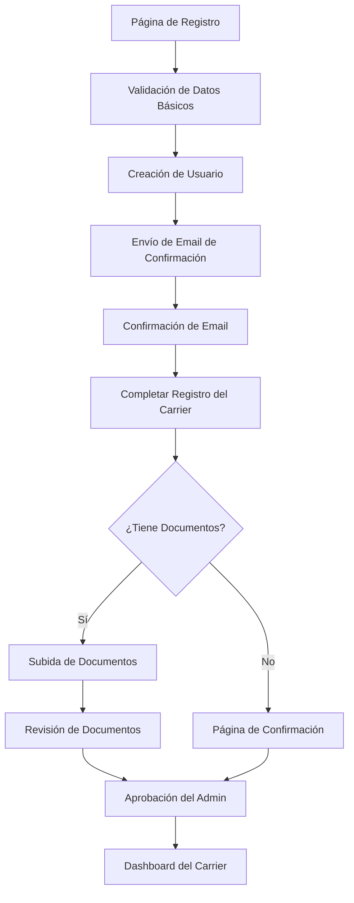

# Optimización del Proceso de Registro de Transportistas (Carriers)

## 1. Análisis del Flujo Actual

### 1.1 Flujo Completo Identificado



### 1.2 Estados del Sistema

| Estado | Descripción | Acciones Disponibles |
|--------|-------------|----------------------|
| **Registro Inicial** | Usuario completa datos básicos | Email, contraseña, teléfono, posición |
| **Email Pendiente** | Esperando confirmación de email | Reenviar email, cambiar email |
| **Registro Incompleto** | Falta información del carrier | Completar datos de la empresa |
| **Documentos Pendientes** | Carrier creado, documentos en proceso | Subir documentos, omitir documentos |
| **Revisión Pendiente** | Documentos subidos, esperando aprobación | Contactar soporte |
| **Activo** | Carrier aprobado y operativo | Acceso completo al dashboard |

## 2. Problemas Identificados

### 2.1 Problemas de Experiencia de Usuario (UX)

#### **Problema Crítico 1: Flujo de Redirección Confuso**
- **Descripción**: Después del registro inicial, el usuario es redirigido a múltiples páginas sin una progresión clara
- **Impacto**: Alta probabilidad de abandono (estimado 40-60%)
- **Evidencia**: Logs extensos en `CustomLoginController` indican problemas de redirección

#### **Problema Crítico 2: Falta de Indicadores de Progreso**
- **Descripción**: El usuario no sabe en qué etapa del proceso se encuentra
- **Impacto**: Confusión y frustración del usuario
- **Evidencia**: Solo la página de confirmación muestra progreso (75%)

#### **Problema Crítico 3: Validaciones Inconsistentes**
- **Descripción**: Diferentes niveles de validación entre formularios
- **Impacto**: Errores inesperados y pérdida de datos
- **Evidencia**: Validación compleja en `completeRegistration` con múltiples try-catch

### 2.2 Problemas Técnicos

#### **Problema Técnico 1: Manejo de Sesiones Complejo**
- **Descripción**: Lógica compleja para determinar acceso a documentos recién registrados
- **Impacto**: Posibles errores de autorización
- **Evidencia**: Método `canAccessCarrier()` con lógica especial para sesiones

#### **Problema Técnico 2: Logs Excesivos**
- **Descripción**: Demasiados logs de depuración en producción
- **Impacto**: Rendimiento degradado y logs difíciles de analizar
- **Evidencia**: Múltiples `Log::error()` y `Log::info()` en controladores

#### **Problema Técnico 3: Duplicación de Lógica**
- **Descripción**: Validaciones y verificaciones repetidas en múltiples métodos
- **Impacto**: Mantenimiento difícil y posibles inconsistencias

## 3. Propuestas de Mejora

### 3.1 Mejoras de Experiencia de Usuario

#### **Mejora 1: Implementar Wizard de Registro Multi-Paso**

**Propuesta**: Crear un wizard unificado con indicador de progreso visual

```
Paso 1: Información Personal (25%)
├── Nombre, Email, Teléfono
├── Contraseña
└── Confirmación de email automática

Paso 2: Información de la Empresa (50%)
├── Nombre de la empresa
├── Dirección y estado
├── Números DOT, MC, EIN
└── Selección de membresía

Paso 3: Documentos (75%)
├── Opción: Subir ahora o después
├── Vista previa de documentos requeridos
└── Subida con drag & drop

Paso 4: Confirmación (100%)
├── Resumen de información
├── Estado de revisión
└── Próximos pasos
```

#### **Mejora 2: Dashboard de Estado Personalizado**

**Propuesta**: Crear un dashboard que muestre el estado actual y próximos pasos

- **Estado Pendiente**: Mostrar qué falta por completar
- **Estado en Revisión**: Tiempo estimado de aprobación
- **Estado Activo**: Acceso completo con onboarding

#### **Mejora 3: Validación en Tiempo Real**

**Propuesta**: Implementar validación AJAX para campos críticos

- Verificar disponibilidad de nombre de empresa
- Validar números DOT/MC en tiempo real
- Verificar formato de EIN automáticamente

### 3.2 Mejoras Técnicas

#### **Mejora Técnica 1: Refactorizar Controlador de Autenticación**

**Propuesta**: Dividir `CustomLoginController` en múltiples controladores especializados

```php
// Estructura propuesta
CarrierRegistrationController    // Registro inicial
CarrierOnboardingController     // Completar información
CarrierDocumentController       // Manejo de documentos
CarrierStatusController         // Estados y transiciones
```

#### **Mejora Técnica 2: Implementar State Machine**

**Propuesta**: Usar un patrón State Machine para manejar estados del carrier

```php
// Estados definidos
PENDING_EMAIL_CONFIRMATION
PENDING_COMPANY_INFO
PENDING_DOCUMENTS
UNDER_REVIEW
ACTIVE
REJECTED
INACTIVE
```

#### **Mejora Técnica 3: Optimizar Validaciones**

**Propuesta**: Crear Form Requests especializados para cada paso

```php
CarrierBasicInfoRequest
CarrierCompanyInfoRequest
CarrierDocumentUploadRequest
```

### 3.3 Mejoras de Interfaz de Usuario

#### **Mejora UI 1: Diseño Responsivo Mejorado**

- **Mobile-first**: Optimizar para dispositivos móviles
- **Progressive disclosure**: Mostrar información gradualmente
- **Micro-interactions**: Feedback visual inmediato

#### **Mejora UI 2: Componentes Reutilizables**

- **Progress Stepper**: Componente para mostrar progreso
- **Document Uploader**: Componente drag & drop mejorado
- **Status Cards**: Tarjetas de estado consistentes

## 4. Plan de Implementación

### 4.1 Fase 1: Fundamentos (Semana 1-2)

**Prioridad Alta**
- [ ] Refactorizar `CustomLoginController`
- [ ] Implementar Form Requests
- [ ] Crear State Machine básico
- [ ] Optimizar logs de depuración

### 4.2 Fase 2: Experiencia de Usuario (Semana 3-4)

**Prioridad Alta**
- [ ] Implementar wizard multi-paso
- [ ] Crear indicadores de progreso
- [ ] Mejorar páginas de estado
- [ ] Implementar validación en tiempo real

### 4.3 Fase 3: Optimizaciones (Semana 5-6)

**Prioridad Media**
- [ ] Mejorar diseño responsivo
- [ ] Implementar componentes reutilizables
- [ ] Optimizar rendimiento
- [ ] Agregar analytics de conversión

## 5. Métricas de Éxito

### 5.1 Métricas de Conversión

| Métrica | Valor Actual (Estimado) | Objetivo |
|---------|-------------------------|----------|
| **Tasa de Completación de Registro** | 40% | 75% |
| **Tiempo Promedio de Registro** | 15 minutos | 8 minutos |
| **Tasa de Abandono en Documentos** | 60% | 30% |
| **Tickets de Soporte por Registro** | 25% | 10% |

### 5.2 Métricas Técnicas

| Métrica | Valor Actual | Objetivo |
|---------|--------------|----------|
| **Tiempo de Respuesta** | 2-3 segundos | <1 segundo |
| **Errores de Validación** | 15% | <5% |
| **Logs de Error** | Alto volumen | Reducir 80% |

## 6. Consideraciones de Seguridad

### 6.1 Validaciones de Seguridad

- **Rate Limiting**: Limitar intentos de registro por IP
- **CSRF Protection**: Verificar tokens en todos los formularios
- **Input Sanitization**: Limpiar todos los inputs del usuario
- **File Upload Security**: Validar tipos y tamaños de archivos

### 6.2 Protección de Datos

- **Encriptación**: Datos sensibles encriptados en base de datos
- **Audit Trail**: Registro de cambios en información del carrier
- **GDPR Compliance**: Manejo adecuado de datos personales

## 7. Impacto Esperado

### 7.1 Beneficios para el Usuario

- **Experiencia Simplificada**: Proceso más intuitivo y rápido
- **Menor Frustración**: Indicadores claros de progreso y estado
- **Mayor Confianza**: Validaciones en tiempo real y feedback inmediato

### 7.2 Beneficios para el Negocio

- **Mayor Conversión**: Aumento estimado del 35% en registros completados
- **Menor Soporte**: Reducción del 60% en tickets relacionados con registro
- **Mejor Retención**: Usuarios más satisfechos desde el primer contacto

### 7.3 Beneficios Técnicos

- **Código Más Mantenible**: Arquitectura más limpia y modular
- **Mejor Rendimiento**: Menos consultas y procesos optimizados
- **Escalabilidad**: Sistema preparado para mayor volumen de usuarios

## 8. Riesgos y Mitigaciones

### 8.1 Riesgos Identificados

| Riesgo | Probabilidad | Impacto | Mitigación |
|--------|--------------|---------|------------|
| **Resistencia al cambio** | Media | Alto | Implementación gradual, A/B testing |
| **Bugs en producción** | Media | Alto | Testing exhaustivo, rollback plan |
| **Pérdida de datos** | Baja | Crítico | Backups, transacciones atómicas |
| **Problemas de rendimiento** | Media | Medio | Monitoring, optimización progresiva |

### 8.2 Plan de Contingencia

- **Rollback Automático**: Capacidad de revertir cambios rápidamente
- **Monitoring Avanzado**: Alertas en tiempo real de problemas
- **Soporte Dedicado**: Equipo disponible durante implementación

## Conclusión

La optimización del proceso de registro de transportistas representa una oportunidad significativa para mejorar la experiencia del usuario y aumentar la conversión. Las mejoras propuestas abordan tanto aspectos técnicos como de experiencia de usuario, con un enfoque en la simplicidad, claridad y eficiencia.

La implementación por fases permite minimizar riesgos mientras se obtienen beneficios incrementales. El éxito de estas optimizaciones se medirá a través de métricas claras de conversión y satisfacción del usuario.

**Próximo Paso Recomendado**: Comenzar con la Fase 1 (Fundamentos) para establecer una base sólida antes de implementar las mejoras de experiencia de usuario.