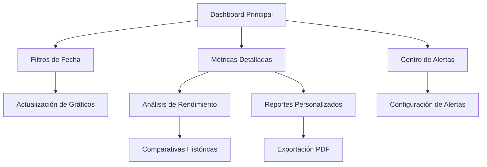

# Dashboard Administrativo - Documento de Requerimientos del Producto

## 1. Resumen del Producto

El Dashboard Administrativo es una interfaz centralizada que proporciona una vista completa y en tiempo real del sistema de gestión de transportistas. Permite a los administradores monitorear métricas clave, analizar tendencias y gestionar eficientemente todos los aspectos del negocio de transporte.

- **Propósito Principal**: Centralizar la información crítica del negocio en una interfaz intuitiva que permita la toma de decisiones informadas basada en datos reales y actualizados.
- **Usuarios Objetivo**: Administradores del sistema, gerentes de operaciones y personal de supervisión que necesitan acceso a métricas y estadísticas del negocio.
- **Valor del Mercado**: Optimización de operaciones, reducción de tiempos de análisis y mejora en la toma de decisiones estratégicas mediante visualización de datos en tiempo real.

## 2. Características Principales

### 2.1 Roles de Usuario

| Rol | Método de Registro | Permisos Principales |
|-----|-------------------|---------------------|
| Super Administrador | Acceso directo del sistema | Acceso completo a todas las métricas, exportación de reportes, configuración de filtros avanzados |
| Administrador | Asignación por Super Admin | Visualización de métricas, exportación básica, acceso a datos históricos |
| Supervisor | Asignación por Administrador | Visualización limitada de métricas operativas, sin acceso a datos financieros sensibles |

### 2.2 Módulos de Funcionalidad

Nuestro dashboard administrativo consta de las siguientes páginas principales:

1. **Dashboard Principal**: panel de control central, métricas clave, gráficos de tendencias, alertas del sistema.
2. **Vista de Métricas Detalladas**: análisis profundo de KPIs, comparativas históricas, filtros avanzados.
3. **Gestión de Reportes**: generación de reportes personalizados, exportación PDF/Excel, programación de reportes automáticos.
4. **Centro de Alertas**: notificaciones del sistema, alertas de rendimiento, configuración de umbrales.

### 2.3 Detalles de Páginas

| Nombre de Página | Nombre del Módulo | Descripción de Funcionalidad |
|------------------|-------------------|------------------------------|
| Dashboard Principal | Panel de Métricas Generales | Mostrar tarjetas de estadísticas principales (total de transportistas, conductores, vehículos, ingresos). Incluir gráficos de tendencias mensuales y semanales. Mostrar alertas críticas del sistema. |
| Dashboard Principal | Filtros de Fecha | Implementar filtros por rango de fechas (diario, semanal, mensual, anual, personalizado). Actualizar todas las métricas según el filtro seleccionado. |
| Dashboard Principal | Gráficos Interactivos | Crear gráficos de líneas para tendencias temporales, gráficos de dona para distribuciones, gráficos de barras para comparativas. Incluir tooltips informativos. |
| Dashboard Principal | Tablas de Registros Recientes | Mostrar últimos transportistas registrados, conductores recientes, vehículos añadidos, mantenimientos programados. Incluir paginación y ordenamiento. |
| Vista de Métricas | Análisis de Rendimiento | Calcular y mostrar métricas de crecimiento, tasas de conversión, eficiencia operativa. Comparar períodos anteriores. |
| Vista de Métricas | Distribución Geográfica | Mostrar mapas de calor con distribución de transportistas por región. Incluir filtros por estado/ciudad. |
| Gestión de Reportes | Exportación PDF | Generar reportes en PDF con gráficos y tablas. Incluir filtros de fecha y personalización de contenido. |
| Gestión de Reportes | Programación Automática | Configurar reportes automáticos por email. Definir frecuencia y destinatarios. |
| Centro de Alertas | Monitoreo en Tiempo Real | Mostrar alertas de vehículos con mantenimiento vencido, documentos por expirar, conductores inactivos. |
| Centro de Alertas | Configuración de Umbrales | Permitir configurar límites para alertas automáticas. Definir niveles de criticidad. |

## 3. Proceso Principal

### Flujo de Usuario Administrador:
El administrador accede al dashboard principal donde visualiza las métricas generales del sistema. Puede aplicar filtros de fecha para analizar períodos específicos. Navega entre diferentes secciones para obtener análisis detallados. Genera reportes personalizados y los exporta en PDF. Configura alertas automáticas según las necesidades operativas.

### Flujo de Usuario Supervisor:
El supervisor accede a una vista limitada del dashboard con métricas operativas básicas. Puede visualizar tendencias y generar reportes básicos. Recibe notificaciones de alertas críticas configuradas por los administradores.

## 4. Diseño de Interfaz de Usuario

### 4.1 Estilo de Diseño

- **Colores Principales**: Azul primario (#3B82F6), Verde éxito (#10B981), Rojo alerta (#EF4444), Gris neutro (#6B7280)
- **Colores Secundarios**: Azul claro (#DBEAFE), Verde claro (#D1FAE5), Amarillo advertencia (#FCD34D)
- **Estilo de Botones**: Botones redondeados con sombras suaves, efectos hover con transiciones suaves
- **Tipografía**: Inter como fuente principal, tamaños de 12px para texto pequeño, 14px para texto normal, 16px para títulos secundarios, 24px para títulos principales
- **Estilo de Layout**: Diseño basado en tarjetas con bordes redondeados, espaciado consistente de 16px entre elementos, uso de grid responsivo
- **Iconos**: Lucide icons para consistencia, iconos de 16px para botones, 20px para navegación, 24px para elementos destacados

### 4.2 Resumen de Diseño de Páginas

| Nombre de Página | Nombre del Módulo | Elementos de UI |
|------------------|-------------------|-----------------|
| Dashboard Principal | Panel de Métricas | Tarjetas con gradientes de fondo, iconos coloridos, números grandes con indicadores de cambio porcentual, gráficos integrados con colores temáticos |
| Dashboard Principal | Filtros de Fecha | Selectores desplegables estilizados, datepicker con calendario visual, botones de filtros rápidos (Hoy, Esta semana, Este mes) |
| Dashboard Principal | Gráficos Interactivos | Gráficos con paleta de colores consistente, tooltips informativos, leyendas claras, animaciones suaves al cargar |
| Dashboard Principal | Tablas de Datos | Tablas con filas alternadas, headers fijos, iconos de estado, botones de acción compactos, paginación estilizada |
| Vista de Métricas | Análisis Detallado | Cards expandibles, indicadores de progreso circulares, badges de estado, comparativas con flechas de tendencia |
| Gestión de Reportes | Configuración | Formularios con campos agrupados, switches para opciones, preview de reportes, botones de acción prominentes |

### 4.3 Responsividad

El dashboard está diseñado con enfoque mobile-first, adaptándose automáticamente a dispositivos móviles, tablets y escritorio. En móviles, las tarjetas se apilan verticalmente y los gráficos se optimizan para pantallas táctiles. En tablets, se utiliza un layout de 2 columnas. En escritorio, se aprovecha el espacio completo con layout de 3-4 columnas según el contenido.