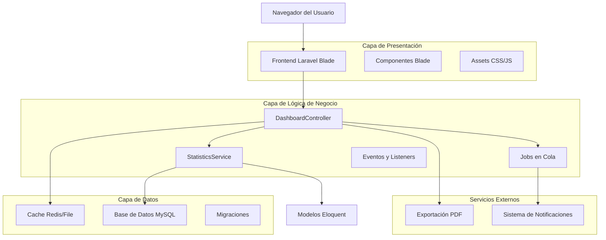
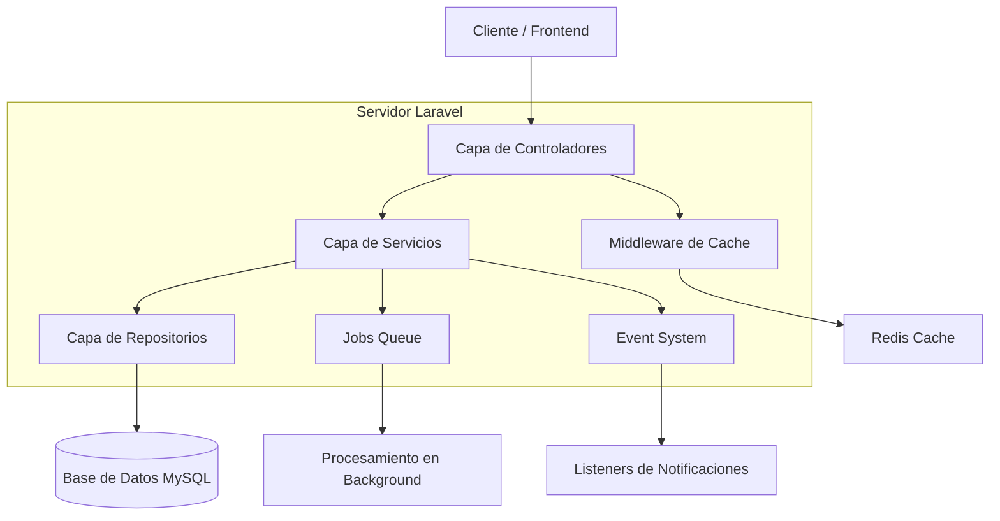
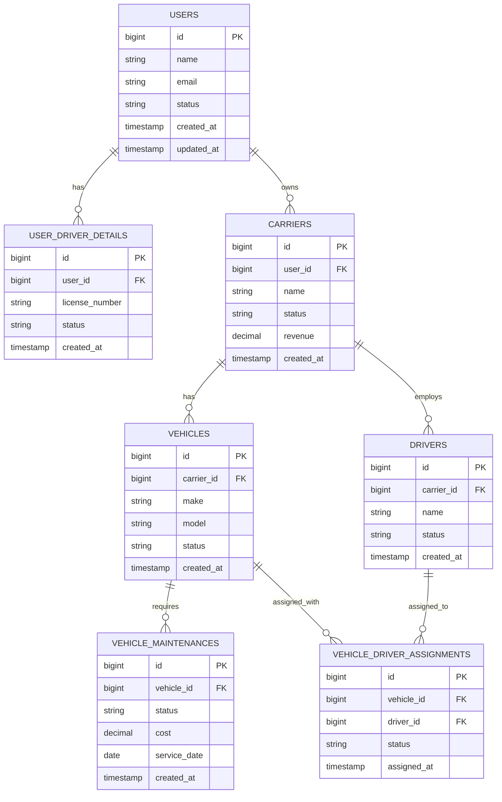

# Dashboard Administrativo - Documento de Arquitectura Técnica

## 1. Diseño de Arquitectura



## 2. Descripción de Tecnologías

* **Frontend**: Laravel Blade Templates + TailwindCSS + Alpine.js + Chart.js

* **Backend**: Laravel 10 + PHP 8.1

* **Base de Datos**: MySQL 8.0

* **Cache**: Redis (producción) / File Cache (desarrollo)

* **Cola de Trabajos**: Redis Queue

* **Exportación**: DomPDF para generación de reportes

* **Gráficos**: Chart.js para visualizaciones interactivas

## 3. Definiciones de Rutas

| Ruta                        | Propósito                                             |
| --------------------------- | ----------------------------------------------------- |
| /admin                      | Dashboard principal con métricas generales y gráficos |
| /admin/dashboard/metrics    | Vista detallada de métricas y análisis avanzados      |
| /admin/dashboard/reports    | Gestión y generación de reportes personalizados       |
| /admin/dashboard/alerts     | Centro de alertas y configuración de notificaciones   |
| /admin/dashboard/export-pdf | Exportación de dashboard completo en PDF              |
| /admin/dashboard/api/stats  | API endpoint para obtener estadísticas en JSON        |
| /admin/dashboard/api/charts | API endpoint para datos de gráficos dinámicos         |

## 4. Definiciones de API

### 4.1 API Principal

**Obtener estadísticas del dashboard**

```
GET /admin/dashboard/api/stats
```

Parámetros de consulta:

| Nombre del Parámetro | Tipo del Parámetro | Es Requerido | Descripción                                                           |
| -------------------- | ------------------ | ------------ | --------------------------------------------------------------------- |
| date\_range          | string             | false        | Rango de fechas (daily, weekly, monthly, yearly, custom)              |
| start\_date          | date               | false        | Fecha de inicio para rango personalizado (formato: Y-m-d)             |
| end\_date            | date               | false        | Fecha de fin para rango personalizado (formato: Y-m-d)                |
| metrics              | array              | false        | Métricas específicas a obtener (carriers, drivers, vehicles, revenue) |

Respuesta:

| Nombre del Parámetro | Tipo del Parámetro | Descripción                       |
| -------------------- | ------------------ | --------------------------------- |
| success              | boolean            | Estado de la respuesta            |
| data                 | object             | Objeto con todas las estadísticas |
| data.carriers        | object             | Estadísticas de transportistas    |
| data.drivers         | object             | Estadísticas de conductores       |
| data.vehicles        | object             | Estadísticas de vehículos         |
| data.revenue         | object             | Estadísticas de ingresos          |
| data.growth          | object             | Métricas de crecimiento           |
| data.alerts          | array              | Alertas del sistema               |

Ejemplo de respuesta:

```json
{
  "success": true,
  "data": {
    "carriers": {
      "total": 150,
      "active": 142,
      "pending": 8,
      "growth_percentage": 12.5
    },
    "drivers": {
      "total": 450,
      "active": 398,
      "pending": 52,
      "growth_percentage": 8.3
    },
    "vehicles": {
      "total": 320,
      "active": 298,
      "maintenance": 22,
      "growth_percentage": 15.2
    },
    "revenue": {
      "total": 125000.50,
      "monthly": 45000.25,
      "growth_percentage": 18.7
    }
  }
}
```

**Obtener datos para gráficos**

```
GET /admin/dashboard/api/charts
```

Parámetros de consulta:

| Nombre del Parámetro | Tipo del Parámetro | Es Requerido | Descripción                                           |
| -------------------- | ------------------ | ------------ | ----------------------------------------------------- |
| chart\_type          | string             | true         | Tipo de gráfico (line, bar, doughnut, area)           |
| period               | string             | false        | Período de datos (7days, 30days, 90days, 1year)       |
| metric               | string             | true         | Métrica a graficar (registrations, revenue, activity) |

**Exportar dashboard a PDF**

```
POST /admin/dashboard/export-pdf
```

Parámetros del cuerpo:

| Nombre del Parámetro | Tipo del Parámetro | Es Requerido | Descripción                     |
| -------------------- | ------------------ | ------------ | ------------------------------- |
| date\_range          | string             | false        | Rango de fechas para el reporte |
| include\_charts      | boolean            | false        | Incluir gráficos en el PDF      |
| sections             | array              | false        | Secciones específicas a incluir |

## 5. Arquitectura del Servidor



## 6. Modelo de Datos

### 6.1 Definición del Modelo de Datos



### 6.2 Lenguaje de Definición de Datos

**Tabla de Estadísticas del Dashboard (dashboard\_statistics)**

```sql
-- Crear tabla para cache de estadísticas
CREATE TABLE dashboard_statistics (
    id BIGINT UNSIGNED AUTO_INCREMENT PRIMARY KEY,
    metric_type VARCHAR(50) NOT NULL,
    metric_key VARCHAR(100) NOT NULL,
    metric_value JSON NOT NULL,
    date_range VARCHAR(20) NOT NULL,
    start_date DATE NULL,
    end_date DATE NULL,
    created_at TIMESTAMP DEFAULT CURRENT_TIMESTAMP,
    updated_at TIMESTAMP DEFAULT CURRENT_TIMESTAMP ON UPDATE CURRENT_TIMESTAMP,
    INDEX idx_metric_type (metric_type),
    INDEX idx_date_range (date_range),
    INDEX idx_created_at (created_at)
);

-- Crear tabla para alertas del sistema
CREATE TABLE system_alerts (
    id BIGINT UNSIGNED AUTO_INCREMENT PRIMARY KEY,
    alert_type VARCHAR(50) NOT NULL,
    title VARCHAR(255) NOT NULL,
    message TEXT NOT NULL,
    severity ENUM('low', 'medium', 'high', 'critical') DEFAULT 'medium',
    is_read BOOLEAN DEFAULT FALSE,
    related_model VARCHAR(100) NULL,
    related_id BIGINT UNSIGNED NULL,
    created_at TIMESTAMP DEFAULT CURRENT_TIMESTAMP,
    updated_at TIMESTAMP DEFAULT CURRENT_TIMESTAMP ON UPDATE CURRENT_TIMESTAMP,
    INDEX idx_alert_type (alert_type),
    INDEX idx_severity (severity),
    INDEX idx_is_read (is_read),
    INDEX idx_created_at (created_at)
);

-- Crear índices para optimizar consultas del dashboard
CREATE INDEX idx_users_status_created ON users(status, created_at);
CREATE INDEX idx_carriers_status_created ON carriers(status, created_at);
CREATE INDEX idx_vehicles_status_created ON vehicles(status, created_at);
CREATE INDEX idx_vehicle_maintenances_status_date ON vehicle_maintenances(status, service_date);

-- Datos iniciales para pruebas
INSERT INTO system_alerts (alert_type, title, message, severity) VALUES
('maintenance', 'Mantenimientos Vencidos', '5 vehículos tienen mantenimiento vencido', 'high'),
('documents', 'Documentos por Expirar', '12 documentos expiran en los próximos 30 días', 'medium'),
('drivers', 'Conductores Inactivos', '8 conductores no han reportado actividad en 7 días', 'low');
```

