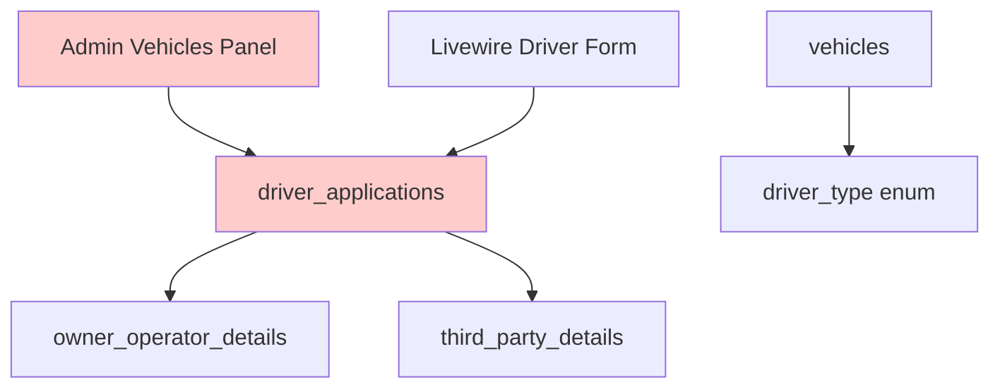
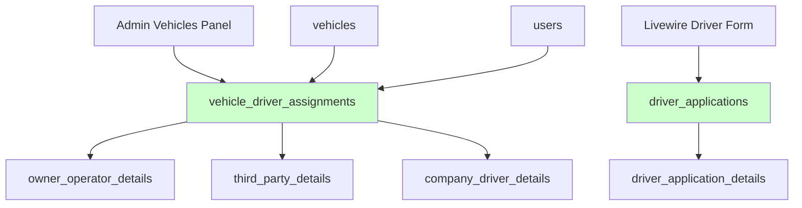

# ANÁLISIS Y SOLUCIÓN: DESACOPLAMIENTO DE DRIVER_APPLICATIONS

## 1. Análisis del Problema Actual

### 1.1 Problema Identificado
La tabla `driver_applications` está siendo utilizada incorrectamente para **DOS propósitos completamente diferentes**:

1. **Proceso legítimo**: Aplicación de nuevos conductores a través del componente Livewire ✅
2. **Uso incorrecto**: Asignación de tipos de conductor a vehículos desde `/admin/vehicles` ❌

### 1.2 Consecuencias del Acoplamiento Incorrecto

- **Confusión conceptual**: Una "aplicación" no debería crearse cuando se asigna un conductor existente
- **Datos inconsistentes**: Se crean registros de `driver_applications` sin un proceso real de aplicación
- **Flujo roto en admin**: El panel de vehículos se "atrofia" al intentar manejar asignaciones
- **Violación de principios**: Mezcla responsabilidades de aplicación y asignación

### 1.3 Estructura Actual Problemática



**Problema**: `driver_applications` está siendo el punto central para ambos flujos

## 2. Solución Propuesta: Desacoplamiento Completo

### 2.1 Nueva Arquitectura



### 2.2 Separación de Responsabilidades

| Concepto | Tabla Responsable | Propósito |
|----------|-------------------|----------|
| **Aplicación de Conductor** | `driver_applications` | Proceso de registro de nuevos conductores |
| **Asignación de Conductor** | `vehicle_driver_assignments` | Asignación de conductores a vehículos |
| **Detalles de Aplicación** | `driver_application_details` | Información del proceso de aplicación |
| **Detalles de Asignación** | `owner_operator_details`, `third_party_details`, `company_driver_details` | Información específica del tipo de conductor |

## 3. Nueva Estructura de Base de Datos

### 3.1 Tabla Principal: vehicle_driver_assignments

```sql
CREATE TABLE vehicle_driver_assignments (
    id BIGINT UNSIGNED AUTO_INCREMENT PRIMARY KEY,
    vehicle_id BIGINT UNSIGNED NOT NULL,
    user_id BIGINT UNSIGNED NOT NULL,
    assignment_type ENUM('company_driver', 'owner_operator', 'third_party') NOT NULL,
    status ENUM('active', 'inactive', 'pending', 'terminated') DEFAULT 'pending',
    assigned_by BIGINT UNSIGNED NOT NULL,
    assigned_at TIMESTAMP DEFAULT CURRENT_TIMESTAMP,
    effective_date DATE NOT NULL,
    termination_date DATE NULL,
    notes TEXT NULL,
    created_at TIMESTAMP DEFAULT CURRENT_TIMESTAMP,
    updated_at TIMESTAMP DEFAULT CURRENT_TIMESTAMP ON UPDATE CURRENT_TIMESTAMP,
    
    FOREIGN KEY (vehicle_id) REFERENCES vehicles(id) ON DELETE CASCADE,
    FOREIGN KEY (user_id) REFERENCES users(id) ON DELETE CASCADE,
    FOREIGN KEY (assigned_by) REFERENCES users(id) ON DELETE RESTRICT,
    
    INDEX idx_vehicle_assignments (vehicle_id, status),
    INDEX idx_user_assignments (user_id, status),
    INDEX idx_assignment_type (assignment_type),
    UNIQUE KEY unique_active_assignment (vehicle_id, user_id, status)
);
```

### 3.2 Nueva Tabla: company_driver_details

```sql
CREATE TABLE company_driver_details (
    id BIGINT UNSIGNED AUTO_INCREMENT PRIMARY KEY,
    assignment_id BIGINT UNSIGNED NOT NULL,
    employee_id VARCHAR(50) NULL,
    department VARCHAR(100) NULL,
    supervisor_name VARCHAR(255) NULL,
    supervisor_phone VARCHAR(20) NULL,
    salary_type ENUM('hourly', 'salary', 'commission', 'per_mile') NULL,
    base_rate DECIMAL(10,2) NULL,
    overtime_rate DECIMAL(10,2) NULL,
    benefits_eligible BOOLEAN DEFAULT FALSE,
    created_at TIMESTAMP DEFAULT CURRENT_TIMESTAMP,
    updated_at TIMESTAMP DEFAULT CURRENT_TIMESTAMP ON UPDATE CURRENT_TIMESTAMP,
    
    FOREIGN KEY (assignment_id) REFERENCES vehicle_driver_assignments(id) ON DELETE CASCADE
);
```

### 3.3 Modificación de Tablas Existentes

#### owner_operator_details
```sql
ALTER TABLE owner_operator_details 
DROP FOREIGN KEY owner_operator_details_driver_application_id_foreign;

ALTER TABLE owner_operator_details 
ADD COLUMN assignment_id BIGINT UNSIGNED NULL AFTER id,
ADD FOREIGN KEY (assignment_id) REFERENCES vehicle_driver_assignments(id) ON DELETE CASCADE;
```

#### third_party_details
```sql
ALTER TABLE third_party_details 
DROP FOREIGN KEY third_party_details_driver_application_id_foreign;

ALTER TABLE third_party_details 
ADD COLUMN assignment_id BIGINT UNSIGNED NULL AFTER id,
ADD FOREIGN KEY (assignment_id) REFERENCES vehicle_driver_assignments(id) ON DELETE CASCADE;
```

## 4. Migraciones Necesarias

### 4.1 Migración de Creación

```php
<?php
// 2025_01_XX_create_vehicle_driver_assignments_table.php

use Illuminate\Database\Migrations\Migration;
use Illuminate\Database\Schema\Blueprint;
use Illuminate\Support\Facades\Schema;

return new class extends Migration
{
    public function up(): void
    {
        Schema::create('vehicle_driver_assignments', function (Blueprint $table) {
            $table->id();
            $table->foreignId('vehicle_id')->constrained()->onDelete('cascade');
            $table->foreignId('user_id')->constrained()->onDelete('cascade');
            $table->enum('assignment_type', ['company_driver', 'owner_operator', 'third_party']);
            $table->enum('status', ['active', 'inactive', 'pending', 'terminated'])->default('pending');
            $table->foreignId('assigned_by')->constrained('users')->onDelete('restrict');
            $table->timestamp('assigned_at')->useCurrent();
            $table->date('effective_date');
            $table->date('termination_date')->nullable();
            $table->text('notes')->nullable();
            $table->timestamps();
            
            $table->index(['vehicle_id', 'status']);
            $table->index(['user_id', 'status']);
            $table->index('assignment_type');
            $table->unique(['vehicle_id', 'user_id', 'status'], 'unique_active_assignment');
        });
    }

    public function down(): void
    {
        Schema::dropIfExists('vehicle_driver_assignments');
    }
};
```

### 4.2 Migración de Datos Existentes

```php
<?php
// 2025_01_XX_migrate_existing_driver_assignments.php

use Illuminate\Database\Migrations\Migration;
use Illuminate\Support\Facades\DB;

return new class extends Migration
{
    public function up(): void
    {
        // Migrar owner_operator_details
        DB::statement("
            INSERT INTO vehicle_driver_assignments 
            (vehicle_id, user_id, assignment_type, status, assigned_by, effective_date, created_at, updated_at)
            SELECT 
                ood.vehicle_id,
                da.user_id,
                'owner_operator' as assignment_type,
                CASE da.status 
                    WHEN 'approved' THEN 'active'
                    WHEN 'pending' THEN 'pending'
                    ELSE 'inactive'
                END as status,
                1 as assigned_by, -- Admin user ID
                COALESCE(da.completed_at, da.created_at) as effective_date,
                da.created_at,
                da.updated_at
            FROM owner_operator_details ood
            JOIN driver_applications da ON ood.driver_application_id = da.id
            WHERE ood.vehicle_id IS NOT NULL
        ");
        
        // Migrar third_party_details
        DB::statement("
            INSERT INTO vehicle_driver_assignments 
            (vehicle_id, user_id, assignment_type, status, assigned_by, effective_date, created_at, updated_at)
            SELECT 
                tpd.vehicle_id,
                da.user_id,
                'third_party' as assignment_type,
                CASE da.status 
                    WHEN 'approved' THEN 'active'
                    WHEN 'pending' THEN 'pending'
                    ELSE 'inactive'
                END as status,
                1 as assigned_by,
                COALESCE(da.completed_at, da.created_at) as effective_date,
                da.created_at,
                da.updated_at
            FROM third_party_details tpd
            JOIN driver_applications da ON tpd.driver_application_id = da.id
            WHERE tpd.vehicle_id IS NOT NULL
        ");
        
        // Actualizar referencias en owner_operator_details
        DB::statement("
            UPDATE owner_operator_details ood
            JOIN vehicle_driver_assignments vda ON (
                vda.vehicle_id = ood.vehicle_id AND 
                vda.assignment_type = 'owner_operator'
            )
            JOIN driver_applications da ON ood.driver_application_id = da.id
            SET ood.assignment_id = vda.id
            WHERE vda.user_id = da.user_id
        ");
        
        // Actualizar referencias en third_party_details
        DB::statement("
            UPDATE third_party_details tpd
            JOIN vehicle_driver_assignments vda ON (
                vda.vehicle_id = tpd.vehicle_id AND 
                vda.assignment_type = 'third_party'
            )
            JOIN driver_applications da ON tpd.driver_application_id = da.id
            SET tpd.assignment_id = vda.id
            WHERE vda.user_id = da.user_id
        ");
    }

    public function down(): void
    {
        // Revertir cambios si es necesario
        DB::table('vehicle_driver_assignments')->truncate();
        DB::statement('UPDATE owner_operator_details SET assignment_id = NULL');
        DB::statement('UPDATE third_party_details SET assignment_id = NULL');
    }
};
```

## 5. Cambios en Modelos

### 5.1 Nuevo Modelo: VehicleDriverAssignment

```php
<?php

namespace App\Models;

use Illuminate\Database\Eloquent\Model;
use Illuminate\Database\Eloquent\Relations\BelongsTo;
use Illuminate\Database\Eloquent\Relations\HasOne;

class VehicleDriverAssignment extends Model
{
    protected $fillable = [
        'vehicle_id',
        'user_id', 
        'assignment_type',
        'status',
        'assigned_by',
        'assigned_at',
        'effective_date',
        'termination_date',
        'notes'
    ];

    protected $casts = [
        'assigned_at' => 'datetime',
        'effective_date' => 'date',
        'termination_date' => 'date',
    ];

    public function vehicle(): BelongsTo
    {
        return $this->belongsTo(Vehicle::class);
    }

    public function user(): BelongsTo
    {
        return $this->belongsTo(User::class);
    }

    public function assignedBy(): BelongsTo
    {
        return $this->belongsTo(User::class, 'assigned_by');
    }

    public function ownerOperatorDetails(): HasOne
    {
        return $this->hasOne(OwnerOperatorDetail::class, 'assignment_id');
    }

    public function thirdPartyDetails(): HasOne
    {
        return $this->hasOne(ThirdPartyDetail::class, 'assignment_id');
    }

    public function companyDriverDetails(): HasOne
    {
        return $this->hasOne(CompanyDriverDetail::class, 'assignment_id');
    }

    public function scopeActive($query)
    {
        return $query->where('status', 'active');
    }

    public function scopeByType($query, $type)
    {
        return $query->where('assignment_type', $type);
    }
}
```

### 5.2 Actualización del Modelo Vehicle

```php
// Agregar al modelo Vehicle
public function driverAssignments()
{
    return $this->hasMany(VehicleDriverAssignment::class);
}

public function activeDriverAssignment()
{
    return $this->hasOne(VehicleDriverAssignment::class)->where('status', 'active');
}

public function currentDriver()
{
    return $this->activeDriverAssignment()?->user();
}
```

## 6. Cambios en Controladores

### 6.1 Nuevo VehicleDriverAssignmentController

```php
<?php

namespace App\Http\Controllers\Admin;

use App\Http\Controllers\Controller;
use App\Models\VehicleDriverAssignment;
use App\Models\Vehicle;
use App\Models\User;
use Illuminate\Http\Request;
use Illuminate\Support\Facades\DB;

class VehicleDriverAssignmentController extends Controller
{
    public function store(Request $request)
    {
        $validated = $request->validate([
            'vehicle_id' => 'required|exists:vehicles,id',
            'user_id' => 'required|exists:users,id',
            'assignment_type' => 'required|in:company_driver,owner_operator,third_party',
            'effective_date' => 'required|date',
            'notes' => 'nullable|string'
        ]);

        DB::transaction(function () use ($validated, $request) {
            // Terminar asignación activa anterior si existe
            VehicleDriverAssignment::where('vehicle_id', $validated['vehicle_id'])
                ->where('status', 'active')
                ->update([
                    'status' => 'terminated',
                    'termination_date' => now()->toDateString()
                ]);

            // Crear nueva asignación
            $assignment = VehicleDriverAssignment::create([
                ...$validated,
                'assigned_by' => auth()->id(),
                'assigned_at' => now(),
                'status' => 'active'
            ]);

            // Crear detalles específicos según el tipo
            $this->createTypeSpecificDetails($assignment, $request);
        });

        return redirect()->back()->with('success', 'Conductor asignado exitosamente');
    }

    private function createTypeSpecificDetails($assignment, $request)
    {
        switch ($assignment->assignment_type) {
            case 'owner_operator':
                $assignment->ownerOperatorDetails()->create([
                    'owner_name' => $request->owner_name,
                    'owner_phone' => $request->owner_phone,
                    'owner_email' => $request->owner_email,
                    'contract_agreed' => $request->boolean('contract_agreed')
                ]);
                break;
                
            case 'third_party':
                $assignment->thirdPartyDetails()->create([
                    'third_party_name' => $request->third_party_name,
                    'third_party_phone' => $request->third_party_phone,
                    'third_party_email' => $request->third_party_email,
                    'third_party_dba' => $request->third_party_dba,
                    'third_party_address' => $request->third_party_address,
                    'third_party_contact' => $request->third_party_contact,
                    'third_party_fein' => $request->third_party_fein
                ]);
                break;
                
            case 'company_driver':
                $assignment->companyDriverDetails()->create([
                    'employee_id' => $request->employee_id,
                    'department' => $request->department,
                    'supervisor_name' => $request->supervisor_name,
                    'supervisor_phone' => $request->supervisor_phone,
                    'salary_type' => $request->salary_type,
                    'base_rate' => $request->base_rate,
                    'benefits_eligible' => $request->boolean('benefits_eligible')
                ]);
                break;
        }
    }
}
```

### 6.2 Actualización del VehicleController

```php
// Remover métodos relacionados con driver_applications
// Reemplazar con llamadas a VehicleDriverAssignmentController

public function assignDriver(Request $request, Vehicle $vehicle)
{
    return app(VehicleDriverAssignmentController::class)->store($request);
}

public function removeDriver(Vehicle $vehicle)
{
    $vehicle->activeDriverAssignment()?->update([
        'status' => 'terminated',
        'termination_date' => now()->toDateString()
    ]);
    
    return redirect()->back()->with('success', 'Conductor removido exitosamente');
}
```

## 7. Plan de Implementación

### Fase 1: Preparación de Base de Datos
1. ✅ Crear migración para `vehicle_driver_assignments`
2. ✅ Crear migración para `company_driver_details`
3. ✅ Crear migración de datos existentes
4. ✅ Ejecutar migraciones en entorno de desarrollo

### Fase 2: Modelos y Relaciones
1. ✅ Crear modelo `VehicleDriverAssignment`
2. ✅ Crear modelo `CompanyDriverDetail`
3. ✅ Actualizar modelos existentes con nuevas relaciones
4. ✅ Actualizar factories y seeders

### Fase 3: Controladores y Lógica
1. ✅ Crear `VehicleDriverAssignmentController`
2. ✅ Actualizar `VehicleController`
3. ✅ Actualizar rutas relacionadas
4. ✅ Crear servicios de negocio si es necesario

### Fase 4: Vistas y Frontend
1. ✅ Actualizar vistas del admin panel
2. ✅ Crear formularios para asignación de conductores
3. ✅ Actualizar componentes Livewire si es necesario
4. ✅ Actualizar JavaScript y validaciones

### Fase 5: Testing y Deployment
1. ✅ Crear tests unitarios
2. ✅ Crear tests de integración
3. ✅ Testing en entorno de staging
4. ✅ Deployment a producción
5. ✅ Monitoreo post-deployment

## 8. Beneficios de la Solución

### 8.1 Separación Clara de Responsabilidades
- ✅ `driver_applications` solo para proceso de aplicación
- ✅ `vehicle_driver_assignments` solo para asignaciones
- ✅ Cada tabla tiene un propósito específico y claro

### 8.2 Flexibilidad Mejorada
- ✅ Asignación independiente de conductores a vehículos
- ✅ Historial completo de asignaciones
- ✅ Soporte para múltiples tipos de conductor
- ✅ Gestión de estados de asignación

### 8.3 Integridad de Datos
- ✅ No más `driver_applications` falsas
- ✅ Relaciones consistentes y lógicas
- ✅ Validaciones apropiadas para cada contexto

### 8.4 Mantenibilidad
- ✅ Código más limpio y comprensible
- ✅ Fácil extensión para nuevos tipos de conductor
- ✅ Debugging simplificado
- ✅ Testing más directo

## 9. Consideraciones de Migración

### 9.1 Datos Existentes
- Los datos actuales se migrarán automáticamente
- Se mantendrá la integridad referencial
- Backup completo antes de la migración

### 9.2 Compatibilidad Temporal
- Mantener ambas estructuras durante la transición
- Deprecar gradualmente el uso incorrecto
- Documentar cambios para el equipo

### 9.3 Rollback Plan
- Script de rollback preparado
- Backup de datos antes de migración
- Plan de contingencia documentado

---

**Conclusión**: Esta solución elimina completamente el acoplamiento incorrecto entre `driver_applications` y la asignación de conductores, creando una arquitectura limpia, mantenible y escalable que respeta el principio de responsabilidad única.