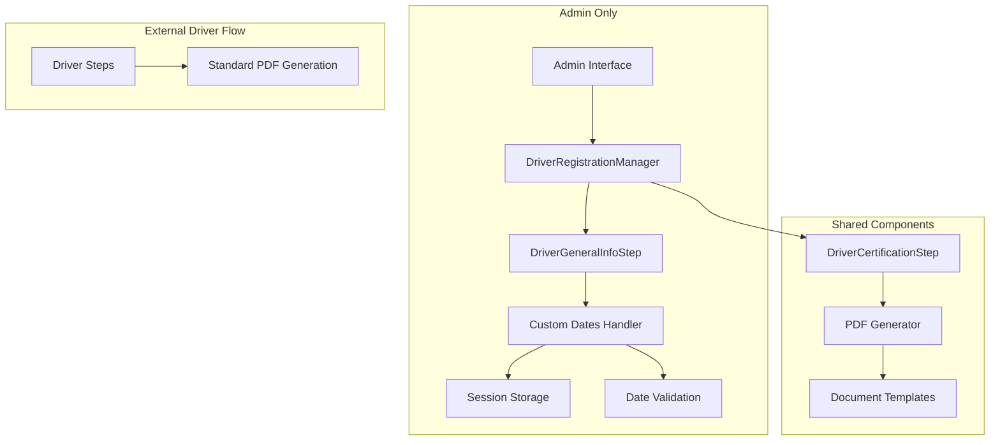
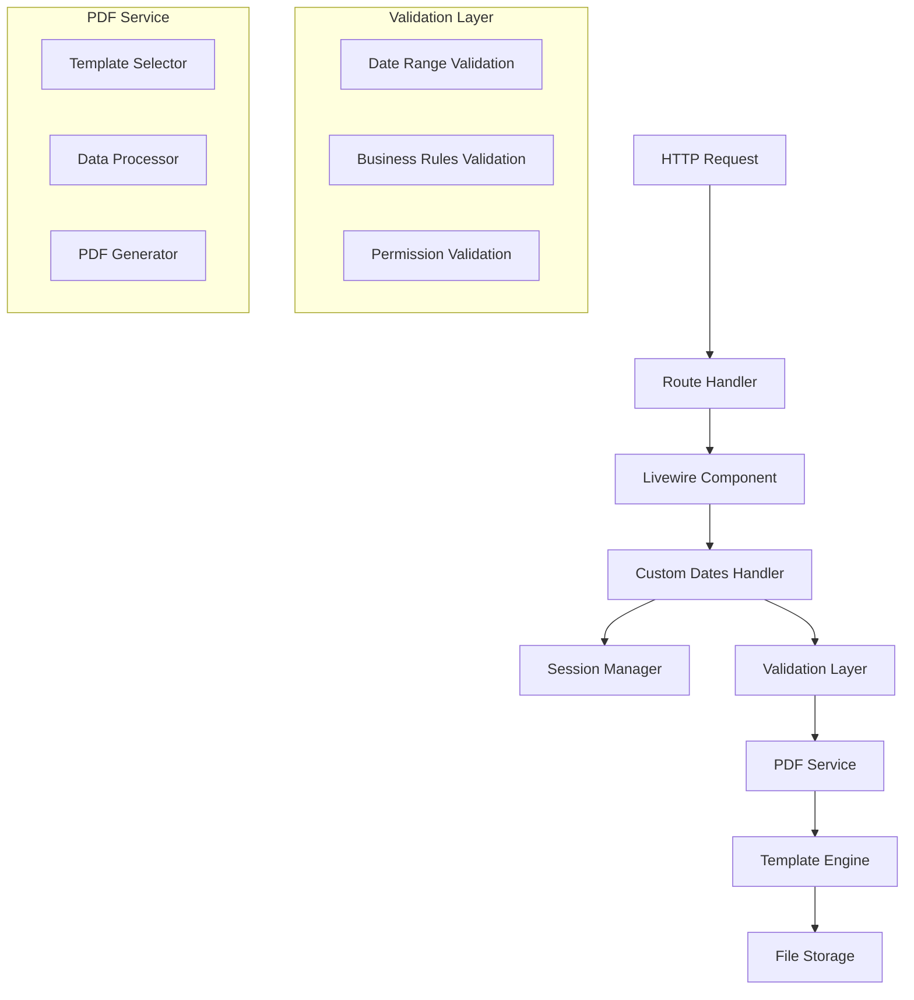
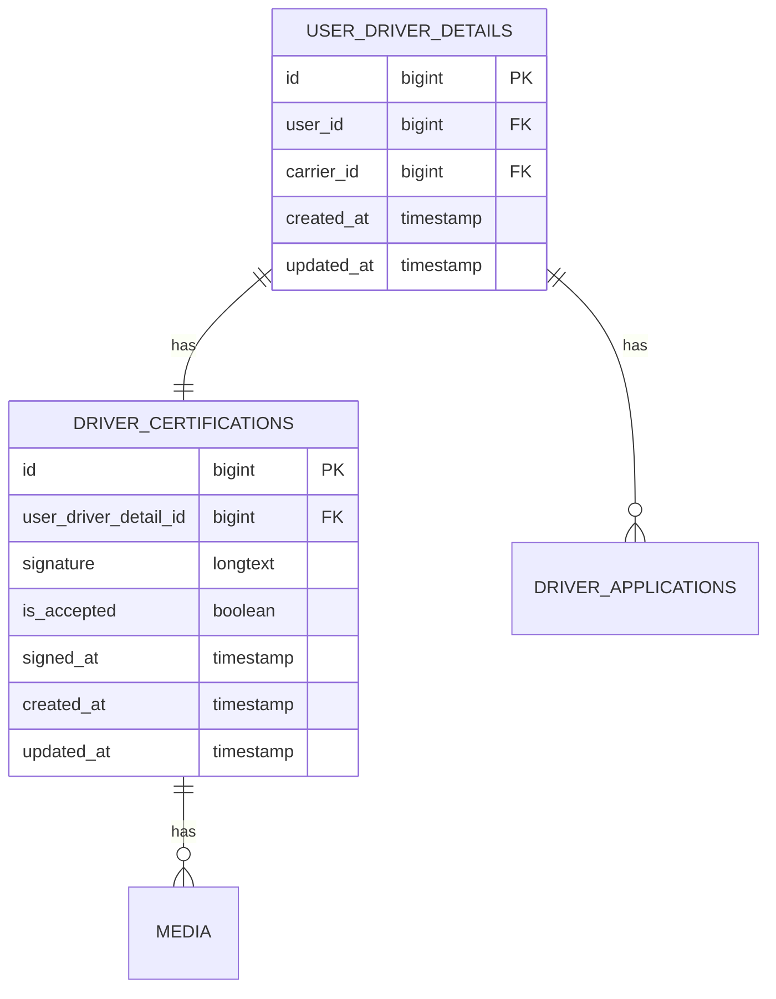

# Arquitectura Técnica - Fechas Personalizadas en Documentos de Drivers

## 1. Diseño de Arquitectura



## 2. Descripción de Tecnologías

- **Frontend**: Livewire Components + Blade Templates
- **Backend**: Laravel 10+ con Livewire
- **Storage**: Session-based temporary storage
- **PDF Generation**: DomPDF con plantillas Blade
- **Validation**: Laravel Validation Rules

## 3. Definiciones de Rutas

| Ruta | Propósito |
|------|----------|
| `/admin/drivers/create` | Creación de drivers con fechas personalizadas |
| `/admin/drivers/{id}/edit` | Edición de drivers existentes |
| `/admin/drivers/{id}/regenerate-docs` | Regeneración de documentos con nuevas fechas |
| `/drivers/*` | Rutas externas sin modificaciones |

## 4. Definiciones de API (Componentes Livewire)

### 4.1 DriverGeneralInfoStep (Admin)

**Propiedades Públicas**
```php
public $use_custom_dates = false;
public $custom_registration_date = null;
public $custom_completion_date = null;
```

**Métodos Principales**
```php
public function updatedUseCustomDates($value)
public function validateCustomDates()
public function saveCustomDates()
```

**Eventos**
```php
// Emitir cuando se guardan fechas personalizadas
$this->dispatch('customDatesUpdated', [
    'driverId' => $this->driverId,
    'dates' => $this->getCustomDatesArray()
]);
```

### 4.2 DriverCertificationStep (Admin)

**Métodos Nuevos**
```php
private function getDocumentDates($userDriverDetail): array
private function prepareCustomPdfData($userDriverDetail): array
private function shouldUseCustomDates($driverId): bool
```

**Estructura de Respuesta**
```php
[
    'created_at' => Carbon,
    'updated_at' => Carbon,
    'formatted_created_at' => 'dd/mm/yyyy',
    'formatted_updated_at' => 'dd/mm/yyyy'
]
```

## 5. Arquitectura del Servidor



## 6. Modelo de Datos

### 6.1 Estructura de Sesión

```php
// Clave de sesión: 'driver_custom_dates_{driver_id}'
[
    'use_custom_dates' => boolean,
    'registration_date' => 'Y-m-d',
    'completion_date' => 'Y-m-d|null',
    'created_by_admin' => true,
    'timestamp' => unix_timestamp
]
```

### 6.2 Estructura de Datos para PDFs

```php
[
    'userDriverDetail' => UserDriverDetail,
    'signaturePath' => string,
    'title' => string,
    'created_at' => 'dd/mm/yyyy',
    'updated_at' => 'dd/mm/yyyy',
    'creation_date' => 'dd/mm/yyyy',
    'last_update' => 'dd/mm/yyyy',
    'document_metadata' => [
        'generated_at' => Carbon::now(),
        'uses_custom_dates' => boolean,
        'admin_generated' => boolean
    ]
]
```

### 6.3 Modelo de Base de Datos (Sin Cambios)



## 7. Implementación de Componentes

### 7.1 Trait HandlesCustomDates

```php
<?php

trait HandlesCustomDates
{
    /**
     * Obtener fechas efectivas para documentos
     */
    protected function getEffectiveDates($driverId): array
    {
        // Solo en contexto admin
        if (!$this->isAdminContext()) {
            return $this->getModelDates($driverId);
        }
        
        $customDates = $this->getCustomDatesFromSession($driverId);
        
        if ($customDates && $customDates['use_custom_dates']) {
            return [
                'created_at' => Carbon::parse($customDates['registration_date']),
                'updated_at' => $customDates['completion_date'] 
                    ? Carbon::parse($customDates['completion_date'])
                    : Carbon::parse($customDates['registration_date']),
                'is_custom' => true
            ];
        }
        
        return $this->getModelDates($driverId);
    }
    
    /**
     * Verificar si estamos en contexto admin
     */
    protected function isAdminContext(): bool
    {
        return request()->is('admin/*') || 
               str_contains(request()->route()->getName() ?? '', 'admin.');
    }
    
    /**
     * Obtener fechas del modelo
     */
    protected function getModelDates($driverId): array
    {
        $driver = UserDriverDetail::find($driverId);
        
        return [
            'created_at' => $driver->created_at,
            'updated_at' => $driver->updated_at,
            'is_custom' => false
        ];
    }
    
    /**
     * Obtener fechas personalizadas de sesión
     */
    protected function getCustomDatesFromSession($driverId): ?array
    {
        return session('driver_custom_dates_' . $driverId);
    }
    
    /**
     * Guardar fechas personalizadas en sesión
     */
    protected function saveCustomDatesToSession($driverId, array $dates): void
    {
        session([
            'driver_custom_dates_' . $driverId => array_merge($dates, [
                'timestamp' => time(),
                'created_by_admin' => true
            ])
        ]);
    }
    
    /**
     * Limpiar fechas personalizadas de sesión
     */
    protected function clearCustomDatesFromSession($driverId): void
    {
        session()->forget('driver_custom_dates_' . $driverId);
    }
}
```

### 7.2 Servicio de Validación

```php
<?php

class CustomDateValidationService
{
    /**
     * Validar fechas personalizadas
     */
    public function validateCustomDates(array $dates): array
    {
        $rules = [
            'registration_date' => [
                'required',
                'date',
                'before_or_equal:today',
                'after:2020-01-01'
            ],
            'completion_date' => [
                'nullable',
                'date',
                'after_or_equal:registration_date',
                'before_or_equal:today'
            ]
        ];
        
        return Validator::make($dates, $rules)->validate();
    }
    
    /**
     * Validar lógica de negocio
     */
    public function validateBusinessRules(array $dates, $driverId): bool
    {
        // Verificar que las fechas no sean futuras
        if (Carbon::parse($dates['registration_date'])->isFuture()) {
            throw new ValidationException('La fecha de registro no puede ser futura');
        }
        
        // Verificar rango razonable (no más de 10 años atrás)
        if (Carbon::parse($dates['registration_date'])->diffInYears(now()) > 10) {
            throw new ValidationException('La fecha de registro es demasiado antigua');
        }
        
        return true;
    }
}
```

### 7.3 Servicio de Generación de PDFs

```php
<?php

class CustomDatePdfService
{
    use HandlesCustomDates;
    
    /**
     * Generar PDFs con fechas personalizadas
     */
    public function generatePdfsWithCustomDates($userDriverDetail, $signaturePath): void
    {
        $dates = $this->getEffectiveDates($userDriverDetail->id);
        
        $pdfData = $this->preparePdfData($userDriverDetail, $signaturePath, $dates);
        
        $this->generateAllPdfs($pdfData);
    }
    
    /**
     * Preparar datos para PDFs
     */
    protected function preparePdfData($userDriverDetail, $signaturePath, $dates): array
    {
        return [
            'userDriverDetail' => $userDriverDetail,
            'signaturePath' => $signaturePath,
            'created_at' => $dates['created_at']->format('d/m/Y'),
            'updated_at' => $dates['updated_at']->format('d/m/Y'),
            'creation_date' => $dates['created_at']->format('d/m/Y'),
            'last_update' => $dates['updated_at']->format('d/m/Y'),
            'document_metadata' => [
                'generated_at' => now()->format('d/m/Y H:i:s'),
                'uses_custom_dates' => $dates['is_custom'],
                'admin_generated' => $this->isAdminContext()
            ]
        ];
    }
}
```

## 8. Consideraciones de Seguridad

### 8.1 Validación de Permisos
```php
// Verificar que solo admins puedan usar fechas personalizadas
if ($this->use_custom_dates && !auth()->user()->hasRole('admin')) {
    throw new UnauthorizedException('Solo administradores pueden usar fechas personalizadas');
}
```

### 8.2 Sanitización de Datos
```php
// Limpiar y validar fechas antes de guardar
$this->custom_registration_date = Carbon::parse($this->custom_registration_date)->format('Y-m-d');
```

### 8.3 Auditoría
```php
// Log de uso de fechas personalizadas
Log::info('Custom dates used for driver', [
    'driver_id' => $this->driverId,
    'admin_id' => auth()->id(),
    'custom_dates' => $this->getCustomDatesArray()
]);
```

## 9. Pruebas y Validación

### 9.1 Casos de Prueba
- ✅ Driver nuevo con fechas personalizadas
- ✅ Driver nuevo sin fechas personalizadas
- ✅ Driver existente editado con fechas personalizadas
- ✅ Regeneración de documentos
- ✅ Validación de fechas inválidas
- ✅ Permisos de admin
- ✅ Compatibilidad con drivers externos

### 9.2 Pruebas de Regresión
- ✅ Funcionalidad existente no afectada
- ✅ Steps externos funcionan normalmente
- ✅ PDFs generados correctamente
- ✅ Sesiones manejadas apropiadamente

## 10. Deployment y Mantenimiento

### 10.1 Archivos a Desplegar
```
app/Traits/HandlesCustomDates.php
app/Services/CustomDateValidationService.php
app/Services/CustomDatePdfService.php
app/Livewire/Admin/Driver/DriverGeneralInfoStep.php (modificado)
app/Livewire/Admin/Driver/DriverCertificationStep.php (modificado)
resources/views/livewire/admin/driver/steps/driver-general-info-step.blade.php (modificado)
resources/views/pdf/driver/*.blade.php (modificados)
```

### 10.2 Configuración
```php
// config/app.php - Agregar configuraciones si es necesario
'custom_dates' => [
    'max_years_back' => 10,
    'min_date' => '2020-01-01',
    'admin_only' => true
]
```

Esta arquitectura garantiza una implementación limpia, mantenible y compatible con el sistema existente, permitiendo fechas personalizadas solo donde es necesario sin afectar la funcionalidad externa.