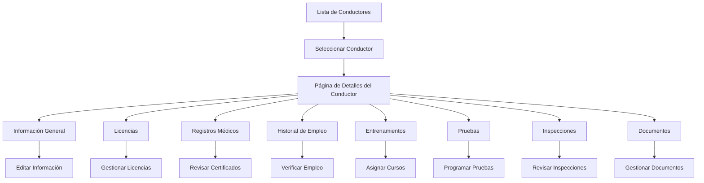

# Rediseño de Página de Detalles del Conductor - Documento de Requerimientos del Producto

## 1. Resumen del Producto
Rediseño completo de la página de detalles del conductor en el panel administrativo de EF Services, transformando la interfaz actual en una experiencia moderna, profesional y altamente funcional que mejore la gestión y visualización de información de conductores.

- **Objetivo Principal:** Crear una interfaz moderna y eficiente para la gestión integral de información de conductores
- **Usuarios Objetivo:** Administradores del sistema, supervisores de flota y personal de recursos humanos
- **Valor del Producto:** Mejorar la productividad del personal administrativo mediante una interfaz intuitiva y funcional

## 2. Características Principales

### 2.1 Roles de Usuario
| Rol | Método de Acceso | Permisos Principales |
|-----|------------------|---------------------|
| Super Admin | Acceso completo al sistema | Puede ver, editar y gestionar todos los conductores y sus datos |
| Fleet Manager | Asignado por Super Admin | Puede ver y editar conductores de su flota asignada |
| HR Specialist | Acceso específico a RRHH | Puede gestionar documentos, certificaciones y registros de empleo |

### 2.2 Módulos de Funcionalidad
Nuestros requerimientos de rediseño consisten en las siguientes páginas principales:

1. **Página Principal de Detalles**: header profesional, tarjeta de perfil del conductor, navegación por pestañas mejorada
2. **Pestaña de Información General**: datos personales, estadísticas clave, información de contacto
3. **Pestaña de Licencias**: gestión de licencias CDL, certificaciones, fechas de vencimiento
4. **Pestaña de Registros Médicos**: certificados médicos, exámenes físicos, restricciones
5. **Pestaña de Historial de Empleo**: empleos anteriores, verificaciones, referencias
6. **Pestaña de Entrenamientos**: cursos completados, certificaciones, progreso de formación
7. **Pestaña de Pruebas**: resultados de pruebas de drogas/alcohol, programación de exámenes
8. **Pestaña de Inspecciones**: historial de inspecciones vehiculares, reportes de seguridad
9. **Pestaña de Documentos**: repositorio centralizado de todos los documentos del conductor

### 2.3 Detalles de Páginas

| Nombre de Página | Nombre del Módulo | Descripción de Funcionalidad |
|------------------|-------------------|------------------------------|
| Página Principal | Header de Navegación | Breadcrumbs dinámicos, botones de acción rápida (Editar, Descargar, Contactar), indicador de estado del conductor |
| Página Principal | Tarjeta de Perfil | Mostrar foto del conductor, información básica, estado de actividad, porcentaje de completitud del perfil, estadísticas clave |
| Página Principal | Navegación por Pestañas | Sistema de pestañas responsive, indicadores de contenido, contadores de elementos por pestaña |
| Información General | Datos Personales | Visualizar y editar información personal, contacto, dirección, información de emergencia |
| Información General | Grid de Estadísticas | Mostrar métricas clave: años de experiencia, millas conducidas, calificación de seguridad, vehículos asignados |
| Licencias | Gestión de Licencias | Listar licencias CDL, fechas de vencimiento, alertas de renovación, subir documentos de licencias |
| Registros Médicos | Certificados Médicos | Gestionar certificados DOT, exámenes físicos, restricciones médicas, alertas de vencimiento |
| Historial de Empleo | Empleos Anteriores | Timeline de empleos, verificaciones de empleo, referencias de empleadores, gaps de empleo |
| Entrenamientos | Cursos y Certificaciones | Listar cursos completados, certificaciones activas, progreso de entrenamientos, asignar nuevos cursos |
| Pruebas | Registros de Pruebas | Historial de pruebas de drogas/alcohol, resultados, programar nuevas pruebas, alertas de cumplimiento |
| Inspecciones | Historial de Inspecciones | Registros de inspecciones pre-viaje, reportes de seguridad, defectos encontrados, acciones correctivas |
| Documentos | Repositorio de Documentos | Categorizar documentos por tipo, vista previa rápida, descarga masiva, estado de aprobación |

## 3. Proceso Principal

### Flujo de Usuario Administrador:
El administrador accede a la lista de conductores, selecciona un conductor específico, navega por las diferentes pestañas para revisar información, realiza ediciones necesarias, gestiona documentos y genera reportes.

### Flujo de Usuario Fleet Manager:
El manager de flota accede a conductores de su flota asignada, revisa el estado de cumplimiento, programa entrenamientos o pruebas, y monitorea el rendimiento de seguridad.

## 4. Diseño de Interfaz de Usuario

### 4.1 Estilo de Diseño
- **Colores Primarios:** #3B82F6 (azul principal), #1E40AF (azul oscuro)
- **Colores Secundarios:** #F8FAFC (fondo claro), #64748B (texto secundario)
- **Estilo de Botones:** Redondeados con sombras sutiles, estados hover y focus definidos
- **Tipografía:** Inter font, tamaños 14px (texto base), 16px (títulos), 12px (metadatos)
- **Estilo de Layout:** Diseño basado en cards con espaciado consistente, grid responsive
- **Iconos:** Lucide icons con estilo outline, tamaño 16px-20px

### 4.2 Resumen de Diseño de Páginas

| Nombre de Página | Nombre del Módulo | Elementos de UI |
|------------------|-------------------|-----------------|
| Página Principal | Header de Navegación | Breadcrumbs con iconos, botones de acción con colores diferenciados, indicador de estado con badges |
| Página Principal | Tarjeta de Perfil | Card elevada con sombra, foto circular con border, grid de información, progress bar para completitud |
| Página Principal | Navegación por Pestañas | Tabs horizontales con indicadores activos, responsive collapse en móvil, contadores de elementos |
| Información General | Grid de Estadísticas | Cards con iconos coloridos, números grandes, descripciones claras, animaciones sutiles |
| Licencias | Lista de Licencias | Table responsive, badges de estado, botones de acción, modal para detalles |
| Documentos | Grid de Documentos | Cards con preview de documentos, categorización por colores, drag & drop para subir |

### 4.3 Responsividad
El producto está diseñado con enfoque mobile-first, adaptándose perfectamente a dispositivos móviles, tablets y desktop. Incluye optimización para interacciones táctiles y navegación simplificada en pantallas pequeñas.