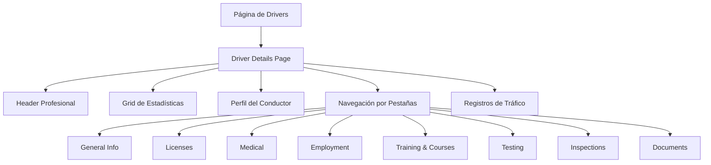

# Rediseño Profesional - Página de Detalles del Conductor

## 1. Resumen del Proyecto

Rediseño completo de la página de detalles del conductor (`admin/drivers/{id}`) para transformarla en una interfaz moderna, profesional y basada en componentes reutilizables. El objetivo es mejorar significativamente la experiencia de usuario manteniendo toda la funcionalidad existente.

- **Problema a resolver**: La vista actual tiene 2668 líneas de código monolítico con diseño básico y poca reutilización de componentes.
- **Usuarios objetivo**: Administradores del sistema que gestionan información detallada de conductores.
- **Valor del proyecto**: Interfaz más eficiente, mantenible y profesional que mejore la productividad del equipo administrativo.

## 2. Funcionalidades Principales

### 2.1 Roles de Usuario
| Rol | Método de Acceso | Permisos Principales |
|-----|------------------|---------------------|
| Administrador | Autenticación admin | Acceso completo a todos los detalles del conductor, edición y descarga de documentos |

### 2.2 Módulos de Funcionalidad

Nuestra página de detalles del conductor rediseñada consistirá en los siguientes módulos principales:

1. **Header Profesional**: Navegación mejorada, información del conductor y botones de acción principales.
2. **Grid de Estadísticas**: Panel de métricas clave del conductor con visualización moderna.
3. **Perfil del Conductor**: Información básica con foto, estado y progreso de completitud.
4. **Navegación por Pestañas**: Sistema moderno de pestañas para organizar la información.
5. **Secciones de Contenido**: Información General, Licencias, Médico, Empleo, Entrenamiento, Testing, Inspecciones, Documentos.
6. **Sección de Registros**: Convicciones de tráfico y accidentes con diseño mejorado.

### 2.3 Detalles de Páginas

| Nombre de Página | Nombre del Módulo | Descripción de Funcionalidad |
|------------------|-------------------|------------------------------|
| Driver Details | Header Profesional | Mostrar breadcrumbs, título, botón de regreso y acciones principales (descargar documentos, regenerar formularios) |
| Driver Details | Grid de Estadísticas | Mostrar métricas clave: estado del conductor, porcentaje de completitud, fecha de ingreso, carrier asignado, número de documentos |
| Driver Details | Perfil del Conductor | Mostrar foto de perfil, nombre completo, email, estado activo/inactivo, fecha de ingreso, carrier, barra de progreso de completitud |
| Driver Details | Navegación por Pestañas | Implementar sistema de pestañas moderno con 8 secciones: General Info, Licenses, Medical, Employment, Training & Courses, Testing, Inspections, Documents |
| Driver Details | Información General | Mostrar información personal (nombre, email, teléfono, fecha de nacimiento), información del carrier, direcciones con diseño de tarjetas |
| Driver Details | Licencias | Mostrar tabla de licencias con estado, clase, tipo, expiración, imágenes. Incluir endorsements y experiencia de conducción |
| Driver Details | Información Médica | Mostrar calificación médica, examiner, fecha de expiración, tarjeta médica, registros médicos con indicadores de estado |
| Driver Details | Historial de Empleo | Sistema de sub-pestañas para compañías, períodos de desempleo, empleos relacionados, verificación de empleo |
| Driver Details | Entrenamiento y Cursos | Sub-pestañas para escuelas de conducción y cursos completados con certificados |
| Driver Details | Testing | Tabla de pruebas de drogas y alcohol con resultados, estado, administrador, documentos |
| Driver Details | Inspecciones | Tabla de inspecciones de vehículos con fecha, vehículo, tipo, inspector, estado, seguridad |
| Driver Details | Documentos | Sistema de pestañas categorizadas para diferentes tipos de documentos con descarga y visualización |
| Driver Details | Registros de Tráfico | Sección separada para convicciones de tráfico y accidentes con diseño de tarjetas |

## 3. Flujo Principal de Usuario

El administrador navega a la página de detalles del conductor donde puede:

1. **Visualizar información general**: Ver el header con información básica y estadísticas clave
2. **Explorar secciones**: Navegar entre las diferentes pestañas para revisar información específica
3. **Gestionar documentos**: Descargar documentos individuales o todos los documentos del conductor
4. **Revisar registros**: Consultar historial de tráfico, accidentes e inspecciones
5. **Verificar estado**: Monitorear el progreso de completitud y estado de documentos

## 4. Diseño de Interfaz de Usuario

### 4.1 Estilo de Diseño

- **Colores primarios**: Azul (#2563eb), Verde (#10b981), Rojo (#ef4444)
- **Colores secundarios**: Gris slate (#64748b), Amarillo (#f59e0b)
- **Estilo de botones**: Redondeados con sombras sutiles, estados hover y focus
- **Tipografía**: Sistema de fuentes moderno, tamaños jerárquicos (text-xs a text-2xl)
- **Estilo de layout**: Basado en tarjetas (cards) con bordes redondeados y sombras
- **Iconos**: Lucide icons para consistencia visual

### 4.2 Resumen de Diseño de Páginas

| Nombre de Página | Nombre del Módulo | Elementos de UI |
|------------------|-------------------|-----------------|
| Driver Details | Header Profesional | Breadcrumbs con iconos, título h2, botón de regreso con icono de flecha, botones de acción primarios con iconos |
| Driver Details | Grid de Estadísticas | Grid responsive 2x3, tarjetas con iconos, métricas numéricas destacadas, indicadores de estado con colores |
| Driver Details | Perfil del Conductor | Imagen circular con borde, layout flex responsive, badges de estado, barra de progreso animada |
| Driver Details | Navegación por Pestañas | Pestañas horizontales con scroll, indicador activo azul, transiciones suaves, iconos opcionales |
| Driver Details | Tarjetas de Información | Bordes redondeados, padding consistente, títulos con separadores, grid responsive para contenido |
| Driver Details | Tablas de Datos | Headers con fondo gris claro, filas alternadas, badges de estado, botones de acción compactos |
| Driver Details | Sistema de Documentos | Pestañas categorizadas, iconos de archivo, enlaces con hover, indicadores de tamaño |

### 4.3 Responsividad

El diseño será mobile-first con breakpoints específicos:
- **Mobile (sm)**: Layout de columna única, pestañas con scroll horizontal
- **Tablet (md)**: Grid 2 columnas, pestañas completas visibles
- **Desktop (lg+)**: Layout completo con sidebar opcional, máximo aprovechamiento del espacio