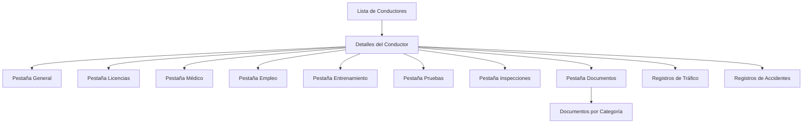

# Documento de Requerimientos - Rediseño de Detalles del Conductor

## 1. Resumen del Producto

Rediseño completo de la página de detalles del conductor (`admin/drivers/{id}`) para transformar la vista actual en una interfaz moderna, profesional y basada en componentes reutilizables. El objetivo es mejorar significativamente la experiencia del usuario manteniendo toda la funcionalidad existente y estableciendo un estándar de diseño consistente para el sistema de gestión de conductores.

## 2. Características Principales

### 2.1 Roles de Usuario

| Rol             | Método de Acceso                  | Permisos Principales                                                             |
| --------------- | --------------------------------- | -------------------------------------------------------------------------------- |
| Administrador   | Login con credenciales admin      | Acceso completo a todos los datos del conductor, edición, descarga de documentos |
| Supervisor      | Login con credenciales supervisor | Visualización de datos, descarga limitada de documentos                          |
| Usuario Carrier | Login con credenciales carrier    | Acceso solo a conductores de su empresa                                          |

### 2.2 Módulos de Funcionalidad

Nuestros requerimientos de rediseño consisten en las siguientes páginas principales:

1. **Página de Detalles del Conductor**: header profesional, perfil del conductor, grid de estadísticas, navegación por pestañas mejorada
2. **Sistema de Pestañas**: información general, licencias, médico, empleo, entrenamiento, pruebas, inspecciones, documentos
3. **Gestión de Documentos**: visualización categorizada, descarga individual y masiva, estados de verificación

### 2.3 Detalles de Páginas

| Nombre de Página       | Nombre del Módulo         | Descripción de Funcionalidad                                                                                                 |
| ---------------------- | ------------------------- | ---------------------------------------------------------------------------------------------------------------------------- |
| Detalles del Conductor | Header Profesional        | Mostrar breadcrumbs, título de página, botón de regreso, acciones principales (descargar documentos, regenerar formularios)  |
| Detalles del Conductor | Perfil del Conductor      | Mostrar foto de perfil, información básica (nombre, email, teléfono), estado actual, progreso de completitud del perfil      |
| Detalles del Conductor | Grid de Estadísticas      | Mostrar métricas clave: años de experiencia, número de licencias, estado médico, documentos pendientes, última actualización |
| Detalles del Conductor | Navegación por Pestañas   | Implementar sistema de pestañas moderno y responsive con indicadores visuales del contenido                                  |
| Pestaña General        | Información Personal      | Mostrar datos personales, información del carrier, dirección, con diseño de tarjetas profesionales                           |
| Pestaña Licencias      | Licencias de Conducir     | Mostrar licencias activas, endorsements, experiencia de conducción en formato de tarjetas                                    |
| Pestaña Médico         | Calificación Médica       | Mostrar estado médico, certificados, registros médicos con indicadores de estado                                             |
| Pestaña Empleo         | Historial Laboral         | Mostrar empresas anteriores, períodos de desempleo, empleo relacionado, verificaciones                                       |
| Pestaña Entrenamiento  | Escuelas y Cursos         | Mostrar instituciones educativas, cursos completados, certificados obtenidos                                                 |
| Pestaña Pruebas        | Testing de Drogas/Alcohol | Mostrar resultados de pruebas con tabla profesional y estados visuales                                                       |
| Pestaña Inspecciones   | Inspecciones de Vehículos | Mostrar registros de inspecciones con detalles y estados                                                                     |
| Pestaña Documentos     | Gestión de Documentos     | Mostrar documentos categorizados, opciones de descarga, estados de verificación                                              |
| Sección Registros      | Convicciones de Tráfico   | Mostrar violaciones de tráfico en tabla profesional con filtros                                                              |
| Sección Registros      | Accidentes                | Mostrar historial de accidentes con detalles y clasificación                                                                 |

## 3. Proceso Principal

### 3.1 Flujo del Administrador

El administrador accede a la lista de conductores, selecciona un conductor específico, y navega a la página de detalles donde puede:

* Visualizar toda la información del conductor en un diseño profesional

* Navegar entre diferentes secciones usando pestañas modernas

* Descargar documentos individuales o en lote

* Regenerar formularios de aplicación

* Verificar el estado de completitud del perfil

* Acceder a registros históricos de tráfico y accidentes

### 3.2 Flujo de Navegación

## 4. Diseño de Interfaz de Usuario

### 4.1 Estilo de Diseño

**Colores Principales:**

* Primario: `#3B82F6` (Blue-500) - Para elementos principales y botones de acción

* Secundario: `#6B7280` (Gray-500) - Para texto secundario y elementos de apoyo

* Éxito: `#10B981` (Emerald-500) - Para estados positivos y confirmaciones

* Advertencia: `#F59E0B` (Amber-500) - Para alertas y elementos que requieren atención

* Error: `#EF4444` (Red-500) - Para errores y estados críticos

* Fondo: `#F9FAFB` (Gray-50) - Para el fondo principal de la aplicación

**Estilo de Botones:**

* Botones primarios: Redondeados (`rounded-lg`), con sombra sutil

* Botones secundarios: Borde sólido, fondo transparente

* Botones de acción: Con iconos de Lucide, espaciado consistente

**Tipografía:**

* Fuente principal: Inter (sistema por defecto)

* Títulos: `text-2xl font-bold` para headers principales

* Subtítulos: `text-lg font-semibold` para secciones

* Texto normal: `text-sm` para contenido general

* Texto pequeño: `text-xs text-gray-500` para metadatos

**Estilo de Layout:**

* Diseño basado en tarjetas con sombras sutiles (`shadow-sm`)

* Espaciado consistente usando sistema de Tailwind (`space-y-4`, `gap-6`)

* Grid responsive para estadísticas y documentos

* Navegación por pestañas horizontal con indicadores visuales

**Iconos y Elementos Visuales:**

* Iconos de Lucide React para consistencia

* Badges de estado con colores semánticos

* Barras de progreso para completitud del perfil

* Indicadores visuales para estados de documentos

### 4.2 Resumen de Diseño de Páginas

| Nombre de Página       | Nombre del Módulo       | Elementos de UI                                                                                  |
| ---------------------- | ----------------------- | ------------------------------------------------------------------------------------------------ |
| Detalles del Conductor | Header Profesional      | Breadcrumbs con iconos, título grande, botón de regreso estilizado, botones de acción con iconos |
| Detalles del Conductor | Perfil del Conductor    | Tarjeta con foto circular, información en grid, badges de estado, barra de progreso              |
| Detalles del Conductor | Grid de Estadísticas    | Tarjetas con iconos, números grandes, texto descriptivo, colores semánticos                      |
| Detalles del Conductor | Navegación por Pestañas | Pestañas horizontales, indicador activo, responsive, iconos opcionales                           |
| Pestañas de Contenido  | Tarjetas de Información | Layout en grid, headers con iconos, contenido estructurado, espaciado consistente                |
| Gestión de Documentos  | Grid de Documentos      | Tarjetas de documentos, iconos de tipo de archivo, botones de descarga, badges de estado         |
| Tablas de Datos        | Tablas Profesionales    | Headers estilizados, filas alternadas, acciones inline, estados vacíos                           |

### 4.3 Responsividad

**Diseño Desktop-First con Adaptación Móvil:**

* Breakpoints principales: `sm:`, `md:`, `lg:`, `xl:`

* Grid de estadísticas: 4 columnas en desktop, 2 en tablet, 1 en móvil

* Navegación por pestañas: Horizontal en desktop, scroll horizontal en móvil

* Tarjetas de información: Stack vertical en móvil, grid en desktop

* Optimización táctil: Botones y enlaces con área de toque adecuada (min 44px)

**Consideraciones Móviles:**

* Menú de pestañas con scroll horizontal

* Botones de acción agrupados en menú desplegable

* Tarjetas de información con padding optimizado

* Texto y elementos redimensionados apropiadamente

