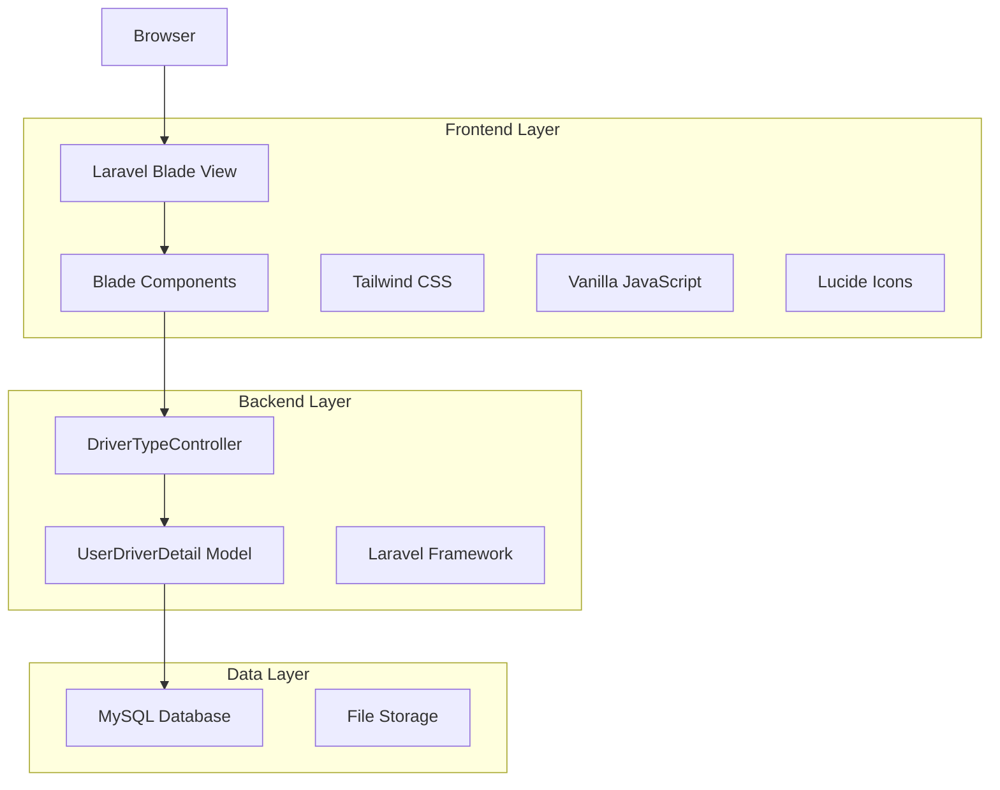
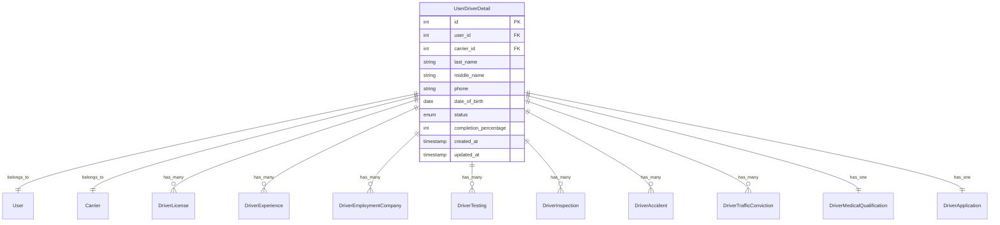

# Arquitectura Técnica - Rediseño de Detalles del Conductor

## 1. Diseño de Arquitectura



## 2. Descripción de Tecnologías

- **Frontend**: Laravel Blade Components + Tailwind CSS 3 + Vanilla JavaScript
- **Backend**: Laravel Framework (existente)
- **Base de datos**: MySQL (existente)
- **Almacenamiento**: Laravel Storage (documentos y archivos multimedia)

## 3. Definiciones de Rutas

| Ruta | Propósito |
|------|-----------|
| /admin/drivers/{driver}/show | Página principal de detalles del conductor |
| /admin/drivers/{driver}/documents/download | Descarga de todos los documentos del conductor |
| /admin/drivers/{driver}/regenerate-application-forms | Regeneración de formularios de aplicación |

## 4. Componentes Blade a Crear

### 4.1 Componentes Principales

**DriverProfileHeader**
```php
// resources/views/components/driver/profile-header.blade.php
@props(['driver'])
```

Propósito: Header profesional con navegación, información básica y botones de acción
- Parámetros: `$driver` (UserDriverDetail model)
- Elementos: Breadcrumbs, título, botón de regreso, acciones principales

**DriverStatsGrid**
```php
// resources/views/components/driver/stats-grid.blade.php
@props(['driver', 'stats'])
```

Propósito: Grid de estadísticas clave del conductor
- Parámetros: `$driver`, `$stats` (array de métricas)
- Elementos: Tarjetas de métricas, iconos, valores numéricos, indicadores

**DriverProfileCard**
```php
// resources/views/components/driver/profile-card.blade.php
@props(['driver'])
```

Propósito: Tarjeta de perfil con foto, información básica y progreso
- Parámetros: `$driver`
- Elementos: Foto de perfil, nombre, email, estado, progreso de completitud

**DriverTabNavigation**
```php
// resources/views/components/driver/tab-navigation.blade.php
@props(['tabs', 'activeTab'])
```

Propósito: Sistema de navegación por pestañas moderno
- Parámetros: `$tabs` (array), `$activeTab` (string)
- Elementos: Pestañas horizontales, indicadores activos, responsive

**DriverInfoCard**
```php
// resources/views/components/driver/info-card.blade.php
@props(['title', 'icon', 'class'])
```

Propósito: Tarjeta reutilizable para mostrar información
- Parámetros: `$title`, `$icon`, `$class`
- Elementos: Header con icono, contenido flexible, estilos consistentes

**DriverDataTable**
```php
// resources/views/components/driver/data-table.blade.php
@props(['headers', 'data', 'emptyMessage'])
```

Propósito: Tabla de datos reutilizable con estilos consistentes
- Parámetros: `$headers`, `$data`, `$emptyMessage`
- Elementos: Headers estilizados, filas de datos, estados vacíos

**DriverDocumentGrid**
```php
// resources/views/components/driver/document-grid.blade.php
@props(['documents', 'category'])
```

Propósito: Grid para mostrar documentos categorizados
- Parámetros: `$documents`, `$category`
- Elementos: Iconos de archivo, enlaces de descarga, información de tamaño

**DriverRecordsSection**
```php
// resources/views/components/driver/records-section.blade.php
@props(['trafficConvictions', 'accidents'])
```

Propósito: Sección para mostrar registros de tráfico y accidentes
- Parámetros: `$trafficConvictions`, `$accidents`
- Elementos: Tarjetas de registros, iconos de estado, tablas de datos

### 4.2 Componentes de Utilidad

**StatusBadge**
```php
// resources/views/components/ui/status-badge.blade.php
@props(['status', 'type'])
```

**ProgressBar**
```php
// resources/views/components/ui/progress-bar.blade.php
@props(['percentage', 'color'])
```

**ActionButton**
```php
// resources/views/components/ui/action-button.blade.php
@props(['href', 'icon', 'variant'])
```

## 5. Estructura de Archivos

```
resources/views/
├── components/
│   ├── driver/
│   │   ├── profile-header.blade.php
│   │   ├── stats-grid.blade.php
│   │   ├── profile-card.blade.php
│   │   ├── tab-navigation.blade.php
│   │   ├── info-card.blade.php
│   │   ├── data-table.blade.php
│   │   ├── document-grid.blade.php
│   │   └── records-section.blade.php
│   └── ui/
│       ├── status-badge.blade.php
│       ├── progress-bar.blade.php
│       └── action-button.blade.php
├── admin/
│   └── drivers/
│       └── list-driver/
│           └── driver-show.blade.php (rediseñado)
└── layouts/
    └── driver-tabs/
        ├── general.blade.php
        ├── licenses.blade.php
        ├── medical.blade.php
        ├── employment.blade.php
        ├── training.blade.php
        ├── testing.blade.php
        ├── inspections.blade.php
        └── documents.blade.php
```

## 6. Modelo de Datos (Existente)

### 6.1 Modelo Principal



### 6.2 Relaciones Clave

- **User**: Información básica del usuario (nombre, email)
- **Carrier**: Empresa transportista asignada
- **DriverLicense**: Licencias de conducir con endorsements
- **DriverMedicalQualification**: Calificación médica y certificados
- **DriverEmploymentCompany**: Historial laboral
- **DriverTesting**: Pruebas de drogas y alcohol
- **DriverInspection**: Inspecciones de vehículos
- **Media Collections**: Documentos y archivos multimedia

## 7. JavaScript y Interactividad

### 7.1 Funcionalidades JavaScript

```javascript
// resources/js/driver-details.js

class DriverDetailsManager {
    constructor() {
        this.initTabs();
        this.initDocumentTabs();
        this.initEmploymentTabs();
        this.initTrainingTabs();
    }

    initTabs() {
        // Manejo de pestañas principales
    }

    initDocumentTabs() {
        // Manejo de pestañas de documentos categorizados
    }

    initEmploymentTabs() {
        // Manejo de sub-pestañas de empleo
    }

    initTrainingTabs() {
        // Manejo de sub-pestañas de entrenamiento
    }
}
```

### 7.2 Características de Interactividad

- **Navegación por pestañas**: Sin dependencias externas, vanilla JavaScript
- **Estados de carga**: Indicadores visuales para operaciones asíncronas
- **Responsive design**: Adaptación automática a diferentes tamaños de pantalla
- **Tooltips**: Información adicional en hover usando Tippy.js (existente)
- **Modales**: Para visualización de documentos e imágenes

## 8. Optimización y Rendimiento

### 8.1 Estrategias de Optimización

- **Lazy loading**: Carga diferida de pestañas no activas
- **Componentes reutilizables**: Reducción de duplicación de código
- **CSS optimizado**: Uso eficiente de Tailwind CSS con purging
- **JavaScript modular**: Carga condicional de funcionalidades

### 8.2 Consideraciones de Rendimiento

- **Eager loading**: Cargar relaciones necesarias en el controlador
- **Caching**: Cache de datos estáticos del conductor
- **Paginación**: Para listas grandes de documentos o registros
- **Compresión**: Optimización de imágenes y documentos