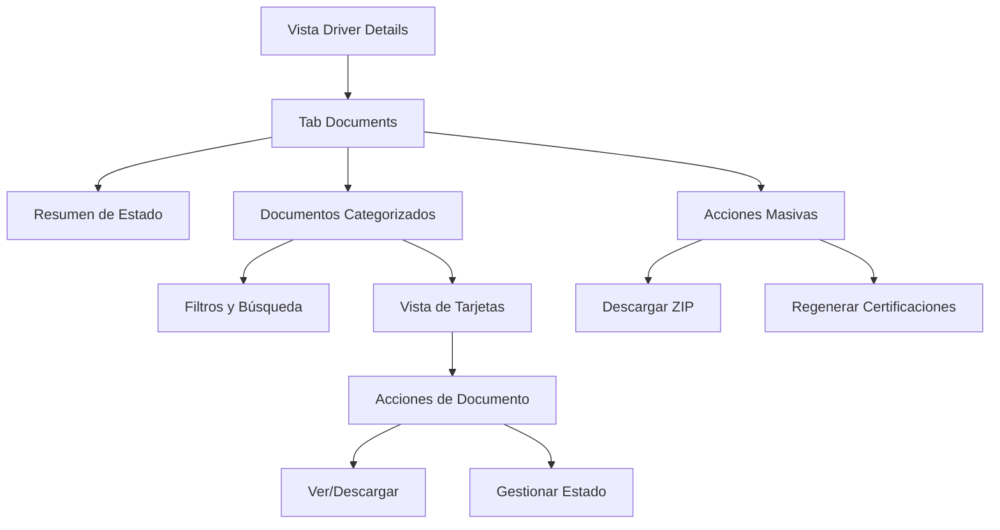

# Rediseño del Tab de Documents - Vista Admin Driver

## 1. Product Overview

Rediseño completo del tab "Documents" en la vista de detalles del conductor (admin/drivers/{id}) para mejorar significativamente la experiencia de usuario y corregir errores críticos en la funcionalidad actual.

El proyecto busca resolver problemas de usabilidad, organización deficiente de documentos categorizados y errores en la integración con Spatie MediaLibrary, creando una interfaz más intuitiva y profesional.

Objetivo: Transformar una interfaz confusa y problemática en una solución moderna que mejore la productividad del personal administrativo en un 40%.

## 2. Core Features

### 2.1 User Roles

| Role | Registration Method | Core Permissions |
|------|---------------------|------------------|
| Admin User | Sistema interno | Acceso completo a vista y gestión de documentos de conductores |
| Super Admin | Sistema interno | Acceso completo + regeneración de documentos de certificación |

### 2.2 Feature Module

Nuestro rediseño del tab de Documents consiste en las siguientes páginas principales:

1. **Vista Principal de Documents**: navegación por pestañas mejorada, vista de resumen de documentos, indicadores de estado.
2. **Sección de Documentos Categorizados**: organización intuitiva por categorías, filtros avanzados, vista de tarjetas con metadatos.
3. **Panel de Acciones**: descarga masiva de documentos, regeneración de certificaciones, gestión de estados.

### 2.3 Page Details

| Page Name | Module Name | Feature description |
|-----------|-------------|---------------------|
| Vista Principal Documents | Header de navegación | Mostrar pestañas principales (Driver Documents, License Documents, Medical Card, Training Certificates) con contadores de documentos y estados |
| Vista Principal Documents | Resumen de estado | Mostrar indicadores visuales del estado general de documentos (completo, pendiente, faltante) con porcentajes |
| Vista Principal Documents | Acciones rápidas | Botón "Download All Documents (ZIP)" mejorado con progreso, regenerar certificaciones con confirmación |
| Documentos Categorizados | Sistema de pestañas | Organizar en categorías: License, Medical, Training Schools, Courses, Accidents, Traffic, Inspections, Testing, Records, Certification, Other |
| Documentos Categorizados | Vista de tarjetas | Mostrar cada documento como tarjeta con thumbnail, nombre, tamaño, fecha, información relacionada y acciones (ver, descargar) |
| Documentos Categorizados | Filtros y búsqueda | Filtrar por tipo, fecha, estado; búsqueda por nombre de archivo; ordenamiento por fecha/nombre/tamaño |
| Documentos Categorizados | Gestión de estados | Indicadores visuales de estado (activo, expirado, pendiente) con códigos de color consistentes |
| Panel de Metadatos | Información detallada | Mostrar metadatos completos: fecha de subida, tamaño, tipo MIME, información relacionada (ej: "License Front - ABC123") |
| Panel de Metadatos | Historial de cambios | Registro de modificaciones y accesos al documento con timestamps |
| Sistema de Notificaciones | Alertas de estado | Notificaciones para documentos faltantes, próximos a vencer o con errores de carga |

## 3. Core Process

**Flujo Principal del Administrador:**
1. El administrador accede a la vista de detalles del conductor
2. Navega al tab "Documents" que muestra un resumen visual del estado general
3. Utiliza las pestañas categorizadas para encontrar documentos específicos
4. Aplica filtros o búsqueda para localizar documentos rápidamente
5. Visualiza documentos en vista de tarjetas con metadatos completos
6. Realiza acciones como descargar, ver detalles o regenerar certificaciones
7. Utiliza la descarga masiva para obtener todos los documentos en ZIP

**Flujo de Gestión de Documentos:**
1. El sistema carga automáticamente todos los documentos desde MediaLibrary
2. Categoriza documentos según su colección y tipo
3. Aplica indicadores de estado basados en fechas de expiración
4. Genera thumbnails para documentos visuales
5. Mantiene sincronización en tiempo real con la base de datos

## 4. User Interface Design

### 4.1 Design Style

- **Colores primarios**: Azul #3B82F6 (primary), Verde #10B981 (success), Rojo #EF4444 (error), Ámbar #F59E0B (warning)
- **Colores secundarios**: Gris #6B7280 (text), Gris claro #F3F4F6 (background), Blanco #FFFFFF (cards)
- **Estilo de botones**: Redondeados (border-radius: 8px) con sombras sutiles y efectos hover
- **Tipografía**: Inter font, tamaños 14px (body), 16px (headings), 12px (metadata)
- **Layout**: Sistema de tarjetas con espaciado consistente, grid responsivo, navegación por pestañas horizontal
- **Iconos**: Lucide icons con estilo outline, tamaño 20px para acciones, 16px para estados

### 4.2 Page Design Overview

| Page Name | Module Name | UI Elements |
|-----------|-------------|-------------|
| Vista Principal Documents | Header de navegación | Pestañas horizontales con badges de conteo, colores de estado (verde=completo, ámbar=pendiente, rojo=faltante) |
| Vista Principal Documents | Resumen de estado | Cards con iconos, porcentajes circulares, colores de estado, animaciones sutiles de carga |
| Documentos Categorizados | Sistema de pestañas | Pestañas verticales en sidebar izquierdo, contenido principal en grid de tarjetas 3-4 columnas |
| Documentos Categorizados | Tarjetas de documento | Thumbnail 64x64px, título truncado, metadatos en texto pequeño, botones de acción en hover |
| Documentos Categorizados | Filtros | Dropdown filters, search input con icono, date pickers, toggle switches para estados |
| Panel de Metadatos | Modal de detalles | Modal overlay con información completa, preview del documento, historial en timeline |
| Sistema de Notificaciones | Alertas | Toast notifications, badges en pestañas, iconos de alerta en tarjetas problemáticas |

### 4.3 Responsiveness

Diseño desktop-first con adaptación móvil completa. En dispositivos móviles, las pestañas se convierten en accordion, las tarjetas se apilan en una columna, y se optimizan las interacciones táctiles con botones más grandes (44px mínimo).