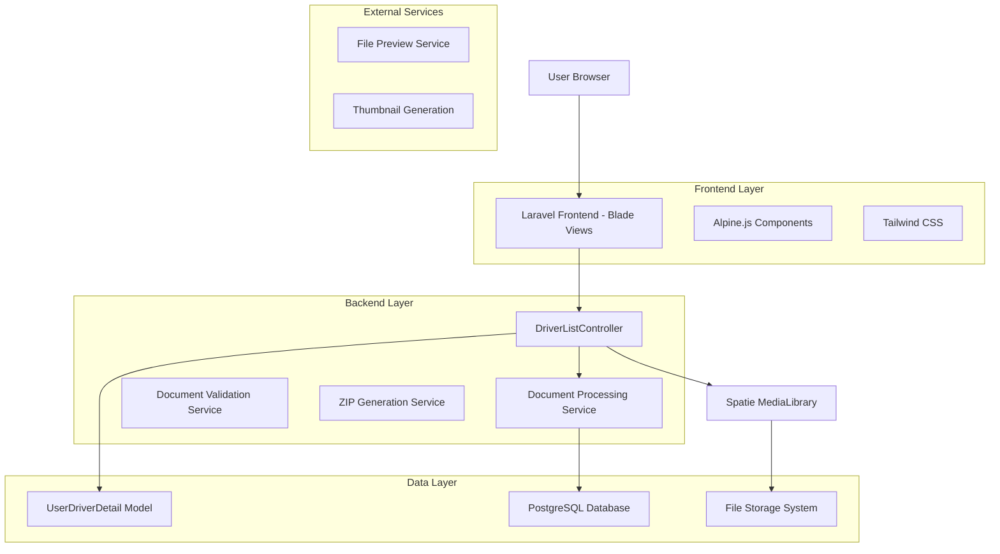
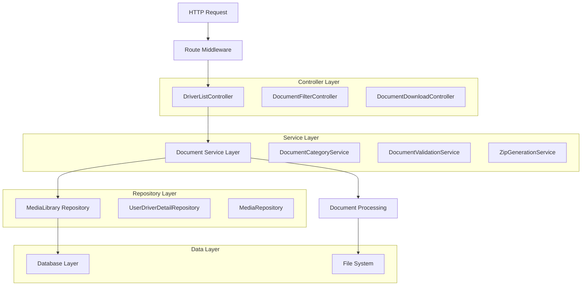
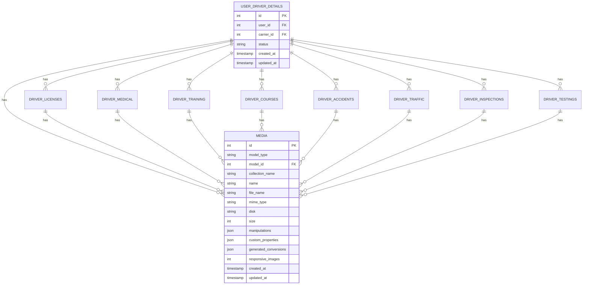

# Arquitectura Técnica - Rediseño Tab Documents Driver

## 1. Architecture design



## 2. Technology Description

* Frontend: Laravel Blade Templates + Alpine.js\@3 + Tailwind CSS\@3

* Backend: Laravel\@10 + Spatie MediaLibrary\@10

* Database: PostgreSQL (existing)

* File Storage: Laravel Storage (local/S3)

* Additional: Intervention Image for thumbnails, ZipArchive for bulk downloads

## 3. Route definitions

| Route                                         | Purpose                                                     |
| --------------------------------------------- | ----------------------------------------------------------- |
| /admin/drivers/{id}                           | Vista principal de detalles del conductor con tab Documents |
| /admin/drivers/{id}/documents/download        | Descarga masiva de documentos en ZIP                        |
| /admin/drivers/{id}/documents/regenerate      | Regeneración de documentos de certificación                 |
| /admin/drivers/{id}/documents/filter          | Filtrado AJAX de documentos por categoría                   |
| /admin/drivers/{id}/documents/preview/{media} | Preview de documento específico                             |

## 4. API definitions

### 4.1 Core API

Filtrado de documentos

```
GET /admin/drivers/{id}/documents/filter
```

Request:

| Param Name | Param Type | isRequired | Description                                     |
| ---------- | ---------- | ---------- | ----------------------------------------------- |
| category   | string     | false      | Categoría de documento (license, medical, etc.) |
| search     | string     | false      | Término de búsqueda en nombre de archivo        |
| date\_from | date       | false      | Fecha de inicio para filtro                     |
| date\_to   | date       | false      | Fecha de fin para filtro                        |
| status     | string     | false      | Estado del documento (active, expired, pending) |

Response:

| Param Name | Param Type | Description                     |
| ---------- | ---------- | ------------------------------- |
| documents  | array      | Lista de documentos filtrados   |
| total      | integer    | Total de documentos encontrados |
| categories | array      | Conteo por categoría            |

Example Response:

```json
{
  "documents": [
    {
      "id": 123,
      "name": "license_front.jpg",
      "category": "license",
      "url": "/storage/media/123/license_front.jpg",
      "thumbnail": "/storage/thumbnails/123.jpg",
      "size": "2.5 MB",
      "date": "2024-01-15 10:30:00",
      "status": "active",
      "related_info": "License Front - ABC123"
    }
  ],
  "total": 45,
  "categories": {
    "license": 8,
    "medical": 3,
    "training_schools": 12
  }
}
```

Descarga masiva de documentos

```
POST /admin/drivers/{id}/documents/download
```

Request:

| Param Name        | Param Type | isRequired | Description                         |
| ----------------- | ---------- | ---------- | ----------------------------------- |
| categories        | array      | false      | Categorías específicas a incluir    |
| include\_metadata | boolean    | false      | Incluir archivo de metadatos en ZIP |

Response:

| Param Name    | Param Type | Description                        |
| ------------- | ---------- | ---------------------------------- |
| download\_url | string     | URL temporal para descarga del ZIP |
| file\_size    | string     | Tamaño estimado del archivo        |
| expires\_at   | datetime   | Fecha de expiración del enlace     |

## 5. Server architecture diagram



## 6. Data model

### 6.1 Data model definition



### 6.2 Data Definition Language

MediaLibrary Collections (existing structure):

```sql
-- Media collections used for document categorization
-- license_documents, license_front, license_back
-- medical_card, medical_records
-- school_certificates (training schools)
-- course_certificates (courses)
-- accident-images (accidents)
-- traffic-tickets (traffic violations)
-- inspection_documents (inspections)
-- drug_test_pdf, test_results (testing)
-- driving_records, criminal_records, clearing_house (records)
-- application_pdf, application_documents (certification)

-- Document status tracking (new table)
CREATE TABLE driver_document_status (
    id UUID PRIMARY KEY DEFAULT gen_random_uuid(),
    driver_id INTEGER NOT NULL,
    media_id INTEGER NOT NULL,
    category VARCHAR(50) NOT NULL,
    status VARCHAR(20) DEFAULT 'active' CHECK (status IN ('active', 'expired', 'pending', 'rejected')),
    expiry_date DATE,
    notes TEXT,
    created_at TIMESTAMP WITH TIME ZONE DEFAULT NOW(),
    updated_at TIMESTAMP WITH TIME ZONE DEFAULT NOW(),
    FOREIGN KEY (driver_id) REFERENCES user_driver_details(id) ON DELETE CASCADE,
    FOREIGN KEY (media_id) REFERENCES media(id) ON DELETE CASCADE
);

-- Indexes for performance
CREATE INDEX idx_driver_document_status_driver_id ON driver_document_status(driver_id);
CREATE INDEX idx_driver_document_status_category ON driver_document_status(category);
CREATE INDEX idx_driver_document_status_status ON driver_document_status(status);
CREATE INDEX idx_driver_document_status_expiry ON driver_document_status(expiry_date);

-- Document categories configuration
CREATE TABLE document_categories (
    id SERIAL PRIMARY KEY,
    name VARCHAR(50) UNIQUE NOT NULL,
    display_name VARCHAR(100) NOT NULL,
    icon VARCHAR(50),
    color VARCHAR(7),
    sort_order INTEGER DEFAULT 0,
    is_active BOOLEAN DEFAULT true,
    created_at TIMESTAMP WITH TIME ZONE DEFAULT NOW()
);

-- Initial data for document categories
INSERT INTO document_categories (name, display_name, icon, color, sort_order) VALUES
('license', 'License Documents', 'credit-card', '#3B82F6', 1),
('medical', 'Medical Documents', 'heart-pulse', '#10B981', 2),
('training_schools', 'Training Schools', 'graduation-cap', '#8B5CF6', 3),
('courses', 'Courses', 'book-open', '#F59E0B', 4),
('accidents', 'Accidents', 'car-crash', '#EF4444', 5),
('traffic', 'Traffic Violations', 'alert-triangle', '#F97316', 6),
('inspections', 'Inspections', 'search-check', '#06B6D4', 7),
('testing', 'Drug & Alcohol Testing', 'flask-conical', '#84CC16', 8),
('records', 'Background Records', 'file-text', '#6B7280', 9),
('certification', 'Application Forms', 'certificate', '#EC4899', 10),
('other', 'Other Documents', 'folder', '#64748B', 11);
```

