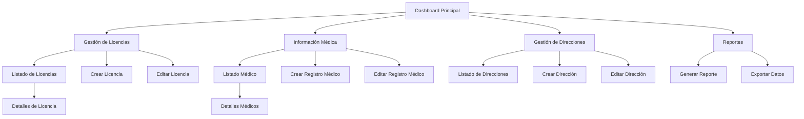

# Sistema de Gestión de Conductores - Áreas Administrativas

## 1. Resumen del Producto

Sistema administrativo integral para la gestión de licencias de conducir e información médica de conductores, basado en la estructura existente de training-schools. El sistema incluye funcionalidades CRUD completas, sistema de alertas por vencimiento con semáforo visual, y capacidades de seguimiento y reportes.

## 2. Características Principales

### 2.1 Roles de Usuario

| Rol | Método de Registro | Permisos Principales |
|-----|-------------------|---------------------|
| Administrador | Acceso directo al sistema | Gestión completa de licencias, información médica y direcciones |
| Supervisor | Asignación por administrador | Visualización y edición limitada de registros |
| Operador | Asignación por supervisor | Solo visualización y creación de nuevos registros |

### 2.2 Módulos de Funcionalidad

Nuestro sistema de gestión de conductores consta de las siguientes páginas principales:

1. **Dashboard Principal**: panel de control con alertas de vencimiento, estadísticas generales y accesos rápidos.
2. **Gestión de Licencias**: listado, creación, edición y visualización de licencias de conducir.
3. **Información Médica**: gestión completa de certificados médicos y exámenes de salud.
4. **Gestión de Direcciones**: administración del historial de direcciones de conductores.
5. **Reportes y Exportación**: generación de reportes y exportación de datos.

### 2.3 Detalles de Páginas

| Nombre de Página | Nombre del Módulo | Descripción de Funcionalidad |
|------------------|-------------------|------------------------------|
| Dashboard Principal | Panel de Control | Mostrar alertas de vencimiento con semáforo (verde=válido, amarillo=próximo a vencer, rojo=vencido), estadísticas generales, accesos rápidos a módulos |
| Dashboard Principal | Sistema de Alertas | Notificaciones automáticas por vencimientos próximos, filtros por tipo de documento, ordenamiento por fecha |
| Gestión de Licencias | Listado de Licencias | Visualizar todas las licencias con estado de vencimiento, filtros por estado/fecha/conductor, búsqueda avanzada |
| Gestión de Licencias | Crear/Editar Licencia | Formulario completo para datos de licencia, carga de documentos, validación de fechas, asignación a conductor |
| Gestión de Licencias | Detalles de Licencia | Vista completa de información, historial de cambios, documentos asociados, opciones de renovación |
| Información Médica | Listado Médico | Visualizar certificados médicos con estado de vigencia, filtros por tipo de examen/fecha/conductor |
| Información Médica | Crear/Editar Médico | Formulario para certificados médicos, carga de resultados, fechas de vencimiento, notas médicas |
| Información Médica | Detalles Médicos | Vista detallada de información médica, historial clínico, documentos adjuntos |
| Gestión de Direcciones | Listado de Direcciones | Visualizar historial de direcciones por conductor, validación de períodos mínimos |
| Gestión de Direcciones | Crear/Editar Dirección | Formulario de direcciones con validación de fechas, verificación de continuidad temporal |
| Reportes | Generación de Reportes | Crear reportes personalizados, exportar a PDF/Excel, programar reportes automáticos |

## 3. Proceso Principal

### Flujo de Administrador
1. Acceso al dashboard principal con vista general de alertas
2. Navegación a módulo específico (licencias/médico/direcciones)
3. Gestión de registros (crear/editar/visualizar)
4. Configuración de alertas y notificaciones
5. Generación de reportes según necesidades

### Flujo de Gestión de Vencimientos
1. Sistema automático revisa fechas de vencimiento diariamente
2. Clasifica documentos según proximidad de vencimiento
3. Genera alertas visuales en dashboard
4. Envía notificaciones automáticas a responsables
5. Permite acciones masivas de renovación

## 4. Diseño de Interfaz de Usuario

### 4.1 Estilo de Diseño

- **Colores primarios**: Azul (#3B82F6) para elementos principales, Verde (#10B981) para estados válidos
- **Colores de semáforo**: Verde (#10B981) para válido, Amarillo (#F59E0B) para próximo a vencer, Rojo (#EF4444) para vencido
- **Estilo de botones**: Redondeados con sombra sutil, efectos hover suaves
- **Tipografía**: Inter o similar, tamaños 14px para texto normal, 16px para títulos
- **Estilo de layout**: Basado en tarjetas con navegación lateral, diseño limpio y moderno
- **Iconos**: Lucide React o Heroicons para consistencia visual

### 4.2 Resumen de Diseño de Páginas

| Nombre de Página | Nombre del Módulo | Elementos de UI |
|------------------|-------------------|----------------|
| Dashboard Principal | Panel de Control | Tarjetas de estadísticas con colores de semáforo, gráficos de barras para vencimientos, lista de alertas recientes |
| Dashboard Principal | Sistema de Alertas | Badges de colores para estados, iconos de advertencia, botones de acción rápida |
| Gestión de Licencias | Listado de Licencias | Tabla responsiva con filtros, badges de estado, botones de acción, paginación |
| Gestión de Licencias | Formularios | Campos de entrada validados, selectores de fecha, carga de archivos drag-and-drop |
| Información Médica | Listado Médico | Tabla con columnas específicas médicas, filtros por tipo de examen, estados visuales |
| Información Médica | Formularios Médicos | Campos especializados para datos médicos, validaciones específicas, adjuntos múltiples |
| Gestión de Direcciones | Listado de Direcciones | Timeline visual del historial, validación de períodos, indicadores de continuidad |
| Reportes | Generación | Constructor de reportes visual, preview en tiempo real, opciones de exportación |

### 4.3 Responsividad

Diseño desktop-first con adaptación completa para tablets y móviles. Optimización táctil para dispositivos móviles con botones de tamaño adecuado y navegación simplificada. Tablas colapsables en pantallas pequeñas con vista de tarjetas.