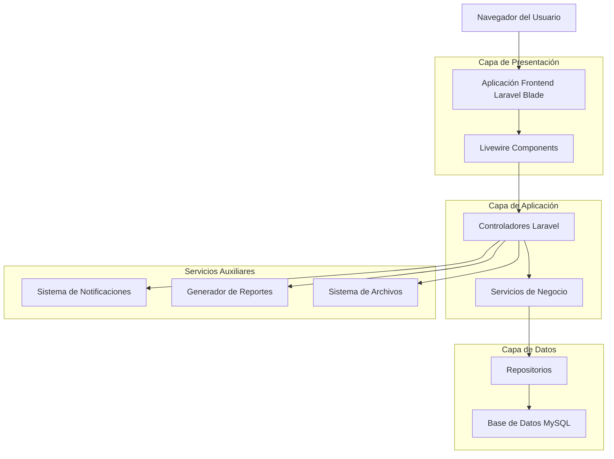
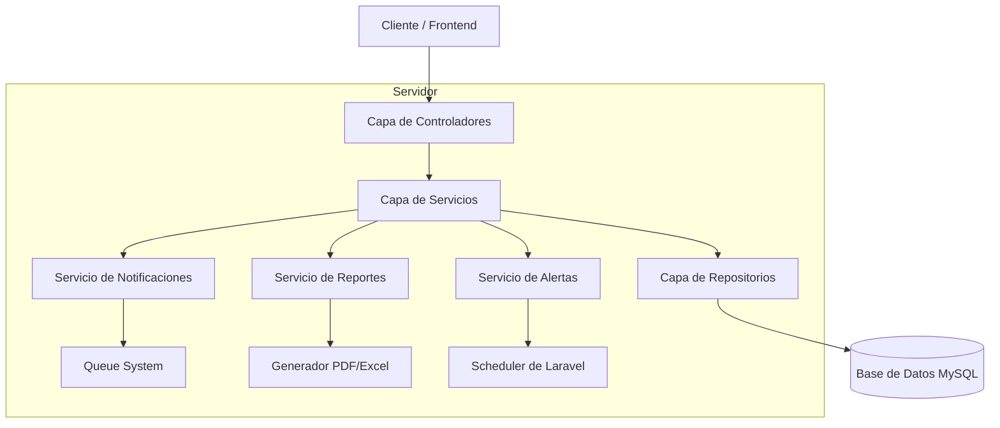
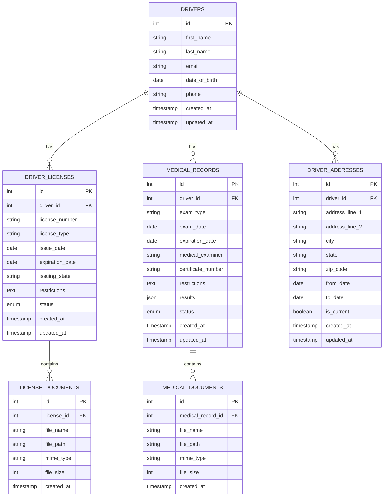

# Arquitectura Técnica - Sistema de Gestión de Conductores

## 1. Diseño de Arquitectura



## 2. Descripción de Tecnologías

- Frontend: Laravel Blade + Livewire + Alpine.js + Tailwind CSS
- Backend: Laravel 10 + PHP 8.1
- Base de Datos: MySQL 8.0
- Almacenamiento: Laravel Media Library
- Notificaciones: Laravel Notifications + Queue System
- Reportes: Laravel Excel + DomPDF

## 3. Definiciones de Rutas

| Ruta | Propósito |
|------|----------|
| /admin/dashboard | Dashboard principal con alertas y estadísticas |
| /admin/driver-licenses | Listado de licencias de conducir |
| /admin/driver-licenses/create | Crear nueva licencia |
| /admin/driver-licenses/{id} | Ver detalles de licencia específica |
| /admin/driver-licenses/{id}/edit | Editar licencia existente |
| /admin/medical-records | Listado de registros médicos |
| /admin/medical-records/create | Crear nuevo registro médico |
| /admin/medical-records/{id} | Ver detalles de registro médico |
| /admin/medical-records/{id}/edit | Editar registro médico |
| /admin/driver-addresses | Listado de direcciones de conductores |
| /admin/driver-addresses/create | Crear nueva dirección |
| /admin/driver-addresses/{id}/edit | Editar dirección existente |
| /admin/reports | Panel de generación de reportes |

## 4. Definiciones de API

### 4.1 API Principal

**Gestión de Licencias**
```
GET /api/admin/driver-licenses
```

Respuesta:
| Nombre del Parámetro | Tipo de Parámetro | Descripción |
|---------------------|-------------------|-------------|
| data | array | Lista de licencias con información completa |
| meta | object | Información de paginación y filtros |
| alerts | array | Alertas de vencimiento por licencia |

```
POST /api/admin/driver-licenses
```

Solicitud:
| Nombre del Parámetro | Tipo de Parámetro | Requerido | Descripción |
|---------------------|-------------------|-----------|-------------|
| driver_id | integer | true | ID del conductor |
| license_number | string | true | Número de licencia |
| license_type | string | true | Tipo de licencia (CDL, regular, etc.) |
| issue_date | date | true | Fecha de emisión |
| expiration_date | date | true | Fecha de vencimiento |
| issuing_state | string | true | Estado emisor |
| restrictions | string | false | Restricciones de la licencia |
| documents | array | false | Documentos adjuntos |

**Gestión Médica**
```
GET /api/admin/medical-records
```

Respuesta:
| Nombre del Parámetro | Tipo de Parámetro | Descripción |
|---------------------|-------------------|-------------|
| data | array | Lista de registros médicos |
| expiration_alerts | array | Alertas de certificados próximos a vencer |

```
POST /api/admin/medical-records
```

Solicitud:
| Nombre del Parámetro | Tipo de Parámetro | Requerido | Descripción |
|---------------------|-------------------|-----------|-------------|
| driver_id | integer | true | ID del conductor |
| exam_type | string | true | Tipo de examen (DOT, vision, etc.) |
| exam_date | date | true | Fecha del examen |
| expiration_date | date | true | Fecha de vencimiento |
| medical_examiner | string | true | Nombre del examinador |
| certificate_number | string | true | Número de certificado |
| restrictions | text | false | Restricciones médicas |
| results | json | false | Resultados detallados del examen |

**Sistema de Alertas**
```
GET /api/admin/expiration-alerts
```

Respuesta:
| Nombre del Parámetro | Tipo de Parámetro | Descripción |
|---------------------|-------------------|-------------|
| critical | array | Documentos vencidos (rojo) |
| warning | array | Documentos próximos a vencer (amarillo) |
| valid | integer | Cantidad de documentos válidos (verde) |

Ejemplo de respuesta:
```json
{
  "critical": [
    {
      "type": "license",
      "driver_name": "Juan Pérez",
      "document": "Licencia CDL",
      "expired_days": 15
    }
  ],
  "warning": [
    {
      "type": "medical",
      "driver_name": "María García",
      "document": "Certificado DOT",
      "days_until_expiration": 30
    }
  ],
  "valid": 245
}
```

## 5. Diagrama de Arquitectura del Servidor



## 6. Modelo de Datos

### 6.1 Definición del Modelo de Datos



### 6.2 Lenguaje de Definición de Datos

**Tabla de Licencias de Conductores (driver_licenses)**
```sql
-- Crear tabla
CREATE TABLE driver_licenses (
    id BIGINT UNSIGNED AUTO_INCREMENT PRIMARY KEY,
    driver_id BIGINT UNSIGNED NOT NULL,
    license_number VARCHAR(50) NOT NULL UNIQUE,
    license_type ENUM('CDL_A', 'CDL_B', 'CDL_C', 'REGULAR', 'MOTORCYCLE', 'COMMERCIAL') NOT NULL,
    issue_date DATE NOT NULL,
    expiration_date DATE NOT NULL,
    issuing_state VARCHAR(2) NOT NULL,
    restrictions TEXT NULL,
    status ENUM('active', 'expired', 'suspended', 'revoked') DEFAULT 'active',
    created_at TIMESTAMP DEFAULT CURRENT_TIMESTAMP,
    updated_at TIMESTAMP DEFAULT CURRENT_TIMESTAMP ON UPDATE CURRENT_TIMESTAMP,
    
    FOREIGN KEY (driver_id) REFERENCES drivers(id) ON DELETE CASCADE,
    INDEX idx_driver_licenses_driver_id (driver_id),
    INDEX idx_driver_licenses_expiration (expiration_date),
    INDEX idx_driver_licenses_status (status)
);

-- Crear índices
CREATE INDEX idx_driver_licenses_license_number ON driver_licenses(license_number);
CREATE INDEX idx_driver_licenses_license_type ON driver_licenses(license_type);
CREATE INDEX idx_driver_licenses_issuing_state ON driver_licenses(issuing_state);

-- Datos iniciales
INSERT INTO driver_licenses (driver_id, license_number, license_type, issue_date, expiration_date, issuing_state, status)
VALUES 
(1, 'CDL123456789', 'CDL_A', '2022-01-15', '2026-01-15', 'TX', 'active'),
(2, 'REG987654321', 'REGULAR', '2021-06-20', '2025-06-20', 'CA', 'active');
```

**Tabla de Registros Médicos (medical_records)**
```sql
-- Crear tabla
CREATE TABLE medical_records (
    id BIGINT UNSIGNED AUTO_INCREMENT PRIMARY KEY,
    driver_id BIGINT UNSIGNED NOT NULL,
    exam_type ENUM('DOT_PHYSICAL', 'VISION_TEST', 'HEARING_TEST', 'DRUG_SCREEN', 'ALCOHOL_TEST') NOT NULL,
    exam_date DATE NOT NULL,
    expiration_date DATE NOT NULL,
    medical_examiner VARCHAR(255) NOT NULL,
    certificate_number VARCHAR(100) NOT NULL UNIQUE,
    restrictions TEXT NULL,
    results JSON NULL,
    status ENUM('valid', 'expired', 'pending', 'failed') DEFAULT 'valid',
    created_at TIMESTAMP DEFAULT CURRENT_TIMESTAMP,
    updated_at TIMESTAMP DEFAULT CURRENT_TIMESTAMP ON UPDATE CURRENT_TIMESTAMP,
    
    FOREIGN KEY (driver_id) REFERENCES drivers(id) ON DELETE CASCADE,
    INDEX idx_medical_records_driver_id (driver_id),
    INDEX idx_medical_records_expiration (expiration_date),
    INDEX idx_medical_records_exam_type (exam_type),
    INDEX idx_medical_records_status (status)
);

-- Crear índices adicionales
CREATE INDEX idx_medical_records_certificate_number ON medical_records(certificate_number);
CREATE INDEX idx_medical_records_exam_date ON medical_records(exam_date);

-- Datos iniciales
INSERT INTO medical_records (driver_id, exam_type, exam_date, expiration_date, medical_examiner, certificate_number, status)
VALUES 
(1, 'DOT_PHYSICAL', '2023-03-15', '2025-03-15', 'Dr. Smith Medical Center', 'DOT2023001', 'valid'),
(2, 'VISION_TEST', '2023-05-20', '2024-05-20', 'Vision Care Clinic', 'VIS2023002', 'valid');
```

**Tabla de Direcciones de Conductores (driver_addresses)**
```sql
-- Crear tabla
CREATE TABLE driver_addresses (
    id BIGINT UNSIGNED AUTO_INCREMENT PRIMARY KEY,
    driver_id BIGINT UNSIGNED NOT NULL,
    address_line_1 VARCHAR(255) NOT NULL,
    address_line_2 VARCHAR(255) NULL,
    city VARCHAR(100) NOT NULL,
    state VARCHAR(2) NOT NULL,
    zip_code VARCHAR(10) NOT NULL,
    from_date DATE NOT NULL,
    to_date DATE NULL,
    is_current BOOLEAN DEFAULT FALSE,
    created_at TIMESTAMP DEFAULT CURRENT_TIMESTAMP,
    updated_at TIMESTAMP DEFAULT CURRENT_TIMESTAMP ON UPDATE CURRENT_TIMESTAMP,
    
    FOREIGN KEY (driver_id) REFERENCES drivers(id) ON DELETE CASCADE,
    INDEX idx_driver_addresses_driver_id (driver_id),
    INDEX idx_driver_addresses_current (is_current),
    INDEX idx_driver_addresses_dates (from_date, to_date)
);

-- Datos iniciales
INSERT INTO driver_addresses (driver_id, address_line_1, city, state, zip_code, from_date, is_current)
VALUES 
(1, '123 Main Street', 'Houston', 'TX', '77001', '2020-01-01', TRUE),
(2, '456 Oak Avenue', 'Los Angeles', 'CA', '90001', '2019-06-15', TRUE);
```