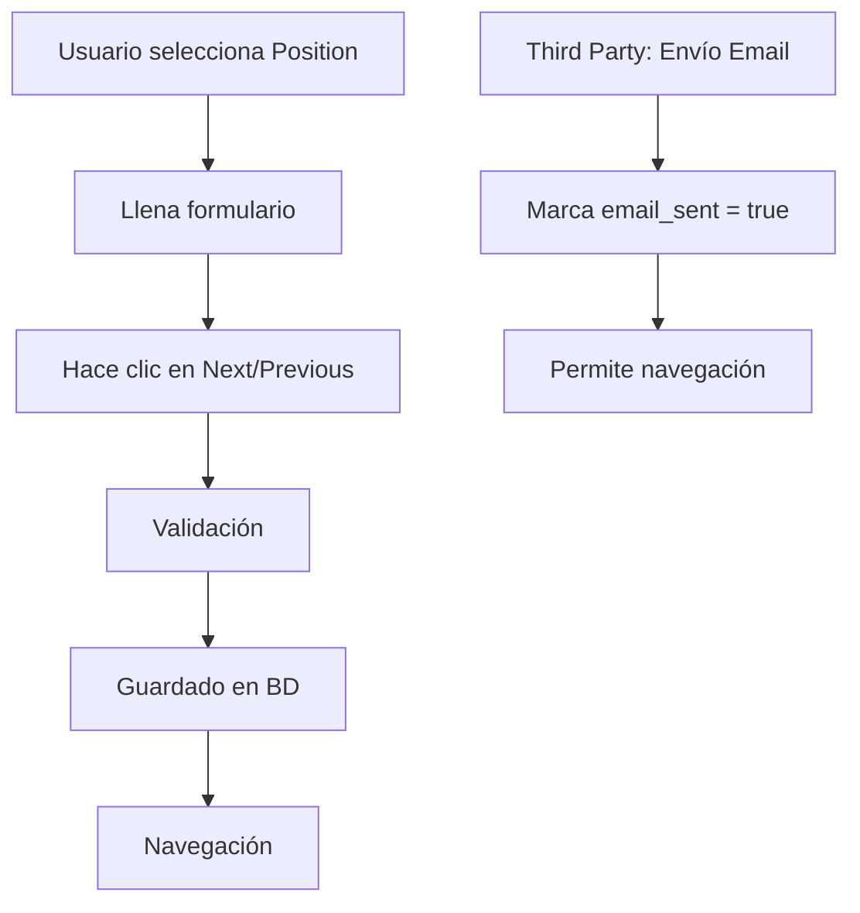

# Análisis y Propuesta de Mejora - Driver Registration Step 3 (ApplicationStep)

## 1. Análisis de la Lógica Actual

### 1.1 Flujo Actual de "Position Applied For"

El sistema actual maneja tres tipos de posiciones:
- **Owner Operator**: Conductor propietario del vehículo
- **Third Party Driver**: Conductor que maneja vehículo de terceros
- **Company Driver**: Conductor de la empresa

#### Problemas Identificados en el Flujo Actual:

1. **Guardado Tardío**: Los datos se guardan solo al navegar (next/previous), no al crear los registros
2. **Validación Inconsistente**: La validación para third party solo verifica si el email fue enviado, no si el registro fue creado
3. **Experiencia de Usuario Confusa**: El usuario puede llenar formularios sin crear registros, causando pérdida de datos
4. **Problemas de Reenvío**: El sistema de reenvío de correos no funciona correctamente porque los registros no están persistidos

### 1.2 Manejo Actual de Owner Operator

```php
// En ApplicationStep.php líneas 618-632
if ($this->applying_position === 'owner_operator') {
    $application->ownerOperatorDetail()->updateOrCreate(
        [],
        [
            'owner_name' => $this->owner_name,
            'owner_phone' => $this->owner_phone,
            'owner_email' => $this->owner_email,
            'contract_agreed' => $this->contract_agreed,
            'vehicle_id' => $this->vehicle_id,
        ]
    );
}
```

**Problema**: Solo se guarda al navegar, no hay creación inmediata del registro.

### 1.3 Manejo Actual de Third Party Company

```php
// En ApplicationStep.php líneas 635-649
if ($this->applying_position === 'third_party_driver') {
    $application->thirdPartyDetail()->updateOrCreate(
        [],
        [
            'third_party_name' => $this->third_party_name,
            'third_party_phone' => $this->third_party_phone,
            'third_party_email' => $this->third_party_email,
            // ... otros campos
        ]
    );
}
```

**Problema**: El registro se crea solo al navegar, y la validación actual solo verifica `email_sent`:

```php
// Líneas 767-773
if ($this->applying_position === 'third_party_driver' && !$this->email_sent && 
    $this->third_party_email && $this->third_party_name && $this->third_party_phone) {
    $this->addError('third_party_email', 'You must send the email to the third party company representative before proceeding.');
    return;
}
```

## 2. Diagramas de Flujo

### 2.1 Flujo Actual



### 2.2 Flujo Propuesto

```mermaid
graph TD
    A[Usuario selecciona Position] --> B[Llena formulario]
    B --> C[Botón "Crear Registro"]
    C --> D[Validación de campos]
    D --> E[Guardado inmediato en BD]
    E --> F[Confirmación visual]
    F --> G[Habilita navegación]
    
    H[Third Party: Botón "Enviar Email"] --> I[Verifica registro creado]
    I --> J[Envía email]
    J --> K[Actualiza estado]
    
    L[Intento de navegación] --> M{¿Registro creado?}
    M -->|No| N[Mensaje de error]
    M -->|Sí| O[Permite navegación]
```

## 3. Propuesta de Mejora Técnica

### 3.1 Nuevos Métodos Requeridos

#### Para Owner Operator:
```php
public function createOwnerOperatorRecord()
{
    $this->validate([
        'owner_name' => 'required|string|max:255',
        'owner_phone' => 'required|string|max:20',
        'owner_email' => 'required|email|max:255',
        'contract_agreed' => 'accepted',
        // Validaciones de vehículo...
    ]);
    
    DB::beginTransaction();
    try {
        // Crear/actualizar vehículo
        $vehicle = $this->createOrUpdateVehicle();
        
        // Crear registro Owner Operator
        $this->application->ownerOperatorDetail()->updateOrCreate(
            [],
            [
                'owner_name' => $this->owner_name,
                'owner_phone' => $this->owner_phone,
                'owner_email' => $this->owner_email,
                'contract_agreed' => $this->contract_agreed,
                'vehicle_id' => $vehicle->id,
                'created_at' => now(),
            ]
        );
        
        $this->owner_operator_created = true;
        DB::commit();
        
        $this->dispatch('notify', [
            'type' => 'success',
            'message' => 'Owner Operator record created successfully'
        ]);
    } catch (\Exception $e) {
        DB::rollBack();
        $this->dispatch('notify', [
            'type' => 'error',
            'message' => 'Error creating record: ' . $e->getMessage()
        ]);
    }
}
```

#### Para Third Party:
```php
public function createThirdPartyRecord()
{
    $this->validate([
        'third_party_name' => 'required|string|max:255',
        'third_party_phone' => 'required|string|max:20',
        'third_party_email' => 'required|email|max:255',
        // Validaciones de vehículo...
    ]);
    
    DB::beginTransaction();
    try {
        // Crear/actualizar vehículo
        $vehicle = $this->createOrUpdateVehicle();
        
        // Crear registro Third Party
        $this->application->thirdPartyDetail()->updateOrCreate(
            [],
            [
                'third_party_name' => $this->third_party_name,
                'third_party_phone' => $this->third_party_phone,
                'third_party_email' => $this->third_party_email,
                'third_party_dba' => $this->third_party_dba,
                'third_party_address' => $this->third_party_address,
                'third_party_contact' => $this->third_party_contact,
                'third_party_fein' => $this->third_party_fein,
                'vehicle_id' => $vehicle->id,
                'email_sent' => false,
                'created_at' => now(),
            ]
        );
        
        $this->third_party_created = true;
        DB::commit();
        
        $this->dispatch('notify', [
            'type' => 'success',
            'message' => 'Third Party record created successfully'
        ]);
    } catch (\Exception $e) {
        DB::rollBack();
        $this->dispatch('notify', [
            'type' => 'error',
            'message' => 'Error creating record: ' . $e->getMessage()
        ]);
    }
}
```

### 3.2 Nuevas Propiedades de Estado

```php
// Agregar al inicio de la clase ApplicationStep
public $owner_operator_created = false;
public $third_party_created = false;
```

### 3.3 Validación Mejorada para Navegación

```php
public function next()
{
    // Validación de completitud de registros
    if ($this->applying_position === 'owner_operator' && !$this->owner_operator_created) {
        $this->addError('applying_position', 'You must create the Owner Operator record before proceeding.');
        return;
    }
    
    if ($this->applying_position === 'third_party_driver' && !$this->third_party_created) {
        $this->addError('applying_position', 'You must create the Third Party record before proceeding.');
        return;
    }
    
    // Validación adicional para third party email
    if ($this->applying_position === 'third_party_driver' && !$this->email_sent) {
        $this->addError('third_party_email', 'You must send the email to the third party company representative before proceeding.');
        return;
    }
    
    // Resto de validaciones...
    $this->validateStep();
    $this->dispatch('nextStep');
}
```

### 3.4 Método Mejorado para Envío de Email

```php
public function sendThirdPartyEmail()
{
    // Verificar que el registro esté creado
    if (!$this->third_party_created) {
        $this->addError('third_party_email', 'You must create the Third Party record first.');
        return;
    }
    
    // Resto del código de envío de email...
    // (mantener la lógica actual pero con la validación previa)
}
```

## 4. Cambios en la Vista (Blade)

### 4.1 Botones de Creación de Registros

#### Para Owner Operator:
```html
<!-- Agregar después del formulario de Owner Operator -->
<div class="mt-6 flex justify-end">
    <button type="button" 
            wire:click="createOwnerOperatorRecord"
            class="px-6 py-2 bg-green-600 text-white rounded-lg hover:bg-green-700 disabled:opacity-50"
            @if($owner_operator_created) disabled @endif>
        @if($owner_operator_created)
            ✓ Record Created
        @else
            Create Owner Operator Record
        @endif
    </button>
</div>

@if($owner_operator_created)
    <div class="mt-3 p-3 bg-green-50 border border-green-200 rounded-lg">
        <p class="text-green-700 text-sm">
            ✓ Owner Operator record has been created successfully. You can now proceed to the next step.
        </p>
    </div>
@endif
```

#### Para Third Party:
```html
<!-- Agregar después del formulario de Third Party -->
<div class="mt-6 flex justify-end">
    <button type="button" 
            wire:click="createThirdPartyRecord"
            class="px-6 py-2 bg-green-600 text-white rounded-lg hover:bg-green-700 disabled:opacity-50"
            @if($third_party_created) disabled @endif>
        @if($third_party_created)
            ✓ Record Created
        @else
            Create Third Party Record
        @endif
    </button>
</div>

@if($third_party_created)
    <div class="mt-3 p-3 bg-green-50 border border-green-200 rounded-lg">
        <p class="text-green-700 text-sm">
            ✓ Third Party record has been created successfully. You can now send the email and proceed.
        </p>
    </div>
@endif

<!-- Modificar el botón de envío de email -->
<div class="mt-4 flex space-x-4">
    <button type="button" 
            wire:click="sendThirdPartyEmail"
            class="px-4 py-2 bg-blue-800 text-white rounded hover:bg-blue-900 disabled:opacity-50"
            @if(!$third_party_created || $email_sent) disabled @endif>
        @if($email_sent)
            ✓ Email Sent
        @elseif(!$third_party_created)
            Create Record First
        @else
            Send Document Signing Request
        @endif
    </button>
    
    @if($email_sent)
        <button type="button" 
                wire:click="sendThirdPartyEmail"
                class="px-4 py-2 bg-yellow-500 text-white rounded hover:bg-yellow-600">
            Resend Email
        </button>
    @endif
</div>
```

## 5. Casos de Uso y Validaciones

### 5.1 Caso de Uso: Owner Operator

1. **Usuario selecciona "Owner Operator"**
   - Se muestra el formulario con campos requeridos
   - Botón "Create Owner Operator Record" habilitado

2. **Usuario llena formulario y hace clic en "Create Record"**
   - Validación de campos requeridos
   - Creación de vehículo y registro de Owner Operator
   - Confirmación visual de creación exitosa
   - Botón cambia a "✓ Record Created" (deshabilitado)

3. **Usuario intenta navegar sin crear registro**
   - Error: "You must create the Owner Operator record before proceeding."

4. **Usuario navega después de crear registro**
   - Navegación permitida sin problemas

### 5.2 Caso de Uso: Third Party Driver

1. **Usuario selecciona "Third Party Driver"**
   - Se muestra el formulario con campos requeridos
   - Botón "Create Third Party Record" habilitado
   - Botón "Send Email" deshabilitado

2. **Usuario llena formulario y hace clic en "Create Record"**
   - Validación de campos requeridos
   - Creación de vehículo y registro de Third Party
   - Confirmación visual de creación exitosa
   - Botón "Send Email" se habilita

3. **Usuario intenta enviar email sin crear registro**
   - Error: "You must create the Third Party record first."

4. **Usuario envía email después de crear registro**
   - Email enviado exitosamente
   - Estado actualizado a `email_sent = true`
   - Botón "Resend Email" habilitado

5. **Usuario intenta navegar sin enviar email**
   - Error: "You must send the email to the third party company representative before proceeding."

## 6. Plan de Implementación

### Fase 1: Preparación (1 día)
- [ ] Agregar nuevas propiedades de estado al componente
- [ ] Crear métodos de validación específicos
- [ ] Preparar migraciones si son necesarias

### Fase 2: Backend (2-3 días)
- [ ] Implementar `createOwnerOperatorRecord()`
- [ ] Implementar `createThirdPartyRecord()`
- [ ] Modificar validaciones de navegación
- [ ] Actualizar método `sendThirdPartyEmail()`
- [ ] Agregar logs y manejo de errores

### Fase 3: Frontend (2 días)
- [ ] Agregar botones de creación de registros
- [ ] Implementar indicadores visuales de estado
- [ ] Actualizar mensajes de error
- [ ] Mejorar UX con confirmaciones visuales

### Fase 4: Testing (1-2 días)
- [ ] Pruebas unitarias de nuevos métodos
- [ ] Pruebas de integración del flujo completo
- [ ] Pruebas de validación y manejo de errores
- [ ] Pruebas de envío de emails

### Fase 5: Deployment (1 día)
- [ ] Deploy en ambiente de staging
- [ ] Pruebas de aceptación
- [ ] Deploy en producción
- [ ] Monitoreo post-deployment

## 7. Impacto en la Experiencia del Usuario

### 7.1 Beneficios

1. **Claridad en el Proceso**: El usuario entiende claramente que debe crear el registro antes de continuar
2. **Prevención de Pérdida de Datos**: Los datos se guardan inmediatamente al crear el registro
3. **Feedback Inmediato**: Confirmaciones visuales de acciones completadas
4. **Flujo Lógico**: Secuencia natural de crear → enviar → continuar
5. **Mejor Manejo de Errores**: Mensajes específicos y accionables

### 7.2 Consideraciones de UX

1. **Estados Visuales Claros**: Botones que cambian de estado según el progreso
2. **Mensajes Informativos**: Explicaciones claras de qué hacer en cada paso
3. **Prevención de Errores**: Validaciones que guían al usuario
4. **Consistencia**: Mismo patrón para Owner Operator y Third Party

## 8. Consideraciones Técnicas Adicionales

### 8.1 Manejo de Errores
- Transacciones de base de datos para operaciones atómicas
- Logs detallados para debugging
- Rollback automático en caso de errores

### 8.2 Performance
- Validaciones eficientes sin consultas innecesarias
- Caching de estados para evitar re-consultas
- Optimización de queries de creación

### 8.3 Seguridad
- Validación server-side de todos los datos
- Sanitización de inputs
- Verificación de permisos antes de crear registros

## 9. Conclusión

La implementación propuesta mejora significativamente el flujo de registro de conductores al:

1. **Separar la creación de registros de la navegación**
2. **Proporcionar feedback inmediato al usuario**
3. **Prevenir pérdida de datos**
4. **Mejorar la confiabilidad del sistema de emails**
5. **Crear un flujo más intuitivo y lógico**

Esta mejora resolverá los problemas actuales de reenvío de emails y proporcionará una experiencia de usuario más robusta y confiable.