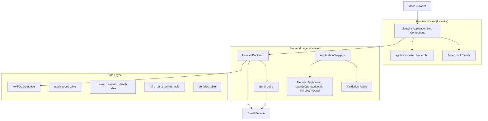
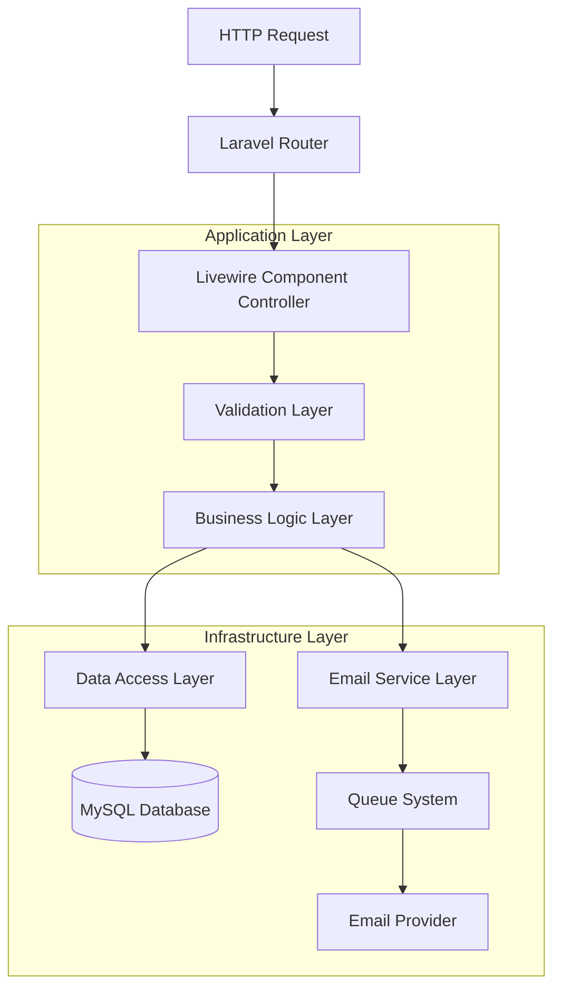
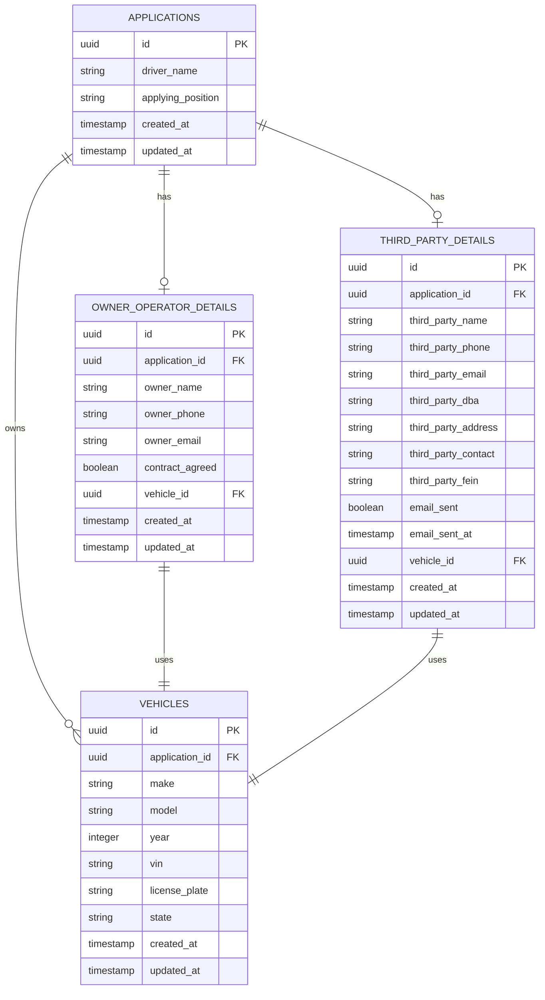

# Arquitectura Técnica - Driver Registration Step 3 Improvements

## 1. Diseño de Arquitectura



## 2. Descripción de Tecnologías

- **Frontend**: Laravel Livewire 3.x + Blade Templates + TailwindCSS
- **Backend**: Laravel 10.x + PHP 8.1+
- **Database**: MySQL 8.0
- **Email**: Laravel Mail + Queue System
- **Validation**: Laravel Validation Rules
- **State Management**: Livewire Properties

## 3. Definiciones de Rutas

| Ruta | Propósito |
|------|----------|
| /driver/registration/continue/3 | Página principal del Step 3 - Application Step |
| /driver/registration/step/{step} | Navegación entre pasos del registro |

## 4. Definiciones de API (Livewire Methods)

### 4.1 Métodos Principales de Creación

**Crear registro Owner Operator**
```php
public function createOwnerOperatorRecord()
```

Validaciones:
| Campo | Tipo | Requerido | Descripción |
|-------|------|-----------|-------------|
| owner_name | string | true | Nombre del propietario operador |
| owner_phone | string | true | Teléfono del propietario |
| owner_email | email | true | Email del propietario |
| contract_agreed | boolean | true | Aceptación del contrato |
| vehicle_* | mixed | true | Datos del vehículo |

Respuesta:
```json
{
  "status": "success",
  "message": "Owner Operator record created successfully",
  "owner_operator_created": true
}
```

**Crear registro Third Party**
```php
public function createThirdPartyRecord()
```

Validaciones:
| Campo | Tipo | Requerido | Descripción |
|-------|------|-----------|-------------|
| third_party_name | string | true | Nombre del representante |
| third_party_phone | string | true | Teléfono del representante |
| third_party_email | email | true | Email del representante |
| third_party_dba | string | false | DBA de la empresa |
| third_party_address | string | true | Dirección de la empresa |
| third_party_contact | string | false | Persona de contacto |
| third_party_fein | string | false | FEIN de la empresa |
| vehicle_* | mixed | true | Datos del vehículo |

Respuesta:
```json
{
  "status": "success",
  "message": "Third Party record created successfully",
  "third_party_created": true
}
```

### 4.2 Métodos de Navegación Mejorados

**Navegación al siguiente paso**
```php
public function next()
```

Validaciones previas:
- Verificar que el registro correspondiente esté creado
- Para third party: verificar que el email haya sido enviado
- Validar completitud de datos requeridos

**Envío de email mejorado**
```php
public function sendThirdPartyEmail()
```

Validaciones previas:
- Verificar que el registro third party esté creado
- Validar datos de email

### 4.3 Eventos Livewire

| Evento | Descripción |
|--------|-------------|
| nextStep | Disparado al navegar al siguiente paso |
| prevStep | Disparado al navegar al paso anterior |
| notify | Disparado para mostrar notificaciones al usuario |
| recordCreated | Disparado cuando se crea un registro exitosamente |

## 5. Arquitectura del Servidor



## 6. Modelo de Datos

### 6.1 Definición del Modelo de Datos



### 6.2 Lenguaje de Definición de Datos (DDL)

**Tabla owner_operator_details (modificaciones)**
```sql
-- Agregar índices para mejor performance
CREATE INDEX idx_owner_operator_details_application_id ON owner_operator_details(application_id);
CREATE INDEX idx_owner_operator_details_vehicle_id ON owner_operator_details(vehicle_id);
CREATE INDEX idx_owner_operator_details_created_at ON owner_operator_details(created_at DESC);

-- Agregar constraint para email único por aplicación
ALTER TABLE owner_operator_details 
ADD CONSTRAINT uk_owner_operator_email_per_app 
UNIQUE (application_id, owner_email);
```

**Tabla third_party_details (modificaciones)**
```sql
-- Agregar índices para mejor performance
CREATE INDEX idx_third_party_details_application_id ON third_party_details(application_id);
CREATE INDEX idx_third_party_details_vehicle_id ON third_party_details(vehicle_id);
CREATE INDEX idx_third_party_details_email_sent ON third_party_details(email_sent);
CREATE INDEX idx_third_party_details_created_at ON third_party_details(created_at DESC);

-- Agregar constraint para email único por aplicación
ALTER TABLE third_party_details 
ADD CONSTRAINT uk_third_party_email_per_app 
UNIQUE (application_id, third_party_email);

-- Agregar columna para tracking de email
ALTER TABLE third_party_details 
ADD COLUMN email_sent_at TIMESTAMP NULL AFTER email_sent;
```

**Tabla vehicles (modificaciones)**
```sql
-- Agregar índices para mejor performance
CREATE INDEX idx_vehicles_application_id ON vehicles(application_id);
CREATE INDEX idx_vehicles_vin ON vehicles(vin);
CREATE INDEX idx_vehicles_license_plate ON vehicles(license_plate, state);

-- Agregar constraint para VIN único
ALTER TABLE vehicles 
ADD CONSTRAINT uk_vehicles_vin 
UNIQUE (vin);
```

**Nueva tabla para audit log (opcional)**
```sql
CREATE TABLE application_step_audit (
    id UUID PRIMARY KEY DEFAULT (UUID()),
    application_id UUID NOT NULL,
    step_number INTEGER NOT NULL,
    action VARCHAR(50) NOT NULL, -- 'created', 'updated', 'email_sent', etc.
    old_data JSON NULL,
    new_data JSON NULL,
    user_agent TEXT NULL,
    ip_address VARCHAR(45) NULL,
    created_at TIMESTAMP DEFAULT CURRENT_TIMESTAMP,
    
    FOREIGN KEY (application_id) REFERENCES applications(id) ON DELETE CASCADE,
    INDEX idx_audit_application_id (application_id),
    INDEX idx_audit_created_at (created_at DESC),
    INDEX idx_audit_action (action)
);
```

## 7. Especificaciones de Implementación

### 7.1 Propiedades de Estado Livewire

```php
class ApplicationStep extends Component
{
    // Estados de creación de registros
    public $owner_operator_created = false;
    public $third_party_created = false;
    
    // Estados de validación
    public $can_navigate_next = false;
    public $can_send_email = false;
    
    // Datos de formulario existentes
    public $applying_position;
    public $owner_name;
    public $owner_phone;
    public $owner_email;
    public $contract_agreed = false;
    
    public $third_party_name;
    public $third_party_phone;
    public $third_party_email;
    public $third_party_dba;
    public $third_party_address;
    public $third_party_contact;
    public $third_party_fein;
    
    // Estados de email
    public $email_sent = false;
    public $email_sent_at;
    
    // Datos de vehículo
    public $vehicle_id;
    public $vehicle_make;
    public $vehicle_model;
    public $vehicle_year;
    public $vehicle_vin;
    // ... otros campos de vehículo
}
```

### 7.2 Reglas de Validación Mejoradas

```php
protected function getOwnerOperatorRules()
{
    return [
        'owner_name' => 'required|string|max:255|regex:/^[a-zA-Z\s]+$/',
        'owner_phone' => 'required|string|max:20|regex:/^[\+]?[1-9][\d]{0,15}$/',
        'owner_email' => 'required|email:rfc,dns|max:255',
        'contract_agreed' => 'required|accepted',
        'vehicle_make' => 'required|string|max:100',
        'vehicle_model' => 'required|string|max:100',
        'vehicle_year' => 'required|integer|min:1990|max:' . (date('Y') + 1),
        'vehicle_vin' => 'required|string|size:17|regex:/^[A-HJ-NPR-Z0-9]{17}$/',
    ];
}

protected function getThirdPartyRules()
{
    return [
        'third_party_name' => 'required|string|max:255|regex:/^[a-zA-Z\s]+$/',
        'third_party_phone' => 'required|string|max:20|regex:/^[\+]?[1-9][\d]{0,15}$/',
        'third_party_email' => 'required|email:rfc,dns|max:255',
        'third_party_dba' => 'nullable|string|max:255',
        'third_party_address' => 'required|string|max:500',
        'third_party_contact' => 'nullable|string|max:255',
        'third_party_fein' => 'nullable|string|regex:/^\d{2}-\d{7}$/',
        'vehicle_make' => 'required|string|max:100',
        'vehicle_model' => 'required|string|max:100',
        'vehicle_year' => 'required|integer|min:1990|max:' . (date('Y') + 1),
        'vehicle_vin' => 'required|string|size:17|regex:/^[A-HJ-NPR-Z0-9]{17}$/',
    ];
}
```

### 7.3 Manejo de Transacciones

```php
use Illuminate\Support\Facades\DB;
use Illuminate\Support\Facades\Log;

private function executeWithTransaction(callable $callback, string $operation)
{
    DB::beginTransaction();
    
    try {
        $result = $callback();
        
        // Log successful operation
        Log::info("ApplicationStep: {$operation} completed successfully", [
            'application_id' => $this->application->id,
            'applying_position' => $this->applying_position,
            'user_id' => auth()->id(),
        ]);
        
        DB::commit();
        return $result;
        
    } catch (\Exception $e) {
        DB::rollBack();
        
        // Log error
        Log::error("ApplicationStep: {$operation} failed", [
            'application_id' => $this->application->id,
            'applying_position' => $this->applying_position,
            'error' => $e->getMessage(),
            'trace' => $e->getTraceAsString(),
        ]);
        
        throw $e;
    }
}
```

### 7.4 Sistema de Notificaciones

```php
private function notifySuccess(string $message)
{
    $this->dispatch('notify', [
        'type' => 'success',
        'message' => $message,
        'duration' => 5000
    ]);
}

private function notifyError(string $message)
{
    $this->dispatch('notify', [
        'type' => 'error',
        'message' => $message,
        'duration' => 8000
    ]);
}

private function notifyWarning(string $message)
{
    $this->dispatch('notify', [
        'type' => 'warning',
        'message' => $message,
        'duration' => 6000
    ]);
}
```

## 8. Consideraciones de Seguridad

### 8.1 Validación de Datos
- Sanitización de todos los inputs del usuario
- Validación server-side obligatoria
- Escape de datos antes de mostrar en vistas
- Validación de tipos de archivo para uploads

### 8.2 Protección CSRF
- Tokens CSRF en todos los formularios
- Verificación automática por Laravel
- Renovación de tokens en sesiones largas

### 8.3 Rate Limiting
```php
// En ApplicationStep.php
public function sendThirdPartyEmail()
{
    // Rate limiting para envío de emails
    $key = 'email_send_' . $this->application->id;
    
    if (Cache::has($key)) {
        $this->addError('third_party_email', 'Please wait before sending another email.');
        return;
    }
    
    // Establecer rate limit de 1 minuto
    Cache::put($key, true, 60);
    
    // Continuar con envío de email...
}
```

## 9. Performance y Optimización

### 9.1 Caching Strategy
```php
// Cache de datos de aplicación
public function mount()
{
    $cacheKey = "application_step3_{$this->application->id}";
    
    $cachedData = Cache::remember($cacheKey, 300, function () {
        return [
            'owner_operator_created' => $this->application->ownerOperatorDetail()->exists(),
            'third_party_created' => $this->application->thirdPartyDetail()->exists(),
            'email_sent' => $this->application->thirdPartyDetail?->email_sent ?? false,
        ];
    });
    
    $this->owner_operator_created = $cachedData['owner_operator_created'];
    $this->third_party_created = $cachedData['third_party_created'];
    $this->email_sent = $cachedData['email_sent'];
}
```

### 9.2 Query Optimization
```php
// Eager loading para evitar N+1 queries
public function loadApplicationData()
{
    $this->application->load([
        'ownerOperatorDetail',
        'thirdPartyDetail',
        'vehicles' => function ($query) {
            $query->latest();
        }
    ]);
}
```

### 9.3 Asset Optimization
- Minificación de CSS y JavaScript
- Lazy loading de componentes no críticos
- Optimización de imágenes
- CDN para assets estáticos

## 10. Monitoreo y Logging

### 10.1 Métricas Clave
- Tiempo de creación de registros
- Tasa de éxito de envío de emails
- Errores de validación más comunes
- Tiempo de navegación entre pasos

### 10.2 Logs Estructurados
```php
// Ejemplo de log estructurado
Log::channel('application_steps')->info('Record created', [
    'event' => 'owner_operator_record_created',
    'application_id' => $this->application->id,
    'user_id' => auth()->id(),
    'duration_ms' => $duration,
    'vehicle_id' => $vehicle->id,
    'timestamp' => now()->toISOString(),
]);
```

## 11. Testing Strategy

### 11.1 Unit Tests
- Tests para cada método de creación de registros
- Tests de validación
- Tests de manejo de errores

### 11.2 Integration Tests
- Tests del flujo completo de navegación
- Tests de envío de emails
- Tests de transacciones de base de datos

### 11.3 Feature Tests
- Tests de interfaz de usuario
- Tests de estados de botones
- Tests de mensajes de error y éxito

Esta arquitectura técnica proporciona una base sólida para implementar las mejoras propuestas, asegurando escalabilidad, mantenibilidad y una excelente experiencia