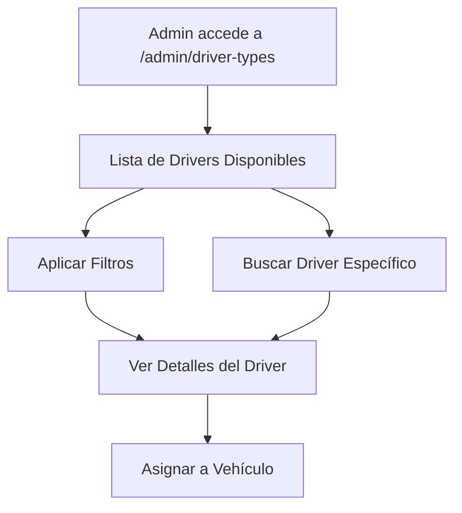
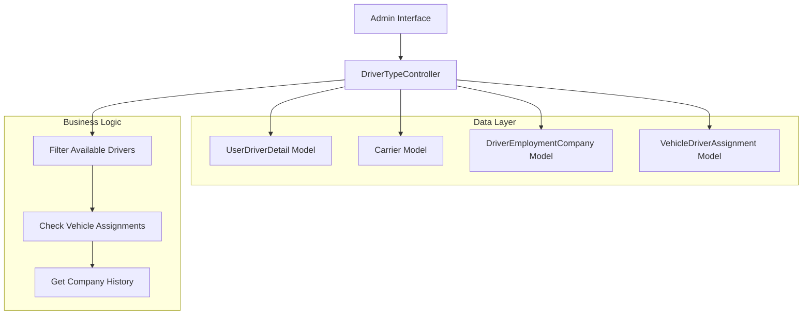
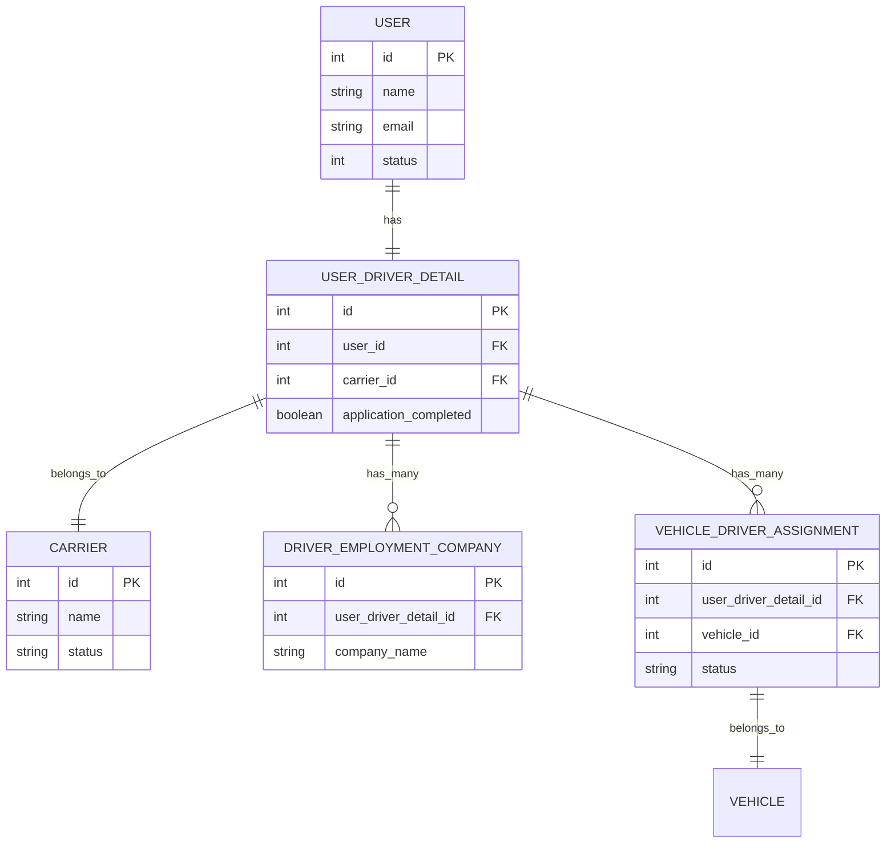

# Documento de Requerimientos: Rediseño de Driver Types

## 1. Resumen del Proyecto

**Objetivo**: Rediseñar completamente la página `/admin/driver-types` para mostrar drivers que tienen carrier asignado, han elegido una company, pero aún no han sido asignados a vehículos.

**Problema actual**: La página actual muestra aplicaciones de drivers con diferentes tipos de ownership (owner_operator, third_party), pero no cumple con el nuevo requerimiento de mostrar drivers disponibles para asignación.

**Solución propuesta**: Cambiar la lógica para filtrar y mostrar drivers específicos que cumplan con los criterios establecidos.

## 2. Funcionalidades Principales

### 2.1 Roles de Usuario
| Rol | Método de Acceso | Permisos Principales |
|-----|------------------|---------------------|
| Administrador | Login admin | Puede ver, filtrar y gestionar drivers disponibles |

### 2.2 Módulos de Funcionalidad

La página rediseñada consistirá de los siguientes módulos principales:

1. **Página de Drivers Disponibles**: Filtros de búsqueda, lista de drivers, información de carrier y company
2. **Vista de Detalles**: Información completa del driver seleccionado
3. **Acciones de Asignación**: Botones para asignar driver a vehículo

### 2.3 Detalles de Funcionalidades

| Página | Módulo | Descripción de Funcionalidad |
|--------|--------|------------------------------|
| Driver Types Index | Filtros de Búsqueda | Buscar por nombre de driver, carrier, company. Filtrar por estado, fecha de registro |
| Driver Types Index | Lista de Drivers | Mostrar drivers con carrier, company elegida, sin vehículo asignado. Incluir información de contacto y estado |
| Driver Types Index | Información de Carrier | Mostrar nombre del carrier asociado a cada driver |
| Driver Types Index | Información de Company | Mostrar company que eligió el driver en su historial de empleo |
| Driver Types Index | Estado de Asignación | Confirmar que no tiene vehículos asignados actualmente |
| Driver Types Index | Acciones | Botones para ver detalles, asignar a vehículo, editar información |
| Driver Types Show | Detalles Completos | Mostrar toda la información del driver, carrier, company y historial |

## 3. Flujo Principal de Usuario

**Flujo del Administrador:**

1. Accede a `/admin/driver-types`
2. Ve lista de drivers disponibles (con carrier y company, sin vehículo)
3. Puede filtrar por diferentes criterios
4. Selecciona un driver para ver detalles
5. Puede proceder a asignar el driver a un vehículo



## 4. Diseño de Interfaz de Usuario

### 4.1 Estilo de Diseño
- **Colores primarios**: Mantener consistencia con el tema admin actual
- **Estilo de botones**: Usar componentes x-base con iconos Lucide
- **Fuente**: Sistema de fuentes del tema actual
- **Layout**: Diseño basado en cards con navegación superior
- **Iconos**: Lucide icons para acciones (eye, edit, plus, etc.)

### 4.2 Diseño de Páginas

| Página | Módulo | Elementos de UI |
|--------|--------|-----------------|
| Driver Types Index | Header | Título "Available Drivers", botón "Assign to Vehicle" |
| Driver Types Index | Filtros | Campos de búsqueda por nombre, carrier, company, estado |
| Driver Types Index | Tabla | Columnas: Driver Name, Email, Carrier, Company, Registration Date, Actions |
| Driver Types Index | Paginación | Links de paginación con preservación de filtros |
| Driver Types Show | Información | Cards con detalles del driver, carrier, company, historial |

### 4.3 Responsividad
- Diseño mobile-first con adaptación para desktop
- Tabla responsive con scroll horizontal en móviles
- Filtros colapsables en pantallas pequeñas

## 5. Arquitectura Técnica

### 5.1 Diseño de Arquitectura



### 5.2 Tecnologías
- Frontend: Laravel Blade + TailwindCSS + x-base components
- Backend: Laravel 10 + Eloquent ORM
- Base de datos: MySQL (existente)

### 5.3 Rutas

| Ruta | Propósito |
|------|-----------|
| GET /admin/driver-types | Mostrar lista de drivers disponibles |
| GET /admin/driver-types/{id} | Mostrar detalles de driver específico |
| GET /admin/driver-types/{id}/assign | Formulario para asignar driver a vehículo |

### 5.4 Consultas y Filtros

**Consulta principal para obtener drivers disponibles:**

```sql
SELECT udd.*, u.name, u.email, c.name as carrier_name, dec.company_name
FROM user_driver_details udd
JOIN users u ON udd.user_id = u.id
JOIN carriers c ON udd.carrier_id = c.id
JOIN driver_employment_companies dec ON udd.id = dec.user_driver_detail_id
LEFT JOIN vehicle_driver_assignments vda ON udd.id = vda.user_driver_detail_id 
    AND vda.status = 'active'
WHERE udd.application_completed = 1
    AND u.status = 1
    AND vda.id IS NULL  -- No tiene asignación activa de vehículo
    AND dec.company_name IS NOT NULL  -- Ha elegido una company
```

## 6. Modelos de Datos

### 6.1 Relaciones de Modelos



### 6.2 Criterios de Filtrado

**Drivers que deben aparecer:**
1. `user_driver_details.application_completed = 1`
2. `users.status = 1` (usuario activo)
3. `carrier_id IS NOT NULL` (tiene carrier asignado)
4. Existe registro en `driver_employment_companies` (ha elegido company)
5. NO existe `vehicle_driver_assignments` con `status = 'active'` (no asignado a vehículo)

**Filtros disponibles:**
- Búsqueda por nombre del driver
- Filtro por carrier
- Filtro por company elegida
- Filtro por fecha de registro
- Filtro por estado de aplicación

## 7. Plan de Implementación

### 7.1 Fases de Desarrollo

**Fase 1: Modificación del Controlador**
- Actualizar `DriverTypeController@index` con nueva lógica
- Implementar consultas con joins apropiados
- Agregar filtros específicos

**Fase 2: Actualización de Vistas**
- Rediseñar `admin.driver-types.index` 
- Actualizar tabla con nuevas columnas
- Implementar filtros en la interfaz

**Fase 3: Funcionalidades Adicionales**
- Vista de detalles mejorada
- Integración con asignación de vehículos
- Testing y optimización

### 7.2 Consideraciones Técnicas

**Rendimiento:**
- Usar eager loading para relaciones
- Implementar índices en columnas de filtrado
- Paginación eficiente

**Seguridad:**
- Validación de permisos de admin
- Sanitización de inputs de filtros
- Protección CSRF en formularios

**Mantenibilidad:**
- Código documentado
- Separación de lógica de negocio
- Tests unitarios para consultas críticas

## 8. Criterios de Aceptación

✅ **Funcionalidad Principal:**
- La página muestra solo drivers con carrier asignado
- Se muestran drivers que han elegido una company
- Se excluyen drivers ya asignados a vehículos
- Los filtros funcionan correctamente

✅ **Interfaz de Usuario:**
- Diseño consistente con otras páginas admin
- Tabla responsive y funcional
- Paginación con preservación de filtros
- Mensajes de estado claros

✅ **Rendimiento:**
- Carga de página en menos de 2 segundos
- Filtros responden inmediatamente
- Paginación fluida

✅ **Compatibilidad:**
- Funciona en navegadores modernos
- Responsive en dispositivos móviles
- Accesible para usuarios con discapacidades