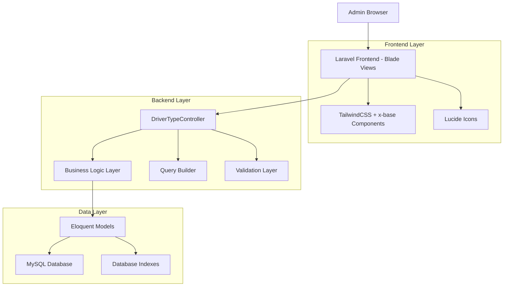
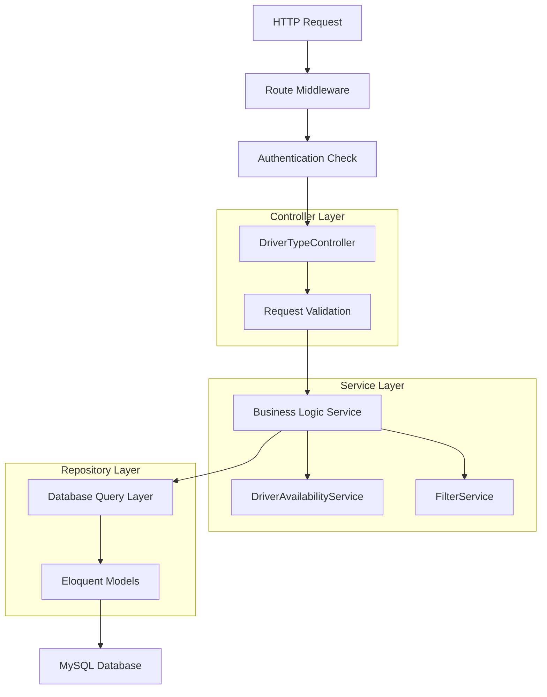
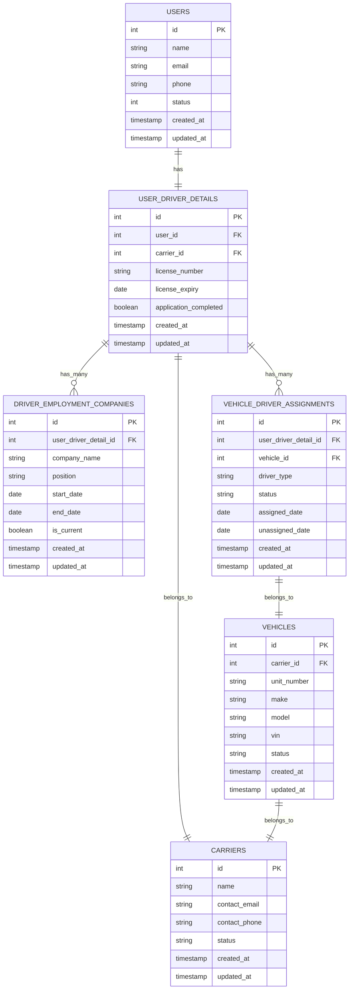

# Arquitectura Técnica: Rediseño Driver Types

## 1. Diseño de Arquitectura



## 2. Descripción de Tecnologías

- Frontend: Laravel Blade@10 + TailwindCSS@3 + x-base components + Lucide Icons
- Backend: Laravel@10 + Eloquent ORM
- Base de datos: MySQL (existente)
- Autenticación: Laravel Sanctum (existente)

## 3. Definiciones de Rutas

| Ruta | Propósito |
|------|-----------|
| GET /admin/driver-types | Lista de drivers disponibles (sin asignación de vehículo) |
| GET /admin/driver-types/{id} | Detalles específicos de un driver disponible |
| GET /admin/driver-types/data | Endpoint AJAX para datos de tabla (si se mantiene Tabulator) |
| POST /admin/driver-types/{id}/assign | Asignar driver a vehículo (redirección a módulo de vehículos) |

## 4. Definiciones de API

### 4.1 API Principal

**Obtener drivers disponibles**
```
GET /admin/driver-types
```

Parámetros de consulta:
| Nombre | Tipo | Requerido | Descripción |
|--------|------|-----------|-------------|
| search_term | string | false | Búsqueda por nombre, email, carrier |
| carrier_id | integer | false | Filtrar por carrier específico |
| company_name | string | false | Filtrar por company elegida |
| date_from | date | false | Fecha de registro desde |
| date_to | date | false | Fecha de registro hasta |
| page | integer | false | Número de página para paginación |

Respuesta:
```json
{
  "drivers": [
    {
      "id": 1,
      "name": "John Doe",
      "email": "john@example.com",
      "carrier": {
        "id": 5,
        "name": "ABC Transport"
      },
      "company_chosen": "XYZ Logistics",
      "registration_date": "2024-01-15",
      "application_status": "completed",
      "has_vehicle_assignment": false
    }
  ],
  "pagination": {
    "current_page": 1,
    "total_pages": 5,
    "total_records": 73
  }
}
```

**Obtener detalles de driver específico**
```
GET /admin/driver-types/{id}
```

Respuesta:
```json
{
  "driver": {
    "id": 1,
    "name": "John Doe",
    "email": "john@example.com",
    "phone": "+1234567890",
    "carrier": {
      "id": 5,
      "name": "ABC Transport",
      "contact_info": "..."
    },
    "employment_history": [
      {
        "company_name": "XYZ Logistics",
        "position": "company_driver",
        "start_date": "2024-01-01",
        "is_current": true
      }
    ],
    "driver_details": {
      "license_number": "DL123456",
      "license_expiry": "2025-12-31",
      "application_completed": true
    },
    "vehicle_assignments": []
  }
}
```

## 5. Arquitectura del Servidor



## 6. Modelo de Datos

### 6.1 Definición del Modelo de Datos



### 6.2 Lenguaje de Definición de Datos (DDL)

**Consulta principal para obtener drivers disponibles:**

```sql
-- Consulta optimizada para drivers disponibles
SELECT 
    u.id,
    u.name,
    u.email,
    u.phone,
    u.created_at as registration_date,
    udd.license_number,
    udd.license_expiry,
    udd.application_completed,
    c.id as carrier_id,
    c.name as carrier_name,
    dec.company_name,
    dec.position,
    dec.start_date as company_start_date
FROM user_driver_details udd
INNER JOIN users u ON udd.user_id = u.id
INNER JOIN carriers c ON udd.carrier_id = c.id
INNER JOIN driver_employment_companies dec ON udd.id = dec.user_driver_detail_id
LEFT JOIN vehicle_driver_assignments vda ON udd.id = vda.user_driver_detail_id 
    AND vda.status = 'active'
WHERE udd.application_completed = 1
    AND u.status = 1
    AND c.status = 'active'
    AND dec.is_current = 1
    AND vda.id IS NULL
ORDER BY u.created_at DESC;
```

**Índices recomendados para optimización:**

```sql
-- Índices para mejorar rendimiento de consultas
CREATE INDEX idx_user_driver_details_carrier_completed 
ON user_driver_details(carrier_id, application_completed);

CREATE INDEX idx_users_status_created 
ON users(status, created_at);

CREATE INDEX idx_vehicle_assignments_driver_status 
ON vehicle_driver_assignments(user_driver_detail_id, status);

CREATE INDEX idx_employment_companies_driver_current 
ON driver_employment_companies(user_driver_detail_id, is_current);

CREATE INDEX idx_carriers_status 
ON carriers(status);
```

**Consulta con filtros aplicados:**

```sql
-- Ejemplo con filtros de búsqueda
SELECT 
    u.id,
    u.name,
    u.email,
    c.name as carrier_name,
    dec.company_name
FROM user_driver_details udd
INNER JOIN users u ON udd.user_id = u.id
INNER JOIN carriers c ON udd.carrier_id = c.id
INNER JOIN driver_employment_companies dec ON udd.id = dec.user_driver_detail_id
LEFT JOIN vehicle_driver_assignments vda ON udd.id = vda.user_driver_detail_id 
    AND vda.status = 'active'
WHERE udd.application_completed = 1
    AND u.status = 1
    AND c.status = 'active'
    AND dec.is_current = 1
    AND vda.id IS NULL
    -- Filtros dinámicos
    AND (
        u.name LIKE '%search_term%' 
        OR u.email LIKE '%search_term%'
        OR c.name LIKE '%search_term%'
        OR dec.company_name LIKE '%search_term%'
    )
    AND (carrier_id = ? OR ? IS NULL)
    AND (dec.company_name = ? OR ? IS NULL)
    AND (DATE(u.created_at) >= ? OR ? IS NULL)
    AND (DATE(u.created_at) <= ? OR ? IS NULL)
ORDER BY u.created_at DESC
LIMIT 15 OFFSET ?;
```

**Datos iniciales de prueba:**

```sql
-- Insertar datos de ejemplo para testing
INSERT INTO users (name, email, phone, status, created_at) VALUES
('John Doe', 'john.doe@example.com', '+1234567890', 1, '2024-01-15 10:00:00'),
('Jane Smith', 'jane.smith@example.com', '+1234567891', 1, '2024-01-16 11:00:00'),
('Mike Johnson', 'mike.johnson@example.com', '+1234567892', 1, '2024-01-17 12:00:00');

INSERT INTO carriers (name, contact_email, status, created_at) VALUES
('ABC Transport', 'contact@abctransport.com', 'active', '2024-01-01 09:00:00'),
('XYZ Logistics', 'info@xyzlogistics.com', 'active', '2024-01-01 09:00:00');

INSERT INTO user_driver_details (user_id, carrier_id, license_number, application_completed, created_at) VALUES
(1, 1, 'DL123456', 1, '2024-01-15 10:30:00'),
(2, 1, 'DL123457', 1, '2024-01-16 11:30:00'),
(3, 2, 'DL123458', 1, '2024-01-17 12:30:00');

INSERT INTO driver_employment_companies (user_driver_detail_id, company_name, position, start_date, is_current, created_at) VALUES
(1, 'Global Shipping Co', 'company_driver', '2024-01-15', 1, '2024-01-15 10:45:00'),
(2, 'Fast Delivery Inc', 'company_driver', '2024-01-16', 1, '2024-01-16 11:45:00'),
(3, 'Reliable Transport', 'company_driver', '2024-01-17', 1, '2024-01-17 12:45:00');
```

## 7. Consideraciones de Rendimiento

### 7.1 Optimizaciones de Base de Datos
- Usar índices compuestos para consultas frecuentes
- Implementar eager loading para relaciones
- Cachear resultados de carriers y companies frecuentemente consultados

### 7.2 Optimizaciones de Frontend
- Paginación del lado del servidor
- Lazy loading para detalles de drivers
- Debounce en campos de búsqueda

### 7.3 Monitoreo
- Log de consultas lentas (>1 segundo)
- Métricas de uso de filtros
- Tracking de rendimiento de paginación