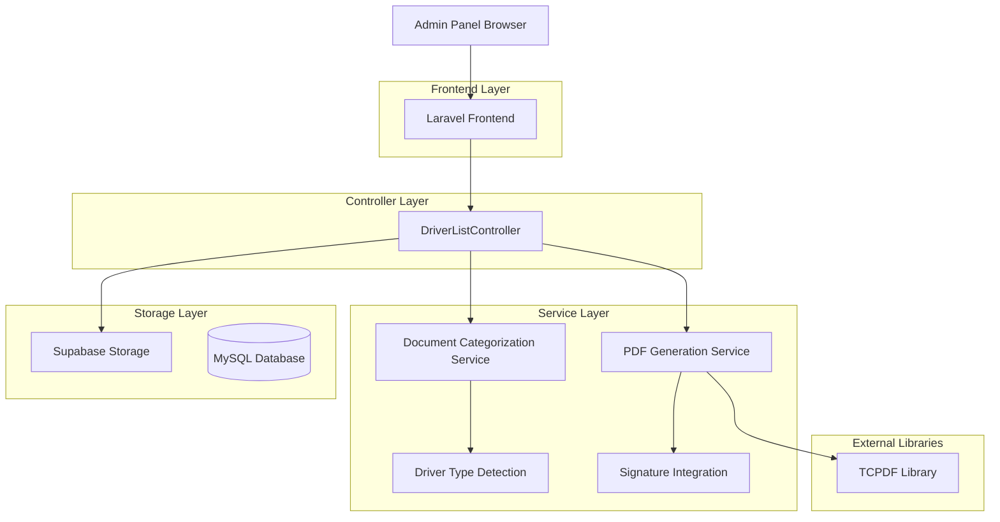
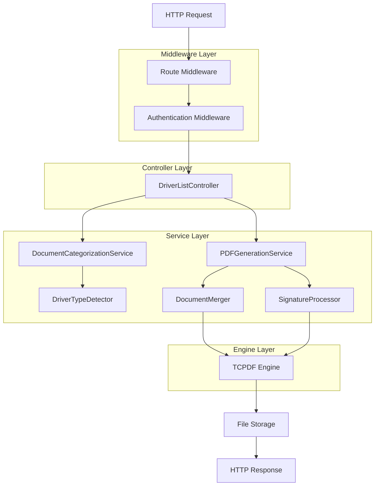
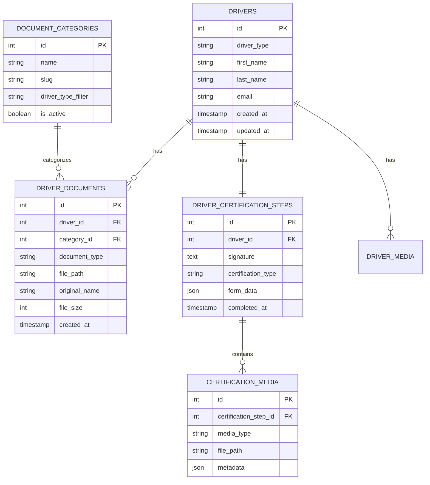

# Arquitectura Técnica para Sistema de PDFs de Conductores

## 1. Diseño de Arquitectura



## 2. Descripción de Tecnologías

- Frontend: Laravel Blade Templates + JavaScript + Bootstrap
- Backend: Laravel 10 + PHP 8.1
- PDF Generation: TCPDF Library
- Database: MySQL (existing)
- Storage: Supabase Storage (for document files)
- Authentication: Laravel built-in authentication

## 3. Definiciones de Rutas

| Ruta | Propósito |
|------|----------|
| /admin/drivers/{id} | Vista detallada del conductor con documentos categorizados |
| /admin/drivers/{id}/consolidated-pdf | Generar y descargar PDF consolidado |
| /admin/drivers/{id}/documents/filter | Filtrar documentos por tipo de conductor (AJAX) |
| /admin/drivers/{id}/regenerate-forms | Regenerar formularios con firma incluida |

## 4. Definiciones de API

### 4.1 APIs Core

#### Generar PDF Consolidado
```
GET /admin/drivers/{id}/consolidated-pdf
```

Request:
| Param Name | Param Type | isRequired | Description |
|------------|------------|------------|--------------|
| id | integer | true | ID del conductor |
| include_signature | boolean | false | Incluir firma en el PDF (default: true) |
| driver_type | string | false | Filtrar por tipo: 'owner_operator', 'third_party', 'all' |

Response:
| Param Name | Param Type | Description |
|------------|------------|-------------|
| file | binary | Archivo PDF consolidado |
| filename | string | Nombre del archivo generado |

Example Response Headers:
```
Content-Type: application/pdf
Content-Disposition: attachment; filename="driver_4_consolidated_documents.pdf"
```

#### Filtrar Documentos por Tipo
```
POST /admin/drivers/{id}/documents/filter
```

Request:
| Param Name | Param Type | isRequired | Description |
|------------|------------|------------|--------------|
| driver_type | string | true | Tipo de conductor: 'owner_operator', 'third_party', 'all' |
| categories | array | false | Categorías específicas a incluir |

Response:
| Param Name | Param Type | Description |
|------------|------------|-------------|
| documents | object | Documentos categorizados por tipo |
| total_count | integer | Total de documentos encontrados |

Example Request:
```json
{
  "driver_type": "owner_operator",
  "categories": ["certification", "license", "medical"]
}
```

Example Response:
```json
{
  "documents": {
    "owner_operator": {
      "certification": [
        {
          "id": 123,
          "name": "Certification Document",
          "url": "/storage/documents/cert_123.pdf",
          "size": "2.5 MB",
          "date": "2024-01-15"
        }
      ]
    }
  },
  "total_count": 15
}
```

## 5. Arquitectura del Servidor



## 6. Modelo de Datos

### 6.1 Definición del Modelo de Datos



### 6.2 Lenguaje de Definición de Datos (DDL)

#### Tabla de Categorías de Documentos
```sql
-- Crear tabla para categorías de documentos
CREATE TABLE document_categories (
    id BIGINT UNSIGNED PRIMARY KEY AUTO_INCREMENT,
    name VARCHAR(255) NOT NULL,
    slug VARCHAR(255) UNIQUE NOT NULL,
    driver_type_filter ENUM('owner_operator', 'third_party', 'all') DEFAULT 'all',
    is_active BOOLEAN DEFAULT TRUE,
    created_at TIMESTAMP DEFAULT CURRENT_TIMESTAMP,
    updated_at TIMESTAMP DEFAULT CURRENT_TIMESTAMP ON UPDATE CURRENT_TIMESTAMP
);

-- Crear índices
CREATE INDEX idx_document_categories_driver_type ON document_categories(driver_type_filter);
CREATE INDEX idx_document_categories_active ON document_categories(is_active);
```

#### Modificar Tabla de Conductores
```sql
-- Agregar campo driver_type si no existe
ALTER TABLE drivers ADD COLUMN driver_type ENUM('owner_operator', 'third_party') DEFAULT 'third_party';

-- Crear índice para driver_type
CREATE INDEX idx_drivers_type ON drivers(driver_type);
```

#### Tabla de Metadatos de Documentos
```sql
-- Crear tabla para metadatos adicionales de documentos
CREATE TABLE driver_document_metadata (
    id BIGINT UNSIGNED PRIMARY KEY AUTO_INCREMENT,
    driver_id BIGINT UNSIGNED NOT NULL,
    document_path VARCHAR(500) NOT NULL,
    document_type VARCHAR(100) NOT NULL,
    driver_type_context ENUM('owner_operator', 'third_party', 'general') NOT NULL,
    category_id BIGINT UNSIGNED,
    file_size BIGINT UNSIGNED,
    mime_type VARCHAR(100),
    is_consolidated BOOLEAN DEFAULT FALSE,
    consolidated_pdf_path VARCHAR(500),
    created_at TIMESTAMP DEFAULT CURRENT_TIMESTAMP,
    updated_at TIMESTAMP DEFAULT CURRENT_TIMESTAMP ON UPDATE CURRENT_TIMESTAMP,
    
    FOREIGN KEY (driver_id) REFERENCES drivers(id) ON DELETE CASCADE,
    FOREIGN KEY (category_id) REFERENCES document_categories(id) ON DELETE SET NULL
);

-- Crear índices
CREATE INDEX idx_driver_document_metadata_driver_id ON driver_document_metadata(driver_id);
CREATE INDEX idx_driver_document_metadata_type_context ON driver_document_metadata(driver_type_context);
CREATE INDEX idx_driver_document_metadata_consolidated ON driver_document_metadata(is_consolidated);
```

#### Datos Iniciales
```sql
-- Insertar categorías de documentos por defecto
INSERT INTO document_categories (name, slug, driver_type_filter) VALUES
('License Documents', 'license', 'all'),
('Medical Records', 'medical', 'all'),
('Training Certificates', 'training', 'all'),
('Owner Operator Certification', 'owner_certification', 'owner_operator'),
('Third Party Agreement', 'third_party_agreement', 'third_party'),
('Insurance Documents', 'insurance', 'owner_operator'),
('Vehicle Registration', 'vehicle_registration', 'owner_operator'),
('Employment Verification', 'employment_verification', 'third_party'),
('Background Check', 'background_check', 'all'),
('Drug Test Results', 'drug_test', 'all');

-- Actualizar drivers existentes con tipo por defecto
UPDATE drivers SET driver_type = 'third_party' WHERE driver_type IS NULL;
```

## 7. Servicios y Clases Principales

### 7.1 DocumentCategorizationService
```php
class DocumentCategorizationService
{
    public function categorizeByDriverType(Driver $driver): array
    public function getDocumentsByCategory(Driver $driver, string $driverType = 'all'): array
    public function filterDocumentsByType(Collection $documents, string $type): Collection
}
```

### 7.2 PDFGenerationService
```php
class PDFGenerationService
{
    public function generateConsolidatedPDF(Driver $driver, array $options = []): string
    public function includeSignature(TCPDF $pdf, string $signaturePath): void
    public function mergeDocuments(array $documentPaths): TCPDF
    public function addDocumentMetadata(TCPDF $pdf, Driver $driver): void
}
```

### 7.3 DriverTypeDetector
```php
class DriverTypeDetector
{
    public function detectType(Driver $driver): string
    public function getRequiredDocuments(string $driverType): array
    public function validateDocumentCompleteness(Driver $driver): array
}
```

## 8. Configuración de Implementación

### 8.1 Variables de Entorno
```env
# PDF Generation Settings
PDF_GENERATION_TIMEOUT=300
PDF_MAX_FILE_SIZE=50MB
PDF_INCLUDE_SIGNATURE=true
PDF_WATERMARK_ENABLED=false

# Document Storage
DOCUMENT_STORAGE_DISK=supabase
DOCUMENT_RETENTION_DAYS=2555  # 7 años
CONSOLIDATED_PDF_CACHE_TTL=3600
```

### 8.2 Configuración de Servicios
```php
// config/pdf.php
return [
    'default_engine' => 'tcpdf',
    'engines' => [
        'tcpdf' => [
            'class' => 'TCPDF',
            'options' => [
                'format' => 'A4',
                'orientation' => 'P',
                'unit' => 'mm',
                'unicode' => true,
                'encoding' => 'UTF-8'
            ]
        ]
    ],
    'signature' => [
        'include_by_default' => true,
        'position' => ['x' => 50, 'y' => 250],
        'size' => ['width' => 100, 'height' => 50]
    ],
    'consolidation' => [
        'max_documents' => 50,
        'cache_enabled' => true,
        'async_generation' => false
    ]
];
```