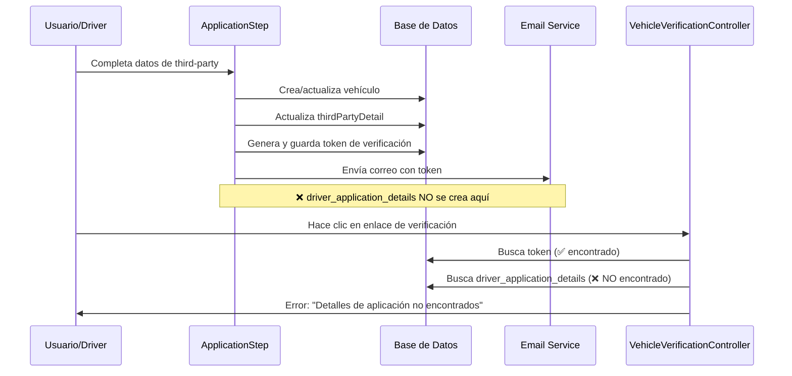
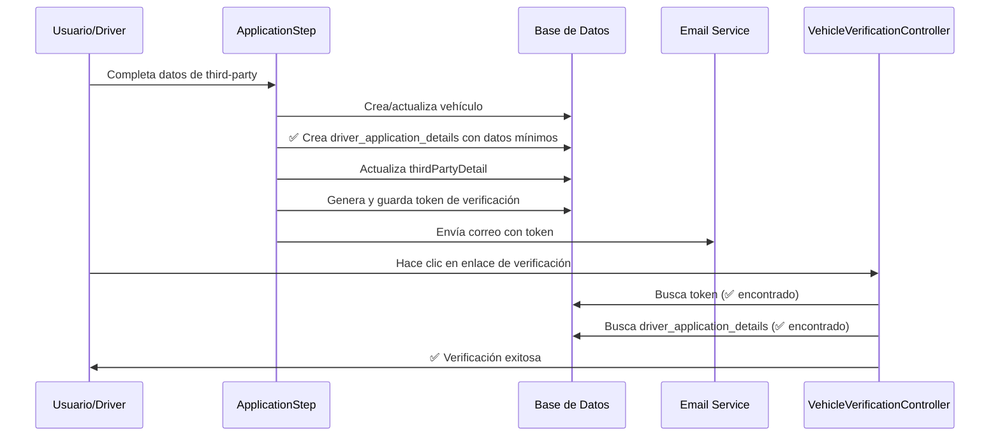

# Análisis y Solución: Problema de Timing en Verificación de Third-Party Drivers

## 1. Descripción del Problema

### Síntomas Observados
- El correo de verificación se envía correctamente al third-party driver
- Al hacer clic en el enlace de verificación, aparece el error: "Detalles de aplicación no encontrados"
- Los logs muestran que el token existe y es válido, pero `driver_application_details` no se encuentra

### Error en Logs
```
[2025-08-27 17:31:59] local.ERROR: Detalles de aplicación no encontrados {
  "token":"1b7083e1d12101d5c3a28e66c6f7ac14",
  "application_id":3,
  "verification_id":38,
  "application_exists":true,
  "details_relationship":false,
  "details_count":0
}
```

## 2. Análisis del Flujo Actual

### Flujo Problemático Identificado



### Momento de Creación de driver_application_details

Actualmente, `driver_application_details` se crea únicamente cuando:
1. El usuario navega entre pasos usando "Next" o "Previous"
2. Se ejecuta el método `saveApplicationDetails()` en el flujo normal

**Problema**: En el flujo de third-party, el correo se envía ANTES de que se creen los detalles de aplicación.

## 3. Análisis Técnico del Código

### Método sendThirdPartyEmail (Actual)
```php
public function sendThirdPartyEmail()
{
    // 1. Validación de datos
    // 2. Creación/actualización de vehículo
    // 3. Actualización de thirdPartyDetail
    // 4. Generación de token
    // 5. Envío de correo
    // ❌ NO crea driver_application_details
}
```

### VehicleVerificationController (Verificación)
```php
public function verify($token)
{
    // 1. Busca token ✅
    // 2. Busca driver_application_details ❌ (no existe)
    // 3. Retorna error
}
```

## 4. Propuesta de Solución

### Opción 1: Crear driver_application_details en sendThirdPartyEmail (Recomendada)



#### Implementación Propuesta

```php
public function sendThirdPartyEmail()
{
    DB::transaction(function () {
        // Validaciones existentes...
        
        // Crear/actualizar vehículo
        $vehicle = $this->createOrUpdateVehicle();
        
        // ✅ NUEVO: Crear driver_application_details con datos mínimos
        $applicationDetails = DriverApplicationDetail::updateOrCreate(
            [
                'driver_application_id' => $this->driverApplication->id,
                'vehicle_id' => $vehicle->id
            ],
            [
                'applying_position' => $this->applying_position ?? 'third_party_driver',
                'applying_location' => 'Various Locations',
                'how_did_hear' => 'Third Party Referral',
                'expected_pay' => 0.00,
                'eligible_to_work' => true,
                'can_speak_english' => true,
                'has_twic_card' => false
            ]
        );
        
        // Actualizar thirdPartyDetail
        $this->updateThirdPartyDetails($vehicle);
        
        // Generar token y enviar correo
        $this->generateTokenAndSendEmail($vehicle);
    });
}
```

### Opción 2: Modificar VehicleVerificationController (Alternativa)

Modificar el controlador para crear `driver_application_details` si no existe durante la verificación:

```php
public function verify($token)
{
    // Buscar token...
    
    // Si no existen driver_application_details, crearlos
    if (!$verification->driverApplication->driverApplicationDetails()->exists()) {
        $this->createMinimalApplicationDetails($verification);
    }
    
    // Continuar con verificación...
}
```

## 5. Consideraciones Técnicas

### Ventajas de la Opción 1 (Recomendada)
- ✅ Soluciona el problema en el origen
- ✅ Mantiene la consistencia de datos
- ✅ No requiere cambios en el controlador de verificación
- ✅ Sigue el principio de "crear datos cuando se necesitan"

### Campos Mínimos Requeridos
Basándose en la migración `driver_application_details`:

```php
// Campos obligatorios sin default
'applying_position' => 'third_party_driver',
'applying_location' => 'Various Locations', 
'how_did_hear' => 'Third Party Referral',
'expected_pay' => 0.00,

// Campos con defaults seguros para third-party
'eligible_to_work' => true,
'can_speak_english' => true,
'has_twic_card' => false
```

### Validaciones Adicionales
- Verificar que `driver_application_id` existe
- Asegurar que `vehicle_id` es válido
- Mantener transaccionalidad para rollback en caso de error

## 6. Plan de Implementación

### Paso 1: Modificar sendThirdPartyEmail
1. Agregar creación de `driver_application_details` dentro de la transacción
2. Usar `updateOrCreate` para evitar duplicados
3. Establecer valores por defecto apropiados para third-party

### Paso 2: Testing
1. Probar flujo completo de third-party registration
2. Verificar que el enlace de verificación funciona
3. Confirmar que no se crean registros duplicados

### Paso 3: Logging Mejorado
1. Agregar logs para confirmar creación de `driver_application_details`
2. Mantener logs existentes para debugging

## 7. Código de Implementación Final

```php
// En ApplicationStep.php - método sendThirdPartyEmail
DB::transaction(function () {
    // Validaciones y creación de vehículo...
    $vehicle = $this->createOrUpdateVehicle();
    
    // Crear driver_application_details para third-party
    $applicationDetails = DriverApplicationDetail::updateOrCreate(
        [
            'driver_application_id' => $this->driverApplication->id,
            'vehicle_id' => $vehicle->id
        ],
        [
            'applying_position' => $this->applying_position ?? 'third_party_driver',
            'applying_location' => 'Various Locations',
            'how_did_hear' => 'Third Party Referral',
            'expected_pay' => 0.00,
            'eligible_to_work' => true,
            'can_speak_english' => true,
            'has_twic_card' => false
        ]
    );
    
    Log::info('Driver application details created for third-party', [
        'application_id' => $this->driverApplication->id,
        'vehicle_id' => $vehicle->id,
        'details_id' => $applicationDetails->id
    ]);
    
    // Continuar con el resto del flujo...
});
```

Esta solución asegura que los `driver_application_details` estén disponibles cuando el usuario haga clic en el enlace de verificación, eliminando el error "Detalles de aplicación no encontrados".
