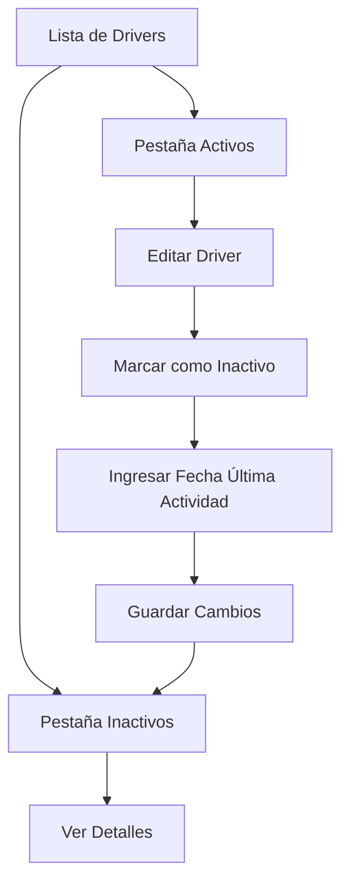

# Requerimientos del Producto: Gestión de Drivers Inactivos

## 1. Descripción General del Producto

Implementar funcionalidad para gestionar drivers que ya no trabajan con la empresa, permitiendo marcarlos como inactivos y registrar su fecha de última actividad. Esta funcionalidad mejora el control de personal y proporciona un historial completo de la relación laboral.

## 2. Características Principales

### 2.1 Roles de Usuario

| Rol | Método de Registro | Permisos Principales |
|-----|-------------------|---------------------|
| Administrador | Acceso directo al sistema | Puede marcar drivers como inactivos, ver historial completo |
| Superadministrador | Acceso completo | Gestión total de drivers activos e inactivos |

### 2.2 Módulo de Características

Nuestros requerimientos para la gestión de drivers inactivos consisten en las siguientes páginas principales:

1. **Lista de Drivers**: vista principal con pestañas para drivers activos e inactivos, filtros por estado.
2. **Formulario de Edición de Driver**: campos adicionales para marcar como inactivo y fecha de última actividad.
3. **Vista de Detalles de Driver**: información completa incluyendo historial de actividad.

### 2.3 Detalles de Páginas

| Nombre de Página | Nombre del Módulo | Descripción de Características |
|------------------|-------------------|-------------------------------|
| Lista de Drivers | Tabla de Drivers Activos | Mostrar drivers activos con información básica, botones de acción |
| Lista de Drivers | Tabla de Drivers Inactivos | Mostrar drivers inactivos con fecha de última actividad, razón de inactividad |
| Formulario de Edición | Campo Estado del Driver | Toggle para marcar como activo/inactivo con validación |
| Formulario de Edición | Campo Fecha de Última Actividad | Selector de fecha que se habilita cuando se marca como inactivo |
| Formulario de Edición | Campo Razón de Inactividad | Campo de texto opcional para documentar motivo |
| Vista de Detalles | Historial de Actividad | Mostrar cronología de cambios de estado del driver |

## 3. Proceso Principal

### Flujo de Administrador

1. El administrador accede a la lista de drivers
2. Selecciona un driver activo para editar
3. Cambia el estado a "Inactivo"
4. Ingresa la fecha de última actividad
5. Opcionalmente agrega una razón de inactividad
6. Guarda los cambios
7. El driver aparece ahora en la pestaña de "Drivers Inactivos"

### Flujo de Consulta

1. El usuario accede a la lista de drivers
2. Puede alternar entre pestañas "Activos" e "Inactivos"
3. Filtra por fechas de inactividad si es necesario
4. Ve detalles completos del historial del driver

## 4. Diseño de Interfaz de Usuario

### 4.1 Estilo de Diseño

- **Colores primarios**: Azul (#3B82F6) para elementos activos, Rojo (#EF4444) para elementos inactivos
- **Colores secundarios**: Gris (#6B7280) para texto secundario, Verde (#10B981) para acciones positivas
- **Estilo de botones**: Redondeados con sombra sutil
- **Fuente**: Inter, tamaños 14px para texto normal, 16px para títulos
- **Estilo de layout**: Basado en tarjetas con navegación por pestañas
- **Iconos**: Lucide icons para consistencia con el sistema existente

### 4.2 Descripción General del Diseño de Páginas

| Nombre de Página | Nombre del Módulo | Elementos de UI |
|------------------|-------------------|----------------|
| Lista de Drivers | Navegación por Pestañas | Pestañas "Activos" e "Inactivos" con contadores, colores diferenciados |
| Lista de Drivers | Tabla de Drivers Inactivos | Columna adicional "Fecha Última Actividad", badge rojo "Inactivo" |
| Formulario de Edición | Campo Estado | Toggle switch con colores verde/rojo, etiquetas "Activo"/"Inactivo" |
| Formulario de Edición | Campo Fecha | Date picker que se habilita condicionalmente, validación de fecha |
| Vista de Detalles | Timeline de Actividad | Línea de tiempo vertical con iconos de estado, fechas destacadas |

### 4.3 Responsividad

La interfaz será responsive-first con adaptación móvil, optimizada para touch en dispositivos móviles y tablets. Las tablas se convertirán en cards apiladas en pantallas pequeñas.