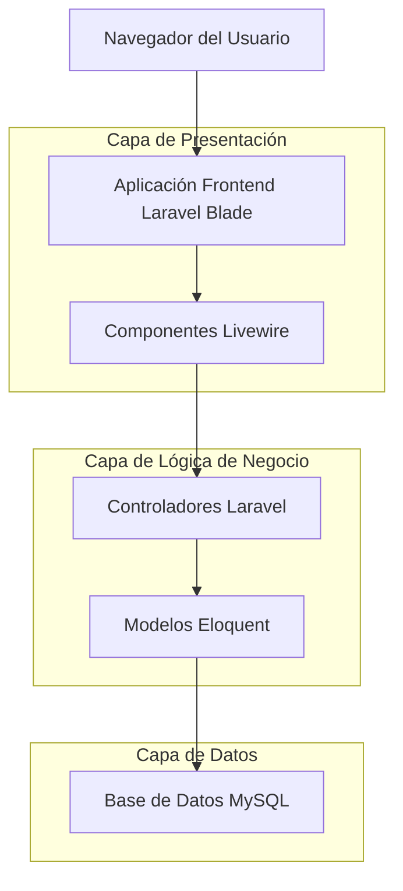
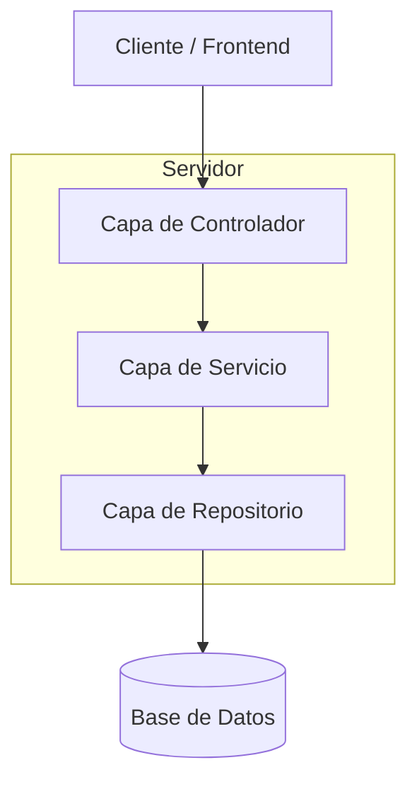
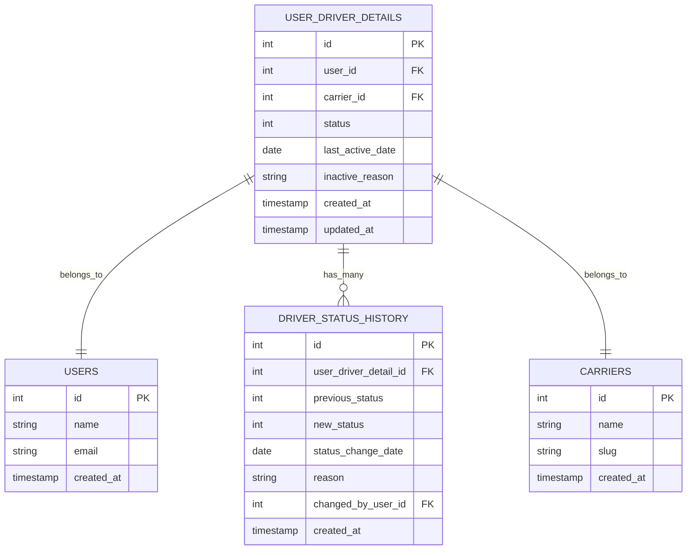

# Arquitectura Técnica: Gestión de Drivers Inactivos

## 1. Diseño de Arquitectura



## 2. Descripción de Tecnologías

* Frontend: Laravel Blade + Livewire + TailwindCSS + Alpine.js

* Backend: Laravel 10 + Eloquent ORM

* Base de Datos: MySQL (existente)

## 3. Definiciones de Rutas

| Ruta                                              | Propósito                                                 |
| ------------------------------------------------- | --------------------------------------------------------- |
| /admin/carrier/{carrier}/drivers                  | Lista principal de drivers con pestañas activos/inactivos |
| /admin/carrier/{carrier}/drivers/{driver}/edit    | Formulario de edición con campos de estado e inactividad  |
| /admin/carrier/{carrier}/drivers/inactive         | Vista filtrada de drivers inactivos                       |
| /admin/carrier/{carrier}/drivers/{driver}/history | Historial de cambios de estado del driver                 |

## 4. Definiciones de API

### 4.1 API Principal

Actualización de estado de driver

```
PATCH /api/drivers/{id}/status
```

Request:

| Nombre del Parámetro | Tipo de Parámetro | Es Requerido | Descripción                                       |
| -------------------- | ----------------- | ------------ | ------------------------------------------------- |
| status               | integer           | true         | Estado del driver (0=inactivo, 1=activo)          |
| last\_active\_date   | date              | false        | Fecha de última actividad (requerido si status=0) |
| inactive\_reason     | string            | false        | Razón de la inactividad                           |

Response:

| Nombre del Parámetro | Tipo de Parámetro | Descripción                   |
| -------------------- | ----------------- | ----------------------------- |
| success              | boolean           | Estado de la respuesta        |
| message              | string            | Mensaje de confirmación       |
| data                 | object            | Datos actualizados del driver |

Ejemplo:

```json
{
  "status": 0,
  "last_active_date": "2024-01-15",
  "inactive_reason": "Terminación de contrato"
}
```

## 5. Diagrama de Arquitectura del Servidor



## 6. Modelo de Datos

### 6.1 Definición del Modelo de Datos



### 6.2 Lenguaje de Definición de Datos

Migración para agregar campos de inactividad

```sql
-- Agregar campos a la tabla existente user_driver_details
ALTER TABLE user_driver_details 
ADD COLUMN last_active_date DATE NULL AFTER status,
ADD COLUMN inactive_reason TEXT NULL AFTER last_active_date;

-- Crear índices para optimizar consultas
CREATE INDEX idx_user_driver_details_status ON user_driver_details(status);
CREATE INDEX idx_user_driver_details_last_active ON user_driver_details(last_active_date);

-- Crear tabla de historial de cambios de estado
CREATE TABLE driver_status_history (
    id BIGINT UNSIGNED PRIMARY KEY AUTO_INCREMENT,
    user_driver_detail_id BIGINT UNSIGNED NOT NULL,
    previous_status TINYINT NOT NULL,
    new_status TINYINT NOT NULL,
    status_change_date DATE NOT NULL,
    reason TEXT NULL,
    changed_by_user_id BIGINT UNSIGNED NULL,
    created_at TIMESTAMP DEFAULT CURRENT_TIMESTAMP,
    
    FOREIGN KEY (user_driver_detail_id) REFERENCES user_driver_details(id) ON DELETE CASCADE,
    FOREIGN KEY (changed_by_user_id) REFERENCES users(id) ON DELETE SET NULL
);

-- Crear índices para la tabla de historial
CREATE INDEX idx_driver_status_history_driver_id ON driver_status_history(user_driver_detail_id);
CREATE INDEX idx_driver_status_history_date ON driver_status_history(status_change_date DESC);

-- Datos iniciales: actualizar drivers existentes como activos
UPDATE user_driver_details 
SET status = 1 
WHERE status IS NULL OR status = 0;
```

Actualización del modelo UserDriverDetail

```php
// Agregar a $fillable
protected $fillable = [
    // ... campos existentes
    'last_active_date',
    'inactive_reason',
];

// Agregar a $casts
protected $casts = [
    // ... casts existentes
    'last_active_date' => 'date',
];

// Agregar relación
public function statusHistory()
{
    return $this->hasMany(DriverStatusHistory::class);
}

// Agregar scopes
public function scopeActive($query)
{
    return $query->where('status', self::STATUS_ACTIVE);
}

public function scopeInactive($query)
{
    return $query->where('status', self::STATUS_INACTIVE);
}
```

