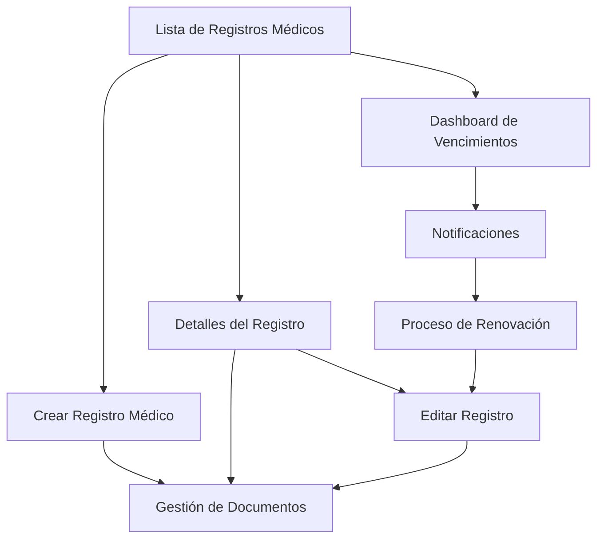

## 1. Product Overview

Sistema integral de gestión de registros médicos para conductores que permite administrar certificaciones médicas, fechas de vencimiento, documentos asociados y seguimiento del estado de las calificaciones médicas de los conductores.

El sistema se integra con la gestión existente de conductores y proporciona funcionalidades completas de CRUD, gestión de documentos y notificaciones para registros médicos que están próximos a vencer.

## 2. Core Features

### 2.1 User Roles

| Role | Registration Method | Core Permissions |
|------|---------------------|------------------|
| Admin | Sistema interno | Acceso completo a gestión de registros médicos, creación, edición, eliminación |
| Supervisor | Asignación por Admin | Visualización y edición de registros médicos de su área |
| Viewer | Asignación por Admin | Solo visualización de registros médicos |

### 2.2 Feature Module

Nuestro sistema de registros médicos consta de las siguientes páginas principales:

1. **Lista de Registros Médicos**: listado principal, filtros de búsqueda, estadísticas de estado, exportación de datos.
2. **Crear Registro Médico**: formulario de creación, validaciones, asociación con conductor.
3. **Detalles del Registro**: información completa, historial de cambios, documentos asociados.
4. **Editar Registro**: modificación de datos, actualización de fechas, cambio de estado.
5. **Gestión de Documentos**: subida de certificados médicos, visualización, eliminación de archivos.
6. **Dashboard de Vencimientos**: alertas de registros próximos a vencer, notificaciones automáticas.

### 2.3 Page Details

| Page Name | Module Name | Feature description |
|-----------|-------------|---------------------|
| Lista de Registros Médicos | Listado Principal | Mostrar todos los registros médicos con filtros por conductor, estado, fecha de vencimiento, centro médico |
| Lista de Registros Médicos | Estadísticas | Mostrar contadores de registros activos, vencidos, próximos a vencer |
| Lista de Registros Médicos | Acciones Masivas | Exportar a Excel/PDF, enviar notificaciones masivas |
| Crear Registro Médico | Formulario Principal | Capturar número de registro, conductor asociado, fecha de examen, fecha de vencimiento |
| Crear Registro Médico | Información Médica | Capturar centro médico, nombre del doctor, número de registro del médico |
| Crear Registro Médico | Estado y Validaciones | Establecer estado inicial, validar fechas, verificar duplicados |
| Detalles del Registro | Información General | Mostrar todos los datos del registro médico, conductor asociado |
| Detalles del Registro | Documentos Asociados | Listar certificados médicos, resultados de exámenes, documentos adicionales |
| Detalles del Registro | Historial de Cambios | Mostrar log de modificaciones, fechas de actualización |
| Editar Registro | Formulario de Edición | Modificar datos del registro, actualizar fechas, cambiar estado |
| Editar Registro | Validaciones | Verificar integridad de datos, validar fechas futuras |
| Gestión de Documentos | Subida de Archivos | Permitir subir certificados médicos, resultados de exámenes |
| Gestión de Documentos | Visualización | Previsualizar documentos PDF/imágenes, descargar archivos |
| Gestión de Documentos | Organización | Categorizar documentos por tipo, gestionar colecciones |
| Dashboard de Vencimientos | Alertas Activas | Mostrar registros que vencen en 30, 60, 90 días |
| Dashboard de Vencimientos | Notificaciones | Enviar emails automáticos, recordatorios programados |

## 3. Core Process

### Flujo Principal de Gestión de Registros Médicos

1. **Creación de Registro**: El administrador accede a la lista de registros médicos y selecciona "Crear Nuevo Registro"
2. **Selección de Conductor**: Se selecciona el conductor desde una lista filtrable de conductores activos
3. **Captura de Información**: Se completa el formulario con datos del examen médico, centro médico y doctor
4. **Subida de Documentos**: Se suben los certificados médicos y documentos relacionados
5. **Validación y Guardado**: El sistema valida la información y guarda el registro
6. **Notificaciones**: Se configuran alertas automáticas para fechas de vencimiento

### Flujo de Seguimiento y Renovación

1. **Monitoreo Automático**: El sistema revisa diariamente los registros próximos a vencer
2. **Generación de Alertas**: Se crean notificaciones 90, 60 y 30 días antes del vencimiento
3. **Envío de Notificaciones**: Se envían emails automáticos al conductor y supervisor
4. **Proceso de Renovación**: El conductor programa nuevo examen médico
5. **Actualización de Registro**: Se actualiza el registro con nueva información médica

## 4. User Interface Design

### 4.1 Design Style

- **Colores Primarios**: Azul (#3B82F6) para acciones principales, Verde (#10B981) para estados activos
- **Colores Secundarios**: Gris (#6B7280) para texto secundario, Rojo (#EF4444) para alertas y vencimientos
- **Estilo de Botones**: Botones redondeados con sombras sutiles, estilo moderno flat design
- **Tipografía**: Inter o system fonts, tamaños 14px para texto normal, 16px para títulos
- **Layout**: Diseño basado en tarjetas con navegación superior, sidebar colapsible
- **Iconos**: Lucide icons para consistencia con el sistema existente

### 4.2 Page Design Overview

| Page Name | Module Name | UI Elements |
|-----------|-------------|-------------|
| Lista de Registros Médicos | Header Principal | Título "Medical Records", botón "+ New Record" (azul), contadores de estado con colores distintivos |
| Lista de Registros Médicos | Filtros | Barra de búsqueda, filtros por estado (dropdown), rango de fechas (date picker), filtro por conductor |
| Lista de Registros Médicos | Tabla de Datos | Tabla responsive con columnas: Conductor, Número de Registro, Centro Médico, Fecha Vencimiento, Estado, Acciones |
| Crear Registro Médico | Formulario | Layout de 2 columnas, campos con labels claros, validaciones en tiempo real, botones "Save" y "Cancel" |
| Detalles del Registro | Card Principal | Card con información del registro, badges para estado, sección de documentos con thumbnails |
| Gestión de Documentos | Upload Area | Drag & drop area, progress bars, thumbnails de documentos, botones de acción (view, download, delete) |
| Dashboard de Vencimientos | Cards de Alerta | Cards con colores de alerta (amarillo, naranja, rojo), contadores grandes, listas de registros críticos |

### 4.3 Responsiveness

El sistema está diseñado mobile-first con adaptación completa para desktop. Incluye optimización táctil para tablets, navegación colapsible en móviles y tablas responsive con scroll horizontal cuando sea necesario.