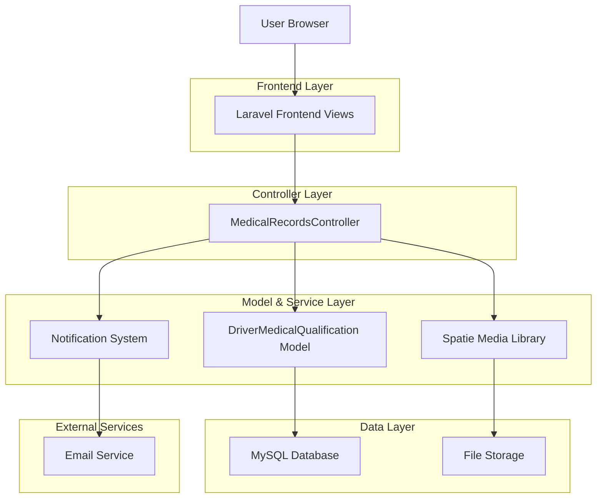
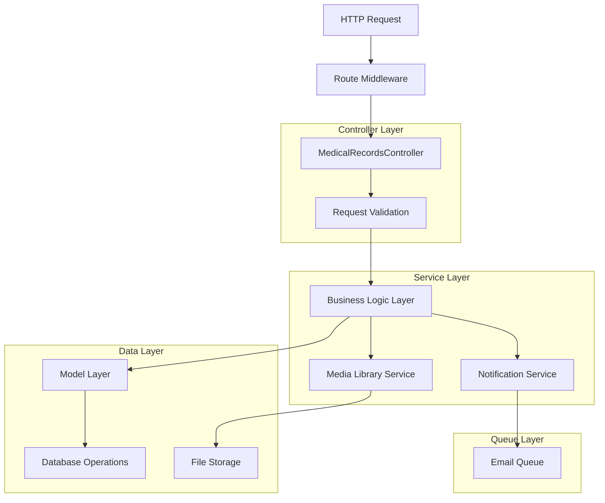
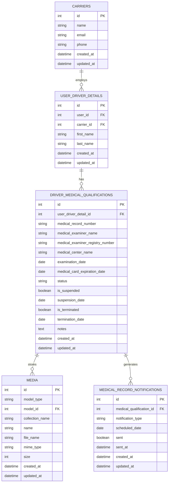

## 1. Architecture design



## 2. Technology Description

- Frontend: Laravel Blade Templates + TailwindCSS + Lucide Icons + Alpine.js
- Backend: Laravel 10 + Spatie Media Library + Laravel Notifications
- Database: MySQL (existing structure)
- File Storage: Local Storage (public disk)
- Authentication: Laravel Sanctum (existing)

## 3. Route definitions

| Route | Purpose |
|-------|----------|
| /admin/medical-records | Lista principal de registros médicos con filtros y paginación |
| /admin/medical-records/create | Formulario para crear nuevo registro médico |
| /admin/medical-records/{id} | Vista detallada de un registro médico específico |
| /admin/medical-records/{id}/edit | Formulario para editar registro médico existente |
| /admin/medical-records/{id}/documents | Gestión de documentos del registro médico |
| /admin/medical-records/dashboard | Dashboard de vencimientos y alertas |
| /admin/medical-records/export | Exportación de datos a Excel/PDF |

## 4. API definitions

### 4.1 Core API

**Listar registros médicos**
```
GET /admin/medical-records
```

Request Parameters:
| Param Name | Param Type | isRequired | Description |
|------------|------------|------------|-------------|
| search_term | string | false | Término de búsqueda para filtrar registros |
| status | string | false | Filtro por estado (active, expired, pending) |
| driver_id | integer | false | ID del conductor para filtrar |
| expiration_from | date | false | Fecha inicio para filtro de vencimiento |
| expiration_to | date | false | Fecha fin para filtro de vencimiento |

Response:
| Param Name | Param Type | Description |
|------------|------------|-------------|
| data | array | Lista paginada de registros médicos |
| pagination | object | Información de paginación |
| statistics | object | Contadores de estado |

**Crear registro médico**
```
POST /admin/medical-records
```

Request:
| Param Name | Param Type | isRequired | Description |
|------------|------------|------------|-------------|
| user_driver_detail_id | integer | true | ID del conductor |
| medical_record_number | string | true | Número único del registro médico |
| medical_examiner_name | string | true | Nombre del médico examinador |
| medical_center_name | string | true | Nombre del centro médico |
| examination_date | date | true | Fecha del examen médico |
| expiration_date | date | true | Fecha de vencimiento del certificado |
| status | string | true | Estado del registro (active, expired, pending) |

Response:
| Param Name | Param Type | Description |
|------------|------------|-------------|
| success | boolean | Estado de la operación |
| data | object | Datos del registro creado |
| message | string | Mensaje de confirmación |

**Subir documentos**
```
POST /admin/medical-records/{id}/upload-documents
```

Request:
| Param Name | Param Type | isRequired | Description |
|------------|------------|------------|-------------|
| documents | file[] | true | Archivos de documentos médicos |
| collection | string | true | Tipo de documento (medical_certificate, test_results, additional) |

Response:
| Param Name | Param Type | Description |
|------------|------------|-------------|
| success | boolean | Estado de la operación |
| uploaded_files | array | Lista de archivos subidos |

## 5. Server architecture diagram



## 6. Data model

### 6.1 Data model definition



### 6.2 Data Definition Language

**Actualización de tabla driver_medical_qualifications**
```sql
-- Agregar campos adicionales para el sistema de medical records
ALTER TABLE driver_medical_qualifications ADD COLUMN IF NOT EXISTS medical_record_number VARCHAR(255) UNIQUE;
ALTER TABLE driver_medical_qualifications ADD COLUMN IF NOT EXISTS medical_center_name VARCHAR(255);
ALTER TABLE driver_medical_qualifications ADD COLUMN IF NOT EXISTS examination_date DATE;
ALTER TABLE driver_medical_qualifications ADD COLUMN IF NOT EXISTS status ENUM('active', 'expired', 'pending', 'suspended') DEFAULT 'active';
ALTER TABLE driver_medical_qualifications ADD COLUMN IF NOT EXISTS notes TEXT;

-- Crear índices para optimizar consultas
CREATE INDEX idx_medical_qualifications_status ON driver_medical_qualifications(status);
CREATE INDEX idx_medical_qualifications_expiration ON driver_medical_qualifications(medical_card_expiration_date);
CREATE INDEX idx_medical_qualifications_driver ON driver_medical_qualifications(user_driver_detail_id);
CREATE INDEX idx_medical_qualifications_record_number ON driver_medical_qualifications(medical_record_number);
```

**Tabla para notificaciones de registros médicos**
```sql
-- Crear tabla para gestionar notificaciones automáticas
CREATE TABLE medical_record_notifications (
    id BIGINT UNSIGNED AUTO_INCREMENT PRIMARY KEY,
    medical_qualification_id BIGINT UNSIGNED NOT NULL,
    notification_type ENUM('30_days', '60_days', '90_days', 'expired') NOT NULL,
    scheduled_date DATE NOT NULL,
    sent BOOLEAN DEFAULT FALSE,
    sent_at TIMESTAMP NULL,
    created_at TIMESTAMP DEFAULT CURRENT_TIMESTAMP,
    updated_at TIMESTAMP DEFAULT CURRENT_TIMESTAMP ON UPDATE CURRENT_TIMESTAMP,
    
    FOREIGN KEY (medical_qualification_id) REFERENCES driver_medical_qualifications(id) ON DELETE CASCADE,
    INDEX idx_notifications_scheduled (scheduled_date, sent),
    INDEX idx_notifications_medical_id (medical_qualification_id)
);
```

**Configuración de colecciones de media para documentos médicos**
```sql
-- Los documentos se gestionan a través de Spatie Media Library
-- Las colecciones definidas en el modelo son:
-- 'medical_certificate' - Certificados médicos principales
-- 'test_results' - Resultados de exámenes y pruebas
-- 'additional_documents' - Documentos adicionales relacionados

-- Datos iniciales para testing
INSERT INTO driver_medical_qualifications (
    user_driver_detail_id, 
    medical_record_number, 
    medical_examiner_name, 
    medical_examiner_registry_number, 
    medical_center_name,
    examination_date,
    medical_card_expiration_date, 
    status
) VALUES 
(1, 'MED-2024-001', 'Dr. John Smith', 'REG123456', 'City Medical Center', '2024-01-15', '2026-01-15', 'active'),
(2, 'MED-2024-002', 'Dr. Sarah Johnson', 'REG789012', 'Highway Health Clinic', '2024-02-20', '2026-02-20', 'active');
```