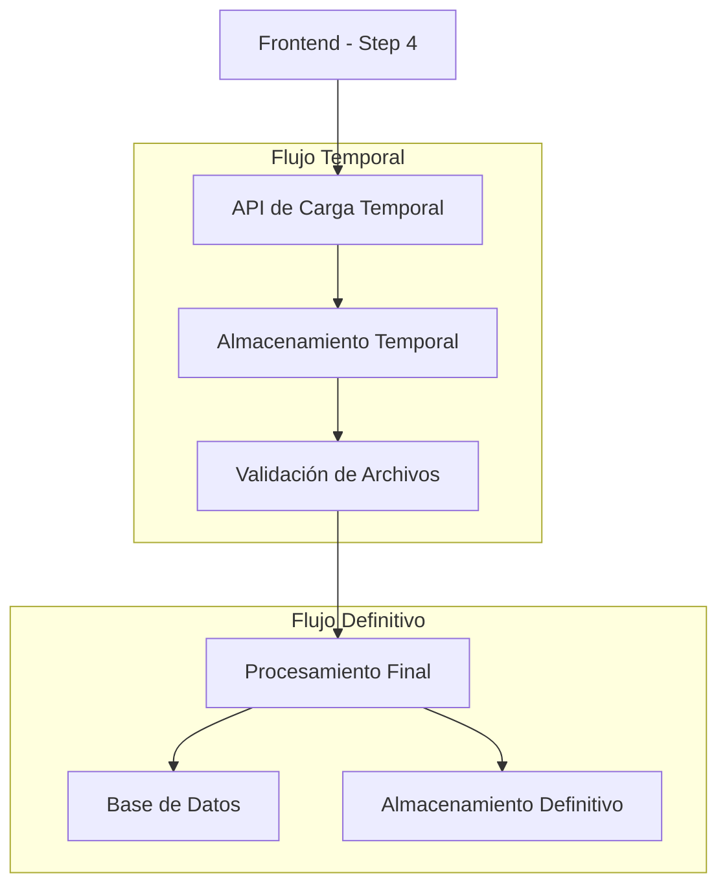

# Mejora del Flujo de Carga de Licencias de Conductor

## 1. Análisis del Problema Actual

### 1.1 Descripción del Problema

En el step 4 del registro de conductores, existe un problema de dependencia circular:

* Se intenta subir fotos de licencias que aún no existen en la base de datos

* El CustomPathGenerator requiere un modelo UserDriverDetail existente para generar las rutas

* Esto causa fallos en la carga de archivos y una experiencia de usuario deficiente

### 1.2 Código Actual Problemático

```php
if ($model instanceof \App\Models\UserDriverDetail) {
    $driverId = $model->id ?? 'unknown';
    $collection = $media->collection_name;
    
    if ($collection === 'license_front') {
        return "driver/{$driverId}/licenses/front/";
    } elseif ($collection === 'license_back') {
        return "driver/{$driverId}/licenses/back/";
    }
    
    return "driver/{$model->id}/";
}
```

## 2. Propuesta de Solución

### 2.1 Arquitectura Propuesta



### 2.2 Componentes de la Solución

#### 2.2.1 API de Carga Temporal

* **Endpoint**: `POST /api/driver/upload-license-temp`

* **Propósito**: Recibir archivos antes de que exista el registro del conductor

* **Almacenamiento**: Directorio temporal con identificador único de sesión

#### 2.2.2 CustomPathGenerator Mejorado

```php
public function getPath(Media $media): string
{
    $model = $media->model;
    
    // Manejo para carga temporal
    if ($model instanceof \App\Models\TempDriverUpload) {
        $sessionId = $model->session_id;
        $collection = $media->collection_name;
        
        return "temp/driver/{$sessionId}/{$collection}/";
    }
    
    // Manejo para registros definitivos
    if ($model instanceof \App\Models\UserDriverDetail) {
        $driverId = $model->id;
        $collection = $media->collection_name;
        
        if (in_array($collection, ['license_front', 'license_back'])) {
            $side = str_replace('license_', '', $collection);
            return "driver/{$driverId}/licenses/{$side}/";
        }
        
        return "driver/{$driverId}/";
    }
    
    return 'uploads/';
}
```

## 3. Implementación Técnica

### 3.1 Modelo Temporal

```php
// app/Models/TempDriverUpload.php
class TempDriverUpload extends Model
{
    protected $fillable = [
        'session_id',
        'file_type',
        'original_name',
        'temp_path',
        'expires_at'
    ];
    
    protected $casts = [
        'expires_at' => 'datetime'
    ];
}
```

### 3.2 API Controller

```php
// app/Http/Controllers/Api/TempUploadController.php
class TempUploadController extends Controller
{
    public function uploadLicense(Request $request)
    {
        $request->validate([
            'file' => 'required|image|max:5120', // 5MB max
            'type' => 'required|in:license_front,license_back',
            'session_id' => 'required|string'
        ]);
        
        $sessionId = $request->session_id;
        $fileType = $request->type;
        
        // Crear modelo temporal
        $tempUpload = TempDriverUpload::create([
            'session_id' => $sessionId,
            'file_type' => $fileType,
            'original_name' => $request->file('file')->getClientOriginalName(),
            'expires_at' => now()->addHours(24)
        ]);
        
        // Subir archivo usando Spatie Media Library
        $media = $tempUpload
            ->addMediaFromRequest('file')
            ->toMediaCollection($fileType);
            
        return response()->json([
            'success' => true,
            'temp_id' => $tempUpload->id,
            'media_id' => $media->id,
            'preview_url' => $media->getUrl()
        ]);
    }
}
```

### 3.3 Servicio de Migración

```php
// app/Services/LicenseMigrationService.php
class LicenseMigrationService
{
    public function migrateTempToFinal(string $sessionId, UserDriverDetail $driver)
    {
        $tempUploads = TempDriverUpload::where('session_id', $sessionId)
            ->with('media')
            ->get();
            
        foreach ($tempUploads as $tempUpload) {
            foreach ($tempUpload->getMedia() as $media) {
                // Mover archivo del almacenamiento temporal al definitivo
                $newMedia = $driver
                    ->addMediaFromUrl($media->getUrl())
                    ->toMediaCollection($tempUpload->file_type);
                    
                // Eliminar archivo temporal
                $media->delete();
            }
            
            $tempUpload->delete();
        }
    }
}
```

## 4. Flujo de Usuario Mejorado

### 4.1 Proceso Paso a Paso

1. **Carga Inicial (Step 4)**

   * Usuario selecciona archivos de licencia

   * Se genera un `session_id` único

   * Archivos se suben a almacenamiento temporal

   * Se muestra preview inmediato

2. **Validación**

   * Verificación de formato y tamaño

   * Validación de contenido (opcional: OCR)

   * Feedback inmediato al usuario

3. **Finalización del Registro**

   * Usuario completa todos los pasos

   * Se crea el registro UserDriverDetail

   * Se migran archivos temporales al almacenamiento definitivo

   * Se eliminan archivos temporales

### 4.2 Manejo de Errores

* **Timeout de Sesión**: Archivos temporales se eliminan automáticamente después de 24 horas

* **Fallo en Migración**: Se mantienen archivos temporales para reintento

* **Validación Fallida**: Se permite resubir archivos sin perder progreso

## 5. Ventajas de la Solución

### 5.1 Beneficios Técnicos

* ✅ Elimina dependencia circular

* ✅ Permite preview inmediato de archivos

* ✅ Manejo robusto de errores

* ✅ Limpieza automática de archivos temporales

* ✅ Escalabilidad mejorada

### 5.2 Beneficios de UX

* ✅ Carga de archivos más rápida y confiable

* ✅ Feedback visual inmediato

* ✅ Posibilidad de corregir archivos sin perder progreso

* ✅ Proceso de registro más fluido

## 6. Consideraciones de Implementación

### 6.1 Seguridad

* Validación estricta de tipos de archivo

* Límites de tamaño apropiados

* Sanitización de nombres de archivo

* Tokens de sesión seguros

### 6.2 Performance

* Compresión automática de imágenes

* Limpieza programada de archivos temporales

* Índices de base de datos optimizados

* CDN para servir archivos estáticos

### 6.3 Monitoreo

* Logs detallados de carga de archivos

* Métricas de éxito/fallo

* Alertas por acumulación de archivos temporales

* Dashboard de estado del sistema

## 7. Plan de Migración

### 7.1 Fase 1: Preparación

* Crear modelo TempDriverUpload

* Implementar API de carga temporal

* Actualizar CustomPathGenerator

### 7.2 Fase 2: Integración

* Modificar frontend del Step 4

* Implementar servicio de migración

* Agregar limpieza automática

### 7.3 Fase 3: Optimización

* Implementar compresión de imágenes

* Agregar validación avanzada

* Optimizar performance

### 7.4 Fase 4: Monitoreo

* Implementar logging detallado

* Configurar alertas

* Dashboard de métricas

