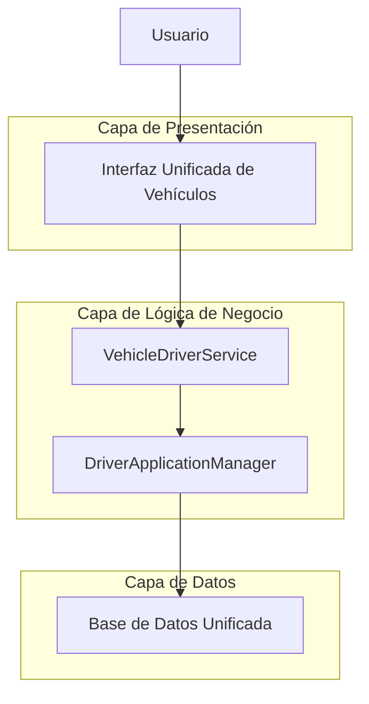
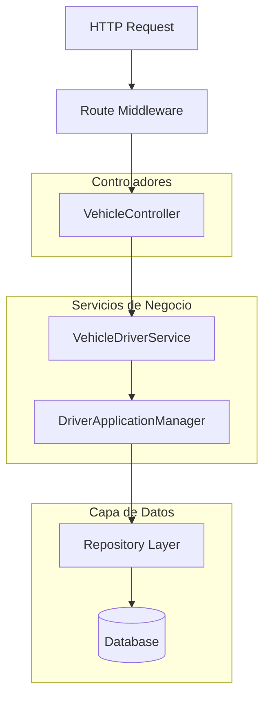

# Solución de Arquitectura Técnica: Unificación de Flujos Vehículo-Conductor

## 1. Diseño de Arquitectura



## 2. Descripción de Tecnología

- **Frontend**: Laravel Blade Templates + Tailwind CSS + Alpine.js
- **Backend**: Laravel 10 + PHP 8.1
- **Base de Datos**: MySQL 8.0
- **Servicios**: VehicleDriverService, DriverApplicationManager

## 3. Definiciones de Rutas Unificadas

| Ruta | Propósito |
|------|----------|
| /admin/vehicles | Lista de vehículos con estado de conductor |
| /admin/vehicles/create | Crear vehículo con asignación opcional de conductor |
| /admin/vehicles/{id} | Mostrar vehículo con detalles completos del conductor |
| /admin/vehicles/{id}/edit | Editar vehículo y datos del conductor |
| /admin/vehicles/{id}/driver-application | Proceso unificado de aplicación de conductor |
| /admin/driver-applications | Lista unificada de todas las aplicaciones |
| /admin/driver-applications/{id} | Detalles de aplicación específica |

## 4. Definiciones de API

### 4.1 API Core de Vehículo-Conductor

**Crear/Actualizar Aplicación de Conductor**
```
POST /api/vehicles/{vehicle_id}/driver-application
PUT /api/vehicles/{vehicle_id}/driver-application
```

Request:
| Parámetro | Tipo | Requerido | Descripción |
|-----------|------|-----------|-------------|
| ownership_type | string | true | Tipo de propiedad: company_driver, owner_operator, third_party |
| user_driver_detail_id | integer | false | ID del conductor existente |
| driver_data | object | false | Datos del nuevo conductor |
| owner_operator_data | object | false | Datos específicos de owner operator |
| third_party_data | object | false | Datos específicos de third party |
| step | string | true | Paso actual: draft, in_progress, completed |

Response:
| Parámetro | Tipo | Descripción |
|-----------|------|-------------|
| success | boolean | Estado de la operación |
| driver_application_id | integer | ID de la aplicación creada/actualizada |
| next_step | string | Siguiente paso en el proceso |
| redirect_url | string | URL para redirección |

Ejemplo:
```json
{
  "ownership_type": "owner_operator",
  "user_driver_detail_id": 123,
  "owner_operator_data": {
    "business_name": "Smith Trucking LLC",
    "tax_id": "12-3456789"
  },
  "step": "in_progress"
}
```

## 5. Arquitectura del Servidor



## 6. Modelo de Datos Mejorado

### 6.1 Definición del Modelo de Datos

```mermaid
erDiagram
    vehicles ||--o{ driver_applications : "has many"
    driver_applications ||--|| driver_application_details : "has one"
    driver_applications ||--o| owner_operator_details : "has one"
    driver_applications ||--o| third_party_details : "has one"
    driver_applications }|--|| users : "belongs to driver"
    driver_applications }|--|| user_driver_details : "belongs to"
    driver_applications ||--o{ driver_application_steps : "has many"
    
    vehicles {
        int id PK
        string make
        string model
        string year
        string vin
        string status
        timestamps
    }
    
    driver_applications {
        int id PK
        int vehicle_id FK
        int user_driver_detail_id FK
        string status
        string current_step
        datetime started_at
        datetime completed_at
        json metadata
        timestamps
    }
    
    driver_application_details {
        int id PK
        int driver_application_id FK
        string ownership_type
        json form_data
        json validation_status
        timestamps
    }
    
    driver_application_steps {
        int id PK
        int driver_application_id FK
        string step_name
        string status
        json step_data
        datetime completed_at
        timestamps
    }
    
    owner_operator_details {
        int id PK
        int driver_application_id FK
        string business_name
        string tax_id
        string business_address
        json additional_info
        timestamps
    }
    
    third_party_details {
        int id PK
        int driver_application_id FK
        string company_name
        string contact_person
        string contact_email
        string contact_phone
        json additional_info
        timestamps
    }
```

### 6.2 Lenguaje de Definición de Datos (DDL)

**Tabla de Aplicaciones de Conductor Mejorada**
```sql
-- Modificar tabla existente
ALTER TABLE driver_applications 
ADD COLUMN current_step VARCHAR(50) DEFAULT 'draft',
ADD COLUMN started_at TIMESTAMP NULL,
ADD COLUMN metadata JSON NULL,
MODIFY COLUMN completed_at TIMESTAMP NULL;

-- Crear tabla de pasos de aplicación
CREATE TABLE driver_application_steps (
    id BIGINT UNSIGNED AUTO_INCREMENT PRIMARY KEY,
    driver_application_id BIGINT UNSIGNED NOT NULL,
    step_name VARCHAR(100) NOT NULL,
    status ENUM('pending', 'in_progress', 'completed', 'skipped') DEFAULT 'pending',
    step_data JSON NULL,
    completed_at TIMESTAMP NULL,
    created_at TIMESTAMP DEFAULT CURRENT_TIMESTAMP,
    updated_at TIMESTAMP DEFAULT CURRENT_TIMESTAMP ON UPDATE CURRENT_TIMESTAMP,
    
    FOREIGN KEY (driver_application_id) REFERENCES driver_applications(id) ON DELETE CASCADE
);

-- Mejorar tabla de detalles
ALTER TABLE driver_application_details
ADD COLUMN form_data JSON NULL,
ADD COLUMN validation_status JSON NULL;

-- Índices para optimización
CREATE INDEX idx_driver_applications_vehicle_status ON driver_applications(vehicle_id, status);
CREATE INDEX idx_driver_applications_current_step ON driver_applications(current_step);
CREATE INDEX idx_driver_application_steps_status ON driver_application_steps(driver_application_id, status);

-- Datos iniciales para pasos estándar
INSERT INTO driver_application_steps (driver_application_id, step_name, status) 
SELECT id, 'vehicle_assignment', 'completed' FROM driver_applications WHERE vehicle_id IS NOT NULL;

INSERT INTO driver_application_steps (driver_application_id, step_name, status)
SELECT id, 'driver_information', 
  CASE WHEN user_driver_detail_id IS NOT NULL THEN 'completed' ELSE 'pending' END
FROM driver_applications;

INSERT INTO driver_application_steps (driver_application_id, step_name, status)
SELECT da.id, 'ownership_details',
  CASE WHEN ood.id IS NOT NULL OR tpd.id IS NOT NULL THEN 'completed' ELSE 'pending' END
FROM driver_applications da
LEFT JOIN owner_operator_details ood ON da.id = ood.driver_application_id
LEFT JOIN third_party_details tpd ON da.id = tpd.driver_application_id;
```

## 7. Implementación de Servicios

### 7.1 VehicleDriverService

```php
<?php

namespace App\Services;

use App\Models\Vehicle;
use App\Models\DriverApplication;
use App\Models\DriverApplicationStep;
use Illuminate\Support\Facades\DB;

class VehicleDriverService
{
    public function createVehicleWithDriver(array $vehicleData, array $driverData = null)
    {
        return DB::transaction(function () use ($vehicleData, $driverData) {
            $vehicle = Vehicle::create($vehicleData);
            
            if ($driverData) {
                $this->assignDriverToVehicle($vehicle->id, $driverData);
            }
            
            return $vehicle;
        });
    }
    
    public function assignDriverToVehicle(int $vehicleId, array $driverData)
    {
        return DB::transaction(function () use ($vehicleId, $driverData) {
            $application = DriverApplication::create([
                'vehicle_id' => $vehicleId,
                'user_driver_detail_id' => $driverData['user_driver_detail_id'] ?? null,
                'status' => 'draft',
                'current_step' => 'vehicle_assignment',
                'started_at' => now(),
            ]);
            
            // Crear paso inicial
            DriverApplicationStep::create([
                'driver_application_id' => $application->id,
                'step_name' => 'vehicle_assignment',
                'status' => 'completed',
                'completed_at' => now(),
            ]);
            
            return $application;
        });
    }
    
    public function getVehicleWithDriverStatus(int $vehicleId)
    {
        return Vehicle::with([
            'driverApplications.driverApplicationDetail',
            'driverApplications.ownerOperatorDetail',
            'driverApplications.thirdPartyDetail',
            'driverApplications.userDriverDetail.user',
            'driverApplications.steps'
        ])->findOrFail($vehicleId);
    }
}
```

### 7.2 DriverApplicationManager

```php
<?php

namespace App\Services;

use App\Models\DriverApplication;
use App\Models\DriverApplicationStep;
use Illuminate\Support\Facades\DB;

class DriverApplicationManager
{
    protected $stepFlow = [
        'vehicle_assignment',
        'driver_information', 
        'ownership_details',
        'documentation',
        'review',
        'completion'
    ];
    
    public function advanceToNextStep(int $applicationId, string $currentStep, array $stepData = [])
    {
        return DB::transaction(function () use ($applicationId, $currentStep, $stepData) {
            // Marcar paso actual como completado
            DriverApplicationStep::where('driver_application_id', $applicationId)
                ->where('step_name', $currentStep)
                ->update([
                    'status' => 'completed',
                    'step_data' => $stepData,
                    'completed_at' => now()
                ]);
            
            // Determinar siguiente paso
            $nextStep = $this->getNextStep($currentStep);
            
            if ($nextStep) {
                // Crear o activar siguiente paso
                DriverApplicationStep::updateOrCreate(
                    [
                        'driver_application_id' => $applicationId,
                        'step_name' => $nextStep
                    ],
                    ['status' => 'in_progress']
                );
                
                // Actualizar aplicación
                DriverApplication::where('id', $applicationId)
                    ->update(['current_step' => $nextStep]);
            } else {
                // Completar aplicación
                DriverApplication::where('id', $applicationId)
                    ->update([
                        'status' => 'completed',
                        'current_step' => 'completion',
                        'completed_at' => now()
                    ]);
            }
            
            return $nextStep;
        });
    }
    
    protected function getNextStep(string $currentStep): ?string
    {
        $currentIndex = array_search($currentStep, $this->stepFlow);
        return $this->stepFlow[$currentIndex + 1] ?? null;
    }
    
    public function getApplicationProgress(int $applicationId)
    {
        $application = DriverApplication::with('steps')->findOrFail($applicationId);
        
        $progress = [];
        foreach ($this->stepFlow as $step) {
            $stepRecord = $application->steps->where('step_name', $step)->first();
            $progress[$step] = [
                'status' => $stepRecord->status ?? 'pending',
                'completed_at' => $stepRecord->completed_at ?? null,
                'data' => $stepRecord->step_data ?? null
            ];
        }
        
        return $progress;
    }
}
```

## 8. Plan de Migración

### 8.1 Fase 1: Preparación de Base de Datos
1. Ejecutar migraciones DDL
2. Migrar datos existentes
3. Validar integridad de datos

### 8.2 Fase 2: Implementación de Servicios
1. Crear VehicleDriverService
2. Crear DriverApplicationManager
3. Actualizar modelos Eloquent

### 8.3 Fase 3: Actualización de Controladores
1. Refactorizar VehicleController
2. Actualizar DriverTypeController
3. Crear nuevas rutas unificadas

### 8.4 Fase 4: Actualización de Vistas
1. Crear vistas unificadas
2. Implementar componentes reutilizables
3. Mejorar UX/UI

### 8.5 Fase 5: Pruebas y Despliegue
1. Pruebas unitarias
2. Pruebas de integración
3. Pruebas de usuario
4. Despliegue gradual

## 9. Beneficios de la Solución

1. **Consistencia de Datos**: Un solo flujo elimina inconsistencias
2. **Mejor UX**: Navegación clara y predecible
3. **Mantenibilidad**: Código más limpio y organizado
4. **Escalabilidad**: Arquitectura preparada para crecimiento
5. **Trazabilidad**: Seguimiento completo del proceso
6. **Flexibilidad**: Fácil adición de nuevos pasos o tipos