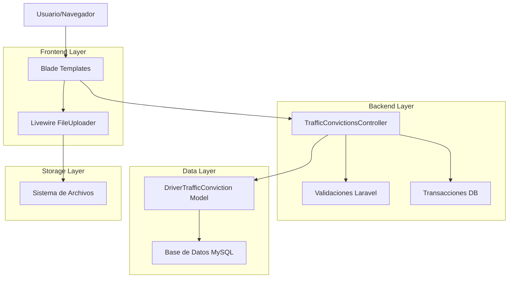
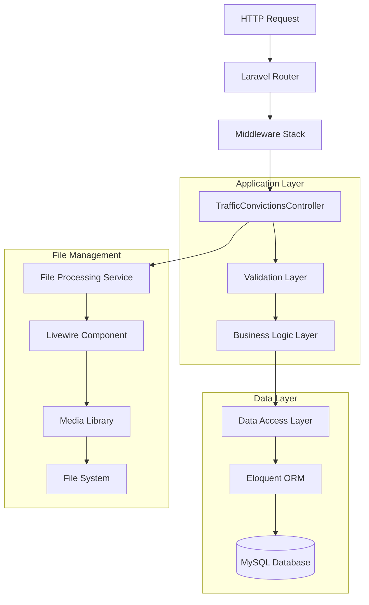
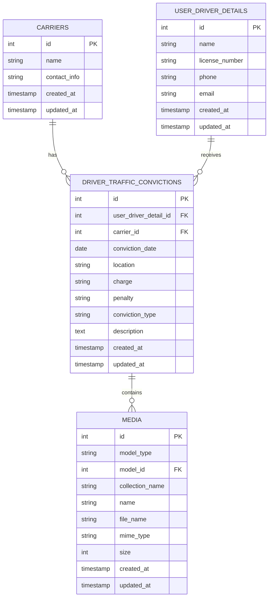

# Arquitectura Técnica del Sistema Traffic Convictions

## 1. Diseño de Arquitectura



## 2. Descripción de Tecnologías

- **Frontend**: Laravel Blade Templates + Livewire + JavaScript + Bootstrap
- **Backend**: Laravel 10 + PHP 8.1
- **Base de Datos**: MySQL con Eloquent ORM
- **Almacenamiento**: Sistema de archivos local + Spatie Media Library
- **Validación**: Laravel Validation + Form Requests

## 3. Definiciones de Rutas

| Ruta | Propósito |
|------|----------|
| `/admin/traffic` | Página principal - listado de infracciones |
| `/admin/traffic/create` | Formulario de creación de infracciones |
| `/admin/traffic/{id}/edit` | Formulario de edición de infracciones |
| `/admin/traffic/{id}` | Vista detallada de infracción |
| `/admin/traffic/{id}/documents` | Gestión de documentos de infracción |
| `/admin/traffic/driver-history/{driver}` | Historial del conductor |
| `/admin/traffic/export` | Exportación de datos |

## 4. Definiciones de API

### 4.1 API Principal

**Creación de infracción de tráfico**
```
POST /admin/traffic
```

Request:
| Nombre del Parámetro | Tipo | Requerido | Descripción |
|---------------------|------|-----------|-------------|
| user_driver_detail_id | integer | true | ID del conductor |
| carrier_id | integer | true | ID del transportista |
| conviction_date | date | true | Fecha de la infracción |
| location | string | true | Ubicación de la infracción |
| charge | string | true | Cargo/Acusación |
| penalty | string | true | Penalización |
| traffic_image_files_input | json | false | Archivos adjuntos |

Response:
| Nombre del Parámetro | Tipo | Descripción |
|---------------------|------|-------------|
| success | boolean | Estado de la operación |
| message | string | Mensaje de respuesta |
| redirect | string | URL de redirección |

Ejemplo Request:
```json
{
  "user_driver_detail_id": 123,
  "carrier_id": 456,
  "conviction_date": "2024-12-15",
  "location": "Highway 101, Los Angeles",
  "charge": "Speeding",
  "penalty": "$250 fine",
  "traffic_image_files_input": "[{\"name\":\"ticket.jpg\",\"path\":\"/tmp/livewire-file123\"}]"
}
```

**Actualización de infracción**
```
PUT /admin/traffic/{id}
```

Request: (Mismos parámetros que POST)

Response: (Misma estructura que POST)

**Eliminación de infracción**
```
DELETE /admin/traffic/{id}
```

Response:
```json
{
  "success": true,
  "message": "Traffic conviction deleted successfully"
}
```

**Obtener conductores por transportista**
```
GET /admin/traffic/get-drivers-by-carrier
```

Request:
| Nombre del Parámetro | Tipo | Requerido | Descripción |
|---------------------|------|-----------|-------------|
| carrier_id | integer | true | ID del transportista |

Response:
```json
{
  "drivers": [
    {
      "id": 123,
      "name": "John Doe",
      "license_number": "DL123456"
    }
  ]
}
```

## 5. Arquitectura del Servidor



## 6. Modelo de Datos

### 6.1 Definición del Modelo de Datos



### 6.2 Lenguaje de Definición de Datos

**Tabla principal (driver_traffic_convictions)**
```sql
-- Crear tabla
CREATE TABLE driver_traffic_convictions (
    id BIGINT UNSIGNED AUTO_INCREMENT PRIMARY KEY,
    user_driver_detail_id BIGINT UNSIGNED NOT NULL,
    carrier_id BIGINT UNSIGNED,
    conviction_date DATE NOT NULL,
    location VARCHAR(255) NOT NULL,
    charge VARCHAR(255) NOT NULL,
    penalty VARCHAR(255) NOT NULL,
    conviction_type VARCHAR(100),
    description TEXT,
    created_at TIMESTAMP NULL DEFAULT NULL,
    updated_at TIMESTAMP NULL DEFAULT NULL,
    
    -- Claves foráneas
    FOREIGN KEY (user_driver_detail_id) REFERENCES user_driver_details(id) ON DELETE CASCADE,
    FOREIGN KEY (carrier_id) REFERENCES carriers(id) ON DELETE SET NULL
);

-- Crear índices para performance
CREATE INDEX idx_traffic_convictions_driver ON driver_traffic_convictions(user_driver_detail_id);
CREATE INDEX idx_traffic_convictions_carrier ON driver_traffic_convictions(carrier_id);
CREATE INDEX idx_traffic_convictions_date ON driver_traffic_convictions(conviction_date DESC);
CREATE INDEX idx_traffic_convictions_location ON driver_traffic_convictions(location);

-- Índice único compuesto para prevenir duplicados
CREATE UNIQUE INDEX unique_traffic_conviction ON driver_traffic_convictions(
    user_driver_detail_id, 
    conviction_date, 
    location, 
    charge
);

-- Datos iniciales de ejemplo
INSERT INTO driver_traffic_convictions (
    user_driver_detail_id, 
    carrier_id, 
    conviction_date, 
    location, 
    charge, 
    penalty,
    conviction_type,
    description,
    created_at,
    updated_at
) VALUES 
(1, 1, '2024-01-15', 'Highway 101, Los Angeles', 'Speeding', '$250 fine', 'Moving Violation', 'Exceeded speed limit by 15 mph', NOW(), NOW()),
(2, 1, '2024-02-20', 'Interstate 5, San Diego', 'Improper Lane Change', '$150 fine', 'Moving Violation', 'Changed lanes without signaling', NOW(), NOW()),
(3, 2, '2024-03-10', 'Route 66, Phoenix', 'Following Too Closely', '$200 fine', 'Moving Violation', 'Tailgating violation', NOW(), NOW());
```

**Tabla de medios (para archivos adjuntos)**
```sql
-- La tabla media es manejada por Spatie Media Library
CREATE TABLE media (
    id BIGINT UNSIGNED AUTO_INCREMENT PRIMARY KEY,
    model_type VARCHAR(255) NOT NULL,
    model_id BIGINT UNSIGNED NOT NULL,
    uuid CHAR(36),
    collection_name VARCHAR(255) NOT NULL,
    name VARCHAR(255) NOT NULL,
    file_name VARCHAR(255) NOT NULL,
    mime_type VARCHAR(255),
    disk VARCHAR(255) NOT NULL,
    conversions_disk VARCHAR(255),
    size BIGINT UNSIGNED NOT NULL,
    manipulations JSON,
    custom_properties JSON,
    generated_conversions JSON,
    responsive_images JSON,
    order_column INT UNSIGNED,
    created_at TIMESTAMP NULL DEFAULT NULL,
    updated_at TIMESTAMP NULL DEFAULT NULL,
    
    INDEX media_model_type_model_id_index (model_type, model_id),
    INDEX media_uuid_index (uuid),
    INDEX media_collection_name_index (collection_name)
);
```

## 7. Componentes de la Arquitectura

### 7.1 Controlador Principal
- **TrafficConvictionsController**: Maneja todas las operaciones CRUD
- **Métodos principales**: index, create, store, edit, update, destroy
- **Funcionalidades especiales**: exportación, historial de conductor, gestión de documentos

### 7.2 Modelo de Datos
- **DriverTrafficConviction**: Modelo Eloquent principal
- **Traits utilizados**: HasFactory, HasDocuments, InteractsWithMedia
- **Relaciones**: belongsTo con User y Carrier

### 7.3 Componentes Frontend
- **Blade Templates**: Vistas del sistema
- **Livewire FileUploader**: Componente para subida de archivos
- **JavaScript**: Manejo de eventos y validaciones del lado cliente
- **Bootstrap**: Framework CSS para estilos

### 7.4 Sistema de Archivos
- **Spatie Media Library**: Gestión de archivos multimedia
- **Colecciones**: 'traffic_documents' para documentos de infracciones
- **Almacenamiento**: Sistema de archivos local (configurable)

## 8. Patrones de Diseño Implementados

### 8.1 MVC (Model-View-Controller)
- **Model**: DriverTrafficConviction, User, Carrier
- **View**: Blade templates en resources/views/admin/drivers/traffic/
- **Controller**: TrafficConvictionsController

### 8.2 Repository Pattern (Implícito)
- Eloquent ORM actúa como repository
- Métodos de consulta encapsulados en el modelo

### 8.3 Observer Pattern
- Eventos de Livewire para manejo de archivos
- Boot methods en modelos para hooks de ciclo de vida

### 8.4 Transaction Script
- Uso de transacciones de base de datos en operaciones críticas
- Rollback automático en caso de errores

## 9. Consideraciones de Seguridad

### 9.1 Validación de Datos
- Validación server-side con Laravel Validation
- Sanitización de inputs
- Validación de tipos de archivo

### 9.2 Protección CSRF
- Tokens CSRF en todos los formularios
- Verificación automática por middleware

### 9.3 Autorización
- Middleware de autenticación
- Control de acceso basado en roles (implícito)

### 9.4 Manejo de Archivos
- Validación de tipos MIME
- Límites de tamaño de archivo
- Almacenamiento seguro fuera del directorio web

## 10. Performance y Escalabilidad

### 10.1 Optimizaciones de Base de Datos
- Índices en campos de búsqueda frecuente
- Paginación en listados
- Eager loading para relaciones

### 10.2 Caching
- Potencial para implementar cache de consultas
- Cache de archivos estáticos

### 10.3 Optimizaciones Frontend
- Carga asíncrona de conductores por transportista
- Validación client-side para feedback inmediato
- Compresión de assets

## 11. Monitoreo y Logging

### 11.1 Logs de Aplicación
- Laravel Log para errores y excepciones
- Logs personalizados para operaciones críticas

### 11.2 Métricas de Performance
- Tiempo de respuesta de consultas
- Uso de memoria en operaciones de archivo
- Frecuencia de operaciones CRUD

## 12. Plan de Mejoras Arquitectónicas

### 12.1 Corto Plazo (1-2 semanas)
1. **Implementar Service Layer**: Extraer lógica de negocio del controlador
2. **Form Requests**: Crear clases dedicadas para validación
3. **Resource Classes**: Estandarizar respuestas API

### 12.2 Mediano Plazo (1-2 meses)
1. **Event Sourcing**: Para auditoría de cambios
2. **Queue System**: Para procesamiento asíncrono de archivos
3. **API REST completa**: Para integración con sistemas externos

### 12.3 Largo Plazo (3-6 meses)
1. **Microservicios**: Separar gestión de archivos
2. **Cache distribuido**: Redis para mejor performance
3. **Búsqueda avanzada**: Elasticsearch para consultas complejas

## 13. Conclusiones Arquitectónicas

La arquitectura actual del sistema Traffic Convictions sigue patrones estándar de Laravel y es funcional para el propósito actual. Sin embargo, presenta oportunidades de mejora en:

1. **Separación de responsabilidades**: El controlador maneja demasiada lógica
2. **Validación de integridad**: Falta de restricciones de unicidad
3. **Manejo de errores**: Necesita mejor gestión de excepciones
4. **Testing**: Falta de cobertura de pruebas automatizadas

Las mejoras propuestas en el documento de análisis de duplicación abordan estos puntos y mejorarán significativamente la robustez del sistema.