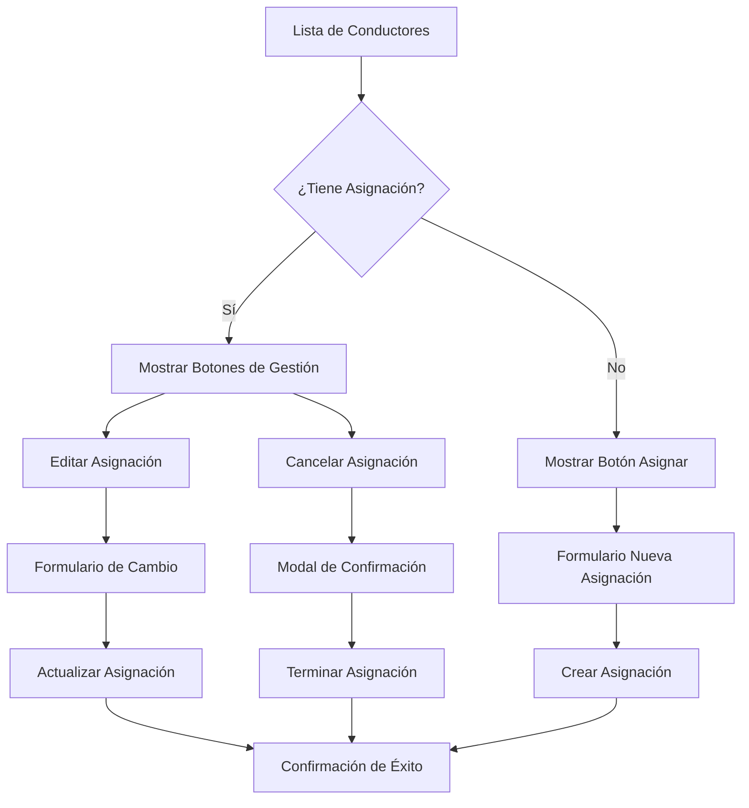

# Sistema de Edición y Cancelación de Asignaciones de Vehículos

## 1. Descripción General del Proyecto

Sistema para permitir la edición y cancelación de asignaciones de vehículos desde la interfaz de gestión de conductores, proporcionando mayor flexibilidad operativa para los administradores del sistema EF Services.

- **Problema a resolver**: Actualmente no existe una forma fácil de editar o cancelar asignaciones de vehículos desde las vistas principales de driver-types, limitando la capacidad de gestión operativa.
- **Usuarios objetivo**: Administradores del sistema que gestionan conductores y asignaciones de vehículos.
- **Valor del producto**: Mejora significativa en la eficiencia operativa al permitir cambios rápidos en asignaciones sin navegar por múltiples interfaces.

## 2. Funcionalidades Principales

### 2.1 Roles de Usuario
No se requieren nuevos roles, se utilizan los permisos administrativos existentes.

### 2.2 Módulos de Funcionalidad

Nuestro sistema de edición y cancelación de asignaciones incluye las siguientes páginas principales:

1. **Lista Principal de Conductores**: vista mejorada con opciones de gestión de asignaciones
2. **Detalle del Conductor**: información completa con historial y opciones de edición
3. **Formulario de Asignación**: capacidad de cambiar vehículo asignado existente
4. **Modal de Confirmación**: interfaz para confirmar cancelaciones

### 2.3 Detalles de Páginas

| Página | Módulo | Descripción de Funcionalidad |
|--------|--------|------------------------------|
| Lista Principal | Botones de Acción | Mostrar botones "Editar Asignación" y "Cancelar Asignación" para conductores con vehículos asignados |
| Lista Principal | Estado Visual | Indicadores visuales claros del estado de asignación (Asignado/Sin Asignar) |
| Detalle del Conductor | Información de Asignación | Mostrar detalles completos de la asignación actual incluyendo vehículo, fecha de inicio, notas |
| Detalle del Conductor | Historial de Asignaciones | Tabla con historial completo de asignaciones previas y actuales |
| Detalle del Conductor | Botones de Gestión | Botones prominentes para "Editar Asignación", "Cancelar Asignación" y "Nueva Asignación" |
| Formulario de Asignación | Detección de Asignación Existente | Detectar si el conductor ya tiene vehículo asignado y mostrar opción de cambio |
| Formulario de Asignación | Selector de Vehículo | Lista de vehículos disponibles excluyendo el actualmente asignado |
| Formulario de Asignación | Información Actual | Mostrar claramente el vehículo actualmente asignado antes del cambio |
| Modal de Confirmación | Confirmación de Cancelación | Modal con detalles de la asignación a cancelar y campo para motivo |
| Modal de Confirmación | Validación de Datos | Campos requeridos para fecha de terminación y motivo de cancelación |

## 3. Flujo Principal de Procesos

### Flujo de Edición de Asignación:
1. Administrador accede a lista de conductores o detalle específico
2. Identifica conductor con asignación existente
3. Hace clic en "Editar Asignación"
4. Sistema muestra formulario con vehículo actual y opciones disponibles
5. Administrador selecciona nuevo vehículo y confirma cambio
6. Sistema actualiza asignación y muestra confirmación

### Flujo de Cancelación de Asignación:
1. Administrador identifica asignación a cancelar
2. Hace clic en "Cancelar Asignación"
3. Sistema muestra modal de confirmación con detalles
4. Administrador ingresa motivo y fecha de terminación
5. Confirma cancelación
6. Sistema termina asignación y actualiza estados

## 4. Diseño de Interfaz de Usuario

### 4.1 Estilo de Diseño
- **Colores primarios**: Azul (#007bff) para acciones principales, Rojo (#dc3545) para cancelaciones
- **Colores secundarios**: Verde (#28a745) para confirmaciones, Gris (#6c757d) para información
- **Estilo de botones**: Botones redondeados con iconos FontAwesome
- **Fuentes**: Sistema de fuentes Bootstrap, tamaños 14px para texto normal, 16px para títulos
- **Layout**: Diseño basado en cards con navegación superior
- **Iconos**: FontAwesome para consistencia visual (fa-edit, fa-times, fa-car, fa-history)

### 4.2 Diseño de Páginas

| Página | Módulo | Elementos de UI |
|--------|--------|-----------------|
| Lista Principal | Columna de Acciones | Botones pequeños con iconos: "Editar" (azul), "Cancelar" (rojo), "Asignar" (verde) |
| Lista Principal | Estado de Asignación | Badge colorizado: "Asignado" (verde), "Sin Asignar" (gris) |
| Detalle del Conductor | Card de Asignación Actual | Card destacado con información del vehículo, fecha de inicio, botones de acción |
| Detalle del Conductor | Tabla de Historial | Tabla responsive con paginación, filtros por estado y fecha |
| Formulario de Asignación | Alert de Cambio | Alert informativo mostrando el cambio de vehículo actual a nuevo |
| Formulario de Asignación | Select de Vehículos | Dropdown con búsqueda, mostrando marca, modelo y número de unidad |
| Modal de Confirmación | Diseño de Advertencia | Modal con header rojo, información destacada de la asignación, campos requeridos |

### 4.3 Responsividad
El sistema será desktop-first con adaptación móvil. En dispositivos móviles, los botones de acción se apilarán verticalmente y las tablas tendrán scroll horizontal.