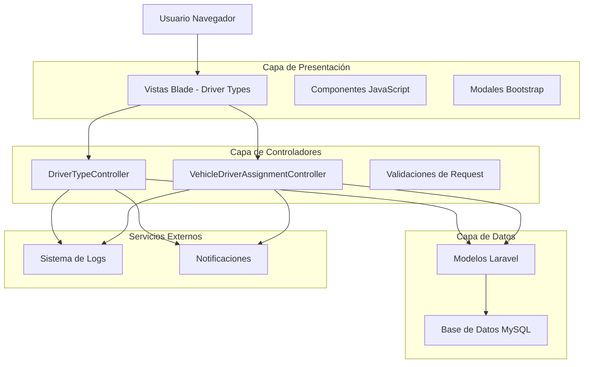
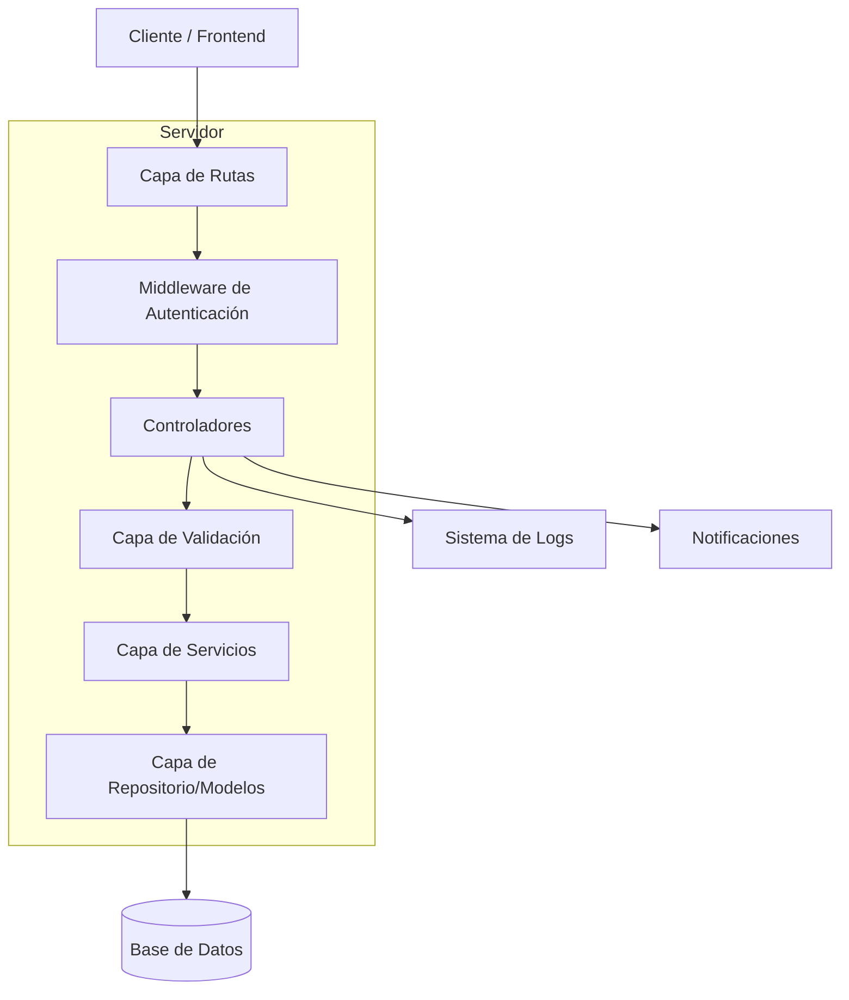
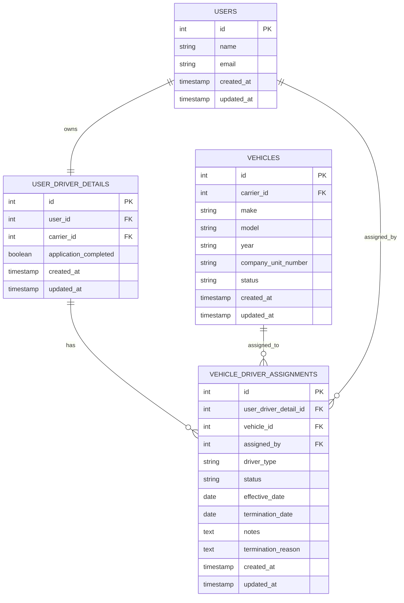

# Arquitectura Técnica - Sistema de Edición y Cancelación de Asignaciones de Vehículos

## 1. Diseño de Arquitectura



## 2. Descripción de Tecnologías

- **Frontend**: Laravel Blade Templates + Bootstrap 5 + JavaScript vanilla
- **Backend**: Laravel 10 + PHP 8.1
- **Base de Datos**: MySQL (usando Eloquent ORM)
- **Validación**: Laravel Form Requests
- **Logging**: Laravel Log facade

## 3. Definiciones de Rutas

| Ruta | Propósito |
|------|-----------|
| GET /admin/driver-types | Lista principal de conductores con opciones de gestión |
| GET /admin/driver-types/{id}/show | Detalle del conductor con historial de asignaciones |
| GET /admin/driver-types/{id}/edit-assignment | Formulario para editar asignación existente |
| PUT /admin/driver-types/{id}/update-assignment | Actualizar asignación de vehículo |
| DELETE /admin/driver-types/{id}/cancel-assignment | Cancelar asignación actual |
| GET /admin/driver-types/{id}/assignment-history | Historial completo de asignaciones |

## 4. Definiciones de API

### 4.1 APIs Principales

**Editar Asignación de Vehículo**
```
PUT /admin/driver-types/{id}/update-assignment
```

Request:
| Parámetro | Tipo | Requerido | Descripción |
|-----------|------|-----------|-------------|
| vehicle_id | integer | true | ID del nuevo vehículo a asignar |
| effective_date | date | true | Fecha efectiva del cambio |
| notes | string | false | Notas adicionales sobre el cambio |
| termination_reason | string | false | Motivo del cambio de vehículo |

Response:
| Parámetro | Tipo | Descripción |
|-----------|------|-------------|
| success | boolean | Estado de la operación |
| message | string | Mensaje de confirmación |
| assignment_id | integer | ID de la nueva asignación |

Ejemplo Request:
```json
{
  "vehicle_id": 15,
  "effective_date": "2024-01-15",
  "notes": "Cambio solicitado por mantenimiento del vehículo anterior",
  "termination_reason": "Mantenimiento programado"
}
```

**Cancelar Asignación**
```
DELETE /admin/driver-types/{id}/cancel-assignment
```

Request:
| Parámetro | Tipo | Requerido | Descripción |
|-----------|------|-----------|-------------|
| termination_date | date | true | Fecha de terminación de la asignación |
| termination_reason | string | true | Motivo de la cancelación |
| notes | string | false | Notas adicionales |

Response:
| Parámetro | Tipo | Descripción |
|-----------|------|-------------|
| success | boolean | Estado de la operación |
| message | string | Mensaje de confirmación |

Ejemplo Request:
```json
{
  "termination_date": "2024-01-10",
  "termination_reason": "Conductor ya no trabaja con la empresa",
  "notes": "Terminación por renuncia voluntaria"
}
```

## 5. Arquitectura del Servidor



## 6. Modelo de Datos

### 6.1 Definición del Modelo de Datos



### 6.2 Lenguaje de Definición de Datos

**Nuevas rutas en routes/admin.php**
```php
// Rutas adicionales para gestión de asignaciones
Route::prefix('driver-types')->name('driver-types.')->group(function () {
    Route::get('/{driver}/edit-assignment', [DriverTypeController::class, 'editAssignment'])->name('edit-assignment');
    Route::put('/{driver}/update-assignment', [DriverTypeController::class, 'updateAssignment'])->name('update-assignment');
    Route::delete('/{driver}/cancel-assignment', [DriverTypeController::class, 'cancelAssignment'])->name('cancel-assignment');
    Route::get('/{driver}/assignment-history', [DriverTypeController::class, 'assignmentHistory'])->name('assignment-history');
});
```

**Nuevos métodos en DriverTypeController**
```php
/**
 * Mostrar formulario para editar asignación existente
 */
public function editAssignment(UserDriverDetail $driver)
{
    $driver->load(['activeVehicleAssignment.vehicle', 'carrier']);
    
    $availableVehicles = Vehicle::with(['carrier'])
        ->whereDoesntHave('driverAssignments', function($q) use ($driver) {
            $q->where('status', 'active')
              ->where('user_driver_detail_id', '!=', $driver->id);
        })
        ->where('carrier_id', $driver->carrier_id)
        ->where('status', 'pending')
        ->get();
    
    return view('admin.driver-types.edit-assignment', compact('driver', 'availableVehicles'));
}

/**
 * Actualizar asignación de vehículo
 */
public function updateAssignment(Request $request, UserDriverDetail $driver)
{
    $request->validate([
        'vehicle_id' => 'required|exists:vehicles,id',
        'effective_date' => 'required|date',
        'notes' => 'nullable|string|max:1000',
        'termination_reason' => 'nullable|string|max:500'
    ]);
    
    DB::transaction(function () use ($request, $driver) {
        // Terminar asignación actual
        $currentAssignment = $driver->activeVehicleAssignment;
        if ($currentAssignment) {
            $currentAssignment->update([
                'status' => 'terminated',
                'termination_date' => $request->effective_date,
                'termination_reason' => $request->termination_reason ?? 'Cambio de vehículo'
            ]);
        }
        
        // Crear nueva asignación
        VehicleDriverAssignment::create([
            'user_driver_detail_id' => $driver->id,
            'vehicle_id' => $request->vehicle_id,
            'driver_type' => 'company_driver',
            'status' => 'active',
            'effective_date' => $request->effective_date,
            'assigned_by' => auth()->id(),
            'notes' => $request->notes
        ]);
    });
    
    return redirect()->route('admin.driver-types.show', $driver)
        ->with('success', 'Asignación actualizada exitosamente');
}

/**
 * Cancelar asignación actual
 */
public function cancelAssignment(Request $request, UserDriverDetail $driver)
{
    $request->validate([
        'termination_date' => 'required|date',
        'termination_reason' => 'required|string|max:500',
        'notes' => 'nullable|string|max:1000'
    ]);
    
    $currentAssignment = $driver->activeVehicleAssignment;
    
    if (!$currentAssignment) {
        return redirect()->back()->with('error', 'No hay asignación activa para cancelar');
    }
    
    $currentAssignment->update([
        'status' => 'terminated',
        'termination_date' => $request->termination_date,
        'termination_reason' => $request->termination_reason,
        'notes' => $currentAssignment->notes . "\n\nCancelación: " . $request->notes
    ]);
    
    return redirect()->route('admin.driver-types.index')
        ->with('success', 'Asignación cancelada exitosamente');
}
```

**Índices adicionales para optimización**
```sql
-- Índices para mejorar rendimiento de consultas
CREATE INDEX idx_vehicle_driver_assignments_status ON vehicle_driver_assignments(status);
CREATE INDEX idx_vehicle_driver_assignments_effective_date ON vehicle_driver_assignments(effective_date);
CREATE INDEX idx_vehicle_driver_assignments_user_driver_detail_status ON vehicle_driver_assignments(user_driver_detail_id, status);
CREATE INDEX idx_vehicles_carrier_status ON vehicles(carrier_id, status);
```