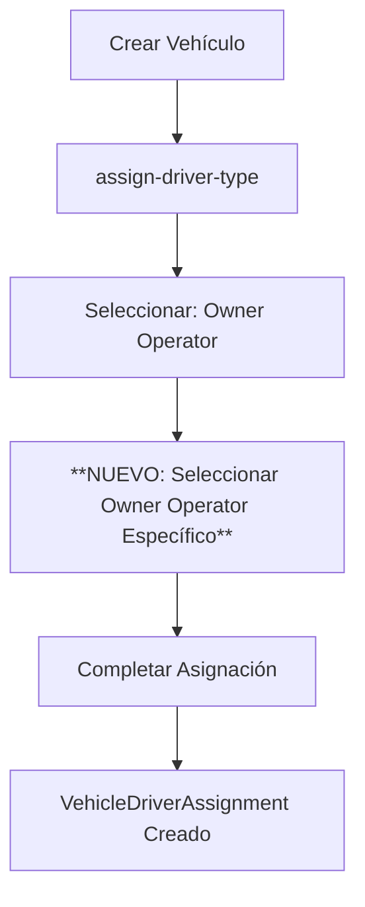
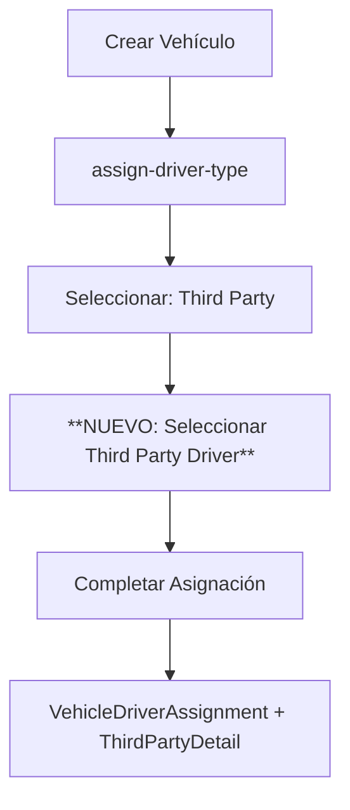

# Análisis del Flujo de Asignación de Vehículos

## 1. Análisis de la Brecha Actual

### 1.1 Problema Identificado
Actualmente, en la página `assign-driver-type`, solo se define el **tipo** de asignación (owner operator, third party, company driver) pero **no se asigna a un user_driver específico**. Esto crea una desconexión entre:
- Definir que un vehículo es "para owner operator"
- Seleccionar **cuál** owner operator específico del sistema

### 1.2 Flujo Actual Incompleto
1. **Crear vehículo** → ✅ Funciona
2. **Ir a assign-driver-type** → ✅ Funciona
3. **Seleccionar tipo** (owner/third party/company) → ✅ Funciona
4. **Seleccionar user_driver específico** → ❌ **FALTA ESTE PASO**
5. **Completar asignación** → ❌ Incompleto

## 2. Flujo de Asignación para Owner Operators

### 2.1 Proceso Propuesto


### 2.2 Implementación Técnica
**Base de Datos:**
- `vehicle_driver_assignments.user_driver_detail_id` → Conecta con el owner operator específico
- `owner_operator_details.vehicle_driver_assignment_id` → Detalles adicionales

**Controlador:**
```php
// En VehicleController o nuevo OwnerOperatorAssignmentController
public function selectOwnerOperator($vehicleId) {
    $availableOwnerOperators = UserDriverDetail::whereHas('driverApplication', function($q) {
        $q->where('driver_type', 'owner_operator')
          ->where('status', 'approved');
    })->get();
    
    return view('admin.vehicles.select-owner-operator', compact('vehicleId', 'availableOwnerOperators'));
}
```

### 2.3 Interfaz de Usuario
**Nueva página:** `/admin/vehicles/{id}/select-owner-operator`
- Lista de owner operators disponibles
- Información básica: nombre, licencia, vehículo actual (si tiene)
- Botón "Asignar" para cada owner operator

## 3. Flujo de Asignación para Third Party

### 3.1 Proceso Similar


### 3.2 Consideraciones Especiales
- Third party drivers pueden no estar registrados en el sistema
- Opción para "Crear nuevo third party driver" durante asignación
- Integración con `third_party_details` existente

## 4. Escenarios de Cambio de Tipo

### 4.1 Owner Operator → Company Driver
**Escenario:** Owner operator vende su vehículo y quiere que le asignen uno de la compañía.

**Flujo:**
1. Terminar asignación actual del vehículo del owner operator
2. Cambiar `driver_type` en `driver_applications` a "company_driver"
3. En el área de asignación unificada, asignar vehículo de compañía
4. Crear nueva `VehicleDriverAssignment` con `company_driver_details`

```sql
-- Terminar asignación actual
UPDATE vehicle_driver_assignments 
SET status = 'terminated', end_date = NOW() 
WHERE user_driver_detail_id = ? AND status = 'active';

-- Cambiar tipo de conductor
UPDATE driver_applications 
SET driver_type = 'company_driver' 
WHERE user_driver_detail_id = ?;
```

### 4.2 Third Party → Company Driver
**Proceso similar:**
1. Terminar asignación third party actual
2. Actualizar `driver_type`
3. Asignar vehículo de compañía

### 4.3 Company Driver → Owner Operator
**Escenario:** Company driver compra su propio vehículo.

**Flujo:**
1. Terminar asignación de vehículo de compañía
2. Cambiar `driver_type` a "owner_operator"
3. Registrar nuevo vehículo del conductor
4. Crear asignación owner operator

## 5. Área de Asignación Unificada (Futura)

### 5.1 Concepto
Una sola área administrativa para manejar **todas** las asignaciones de vehículos:

**Ruta:** `/admin/vehicle-assignments`

### 5.2 Funcionalidades
- **Company Drivers:** Asignación a través de carriers
- **Owner Operators:** Reasignación y cambio de vehículo
- **Third Party:** Gestión de contratos y asignaciones
- **Cambio de Tipo:** Interfaz para cambiar tipo de conductor
- **Historial:** Ver todas las asignaciones pasadas

### 5.3 Interfaz Propuesta
```
┌─────────────────────────────────────────────────┐
│ Gestión de Asignaciones de Vehículos            │
├─────────────────────────────────────────────────┤
│ [Company Drivers] [Owner Operators] [Third Party]│
│                                                 │
│ Vehículo: #123 - Ford F-150                    │
│ Estado: Asignado a Juan Pérez (Owner Operator) │
│ [Cambiar Tipo] [Reasignar] [Historial]         │
│                                                 │
│ Vehículo: #124 - Freightliner                  │
│ Estado: Sin asignar                             │
│ [Asignar a Company] [Asignar a Owner] [Third]   │
└─────────────────────────────────────────────────┘
```

## 6. Implementación Técnica Detallada

### 6.1 Modificaciones de Controlador

**Nuevo:** `VehicleAssignmentController`
```php
class VehicleAssignmentController extends Controller
{
    public function selectDriver($vehicleId, $type)
    {
        switch($type) {
            case 'owner_operator':
                return $this->selectOwnerOperator($vehicleId);
            case 'third_party':
                return $this->selectThirdParty($vehicleId);
            case 'company_driver':
                return $this->selectCompanyDriver($vehicleId);
        }
    }
    
    public function changeDriverType($assignmentId, $newType)
    {
        // Lógica para cambiar tipo de conductor
        // Terminar asignación actual
        // Crear nueva asignación con nuevo tipo
    }
}
```

### 6.2 Actualizaciones de Base de Datos

**Nueva migración:** `add_driver_type_change_tracking`
```php
Schema::table('vehicle_driver_assignments', function (Blueprint $table) {
    $table->string('previous_type')->nullable();
    $table->timestamp('type_changed_at')->nullable();
    $table->text('change_reason')->nullable();
});
```

### 6.3 Modelos y Relaciones

**Actualizar `VehicleDriverAssignment`:**
```php
public function canChangeType()
{
    return $this->status === 'active';
}

public function changeType($newType, $reason = null)
{
    $this->update([
        'status' => 'terminated',
        'end_date' => now()
    ]);
    
    // Crear nueva asignación con nuevo tipo
    return static::create([
        'vehicle_id' => $this->vehicle_id,
        'user_driver_detail_id' => $this->user_driver_detail_id,
        'assignment_type' => $newType,
        'previous_type' => $this->assignment_type,
        'change_reason' => $reason,
        'start_date' => now()
    ]);
}
```

## 7. Flujo de Usuario Completo

### 7.1 Asignación Inicial
1. **Admin crea vehículo**
2. **Va a assign-driver-type**
3. **Selecciona tipo** (owner/third party/company)
4. **NUEVO: Redirige a página de selección de conductor específico**
5. **Selecciona conductor de la lista**
6. **Confirma asignación**
7. **Sistema crea VehicleDriverAssignment completo**

### 7.2 Cambio de Tipo
1. **Admin va al área de asignaciones**
2. **Busca conductor/vehículo**
3. **Hace clic en "Cambiar Tipo"**
4. **Selecciona nuevo tipo**
5. **Proporciona razón del cambio**
6. **Sistema termina asignación actual y crea nueva**

## 8. Próximos Pasos

### 8.1 Implementación Inmediata
1. Crear páginas de selección de conductor específico
2. Modificar `assign-driver-type` para redirigir a selección
3. Implementar lógica de asignación completa

### 8.2 Implementación Futura
1. Área de asignación unificada
2. Funcionalidad de cambio de tipo
3. Historial y reportes de asignaciones

### 8.3 Consideraciones
- **Validaciones:** Un conductor solo puede tener un vehículo activo
- **Notificaciones:** Informar a conductores sobre cambios
- **Auditoría:** Registrar todos los cambios para compliance
- **Permisos:** Solo admins pueden cambiar tipos de asignación

Este análisis resuelve la brecha actual y proporciona un camino claro para implementar asignaciones completas y manejo de cambios de tipo de conductor.