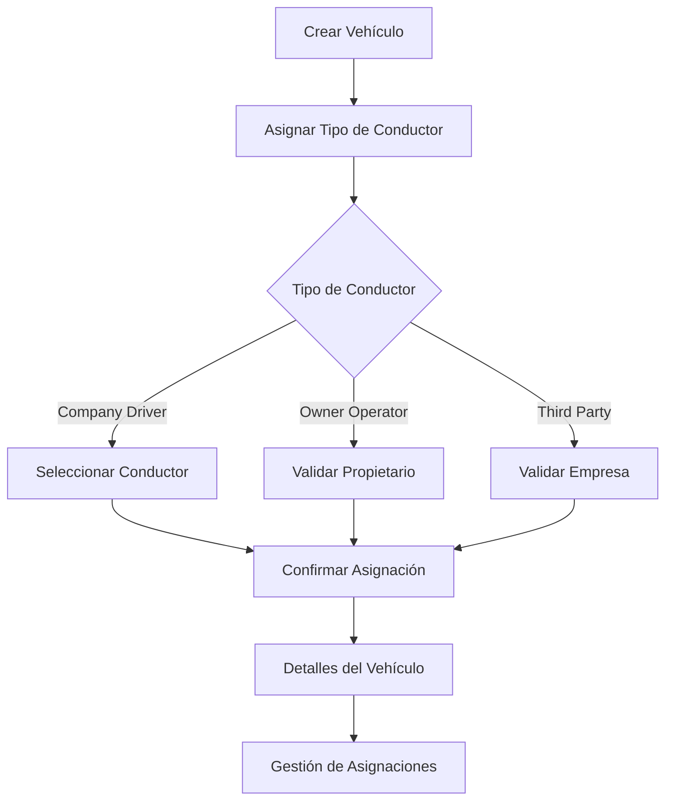

# Análisis del Sistema de Asignación de Vehículos - EF Services

## 1. Visión General del Producto

Sistema integral de gestión de asignación de vehículos que permite asignar vehículos a diferentes tipos de conductores (company drivers, owner operators, third parties) con flujos específicos para cada tipo.

El sistema resuelve la necesidad de gestionar eficientemente las asignaciones de vehículos, validar información de conductores y mantener un registro completo de las asignaciones activas e históricas.

## 2. Características Principales

### 2.1 Roles de Usuario

| Rol | Método de Registro | Permisos Principales |
|-----|-------------------|---------------------|
| Administrador | Acceso directo al sistema | Gestión completa de vehículos y asignaciones |
| Company Driver | Proceso de aplicación interno | Puede ser asignado a vehículos de la empresa |
| Owner Operator | Proceso de aplicación con validación | Maneja sus propios vehículos |
| Third Party | Proceso de aplicación externa | Maneja vehículos de terceros |

### 2.2 Módulos de Funcionalidad

Nuestro sistema de asignación de vehículos consta de las siguientes páginas principales:

1. **Página de Creación de Vehículos**: formulario de registro, validación de datos, guardado inicial.
2. **Página de Asignación de Tipo de Conductor**: selección de tipo, formularios específicos, validación de datos.
3. **Página de Gestión de Asignaciones**: lista de asignaciones activas, historial, acciones de terminación.
4. **Página de Detalles del Vehículo**: información completa, asignación actual, historial de cambios.
5. **Página de Confirmación de Datos**: validación final, verificación de información, confirmación de asignación.

### 2.3 Detalles de Páginas

| Nombre de Página | Nombre del Módulo | Descripción de Funcionalidad |
|------------------|-------------------|------------------------------|
| Creación de Vehículos | Formulario de Registro | Capturar información básica del vehículo, validar datos requeridos, guardar en base de datos |
| Asignación de Tipo | Selector de Tipo de Conductor | Mostrar opciones (Company Driver, Owner Operator, Third Party), formularios dinámicos según selección |
| Asignación de Tipo | Formulario Company Driver | Seleccionar conductor de lista, validar disponibilidad, asignar vehículo específico |
| Asignación de Tipo | Formulario Owner Operator | Capturar información del propietario, validar documentos, confirmar propiedad del vehículo |
| Asignación de Tipo | Formulario Third Party | Capturar información de la empresa tercera, validar datos fiscales, confirmar acuerdos |
| Gestión de Asignaciones | Lista de Asignaciones | Mostrar asignaciones activas, filtros por tipo y estado, acciones de edición y terminación |
| Gestión de Asignaciones | Historial de Cambios | Mostrar historial completo de asignaciones, fechas de inicio y fin, razones de cambio |
| Detalles del Vehículo | Información del Vehículo | Mostrar datos completos del vehículo, asignación actual, estado operativo |
| Detalles del Vehículo | Asignación Actual | Mostrar conductor asignado, tipo de asignación, fechas de vigencia |
| Confirmación de Datos | Validación Final | Revisar toda la información capturada, validar completitud, confirmar asignación |

## 3. Proceso Principal

### Flujo de Administrador
1. Crear vehículo con información básica
2. Navegar a página de asignación de tipo de conductor
3. Seleccionar tipo de conductor (Company Driver, Owner Operator, Third Party)
4. Completar formulario específico según el tipo seleccionado
5. Validar y confirmar información
6. Proceder a página de detalles del vehículo
7. Gestionar asignaciones futuras desde el área de gestión

### Flujo de Company Driver
1. El administrador selecciona "Company Driver"
2. Sistema muestra lista de conductores disponibles
3. Seleccionar conductor específico
4. Asignar vehículo al conductor seleccionado
5. Confirmar asignación y fechas de vigencia

### Flujo de Owner Operator
1. El administrador selecciona "Owner Operator"
2. Sistema muestra formulario de información del propietario
3. Validar documentos y propiedad del vehículo
4. Confirmar información y crear asignación

### Flujo de Third Party
1. El administrador selecciona "Third Party"
2. Sistema muestra formulario de información de la empresa
3. Capturar datos fiscales y de contacto
4. Validar información y confirmar asignación

## 4. Diseño de Interfaz de Usuario

### 4.1 Estilo de Diseño

- **Colores primarios**: Azul corporativo (#2563eb), Verde de confirmación (#16a34a)
- **Colores secundarios**: Gris neutro (#6b7280), Rojo de alerta (#dc2626)
- **Estilo de botones**: Redondeados con sombra sutil, estados hover y active
- **Fuente**: Inter, tamaños 14px (texto), 16px (labels), 24px (títulos)
- **Estilo de layout**: Basado en tarjetas con navegación superior, sidebar colapsible
- **Iconos**: Heroicons para consistencia, emojis 🚛 para vehículos, 👤 para conductores

### 4.2 Resumen de Diseño de Páginas

| Nombre de Página | Nombre del Módulo | Elementos de UI |
|------------------|-------------------|----------------|
| Creación de Vehículos | Formulario de Registro | Layout de 2 columnas, campos agrupados por categoría, validación en tiempo real |
| Asignación de Tipo | Selector de Tipo | Tarjetas grandes con iconos, colores distintivos por tipo, transiciones suaves |
| Asignación de Tipo | Formularios Específicos | Formularios dinámicos con Alpine.js, validación condicional, campos ocultos/visibles |
| Gestión de Asignaciones | Tabla de Asignaciones | DataTable con filtros, acciones en línea, estados visuales por color |
| Detalles del Vehículo | Panel de Información | Layout de dashboard, tarjetas informativas, timeline de historial |

### 4.3 Responsividad

Diseño desktop-first con adaptación móvil completa. Optimización táctil para tablets, navegación colapsible en móviles, formularios apilados en pantallas pequeñas.
