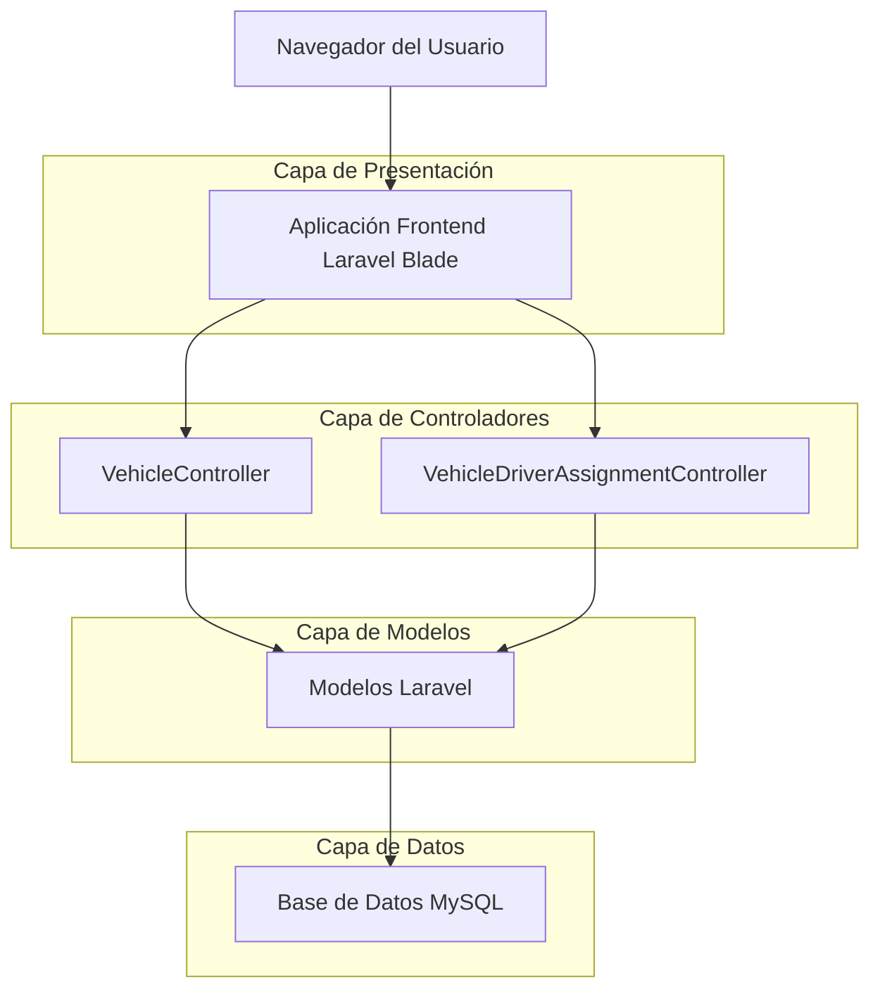
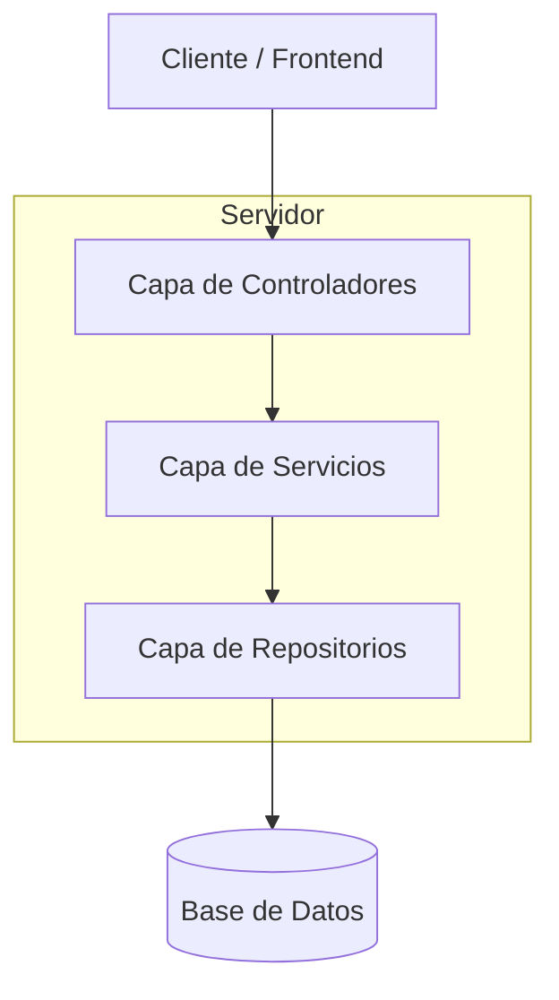
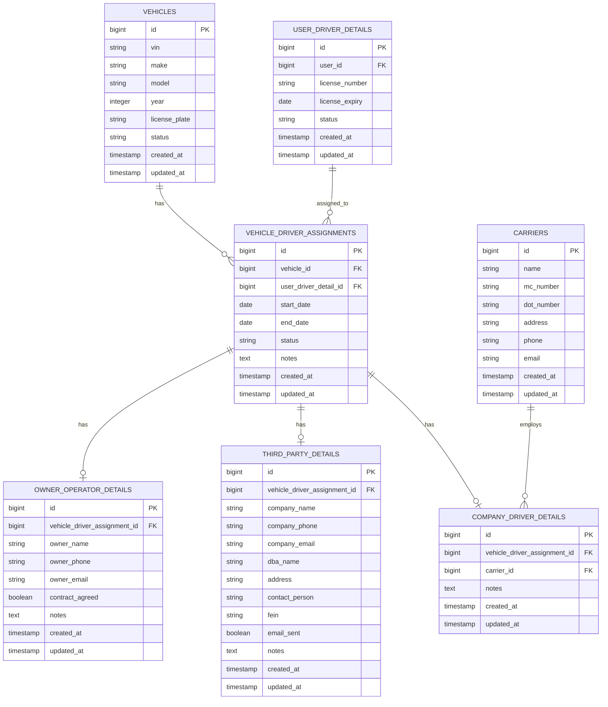

# Arquitectura Técnica del Sistema de Asignación de Vehículos - EF Services

## 1. Diseño de Arquitectura



## 2. Descripción de Tecnologías

- Frontend: Laravel Blade Templates + Alpine.js + Tailwind CSS
- Backend: Laravel 10 + PHP 8.1
- Base de Datos: MySQL 8.0
- Autenticación: Laravel Sanctum
- Validación: Laravel Form Requests

## 3. Definiciones de Rutas

| Ruta | Propósito |
|------|----------|
| /admin/vehicles/create | Página de creación de vehículos |
| /admin/vehicles/{id}/assign-driver-type | Página de asignación de tipo de conductor |
| /admin/vehicles/{id} | Página de detalles del vehículo |
| /admin/vehicle-assignments | Página de gestión de asignaciones |
| /admin/vehicle-assignments/{id} | Detalles de asignación específica |
| /admin/drivers/available | API para obtener conductores disponibles |

## 4. Definiciones de API

### 4.1 API Principal

**Crear Asignación de Vehículo**
```
POST /api/vehicle-assignments
```

Request:
| Nombre del Parámetro | Tipo de Parámetro | Es Requerido | Descripción |
|---------------------|-------------------|--------------|-------------|
| vehicle_id | integer | true | ID del vehículo a asignar |
| user_id | integer | true | ID del usuario conductor |
| assignment_type | string | true | Tipo de asignación (company_driver, owner_operator, third_party) |
| effective_date | date | true | Fecha de inicio de la asignación |
| notes | string | false | Notas adicionales sobre la asignación |

Response:
| Nombre del Parámetro | Tipo de Parámetro | Descripción |
|---------------------|-------------------|-------------|
| success | boolean | Estado de la respuesta |
| assignment_id | integer | ID de la asignación creada |
| message | string | Mensaje de confirmación |

Ejemplo:
```json
{
  "vehicle_id": 8,
  "user_id": 15,
  "assignment_type": "company_driver",
  "effective_date": "2024-01-15",
  "notes": "Asignación inicial del vehículo"
}
```

**Obtener Conductores Disponibles**
```
GET /api/drivers/available
```

Request:
| Nombre del Parámetro | Tipo de Parámetro | Es Requerido | Descripción |
|---------------------|-------------------|--------------|-------------|
| assignment_type | string | false | Filtrar por tipo de conductor |
| vehicle_id | integer | false | Excluir conductores ya asignados a este vehículo |

Response:
| Nombre del Parámetro | Tipo de Parámetro | Descripción |
|---------------------|-------------------|-------------|
| drivers | array | Lista de conductores disponibles |
| total | integer | Total de conductores disponibles |

Ejemplo:
```json
{
  "drivers": [
    {
      "id": 15,
      "name": "Juan Pérez",
      "license_number": "DL123456",
      "status": "active"
    }
  ],
  "total": 1
}
```

**Terminar Asignación**
```
PUT /api/vehicle-assignments/{id}/terminate
```

Request:
| Nombre del Parámetro | Tipo de Parámetro | Es Requerido | Descripción |
|---------------------|-------------------|--------------|-------------|
| end_date | date | true | Fecha de terminación de la asignación |
| reason | string | false | Razón de la terminación |

Response:
| Nombre del Parámetro | Tipo de Parámetro | Descripción |
|---------------------|-------------------|-------------|
| success | boolean | Estado de la respuesta |
| message | string | Mensaje de confirmación |

## 5. Arquitectura del Servidor



## 6. Modelo de Datos

### 6.1 Definición del Modelo de Datos



### 6.2 Lenguaje de Definición de Datos

**Tabla de Asignaciones de Vehículos (vehicle_driver_assignments)**
```sql
-- crear tabla
CREATE TABLE vehicle_driver_assignments (
    id BIGINT UNSIGNED AUTO_INCREMENT PRIMARY KEY,
    vehicle_id BIGINT UNSIGNED NOT NULL,
    user_driver_detail_id BIGINT UNSIGNED NOT NULL,
    start_date DATE NOT NULL,
    end_date DATE NULL,
    status VARCHAR(50) DEFAULT 'active' CHECK (status IN ('active', 'terminated', 'suspended')),
    notes TEXT NULL,
    created_at TIMESTAMP NULL DEFAULT CURRENT_TIMESTAMP,
    updated_at TIMESTAMP NULL DEFAULT CURRENT_TIMESTAMP ON UPDATE CURRENT_TIMESTAMP,
    
    FOREIGN KEY (vehicle_id) REFERENCES vehicles(id) ON DELETE CASCADE,
    FOREIGN KEY (user_driver_detail_id) REFERENCES user_driver_details(id) ON DELETE CASCADE
);

-- crear índices
CREATE INDEX idx_vehicle_driver_assignments_vehicle_id ON vehicle_driver_assignments(vehicle_id);
CREATE INDEX idx_vehicle_driver_assignments_user_driver_detail_id ON vehicle_driver_assignments(user_driver_detail_id);
CREATE INDEX idx_vehicle_driver_assignments_status ON vehicle_driver_assignments(status);
CREATE INDEX idx_vehicle_driver_assignments_dates ON vehicle_driver_assignments(start_date, end_date);
```

**Tabla de Detalles de Owner Operator (owner_operator_details)**
```sql
-- crear tabla
CREATE TABLE owner_operator_details (
    id BIGINT UNSIGNED AUTO_INCREMENT PRIMARY KEY,
    vehicle_driver_assignment_id BIGINT UNSIGNED NULL,
    owner_name VARCHAR(255) NOT NULL,
    owner_phone VARCHAR(20) NULL,
    owner_email VARCHAR(255) NULL,
    contract_agreed BOOLEAN DEFAULT FALSE,
    notes TEXT NULL,
    created_at TIMESTAMP NULL DEFAULT CURRENT_TIMESTAMP,
    updated_at TIMESTAMP NULL DEFAULT CURRENT_TIMESTAMP ON UPDATE CURRENT_TIMESTAMP,
    
    FOREIGN KEY (vehicle_driver_assignment_id) REFERENCES vehicle_driver_assignments(id) ON DELETE SET NULL
);

-- crear índices
CREATE INDEX idx_owner_operator_details_assignment_id ON owner_operator_details(vehicle_driver_assignment_id);
CREATE INDEX idx_owner_operator_details_owner_email ON owner_operator_details(owner_email);
```

**Tabla de Detalles de Third Party (third_party_details)**
```sql
-- crear tabla
CREATE TABLE third_party_details (
    id BIGINT UNSIGNED AUTO_INCREMENT PRIMARY KEY,
    vehicle_driver_assignment_id BIGINT UNSIGNED NULL,
    company_name VARCHAR(255) NOT NULL,
    company_phone VARCHAR(20) NULL,
    company_email VARCHAR(255) NULL,
    dba_name VARCHAR(255) NULL,
    address TEXT NULL,
    contact_person VARCHAR(255) NULL,
    fein VARCHAR(50) NULL,
    email_sent BOOLEAN DEFAULT FALSE,
    notes TEXT NULL,
    created_at TIMESTAMP NULL DEFAULT CURRENT_TIMESTAMP,
    updated_at TIMESTAMP NULL DEFAULT CURRENT_TIMESTAMP ON UPDATE CURRENT_TIMESTAMP,
    
    FOREIGN KEY (vehicle_driver_assignment_id) REFERENCES vehicle_driver_assignments(id) ON DELETE SET NULL
);

-- crear índices
CREATE INDEX idx_third_party_details_assignment_id ON third_party_details(vehicle_driver_assignment_id);
CREATE INDEX idx_third_party_details_company_name ON third_party_details(company_name);
CREATE INDEX idx_third_party_details_fein ON third_party_details(fein);
```

**Tabla de Detalles de Company Driver (company_driver_details)**
```sql
-- crear tabla
CREATE TABLE company_driver_details (
    id BIGINT UNSIGNED AUTO_INCREMENT PRIMARY KEY,
    vehicle_driver_assignment_id BIGINT UNSIGNED NULL,
    carrier_id BIGINT UNSIGNED NULL,
    notes TEXT NULL,
    created_at TIMESTAMP NULL DEFAULT CURRENT_TIMESTAMP,
    updated_at TIMESTAMP NULL DEFAULT CURRENT_TIMESTAMP ON UPDATE CURRENT_TIMESTAMP,
    
    FOREIGN KEY (vehicle_driver_assignment_id) REFERENCES vehicle_driver_assignments(id) ON DELETE SET NULL,
    FOREIGN KEY (carrier_id) REFERENCES carriers(id) ON DELETE SET NULL
);

-- crear índices
CREATE INDEX idx_company_driver_details_assignment_id ON company_driver_details(vehicle_driver_assignment_id);
CREATE INDEX idx_company_driver_details_carrier_id ON company_driver_details(carrier_id);

-- datos iniciales
INSERT INTO vehicle_driver_assignments (vehicle_id, user_driver_detail_id, start_date, status, notes)
VALUES (1, 1, '2024-01-01', 'active', 'Asignación inicial del sistema');
```
