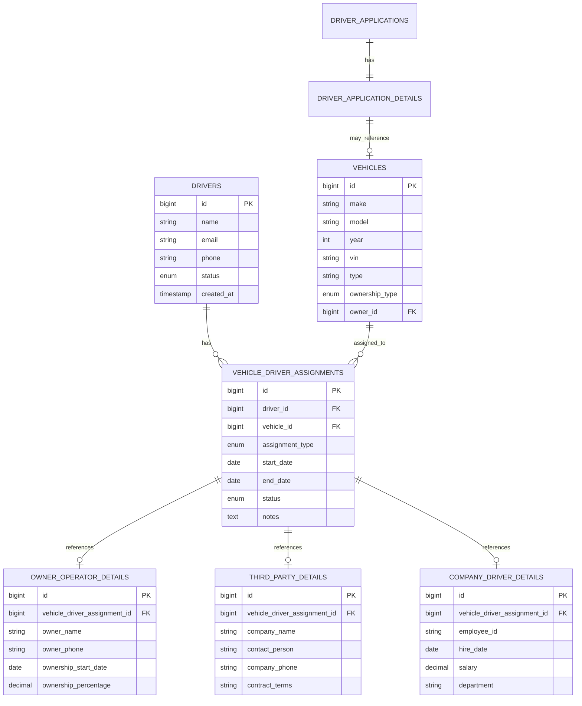

# Arquitectura de Asignación de Vehículos y Conductores

## 1. Visión General del Sistema

El sistema maneja relaciones complejas entre conductores y vehículos donde un conductor puede tener múltiples tipos de relaciones vehiculares simultáneamente:
- **Vehículos Propios** (Owner Operator)
- **Vehículos de Terceros** (Third Party)
- **Vehículos de la Empresa** (Company Driver)

## 2. Arquitectura de Tablas y Relaciones

### 2.1 Diagrama de Relaciones



### 2.2 Tabla Central: vehicle_driver_assignments

Esta tabla es el **corazón del sistema** y maneja todas las relaciones:

```sql
CREATE TABLE vehicle_driver_assignments (
    id BIGINT UNSIGNED PRIMARY KEY AUTO_INCREMENT,
    driver_id BIGINT UNSIGNED NOT NULL,
    vehicle_id BIGINT UNSIGNED NOT NULL,
    assignment_type ENUM('owner_operator', 'third_party_driver', 'company_driver') NOT NULL,
    start_date DATE NOT NULL,
    end_date DATE NULL,
    status ENUM('active', 'inactive', 'terminated', 'pending') DEFAULT 'active',
    priority INT DEFAULT 1, -- Para múltiples asignaciones
    notes TEXT NULL,
    created_at TIMESTAMP DEFAULT CURRENT_TIMESTAMP,
    updated_at TIMESTAMP DEFAULT CURRENT_TIMESTAMP ON UPDATE CURRENT_TIMESTAMP,
    
    FOREIGN KEY (driver_id) REFERENCES drivers(id) ON DELETE CASCADE,
    FOREIGN KEY (vehicle_id) REFERENCES vehicles(id) ON DELETE CASCADE,
    
    INDEX idx_driver_active (driver_id, status),
    INDEX idx_vehicle_assignments (vehicle_id, status),
    INDEX idx_assignment_type (assignment_type, status)
);
```

## 3. Flujo de Registro Inicial (Driver Application Step)

### 3.1 Proceso Durante la Aplicación

**Paso 1: Selección de Tipo de Conductor**
```php
// En ApplicationStep.php
public $driverTypes = [];
public $selectedDriverTypes = [];
public $vehiclesByType = [];

public function mount()
{
    // Un conductor puede ser múltiples tipos simultáneamente
    $this->driverTypes = [
        'owner_operator' => 'Propietario-Operador',
        'third_party_driver' => 'Conductor de Terceros',
        'company_driver' => 'Conductor de Empresa'
    ];
}
```

**Paso 2: Configuración por Tipo Seleccionado**
```php
public function addDriverType($type)
{
    if (!in_array($type, $this->selectedDriverTypes)) {
        $this->selectedDriverTypes[] = $type;
        $this->vehiclesByType[$type] = [];
        
        // Inicializar campos específicos
        $this->initializeTypeSpecificFields($type);
    }
}

private function initializeTypeSpecificFields($type)
{
    switch ($type) {
        case 'owner_operator':
            $this->vehiclesByType[$type] = [
                'existing_vehicles' => [],
                'new_vehicles' => []
            ];
            break;
            
        case 'third_party_driver':
            $this->vehiclesByType[$type] = [
                'company_info' => [],
                'assigned_vehicles' => []
            ];
            break;
            
        case 'company_driver':
            // No necesita vehículos específicos inicialmente
            break;
    }
}
```

### 3.2 Interfaz de Usuario Dinámica

```blade
<!-- resources/views/livewire/driver/steps/application-step.blade.php -->
<div class="driver-types-selection">
    <h3>Tipos de Conductor (Puede seleccionar múltiples)</h3>
    
    @foreach($driverTypes as $type => $label)
        <label class="flex items-center space-x-2">
            <input type="checkbox" 
                   wire:model="selectedDriverTypes" 
                   value="{{ $type }}"
                   wire:change="toggleDriverType('{{ $type }}')">
            <span>{{ $label }}</span>
        </label>
    @endforeach
</div>

<!-- Secciones dinámicas por tipo -->
@foreach($selectedDriverTypes as $type)
    <div class="mt-6 p-4 border rounded-lg">
        <h4 class="text-lg font-semibold mb-4">
            Configuración: {{ $driverTypes[$type] }}
        </h4>
        
        @if($type === 'owner_operator')
            @include('livewire.driver.steps.partials.owner-operator-vehicles')
        @elseif($type === 'third_party_driver')
            @include('livewire.driver.steps.partials.third-party-vehicles')
        @elseif($type === 'company_driver')
            @include('livewire.driver.steps.partials.company-driver-info')
        @endif
    </div>
@endforeach
```

### 3.3 Partial: Owner Operator Vehicles

```blade
<!-- resources/views/livewire/driver/steps/partials/owner-operator-vehicles.blade.php -->
<div class="owner-operator-section">
    <h5>Vehículos Propios</h5>
    
    <!-- Vehículos existentes -->
    <div class="existing-vehicles mb-4">
        <h6>Seleccionar Vehículos Existentes</h6>
        @if($existingOwnedVehicles->count() > 0)
            @foreach($existingOwnedVehicles as $vehicle)
                <label class="flex items-center space-x-2">
                    <input type="checkbox" 
                           wire:model="vehiclesByType.owner_operator.existing_vehicles" 
                           value="{{ $vehicle->id }}">
                    <span>{{ $vehicle->year }} {{ $vehicle->make }} {{ $vehicle->model }} ({{ $vehicle->vin }})</span>
                </label>
            @endforeach
        @else
            <p class="text-gray-500">No hay vehículos registrados a su nombre</p>
        @endif
    </div>
    
    <!-- Agregar nuevos vehículos -->
    <div class="new-vehicles">
        <h6>Agregar Nuevos Vehículos</h6>
        <button type="button" 
                wire:click="addNewVehicleForm('owner_operator')"
                class="btn btn-secondary mb-3">
            + Agregar Vehículo Propio
        </button>
        
        @foreach($vehiclesByType['owner_operator']['new_vehicles'] ?? [] as $index => $vehicle)
            <div class="vehicle-form border p-3 mb-3 rounded">
                <div class="grid grid-cols-2 gap-4">
                    <input type="text" 
                           wire:model="vehiclesByType.owner_operator.new_vehicles.{{ $index }}.make"
                           placeholder="Marca" class="form-input">
                    <input type="text" 
                           wire:model="vehiclesByType.owner_operator.new_vehicles.{{ $index }}.model"
                           placeholder="Modelo" class="form-input">
                    <input type="number" 
                           wire:model="vehiclesByType.owner_operator.new_vehicles.{{ $index }}.year"
                           placeholder="Año" class="form-input">
                    <input type="text" 
                           wire:model="vehiclesByType.owner_operator.new_vehicles.{{ $index }}.vin"
                           placeholder="VIN" class="form-input">
                </div>
                
                <!-- Información de propiedad -->
                <div class="mt-3">
                    <h7>Detalles de Propiedad</h7>
                    <div class="grid grid-cols-2 gap-4 mt-2">
                        <input type="date" 
                               wire:model="vehiclesByType.owner_operator.new_vehicles.{{ $index }}.ownership_start_date"
                               placeholder="Fecha de Adquisición" class="form-input">
                        <input type="number" 
                               wire:model="vehiclesByType.owner_operator.new_vehicles.{{ $index }}.ownership_percentage"
                               placeholder="% Propiedad" min="1" max="100" class="form-input">
                    </div>
                </div>
                
                <button type="button" 
                        wire:click="removeVehicleForm('owner_operator', {{ $index }})"
                        class="btn btn-danger btn-sm mt-2">
                    Eliminar
                </button>
            </div>
        @endforeach
    </div>
</div>
```

### 3.4 Partial: Third Party Vehicles

```blade
<!-- resources/views/livewire/driver/steps/partials/third-party-vehicles.blade.php -->
<div class="third-party-section">
    <h5>Información de Empresa Tercera</h5>
    
    <!-- Información de la empresa -->
    <div class="company-info mb-4">
        <div class="grid grid-cols-2 gap-4">
            <input type="text" 
                   wire:model="vehiclesByType.third_party_driver.company_info.name"
                   placeholder="Nombre de la Empresa" class="form-input">
            <input type="text" 
                   wire:model="vehiclesByType.third_party_driver.company_info.contact_person"
                   placeholder="Persona de Contacto" class="form-input">
            <input type="tel" 
                   wire:model="vehiclesByType.third_party_driver.company_info.phone"
                   placeholder="Teléfono" class="form-input">
            <input type="email" 
                   wire:model="vehiclesByType.third_party_driver.company_info.email"
                   placeholder="Email" class="form-input">
        </div>
    </div>
    
    <!-- Vehículos asignados por la empresa tercera -->
    <div class="assigned-vehicles">
        <h6>Vehículos Asignados por la Empresa</h6>
        <button type="button" 
                wire:click="addNewVehicleForm('third_party_driver')"
                class="btn btn-secondary mb-3">
            + Agregar Vehículo de Terceros
        </button>
        
        @foreach($vehiclesByType['third_party_driver']['assigned_vehicles'] ?? [] as $index => $vehicle)
            <div class="vehicle-form border p-3 mb-3 rounded">
                <div class="grid grid-cols-2 gap-4">
                    <input type="text" 
                           wire:model="vehiclesByType.third_party_driver.assigned_vehicles.{{ $index }}.make"
                           placeholder="Marca" class="form-input">
                    <input type="text" 
                           wire:model="vehiclesByType.third_party_driver.assigned_vehicles.{{ $index }}.model"
                           placeholder="Modelo" class="form-input">
                    <input type="number" 
                           wire:model="vehiclesByType.third_party_driver.assigned_vehicles.{{ $index }}.year"
                           placeholder="Año" class="form-input">
                    <input type="text" 
                           wire:model="vehiclesByType.third_party_driver.assigned_vehicles.{{ $index }}.vin"
                           placeholder="VIN" class="form-input">
                </div>
                
                <!-- Detalles del contrato -->
                <div class="mt-3">
                    <h7>Detalles del Contrato</h7>
                    <div class="grid grid-cols-2 gap-4 mt-2">
                        <input type="date" 
                               wire:model="vehiclesByType.third_party_driver.assigned_vehicles.{{ $index }}.contract_start_date"
                               placeholder="Inicio del Contrato" class="form-input">
                        <input type="date" 
                               wire:model="vehiclesByType.third_party_driver.assigned_vehicles.{{ $index }}.contract_end_date"
                               placeholder="Fin del Contrato" class="form-input">
                    </div>
                    <textarea wire:model="vehiclesByType.third_party_driver.assigned_vehicles.{{ $index }}.contract_terms"
                              placeholder="Términos del Contrato" class="form-textarea mt-2"></textarea>
                </div>
                
                <button type="button" 
                        wire:click="removeVehicleForm('third_party_driver', {{ $index }})"
                        class="btn btn-danger btn-sm mt-2">
                    Eliminar
                </button>
            </div>
        @endforeach
    </div>
</div>
```

## 4. Lógica de Guardado Durante la Aplicación

### 4.1 Método de Guardado Principal

```php
// En ApplicationStep.php
public function save()
{
    $this->validate();
    
    DB::transaction(function () {
        // 1. Guardar la aplicación básica
        $applicationDetail = $this->saveApplicationDetail();
        
        // 2. Procesar cada tipo de conductor seleccionado
        foreach ($this->selectedDriverTypes as $type) {
            $this->processDriverType($type, $applicationDetail);
        }
        
        // 3. Crear asignaciones preliminares
        $this->createPreliminaryAssignments();
    });
}

private function processDriverType($type, $applicationDetail)
{
    switch ($type) {
        case 'owner_operator':
            $this->processOwnerOperatorVehicles($applicationDetail);
            break;
            
        case 'third_party_driver':
            $this->processThirdPartyVehicles($applicationDetail);
            break;
            
        case 'company_driver':
            $this->processCompanyDriverInfo($applicationDetail);
            break;
    }
}

private function processOwnerOperatorVehicles($applicationDetail)
{
    $vehicleData = $this->vehiclesByType['owner_operator'] ?? [];
    
    // Procesar vehículos existentes seleccionados
    foreach ($vehicleData['existing_vehicles'] ?? [] as $vehicleId) {
        $this->createVehicleAssignment([
            'driver_id' => $this->application->driver_id,
            'vehicle_id' => $vehicleId,
            'assignment_type' => 'owner_operator',
            'status' => 'pending', // Pendiente de aprobación
            'start_date' => now()
        ]);
    }
    
    // Procesar nuevos vehículos
    foreach ($vehicleData['new_vehicles'] ?? [] as $vehicleInfo) {
        // Crear el vehículo
        $vehicle = Vehicle::create([
            'make' => $vehicleInfo['make'],
            'model' => $vehicleInfo['model'],
            'year' => $vehicleInfo['year'],
            'vin' => $vehicleInfo['vin'],
            'ownership_type' => 'owned',
            'owner_id' => $this->application->driver_id
        ]);
        
        // Crear la asignación
        $assignment = $this->createVehicleAssignment([
            'driver_id' => $this->application->driver_id,
            'vehicle_id' => $vehicle->id,
            'assignment_type' => 'owner_operator',
            'status' => 'pending',
            'start_date' => now()
        ]);
        
        // Crear detalles de owner operator
        OwnerOperatorDetail::create([
            'vehicle_driver_assignment_id' => $assignment->id,
            'owner_name' => $this->application->driver->name,
            'owner_phone' => $this->application->driver->phone,
            'ownership_start_date' => $vehicleInfo['ownership_start_date'],
            'ownership_percentage' => $vehicleInfo['ownership_percentage'] ?? 100
        ]);
    }
}

private function processThirdPartyVehicles($applicationDetail)
{
    $vehicleData = $this->vehiclesByType['third_party_driver'] ?? [];
    
    foreach ($vehicleData['assigned_vehicles'] ?? [] as $vehicleInfo) {
        // Crear o encontrar el vehículo
        $vehicle = Vehicle::firstOrCreate(
            ['vin' => $vehicleInfo['vin']],
            [
                'make' => $vehicleInfo['make'],
                'model' => $vehicleInfo['model'],
                'year' => $vehicleInfo['year'],
                'ownership_type' => 'third_party',
                'owner_id' => null // Propiedad de terceros
            ]
        );
        
        // Crear la asignación
        $assignment = $this->createVehicleAssignment([
            'driver_id' => $this->application->driver_id,
            'vehicle_id' => $vehicle->id,
            'assignment_type' => 'third_party_driver',
            'status' => 'pending',
            'start_date' => $vehicleInfo['contract_start_date'] ?? now()
        ]);
        
        // Crear detalles de third party
        ThirdPartyDetail::create([
            'vehicle_driver_assignment_id' => $assignment->id,
            'company_name' => $vehicleData['company_info']['name'],
            'contact_person' => $vehicleData['company_info']['contact_person'],
            'company_phone' => $vehicleData['company_info']['phone'],
            'contract_terms' => $vehicleInfo['contract_terms']
        ]);
    }
}
```

## 5. Gestión Post-Registro

### 5.1 Dashboard del Conductor

Una vez registrado, el conductor puede gestionar sus vehículos desde su dashboard:

```php
// App/Livewire/Driver/VehicleManagement.php
class VehicleManagement extends Component
{
    public $activeAssignments;
    public $availableVehicles;
    public $pendingRequests;
    
    public function mount()
    {
        $this->loadDriverVehicles();
    }
    
    private function loadDriverVehicles()
    {
        $driverId = auth()->user()->driver->id;
        
        $this->activeAssignments = VehicleDriverAssignment::where('driver_id', $driverId)
            ->where('status', 'active')
            ->with(['vehicle', 'ownerOperatorDetail', 'thirdPartyDetail', 'companyDriverDetail'])
            ->get()
            ->groupBy('assignment_type');
            
        $this->pendingRequests = VehicleDriverAssignment::where('driver_id', $driverId)
            ->where('status', 'pending')
            ->with('vehicle')
            ->get();
    }
    
    public function requestNewVehicle($type)
    {
        // Redirigir al formulario apropiado según el tipo
        switch ($type) {
            case 'owner_operator':
                return redirect()->route('driver.vehicles.add-owned');
            case 'company_driver':
                return redirect()->route('driver.vehicles.request-company');
            case 'third_party_driver':
                return redirect()->route('driver.vehicles.add-third-party');
        }
    }
}
```

### 5.2 Vista del Dashboard

```blade
<!-- resources/views/livewire/driver/vehicle-management.blade.php -->
<div class="vehicle-management">
    <h2>Gestión de Vehículos</h2>
    
    <!-- Resumen de asignaciones activas -->
    <div class="grid grid-cols-1 md:grid-cols-3 gap-6 mb-8">
        @foreach(['owner_operator' => 'Vehículos Propios', 'third_party_driver' => 'Vehículos de Terceros', 'company_driver' => 'Vehículos de Empresa'] as $type => $label)
            <div class="bg-white p-6 rounded-lg shadow">
                <h3 class="text-lg font-semibold mb-4">{{ $label }}</h3>
                <div class="text-3xl font-bold text-blue-600 mb-2">
                    {{ $activeAssignments[$type]->count() ?? 0 }}
                </div>
                <p class="text-gray-600 mb-4">Vehículos activos</p>
                <button wire:click="requestNewVehicle('{{ $type }}')"
                        class="btn btn-primary btn-sm">
                    + Agregar {{ $label }}
                </button>
            </div>
        @endforeach
    </div>
    
    <!-- Lista detallada de vehículos -->
    @foreach($activeAssignments as $type => $assignments)
        @if($assignments->count() > 0)
            <div class="mb-8">
                <h3 class="text-xl font-semibold mb-4">
                    {{ ['owner_operator' => 'Vehículos Propios', 'third_party_driver' => 'Vehículos de Terceros', 'company_driver' => 'Vehículos de Empresa'][$type] }}
                </h3>
                
                <div class="grid grid-cols-1 md:grid-cols-2 lg:grid-cols-3 gap-4">
                    @foreach($assignments as $assignment)
                        <div class="bg-white p-4 rounded-lg shadow border">
                            <div class="flex justify-between items-start mb-3">
                                <h4 class="font-semibold">
                                    {{ $assignment->vehicle->year }} {{ $assignment->vehicle->make }} {{ $assignment->vehicle->model }}
                                </h4>
                                <span class="px-2 py-1 bg-green-100 text-green-800 text-xs rounded-full">
                                    {{ ucfirst($assignment->status) }}
                                </span>
                            </div>
                            
                            <p class="text-gray-600 text-sm mb-2">VIN: {{ $assignment->vehicle->vin }}</p>
                            <p class="text-gray-600 text-sm mb-3">Desde: {{ $assignment->start_date->format('d/m/Y') }}</p>
                            
                            <!-- Información específica por tipo -->
                            @if($type === 'owner_operator' && $assignment->ownerOperatorDetail)
                                <div class="text-sm text-gray-600">
                                    <p>Propiedad: {{ $assignment->ownerOperatorDetail->ownership_percentage }}%</p>
                                </div>
                            @elseif($type === 'third_party_driver' && $assignment->thirdPartyDetail)
                                <div class="text-sm text-gray-600">
                                    <p>Empresa: {{ $assignment->thirdPartyDetail->company_name }}</p>
                                </div>
                            @elseif($type === 'company_driver' && $assignment->companyDriverDetail)
                                <div class="text-sm text-gray-600">
                                    <p>Empleado ID: {{ $assignment->companyDriverDetail->employee_id }}</p>
                                </div>
                            @endif
                            
                            <div class="mt-4 flex space-x-2">
                                <button wire:click="viewVehicleDetails({{ $assignment->id }})"
                                        class="btn btn-sm btn-outline">
                                    Ver Detalles
                                </button>
                                @if($type !== 'company_driver')
                                    <button wire:click="editAssignment({{ $assignment->id }})"
                                            class="btn btn-sm btn-secondary">
                                        Editar
                                    </button>
                                @endif
                            </div>
                        </div>
                    @endforeach
                </div>
            </div>
        @endif
    @endforeach
    
    <!-- Solicitudes pendientes -->
    @if($pendingRequests->count() > 0)
        <div class="mb-8">
            <h3 class="text-xl font-semibold mb-4">Solicitudes Pendientes</h3>
            <div class="bg-yellow-50 border border-yellow-200 rounded-lg p-4">
                @foreach($pendingRequests as $request)
                    <div class="flex justify-between items-center py-2">
                        <div>
                            <span class="font-medium">
                                {{ $request->vehicle->year }} {{ $request->vehicle->make }} {{ $request->vehicle->model }}
                            </span>
                            <span class="text-sm text-gray-600 ml-2">
                                ({{ ucfirst(str_replace('_', ' ', $request->assignment_type)) }})
                            </span>
                        </div>
                        <span class="px-2 py-1 bg-yellow-100 text-yellow-800 text-xs rounded-full">
                            Pendiente de Aprobación
                        </span>
                    </div>
                @endforeach
            </div>
        </div>
    @endif
</div>
```

## 6. Casos de Uso Específicos

### 6.1 Caso: Conductor con Vehículo Propio + Third Party

**Escenario**: Juan tiene un camión propio y también maneja un camión de la empresa "Transportes ABC".

**Implementación**:
```php
// Asignación 1: Vehículo propio
VehicleDriverAssignment::create([
    'driver_id' => $juan->id,
    'vehicle_id' => $camion_propio->id,
    'assignment_type' => 'owner_operator',
    'status' => 'active',
    'start_date' => '2024-01-01',
    'priority' => 1 // Prioridad alta
]);

// Detalles de owner operator
OwnerOperatorDetail::create([
    'vehicle_driver_assignment_id' => $assignment1->id,
    'owner_name' => 'Juan Pérez',
    'ownership_percentage' => 100
]);

// Asignación 2: Vehículo de terceros
VehicleDriverAssignment::create([
    'driver_id' => $juan->id,
    'vehicle_id' => $camion_terceros->id,
    'assignment_type' => 'third_party_driver',
    'status' => 'active',
    'start_date' => '2024-02-01',
    'priority' => 2 // Prioridad secundaria
]);

// Detalles de third party
ThirdPartyDetail::create([
    'vehicle_driver_assignment_id' => $assignment2->id,
    'company_name' => 'Transportes ABC',
    'contact_person' => 'María González',
    'contract_terms' => 'Contrato por 6 meses'
]);
```

### 6.2 Caso: Transición a Company Driver

**Escenario**: Juan es contratado como empleado de la empresa y debe dejar los vehículos de terceros.

**Implementación**:
```php
class DriverTransitionService
{
    public function transitionToCompanyDriver($driverId, $companyDetails)
    {
        DB::transaction(function () use ($driverId, $companyDetails) {
            // 1. Terminar asignaciones de third party
            VehicleDriverAssignment::where('driver_id', $driverId)
                ->where('assignment_type', 'third_party_driver')
                ->where('status', 'active')
                ->update([
                    'status' => 'terminated',
                    'end_date' => now(),
                    'notes' => 'Terminated due to company employment'
                ]);
            
            // 2. Mantener vehículos propios (owner_operator)
            // No se modifican las asignaciones owner_operator
            
            // 3. Crear nueva asignación como company driver
            $companyVehicle = $this->assignCompanyVehicle($driverId);
            
            if ($companyVehicle) {
                $assignment = VehicleDriverAssignment::create([
                    'driver_id' => $driverId,
                    'vehicle_id' => $companyVehicle->id,
                    'assignment_type' => 'company_driver',
                    'status' => 'active',
                    'start_date' => now(),
                    'priority' => 3
                ]);
                
                CompanyDriverDetail::create([
                    'vehicle_driver_assignment_id' => $assignment->id,
                    'employee_id' => $companyDetails['employee_id'],
                    'hire_date' => now(),
                    'salary' => $companyDetails['salary'],
                    'department' => $companyDetails['department']
                ]);
            }
        });
    }
}
```

## 7. Consultas y Reportes

### 7.1 Consultas Complejas

```php
// Obtener todos los vehículos de un conductor con sus detalles
public function getDriverVehiclesWithDetails($driverId)
{
    return VehicleDriverAssignment::where('driver_id', $driverId)
        ->where('status', 'active')
        ->with([
            'vehicle',
            'ownerOperatorDetail',
            'thirdPartyDetail',
            'companyDriverDetail'
        ])
        ->get()
        ->map(function ($assignment) {
            return [
                'assignment_id' => $assignment->id,
                'vehicle' => $assignment->vehicle,
                'type' => $assignment->assignment_type,
                'details' => $this->getAssignmentDetails($assignment),
                'priority' => $assignment->priority,
                'start_date' => $assignment->start_date
            ];
        });
}

private function getAssignmentDetails($assignment)
{
    switch ($assignment->assignment_type) {
        case 'owner_operator':
            return $assignment->ownerOperatorDetail;
        case 'third_party_driver':
            return $assignment->thirdPartyDetail;
        case 'company_driver':
            return $assignment->companyDriverDetail;
        default:
            return null;
    }
}

// Reporte de utilización de vehículos
public function getVehicleUtilizationReport()
{
    return Vehicle::with(['assignments' => function ($query) {
        $query->where('status', 'active');
    }])
    ->get()
    ->map(function ($vehicle) {
        $activeAssignments = $vehicle->assignments;
        
        return [
            'vehicle' => $vehicle->year . ' ' . $vehicle->make . ' ' . $vehicle->model,
            'vin' => $vehicle->vin,
            'total_assignments' => $activeAssignments->count(),
            'assignment_types' => $activeAssignments->pluck('assignment_type')->unique()->values(),
            'current_drivers' => $activeAssignments->with('driver')->get()->pluck('driver.name'),
            'utilization_status' => $activeAssignments->count() > 0 ? 'In Use' : 'Available'
        ];
    });
}
```

## 8. Validaciones y Reglas de Negocio

### 8.1 Validaciones de Asignación

```php
class VehicleAssignmentValidator
{
    public function validateAssignment($driverId, $vehicleId, $assignmentType)
    {
        $rules = [
            'no_duplicate_active_assignments' => $this->checkDuplicateAssignments($driverId, $vehicleId),
            'driver_license_valid' => $this->checkDriverLicense($driverId),
            'vehicle_availability' => $this->checkVehicleAvailability($vehicleId, $assignmentType),
            'assignment_type_permissions' => $this->checkAssignmentPermissions($driverId, $assignmentType)
        ];
        
        foreach ($rules as $rule => $result) {
            if (!$result['valid']) {
                throw new ValidationException($result['message']);
            }
        }
        
        return true;
    }
    
    private function checkDuplicateAssignments($driverId, $vehicleId)
    {
        $exists = VehicleDriverAssignment::where('driver_id', $driverId)
            ->where('vehicle_id', $vehicleId)
            ->where('status', 'active')
            ->exists();
            
        return [
            'valid' => !$exists,
            'message' => 'El conductor ya tiene una asignación activa con este vehículo'
        ];
    }
    
    private function checkVehicleAvailability($vehicleId, $assignmentType)
    {
        $vehicle = Vehicle::find($vehicleId);
        
        // Owner operator vehicles can only be assigned to their owners
        if ($assignmentType === 'owner_operator' && $vehicle->ownership_type !== 'owned') {
            return [
                'valid' => false,
                'message' => 'Solo el propietario puede ser asignado como owner operator'
            ];
        }
        
        // Company vehicles can only be assigned to company drivers
        if ($assignmentType === 'company_driver' && $vehicle->ownership_type !== 'company') {
            return [
                'valid' => false,
                'message' => 'Este vehículo no pertenece a la empresa'
            ];
        }
        
        return ['valid' => true, 'message' => ''];
    }
}
```

## 9. Conclusión

Esta arquitectura proporciona:

1. **Flexibilidad Total**: Un conductor puede tener múltiples tipos de relaciones vehiculares simultáneamente
2. **Trazabilidad Completa**: Cada asignación tiene su historial y detalles específicos
3. **Escalabilidad**: Fácil agregar nuevos tipos de asignaciones
4. **Integridad de Datos**: Validaciones robustas y relaciones bien definidas
5. **Experiencia de Usuario**: Interfaces intuitivas para manejar casos complejos

El sistema maneja desde el registro inicial hasta la gestión continua de vehículos, permitiendo transiciones fluidas entre diferentes tipos de conductor mientras mantiene la integridad de los datos históricos.